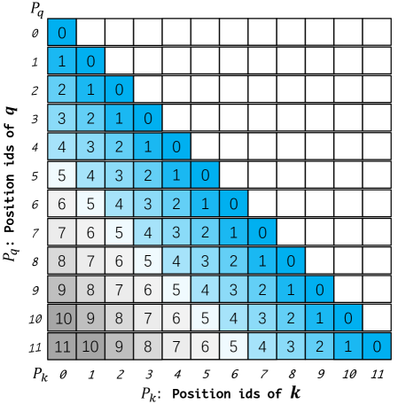

# Training-Free Long-Context Scaling of LLMs (Dual Chunk Attention) — An et al., 2024

> **arXiv:** 2402.17463v2 · **Venue:** ICML 2024 · **Affiliation:** HKU + Alibaba DAMO

## TL;DR
**Dual Chunk Attention (DCA)** decomposes self-attention over a long sequence into three patterns over chunks of size $s$ that *only ever use position-id differences seen during pre-training*. The result: a Llama-2 / Llama-3 / Mistral checkpoint can be inferred at **8–50× its training context** with no training, no extra parameters, and no perceptible Flash-Attention overhead. On Llama-2-70B at 16k it reaches 94 % of GPT-3.5-Turbo-16k average score on L-Eval — without touching the weights.

## Problem & motivation
RoPE-extension methods that work — PI, NTK-aware, [YaRN](positional_2023_yarn-context-extension.md) — generally need at least a brief fine-tune (PG-19, ~400 steps) and still degrade past ~2× training length without it. Streaming methods (StreamingLLM, LM-Infinite) keep perplexity low at long lengths but discard distant tokens, so they can't actually use the long context.

The question DCA asks: can we feed positions all the way out to 100k+ tokens to a 4k-pretrained model **without any training and without dropping tokens** — and still answer questions about token #80 000?

## Key idea
Split the sequence into chunks of size $s$ (typically $s = \tfrac{3}{4}c$ where $c$ is the pre-training window — for Llama-2 4k, $s=3072$). Define three position-id remappings so that **every relative offset that appears in the attention matrix lies in $[0,c-1]$**, the range RoPE already understands.

![Figure 1: the three DCA attention patterns (intra-, inter-, successive-chunk) — relative position matrix stays in [0, c-1]](_assets/positional_2024_dca-dual-chunk-attention/fig2_dca_three_patterns.png)

**(a) Intra-chunk** — positions inside one chunk reuse $0,1,\dots,s-1$:
$$P_q^{\text{intra}}=P_k=[0,1,\dots,l-1]\bmod s,\qquad M_{ij}=P_q^{\text{intra}}[i]-P_k[j].$$

**(b) Inter-chunk** — for distant query/key chunks, set every distant query to a single large index $c-1$:
$$P_q^{\text{inter}}=[c-1,\dots,c-1]\Rightarrow M_{ij}=c-1-P_k[j]\in[c-s,\,c-1].$$

This compresses long-range distance to a small slab near the upper end of the trained range — coarse, but never out-of-distribution.

**(c) Successive-chunk** — the "boundary fix". Naïve inter-chunk loses locality at chunk seams (a token 1 position away suddenly looks $c-s$ away). Override the first $w=c-s$ query indices in each new chunk:
$$P_q^{\text{succ}}=[s, s{+}1, \dots, s{+}w{-}1,\;c{-}1,\dots,c{-}1].$$

The combined relative-position matrix is:
$$
M_{ij} = \begin{cases}
P_q^{\text{intra}}[i] - P_k[j] & \lfloor i/s\rfloor = \lfloor j/s\rfloor\\
P_q^{\text{succ}}[i]  - P_k[j] & \lfloor i/s\rfloor - \lfloor j/s\rfloor = 1\\
P_q^{\text{inter}}[i] - P_k[j] & \lfloor i/s\rfloor - \lfloor j/s\rfloor > 1.
\end{cases}
$$

Standard RoPE without DCA, by contrast, runs straight off the edge of trained positions:

## How it works
- **Inference-only.** Implemented as a Python monkey-patch on the model's attention module — no weights touched.
- **RoPE-compatible.** Works with any RoPE LLM (LLaMA-2/3, Mistral, CodeLlama, etc.).
- **Flash-DCA.** Decomposes into three separate Flash-Attention-2 calls (App. A.3, Algorithm 1) with the same memory and ~the same wall-clock as a single dense Flash-Attention pass at training length (Figure 3 of the paper).
- **Hyperparameters.** Chunk size $s$ (default $\tfrac{3}{4}c$); local window $w=c-s$ (auto-derived). Tunable per target context: e.g. $s=24\text{k}$ to push CodeLlama / Together-LLaMA-32k to 192k.
- **Stacks with PI / NTK-aware** — additive gains shown in Table 2 of the paper.

## Training / data
**Zero training is needed for DCA itself.** The paper additionally evaluates an *optional* chat fine-tune ("ChunkLlama2-Chat") on ~5 405 long-dialogue instances (≤16k input) drawn from ShareGPT-GPT4 + AlpacaGPT4, costing ~40 GPU·h (7B) / ~60 GPU·h (13B) on a single A100-80G — but Table 3 below shows the no-training variant is already competitive.

## Results
**PG-19 perplexity (§4, Table 1).** Vanilla Llama-2 explodes immediately past 4k; ChunkLlama-70B stays under 6.2 even at 64k:

| Model | 4k | 8k | 16k | 32k | 64k |
|---|---|---|---|---|---|
| Llama-2 7B  | 7.87 | >102 | >102 | >102 | >102 |
| **ChunkLlama-2 7B**  | 7.87 | 7.89 | 15.87 | 43.57 | 96.21 |
| Llama-2 70B | 5.24 | >102 | >102 | >102 | >102 |
| **ChunkLlama-2 70B** | 5.24 | 5.30 | 5.59 | 5.80 | **6.12** |

**Stacking with PI / NTK gets to 192k** (§4, Table 2): ChunkLlama-70B + NTK reports ppl 6.45 at 192k.

**Real long-context tasks** (NarrativeQA / Qasper / QuALITY / QMSum, few-shot, §4, Table 3):

| Model | Training | Context | NarrativeQA | Qasper | QuALITY | QMSum | Avg |
|---|---|---|---|---|---|---|---|
| Longlora 13B | finetuned 32k | 32k | 25.8 | 26.4 | 48.9 | 15.1 | 29.1 |
| YaRN 13B     | finetuned 128k | 128k | 23.4 | 27.1 | 46.4 | 11.9 | 27.2 |
| Llama-2 70B  | none | 4k | 11.1 | 27.8 | 60.9 |  7.8 | 26.9 |
| **ChunkLlama-2 70B** | **none, DCA** | **(extended)** | **33.7** | **33.5** | **65.2** | **17.1** | **37.8** |
| Llama-2-Long 70B | finetuned 100k (400B tok) | 100k | 36.8 | 34.2 | 64.1 | 16.2 | 37.9 |

Training-free DCA-70B is within 0.1 avg-F1 of Meta's heavily fine-tuned Llama-2-Long 70B.

**Zero-shot L-Eval, ChunkLlama2-Chat 70B (§4, Table 4):** TOFEL 63.6 / QuALITY 62.0 / Coursera 51.6 / SFiction 68.1, average **61.3** vs GPT-3.5-Turbo-16k 63.5 — i.e. ≈ 96 % of GPT-3.5-Turbo's score on a 4k-pretrained model.

**Passkey retrieval (App. A.1, Figs. 5 & 7):** 100 % at 18k tokens across all document depths (vs PI ≈ 0 %, NTK suffers "lost-in-the-middle"); ≥ 90 % at 192k.

**Ablation (Figure 4):** all three patterns matter — intra-only ppl@32k = 12.5, +inter = 7.2, +successive = 5.9.

## Limitations & follow-ups
- **Coarse long-range distances.** All inter-chunk pairs collapse to the slab $[c-s,c-1]$, so the model can't tell two distant chunks apart by exact distance — only "far".
- **PPL grows non-linearly past ~96k** (still acceptable up to 192k but trending up).
- **Chunk-size tuning.** $s$ is per-model / per-target; no universal default beyond the $\tfrac{3}{4}c$ rule of thumb.
- **No weight adaptation.** Pure inference trick — pretraining knowledge is not extended; optional chat fine-tune helps.
- **Used in:** Qwen 2.5-1M long-context recipe (combined with YaRN to reach 1M tokens).

## Links
- **arXiv:** [abs](https://arxiv.org/abs/2402.17463) · [html v2](https://arxiv.org/html/2402.17463v2) · [pdf](https://arxiv.org/pdf/2402.17463)
- **Code:** [HKUNLP/ChunkLlama](https://github.com/HKUNLP/ChunkLlama) (DCA monkey-patch, eval scripts, Flash-DCA kernel, optional fine-tune data)
- **Hugging Face:** ChunkLlama2 7B / 13B / 70B and ChunkLlama2-Chat variants (linked from the GitHub repo)
- **Project page:** —
- **Blog posts:** —
- **Talks / videos:** ICML 2024 spotlight (search "Dual Chunk Attention ICML 2024")
- **OpenReview / venue page:** [ICML 2024 OpenReview entry](https://openreview.net/forum?id=GvXFu7AhpZ) (search if the linked id changes)
- **Papers-with-Code:** [paperswithcode.com/paper/training-free-long-context-scaling-of-large](https://paperswithcode.com/paper/training-free-long-context-scaling-of-large)
- **BibTeX:** available from the arXiv abs page
- **Related / successor papers:** [RoPE](positional_2021_rope-roformer.md) · [NTK-aware](positional_2023_ntk-aware-rope.md) · [YaRN](positional_2023_yarn-context-extension.md) · StreamingLLM (Xiao et al., arXiv:2309.17453) · LongLora (Chen et al., arXiv:2309.12307) · LM-Infinite (Han et al., arXiv:2308.16137)
