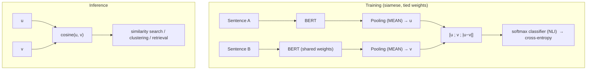

# Sentence-BERT: Sentence Embeddings using Siamese BERT-Networks — Reimers & Gurevych, 2019

> **arXiv:** 1908.10084v1 · **Venue:** EMNLP 2019 · **Affiliation:** UKP Lab, Technische Universität Darmstadt

## TL;DR
Sentence-BERT (SBERT) fine-tunes BERT in a **siamese / triplet** structure so that a *single* forward
pass yields a fixed-size sentence embedding whose **cosine similarity** is semantically meaningful.
This turns BERT — a cross-encoder that must see both sentences together — into an indexable
**bi-encoder**, cutting the cost of finding the most similar pair among 10,000 sentences from **~65
hours to ~5 seconds**, while *improving* sentence-embedding quality over InferSent and the Universal
Sentence Encoder on STS and transfer benchmarks.

## Problem & motivation
Vanilla BERT sets SOTA on sentence-pair regression (e.g. semantic textual similarity) by feeding
`sentence A [SEP] sentence B` through the network — a **cross-encoder**. But that makes similarity
search combinatorial: comparing all pairs in a 10k-sentence set needs ~50M BERT inferences (~65 h on a
V100), and clustering or retrieval are infeasible. The naive fix — run each sentence through BERT alone
and average the outputs (or take `[CLS]`) — produces **poor** embeddings, often *worse than averaging
GloVe vectors*. SBERT's goal: fine-tune BERT so that independent, poolable sentence vectors are directly
comparable by cosine similarity.

## Key idea
Two BERT encoders with **tied weights** (siamese) map sentences $A,B$ to embeddings $u,v$ via a pooling
layer over BERT's token outputs. Pooling options: **MEAN** (default), MAX, or `[CLS]`. The training
objective depends on the data:

**Classification objective** (NLI data) — concatenate $u$, $v$, and the element-wise difference
$|u-v|$, project, and softmax:
$$
o=\mathrm{softmax}\big(W_t\,[\,u;\,v;\,|u-v|\,]\big),\qquad W_t\in\mathbb{R}^{3n\times k},
$$
with $n$ the embedding dimension and $k$ the number of labels; trained by cross-entropy. **At inference
only $u,v$ + cosine are used** — the classifier head is discarded.

**Regression objective** (STS data) — cosine similarity $\cos(u,v)$ trained with mean-squared error.

**Triplet objective** (anchor $a$, positive $p$, negative $n$):
$$
\max\big(\lVert s_a-s_p\rVert-\lVert s_a-s_n\rVert+\epsilon,\;0\big),
$$
with Euclidean distance and margin $\epsilon=1$ — pulls the anchor closer to the positive than the
negative by at least $\epsilon$.

The ablation is unambiguous: the **$|u-v|$ term is the most important** part of the concatenation, and
**MEAN pooling** beats MAX and `[CLS]`.

## How it works



- **Backbone:** BERT-base/large (or RoBERTa → SRoBERTa); pooling makes a fixed 768/1024-d vector.
- **Deployment:** encode each sentence once, then compare with cosine — enabling FAISS-style search,
  hierarchical clustering, and semantic retrieval that raw BERT cannot do at scale.

## Training / data
- **Data:** SNLI (570k pairs) + MultiNLI (430k pairs), 3-way (entailment/neutral/contradiction) softmax.
- **Recipe:** **1 epoch**, batch 16, Adam lr $2\times10^{-5}$, 10% linear warm-up, **MEAN** pooling;
  fine-tunes in **<20 min**. For supervised STS, optionally continue-train on STSb with the regression
  objective; "smart batching" (group by length) speeds encoding.

## Results
From the paper (Tables 1, 2, 5). Spearman $\rho\times100$ for STS; accuracy for SentEval.

| Benchmark | Metric | SBERT | Best prior | Raw BERT | Source |
|---|---|---|---|---|---|
| 7-task STS avg (unsupervised) | Spearman | **74.89** (base) / 76.55 (large) | 71.22 (USE) · 65.01 (InferSent) | 54.81 (avg) · 29.19 (`[CLS]`) | §4.1, Table 1 |
| STS benchmark (NLI→STSb, large) | Spearman | **86.10** | 84.92 (SRoBERTa-STSb) | — | §4.2, Table 2 |
| Wikipedia sections (triplet) | Accuracy | **80.42%** | 74% (Dor et al.) | — | §4.4, Table 4 |
| SentEval (7-task transfer avg) | Accuracy | **87.41** (base) | 85.59 (InferSent) | 84.94 (avg BERT) | §5, Table 5 |
| 10k-pair most-similar search | wall-clock | **~5 s** | — | ~65 h | §1 / §7 |

The headline contrast: raw BERT embeddings (avg 54.81, `[CLS]` 29.19) are **worse than average GloVe**
(61.32) on STS, but SBERT's siamese fine-tuning lifts them to **74.89**, beating InferSent by +11.7 and
USE by +5.5 on average — at a fraction of the search cost. On a GPU SBERT is ~9% faster than InferSent
and ~55% faster than USE (Table 7).

## Limitations & follow-ups
- **Bi-encoder ceiling.** By encoding sentences independently, SBERT trails the BERT cross-encoder on
  tasks needing direct word-by-word comparison (e.g. cross-topic argument similarity drops ~7 points).
- **Supervision-dependent.** Quality hinges on NLI/STS fine-tuning data; embeddings are tuned for
  cosine, not for arbitrary downstream classifiers.
- **RoBERTa ≈ BERT** here — the swap gives no significant gain.
- **Relation to neighbors.** SBERT is the **sentence-level dual encoder** that seeded the modern text-
  embedding family; it shares the contrastive/siamese recipe with [DPR](retrieval_2020_dpr.md)
  (passage retrieval) and contrasts with per-token late interaction in
  [ColBERT](retrieval_2020_colbert-late-interaction.md)/[ColBERTv2](retrieval_2021_colbertv2.md). Its
  MEAN-pooled sentence vectors are the ancestor of the encoders used as compressors in
  [xRAG](softtoken_2024_xrag.md) and note embedders in agentic memory
  ([A-Mem](agentic_2025_a-mem.md), [MemoryBank](agentic_2023_memorybank.md)).

## Links
- **arXiv:** [abs](https://arxiv.org/abs/1908.10084) · [html](https://arxiv.org/html/1908.10084v1) · [pdf](https://arxiv.org/pdf/1908.10084)
- **Code:** [sbert.net](https://www.sbert.net/) · [github.com/UKPLab/sentence-transformers](https://github.com/UKPLab/sentence-transformers)
- **BibTeX:**
  ```bibtex
  @inproceedings{reimers2019sentencebert,
    title     = {Sentence-BERT: Sentence Embeddings using Siamese BERT-Networks},
    author    = {Reimers, Nils and Gurevych, Iryna},
    booktitle = {Proceedings of the 2019 Conference on Empirical Methods in Natural Language Processing (EMNLP)},
    year      = {2019}
  }
  ```
- **Related papers:** [DPR](retrieval_2020_dpr.md) · [ColBERT](retrieval_2020_colbert-late-interaction.md) · [ColBERTv2](retrieval_2021_colbertv2.md) · [xRAG](softtoken_2024_xrag.md)
- **In-repo:** [MixedDecoder](../mixed_decoder/mixed_decoder.md) · [Soft-token compression thread](../context/soft_token/soft_token.md) · [Agentic memory thread](../context/agentic_memory/agentic_memory.md)
