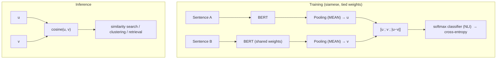

# Sentence-BERT: Sentence Embeddings using Siamese BERT-Networks — Reimers & Gurevych, 2019

> **arXiv:** 1908.10084v1 · **Venue:** EMNLP 2019 · **Affiliation:** UKP Lab, Technische Universität Darmstadt

## TL;DR
Sentence-BERT (SBERT) fine-tunes BERT in a **siamese / triplet** structure so that a *single* forward
pass yields a fixed-size sentence embedding whose **cosine similarity** is semantically meaningful.
This turns BERT — a cross-encoder that must see both sentences together — into an indexable
**bi-encoder**, cutting the cost of finding the most similar pair among 10,000 sentences from **~65
hours to ~5 seconds**, while *improving* sentence-embedding quality over InferSent and the Universal
Sentence Encoder on STS and transfer benchmarks. The whole recipe is one epoch of NLI fine-tuning in
**under 20 minutes**, and its two load-bearing design choices — **MEAN** pooling and the
**$|u-v|$** term in the classifier input — are isolated by ablation.

## Problem & motivation
Vanilla BERT sets SOTA on sentence-pair regression (e.g. semantic textual similarity) by feeding
`sentence A [SEP] sentence B` through the network — a **cross-encoder**. But that makes similarity
search combinatorial: comparing all pairs in a 10k-sentence set needs ~50M BERT inferences (~65 h on a
V100), and clustering or retrieval are infeasible. The naive fix — run each sentence through BERT alone
and average the outputs (or take `[CLS]`) — produces **poor** embeddings, often *worse than averaging
GloVe vectors*. SBERT's goal: fine-tune BERT so that independent, poolable sentence vectors are directly
comparable by cosine similarity.

The asymmetry is worth stating precisely, because it is the structural reason the bi-encoder exists.
A cross-encoder scores a *pair*, so its cost for $n$ sentences is $O(n^2)$ **network** evaluations. A
bi-encoder encodes each sentence *once* — $O(n)$ network evaluations — and defers comparison to cosine
similarity over cached vectors, which is a cheap matrix product amenable to ANN indexing. The paper's
own framing: poly-encoders (Humeau et al., 2019) also attack the cross-encoder's run-time cost, but
their score function is **not symmetric** and cannot be precomputed into a metric space, so clustering
(which needs $O(n^2)$ score computations) stays infeasible (per §2).

A second, subtler motivation: prior neural sentence embedders (InferSent, Universal Sentence Encoder)
trained **from random initialization**. SBERT instead starts from pretrained BERT/RoBERTa and only
fine-tunes, which is why it needs *under 20 minutes* of training to beat them (per §2).

## Key idea
Two BERT encoders with **tied weights** (siamese) map sentences $A,B$ to embeddings $u,v$ via a pooling
layer over BERT's token outputs. Given BERT's token-output matrix $H\in\mathbb{R}^{L\times n}$ for a
sentence of $L$ tokens and hidden width $n$, the three pooling strategies are

$$
u_{\text{MEAN}}=\frac{1}{L}\sum_{t=1}^{L}H_t,\qquad
u_{\text{MAX}}=\max_{t=1..L}H_t \;(\text{element-wise}),\qquad
u_{\texttt{CLS}}=H_1 ,
$$

with **MEAN** the default. The training objective depends on the data:

**Classification objective** (NLI data) — concatenate $u$, $v$, and the element-wise difference
$|u-v|$, project, and softmax:
$$
o=\mathrm{softmax}\big(W_t\,[\,u;\,v;\,|u-v|\,]\big),\qquad W_t\in\mathbb{R}^{3n\times k},
$$
with $n$ the embedding dimension and $k$ the number of labels; trained by cross-entropy. **At inference
only $u,v$ + cosine are used** — the classifier head is discarded.

**Regression objective** (STS data) — cosine similarity trained with mean-squared error against gold
score $y$:
$$
\cos(u,v)=\frac{u^\top v}{\lVert u\rVert\,\lVert v\rVert},
\qquad
\mathcal{L}=\big(\cos(u,v)-y\big)^2 .
$$

**Triplet objective** (anchor $a$, positive $p$, negative $n$):
$$
\max\big(\lVert s_a-s_p\rVert-\lVert s_a-s_n\rVert+\epsilon,\;0\big),
$$
with $s_x$ the embedding of sentence $x$, Euclidean distance, and margin $\epsilon=1$ — pulls the anchor
closer to the positive than the negative by at least $\epsilon$.

The ablation is unambiguous: the **$|u-v|$ term is the most important** part of the concatenation, and
**MEAN pooling** beats MAX and `[CLS]`. The paper's explanation for $|u-v|$: it "measures the distance
between the dimensions of the two sentence embeddings, ensuring that similar pairs are closer and
dissimilar pairs are further apart" (per §6) — i.e. the *training* signal is shaped to match the
*inference-time* metric, even though the concatenation itself is discarded at inference.

Note also what is **not** swapped in: adding the element-wise product $u*v$ (as InferSent and USE both
do) **decreases** performance in this architecture (per §6).

## How it works



- **Backbone:** BERT-base/large (or RoBERTa → SRoBERTa); pooling makes a fixed 768/1024-d vector.
- **Deployment:** encode each sentence once, then compare with cosine — enabling FAISS-style search,
  hierarchical clustering, and semantic retrieval that raw BERT cannot do at scale.

The paper's own two figures show the train/infer split directly — the classifier head exists only during
NLI training and is thrown away afterwards:


**Similarity metric is not the point.** The authors also ran everything with negative Manhattan and
negative Euclidean distance instead of cosine and report "the results for all approaches remained
roughly the same" (per §4) — the gain comes from the fine-tuning geometry, not the choice of metric.

## Training / data
- **Data:** SNLI (570k pairs) + MultiNLI (430k pairs), 3-way (entailment/neutral/contradiction) softmax.
- **Recipe:** **1 epoch**, batch 16, Adam lr $2\times10^{-5}$, 10% linear warm-up, **MEAN** pooling;
  fine-tunes in **<20 min**. For supervised STS, optionally continue-train on STSb with the regression
  objective; "smart batching" (group by length) speeds encoding.
- **Per-task variants.** The released checkpoints differ only in what they were trained on:
  *SBERT-NLI* (classification objective on SNLI+MNLI), *SBERT-STSb* (regression on STSb's 5,749 train
  pairs), *SBERT-NLI-STSb* (NLI then STSb), *SBERT-WikiSec* (triplet objective, 1 epoch over ~1.8M
  Wikipedia-section triplets, evaluated on 222,957 test triplets), and *SBERT-AFS* (regression on
  Argument Facet Similarity).
- **Variance control.** Every STSb system is trained with **10 random seeds** and reported as
  mean ± std, because the authors' earlier work showed single-seed comparisons on these datasets are
  unreliable (per §4.2). The ablation table likewise averages 10 seeds per configuration.

## Results
From the paper (Tables 1, 2, 5). Spearman $\rho\times100$ for STS; accuracy for SentEval.

| Benchmark | Metric | SBERT | Best prior | Raw BERT | Source |
|---|---|---|---|---|---|
| 7-task STS avg (unsupervised) | Spearman | **74.89** (base) / 76.55 (large) | 71.22 (USE) · 65.01 (InferSent) | 54.81 (avg) · 29.19 (`[CLS]`) | §4.1, Table 1 |
| STS benchmark (NLI→STSb, large) | Spearman | **86.10** | 84.92 (SRoBERTa-STSb) | — | §4.2, Table 2 |
| Wikipedia sections (triplet) | Accuracy | **80.42%** | 74% (Dor et al.) | — | §4.4, Table 4 |
| SentEval (7-task transfer avg) | Accuracy | **87.41** (base) | 85.59 (InferSent) | 84.94 (avg BERT) | §5, Table 5 |
| 10k-pair most-similar search | wall-clock | **~5 s** | — | ~65 h | §1 / §7 |

The headline contrast: raw BERT embeddings (avg 54.81, `[CLS]` 29.19) are **worse than average GloVe**
(61.32) on STS, but SBERT's siamese fine-tuning lifts them to **74.89**, beating InferSent by +11.7 and
USE by +5.5 on average — at a fraction of the search cost.

### Unsupervised STS in full (Table 1, Spearman $\rho\times100$)

| Model | STS12 | STS13 | STS14 | STS15 | STS16 | STSb | SICK-R | Avg |
|---|---|---|---|---|---|---|---|---|
| Avg. GloVe | 55.14 | 70.66 | 59.73 | 68.25 | 63.66 | 58.02 | 53.76 | 61.32 |
| Avg. BERT | 38.78 | 57.98 | 57.98 | 63.15 | 61.06 | 46.35 | 58.40 | 54.81 |
| BERT `[CLS]` | 20.16 | 30.01 | 20.09 | 36.88 | 38.08 | 16.50 | 42.63 | 29.19 |
| InferSent-GloVe | 52.86 | 66.75 | 62.15 | 72.77 | 66.87 | 68.03 | 65.65 | 65.01 |
| Universal Sentence Encoder | 64.49 | 67.80 | 64.61 | 76.83 | 73.18 | 74.92 | **76.69** | 71.22 |
| **SBERT-NLI-base** | 70.97 | 76.53 | 73.19 | 79.09 | 74.30 | 77.03 | 72.91 | 74.89 |
| **SBERT-NLI-large** | 72.27 | **78.46** | **74.90** | 80.99 | 76.25 | **79.23** | 73.75 | 76.55 |
| SRoBERTa-NLI-large | **74.53** | 77.00 | 73.18 | **81.85** | **76.82** | 79.10 | 74.29 | **76.68** |

SICK-R is the one loss to USE, which the authors attribute to USE's broader pretraining (news, QA pages,
forums) versus SBERT's Wikipedia + NLI diet (per §4.1).

### Where the bi-encoder actually loses (Table 3, Argument Facet Similarity)

| Setting | BERT-AFS-base ($\rho$) | SBERT-AFS-base ($\rho$) | BERT-AFS-large | SBERT-AFS-large |
|---|---|---|---|---|
| 10-fold cross-validation | 74.84 | 74.13 | 76.38 | 75.93 |
| **Cross-topic** | **57.23** | **50.65** | **60.34** | **53.10** |

In-domain the bi-encoder is essentially level with the cross-encoder; held out to an unseen topic it
drops ~7 points. The stated reason is exactly the structural trade: BERT "is able to use attention to
compare directly both sentences (e.g. word-by-word comparison), while SBERT must map individual
sentences from an unseen topic to a vector space" (per §4.3).

### Ablation (Table 6, Spearman on STSb dev)

| Variant | NLI (classification obj.) | STSb (regression obj.) |
|---|---|---|
| **Pooling MEAN** | **80.78** | **87.44** |
| Pooling MAX | 79.07 | 69.92 |
| Pooling `[CLS]` | 79.80 | 86.62 |
| Concat $(u,v)$ | 66.04 | — |
| Concat $(\lvert u-v\rvert)$ | 69.78 | — |
| Concat $(u*v)$ | 70.54 | — |
| Concat $(\lvert u-v\rvert, u*v)$ | 78.37 | — |
| Concat $(u,v,u*v)$ | 77.44 | — |
| **Concat $(u,v,\lvert u-v\rvert)$** | **80.78** | — |
| Concat $(u,v,\lvert u-v\rvert,u*v)$ | 80.44 | — |

Two readings. (1) Under the **classification** objective pooling barely matters (79.07–80.78) while
concatenation matters enormously (66.04–80.78) — dropping $|u-v|$ costs ~14.7 points. (2) Under the
**regression** objective the ranking inverts: pooling becomes critical and MAX collapses by 17.5 points
(69.92 vs 87.44), contradicting InferSent's finding that MAX suits its BiLSTM.

### Computational efficiency (Table 7, sentences/second — higher is better)

| Model | CPU | GPU |
|---|---|---|
| Avg. GloVe | **6469** | — |
| InferSent | 137 | 1876 |
| Universal Sentence Encoder | 67 | 1318 |
| SBERT-base | 44 | 1378 |
| **SBERT-base + smart batching** | 83 | **2042** |

Smart batching (grouping similar-length sentences so padding is minimal) is worth **+89% on CPU** and
**+48% on GPU**. On GPU this makes SBERT ~9% faster than InferSent and ~55% faster than USE; on CPU
InferSent remains ~65% faster because a single BiLSTM layer is cheaper than 12 transformer layers.
Measured on an i7-5820K + Tesla V100 (per §7).

### One diagnostic worth remembering

Average-BERT and `[CLS]` embeddings score **29–55** on STS (Table 1) yet **84.66–84.94** on SentEval
(Table 5), *above* average GloVe. The explanation (per §5) is the read-out, not the representation:
cosine similarity weights all dimensions **equally**, whereas SentEval fits a logistic-regression
classifier that can **learn per-dimension weights** and suppress the bad ones. An embedding can carry
the information and still be unusable under a fixed metric — which is precisely the gap SBERT closes.

## Limitations & follow-ups
- **Bi-encoder ceiling.** By encoding sentences independently, SBERT trails the BERT cross-encoder on
  tasks needing direct word-by-word comparison — cross-topic argument similarity drops ~7 points
  (50.65 vs 57.23 $\rho$, Table 3), and on supervised STSb the cross-encoder still leads
  (BERT-NLI-STSb-large 88.77 vs SBERT-NLI-STSb-large 86.10, Table 2).
- **Supervision-dependent.** Quality hinges on NLI/STS fine-tuning data; embeddings are tuned for
  cosine, not for arbitrary downstream classifiers. The authors explicitly state SBERT embeddings are
  **not** intended for transfer learning — full fine-tuning is the better tool there (per §5).
- **RoBERTa ≈ BERT** here — the swap gives no significant gain, in contrast to RoBERTa's gains on
  supervised single-sentence tasks.
- **Objective/read-out coupling.** The ablation shows the best pooling depends on the objective
  (MAX is fine under classification, catastrophic under regression), so the recipe does not transfer
  blindly to a new loss.
- **Relation to neighbors.** SBERT is the **sentence-level dual encoder** that seeded the modern text-
  embedding family; it shares the contrastive/siamese recipe with [DPR](retrieval_2020_dpr.md)
  (passage retrieval) and contrasts with per-token late interaction in
  [ColBERT](retrieval_2020_colbert-late-interaction.md)/[ColBERTv2](retrieval_2021_colbertv2.md), which
  recover much of the cross-encoder's word-level comparison while staying indexable. Later work replaces
  SBERT's supervised NLI signal with large-scale contrastive pretraining
  ([Contriever](retrieval_2021_contriever.md), [E5](retrieval_2022_e5.md),
  [GTR](retrieval_2021_gtr.md), [BGE](retrieval_2023_bge-c-pack.md)). Its MEAN-pooled sentence vectors
  are the ancestor of the encoders used as compressors in [xRAG](softtoken_2024_xrag.md) and note
  embedders in agentic memory ([A-Mem](agentic_2025_a-mem.md),
  [MemoryBank](agentic_2023_memorybank.md)).

## Links
- **arXiv:** [abs](https://arxiv.org/abs/1908.10084) · [html](https://arxiv.org/html/1908.10084v1) · [pdf](https://arxiv.org/pdf/1908.10084)
- **Code:** [github.com/UKPLab/sentence-transformers](https://github.com/UKPLab/sentence-transformers)
- **Hugging Face:** [sentence-transformers org](https://huggingface.co/sentence-transformers) · [all-MiniLM-L6-v2](https://huggingface.co/sentence-transformers/all-MiniLM-L6-v2) (the most-downloaded descendant checkpoint)
- **Project page:** [sbert.net](https://www.sbert.net/)
- **Blog posts:** —
- **Talks / videos:** —
- **OpenReview / venue page:** [ACL Anthology D19-1410](https://aclanthology.org/D19-1410/)
- **Papers-with-Code:** [sentence-bert](https://paperswithcode.com/paper/sentence-bert-sentence-embeddings-using)
- **BibTeX:**
  ```bibtex
  @inproceedings{reimers2019sentencebert,
    title     = {Sentence-BERT: Sentence Embeddings using Siamese BERT-Networks},
    author    = {Reimers, Nils and Gurevych, Iryna},
    booktitle = {Proceedings of the 2019 Conference on Empirical Methods in Natural Language Processing (EMNLP)},
    pages     = {3982--3992},
    year      = {2019},
    url       = {https://aclanthology.org/D19-1410/}
  }
  ```
- **Related papers:** [DPR](retrieval_2020_dpr.md) · [Contriever](retrieval_2021_contriever.md) · [GTR](retrieval_2021_gtr.md) · [E5](retrieval_2022_e5.md) · [BGE / C-Pack](retrieval_2023_bge-c-pack.md) · [ColBERT](retrieval_2020_colbert-late-interaction.md) · [ColBERTv2](retrieval_2021_colbertv2.md) · [BERT](bert-encoder_2018_bert-pretraining.md) · [xRAG](softtoken_2024_xrag.md)
- **In-repo:** [BERT overview §16.4](../bert/overview.md) · [MixedDecoder](../mixed_decoder/mixed_decoder.md) · [Soft-token compression thread](../context/soft_token/soft_token.md) · [Agentic memory thread](../context/agentic_memory/agentic_memory.md)
