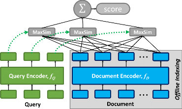

# ColBERT: Efficient and Effective Passage Search via Contextualized Late Interaction over BERT — Khattab & Zaharia, 2020

> **arXiv:** 2004.12832v2 · **Venue:** SIGIR 2020 · **Affiliation:** Stanford University

## TL;DR
ColBERT replaces the "one vector per document" assumption of dual-encoder retrieval with a **bag of contextual token vectors** per query and per document, scored by a sum-of-max-similarities operator (**MaxSim**). The query–document interaction is *delayed* until scoring time — "late interaction" — so the expensive BERT pass over each document can be pre-computed and indexed offline, giving near-cross-encoder quality at retrieval-friendly latency.

## Problem & motivation
Two regimes dominated neural IR before ColBERT, with opposite trade-offs:

- **Cross-encoders** (e.g. BERT reranker): feed `[CLS] query [SEP] doc [SEP]` through BERT and read a scalar relevance score. Best quality, but each query–doc pair requires a full BERT forward pass — orders of magnitude too slow for retrieval over millions of documents.
- **Single-vector dual encoders** (e.g. DPR, Sentence-BERT): independently encode query and doc to one vector each and score by inner product. Cheap and indexable with ANN, but the single-vector bottleneck loses fine-grained token-level matching and underperforms cross-encoders.

ColBERT keeps the dual-encoder factorization (documents are encoded **independently** of the query, so they can be precomputed) but recovers fine-grained matching by keeping all token embeddings on both sides and using a lightweight late-interaction operator at scoring time.

## Key idea
Encode the query into $|q|$ token vectors $E_{q_1},\dots,E_{q_{|q|}}$ and the document into $|d|$ token vectors $E_{d_1},\dots,E_{d_{|d|}}$, all L2-normalized. The relevance score is the **sum over query tokens of the maximum cosine similarity to any document token** (MaxSim):

$$
S_{q,d} \;=\; \sum_{i=1}^{|q|} \max_{j=1,\dots,|d|}\; E_{q_i}^{\top} E_{d_j}.
$$

This **factorizes** — $E_{q_i}$ depends only on the query and $E_{d_j}$ only on the document — so document encodings can be precomputed once and reused for every query, while the MaxSim aggregation is a cheap pointwise max+sum that takes microseconds even on CPU.

## How it works

- **Two BERT encoders, shared weights.** A single BERT-base is used for both sides; the role is distinguished by prepending a learned marker token: `[Q]` for queries, `[D]` for documents (after `[CLS]`).
- **Output projection.** Each BERT output token is linearly projected from the BERT hidden size (768) down to a small embedding dimension $m = 128$, then L2-normalized so MaxSim equals cosine similarity.
- **Query augmentation.** Queries are padded to a fixed length $N_q = 32$ with `[MASK]` tokens (not the BERT pad token). The masks are processed by BERT and produce contextual embeddings of their own; this acts as a learned query expansion — the masks attend to the real query tokens and end up holding plausible "missing" terms.
- **Document encoding.** Documents are truncated to a max length (180 tokens is the default in the released code); punctuation and stopwords are optionally filtered to compress the index.
- **End-to-end re-ranking.** Pre-compute and store all document token embeddings offline. At query time: (1) encode the query, (2) for each candidate document (e.g. BM25 top-1000), compute MaxSim against its stored matrix, (3) sort.
- **End-to-end retrieval (no first-stage BM25).** Concatenate all document token vectors into one big matrix; build a FAISS IVF (or HNSW) index. At query time, for each of the $N_q$ query token vectors, retrieve its top-$k'$ nearest document tokens; take the **union of source documents** as a candidate set; rescore each candidate with full MaxSim.
- **Training.** Pairwise softmax cross-entropy on triples $(q, d^+, d^-)$ where $d^-$ is sampled from the official MS MARCO BM25-mined negatives. The model is trained for $\approx 200{,}000$ steps with Adam, learning rate $3\times10^{-6}$, on MS MARCO triples (per §4.1).

## Training / data
- **Backbone:** `bert-base-uncased` (untouched at training time except for fine-tuning).
- **Datasets:** MS MARCO Passage Ranking (training + dev) and TREC CAR (per §4).
- **Objective:** $\mathcal{L} = -\log\frac{\exp(S_{q,d^+})}{\exp(S_{q,d^+})+\exp(S_{q,d^-})}$.
- **Optimizer / schedule:** Adam, lr $3\times10^{-6}$, batch size 32 (per §4.1).
- **Compute:** trained on 4 GPUs; full MS MARCO indexing on a single GPU takes hours.

## Results
| Benchmark | Metric | ColBERT (re-rank BM25 top-1000) | ColBERT (end-to-end) | BM25 | BERT-large reranker | Notes |
|---|---|---|---|---|---|---|
| MS MARCO Passage Dev | MRR@10 | 0.349 | 0.360 | 0.167 | 0.365 | per Table 2 (re-rank) and Table 4 (end-to-end) |
| MS MARCO Passage Dev | Recall@1000 | 0.814 | 0.968 | 0.814 | 0.814 | per Table 2 / Table 4 |
| TREC CAR | MRR@10 | n/a | n/a | n/a | n/a | reported in §4 but not extracted here |
| Latency (re-rank BM25 top-1000) | per query | ≈61 ms (GPU) | — | ≈11 ms | ≈10,700 ms | per Table 2 |
| FLOPs/query vs BERT-large reranker | ratio | $\approx 10^{-4}\times$ | — | — | 1× | per abstract; "four orders-of-magnitude fewer FLOPs" |

> Headline framing from the abstract: ColBERT is *"two orders-of-magnitude faster and requires four orders-of-magnitude fewer FLOPs per query"* than the BERT-large reranker while remaining competitive in quality.

## Limitations & follow-ups
- **Index size.** Storing one $m=128$ vector per token blows up the index: at fp16 the MS MARCO index is ~150 GB. Compression (PQ, binary) hurts quality.
- **Recall ceiling of end-to-end retrieval** is bounded by the per-token ANN recall — pathological queries with rare tokens can miss relevant documents.
- **Stopword effects.** Punctuation/stopword filtering is a pre-processing knob, not learned.

Follow-up work (all from the same group):
- **ColBERTv2** (Santhanam et al., NAACL 2022, arXiv:2112.01488) — clusters token vectors into centroids and stores per-token *residuals* with low-bit quantization (e.g. 2-bit), shrinking the index by ~6–10× while improving quality. Adds denoised supervision via cross-encoder distillation and in-batch negatives.
- **PLAID** (Santhanam et al., CIKM 2022, arXiv:2205.09707) — engine that scores candidates by first ranking centroids, then full residuals, achieving 6–8× lower latency at the same recall as ColBERTv2.
- **Baleen** (Khattab et al., NeurIPS 2021) — multi-hop reasoning over ColBERT.

## Links
- **arXiv:** [abs](https://arxiv.org/abs/2004.12832) · [pdf](https://arxiv.org/pdf/2004.12832)
- **Code:** [stanford-futuredata/ColBERT](https://github.com/stanford-futuredata/ColBERT) (active development on `main` is ColBERTv2 + PLAID; SIGIR'20 code on the [`colbertv1` branch](https://github.com/stanford-futuredata/ColBERT/tree/colbertv1))
- **Pre-trained checkpoint:** <https://downloads.cs.stanford.edu/nlp/data/colbert/colbertv2/colbertv2.0.tar.gz> (ColBERTv2 weights)
- **Hugging Face:** [colbert-ir/colbertv2.0](https://huggingface.co/colbert-ir/colbertv2.0)
- **Community library:** [RAGatouille](https://github.com/AnswerDotAI/RAGatouille) — pip-installable ColBERT for RAG pipelines
- **DSPy integration:** <https://github.com/stanfordnlp/dspy>
- **BibTeX:** see [DBLP entry](https://dblp.uni-trier.de/rec/bibtex/journals/corr/abs-2004-12832)
- **Related / successor papers:** ColBERTv2 (arXiv:2112.01488), PLAID (arXiv:2205.09707), ColPali (arXiv:2407.01449) — late interaction over visual document tokens.
