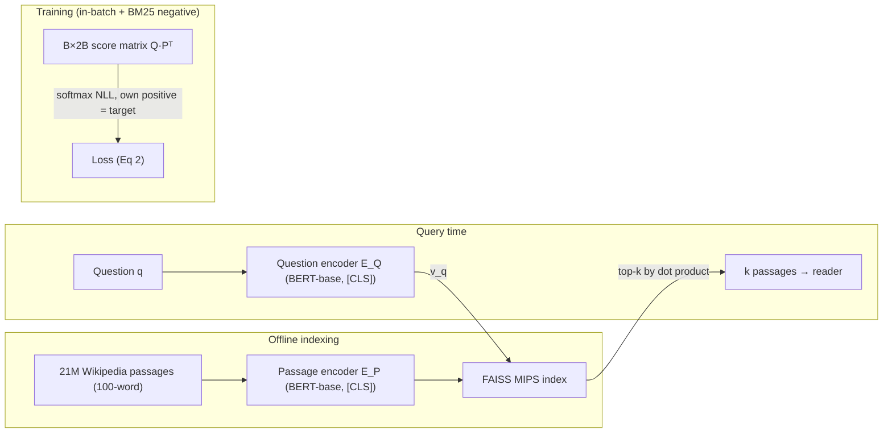
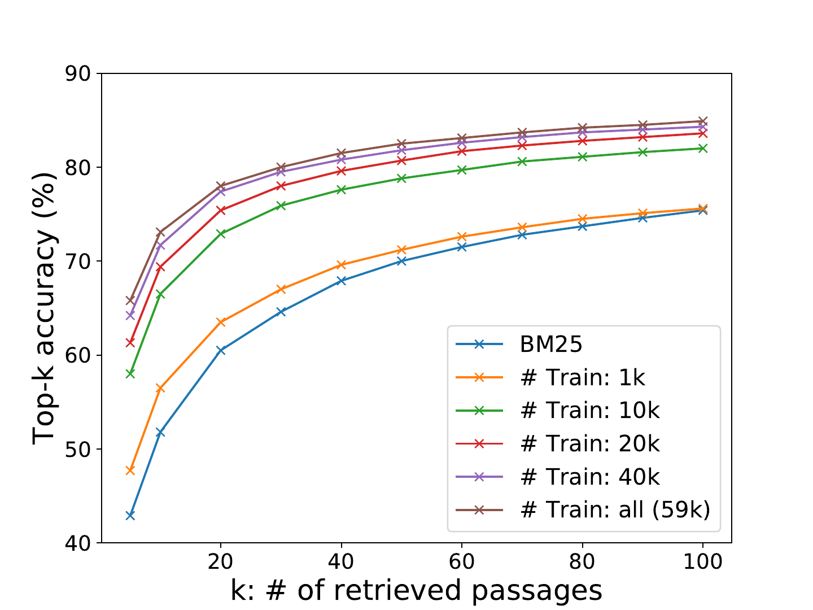
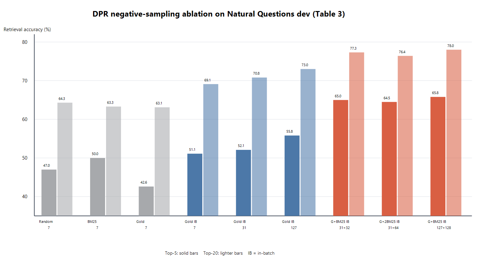

# Dense Passage Retrieval for Open-Domain Question Answering — Karpukhin et al., 2020

> **arXiv:** 2004.04906v3 · **Venue:** EMNLP 2020 · **Affiliation:** Facebook AI · University of Washington · Princeton University

## TL;DR
DPR shows that a **simple dual-encoder** — two independent BERT encoders scored by dot product — can be
trained on a modest number of question–passage pairs to **beat BM25 by 9–19 points** in top-20 passage
retrieval, *without* the expensive inverse-cloze pretraining that earlier dense retrievers (ORQA)
relied on. The decisive ingredient is the training scheme: a softmax **negative-log-likelihood** loss
with **in-batch negatives** plus one **hard BM25 negative** per question. Feeding DPR's passages to a
reader set new state-of-the-art on multiple open-domain QA benchmarks.

## Problem & motivation
Open-domain QA is a two-stage pipeline: a **retriever** narrows a huge corpus to a few passages, then a
**reader** extracts the answer. Retrieval was dominated by sparse **TF-IDF/BM25**, which matches exact
keywords but misses semantic paraphrase — e.g. it struggles to link *"bad guy"* to *"villain."* Dense
retrieval could fix that, but the prevailing belief was that learning good dense vectors needs **many**
labeled pairs or heavy extra pretraining (ORQA's inverse-cloze task). DPR asks: *can we train a strong
dense retriever using only existing question–passage pairs, no special pretraining?* The answer is yes —
with the right negatives.

## Key idea
Two independent BERT-base encoders map questions and passages into a shared space; relevance is a **dot
product** (Eq. 1):

$$
\mathrm{sim}(q,p)=E_Q(q)^{\top}E_P(p),
$$

where $E_Q,E_P$ take the **`[CLS]`** output ($d=768$). Because the similarity **factorizes**, all $M$
passage vectors are precomputed once and indexed with **FAISS** for maximum-inner-product search; only
the question is encoded at query time.

**Training = metric learning.** For a batch of $m$ instances, each a question $q_i$ with one positive
$p_i^{+}$ and $n$ negatives $p_{i,j}^{-}$, minimize the negative log-likelihood of the positive (Eq. 2):

$$
L\big(q_i,p_i^{+},p_{i,1}^{-},\dots,p_{i,n}^{-}\big)=-\log\frac{e^{\,\mathrm{sim}(q_i,p_i^{+})}}{e^{\,\mathrm{sim}(q_i,p_i^{+})}+\sum_{j=1}^{n}e^{\,\mathrm{sim}(q_i,p_{i,j}^{-})}}.
$$

**In-batch negatives.** With $B$ questions per batch, stack embeddings into $\mathbf{Q},\mathbf{P}\in\mathbb{R}^{B\times d}$;
$\mathbf{S}=\mathbf{Q}\mathbf{P}^{\top}$ is a $B\times B$ score matrix whose diagonal is positive and off-diagonal
entries are negatives. This reuses each passage as a negative for every *other* question — $B^2$ pairs
from $B$ examples, essentially free. The **best** recipe adds **one hard BM25 negative** per question
(a passage that scores high on BM25 but lacks the answer), shared across the batch.

## How it works



### Passage construction and indexing

The corpus is the 20 December 2018 English Wikipedia dump. DrQA preprocessing removes tables,
infoboxes, lists, and disambiguation pages, then splits article text into **21,015,324 disjoint
100-word passages**. Each passage is prefixed with its article title and a `[SEP]` token. The passage
encoder maps every passage to one 768-dimensional vector offline; FAISS then performs maximum-inner-
product search over that static matrix.

At query time, only $E_Q(q)$ is computed. This factorization is DPR's systems contribution: unlike a
cross-encoder score, $E_Q(q)^\top E_P(p)$ permits all $E_P(p)$ values to be cached before the question is
known. The two encoders start from BERT-base-uncased but do **not** share parameters, allowing question
and passage language to specialize independently.

### Negative construction

With only one positive per question, random negatives rapidly become too easy. DPR compares random
corpus passages, high-ranked BM25 passages that do not contain the answer, and gold passages belonging
to other questions. Its strongest recipe combines in-batch gold passages with one BM25 hard negative
per question.

For batch size $B$, encode the $B$ positives and $B$ hard negatives into
$P\in\mathbb R^{2B\times d}$ and the questions into $Q\in\mathbb R^{B\times d}$. Then

$$
S=QP^T\in\mathbb R^{B\times2B}.
$$

For row $i$, its own positive is the target and the remaining $2B-1$ columns are negatives. This is
more precise than treating each hard negative as local to one question: every encoded passage is
shared across the batch, expanding the negative pool with no additional encoder calls.

### Reader and passage reranker

The end-to-end system is not just the retriever. A separate BERT-base cross-encoder reads each of the
top $k\le100$ question-passage pairs. For passage $i$, let
$P_i\in\mathbb R^{L\times h}$ be its contextual token states and let
$\hat P=[P_1^{[\mathrm{CLS}]},\ldots,P_k^{[\mathrm{CLS}]}]\in\mathbb R^{h\times k}$.
The reader predicts answer boundaries and passage relevance:

$$
P_{\mathrm{start},i}(s)=\operatorname{softmax}(P_iw_{\mathrm{start}})_s,
\qquad
P_{\mathrm{end},i}(t)=\operatorname{softmax}(P_iw_{\mathrm{end}})_t,
$$

$$
P_{\mathrm{selected}}(i)
=\operatorname{softmax}(\hat P^Tw_{\mathrm{selected}})_i.
$$

Here $s,t$ index token positions, $h=768$, and the three $w$ vectors are learned. Span score is
$P_{\mathrm{start},i}(s)P_{\mathrm{end},i}(t)$; passage selection supplies a cross-attentive reranking
signal that would be too expensive over all 21 million passages. Reader training samples one positive
and 23 negatives from the retriever's top 100, maximizes the marginal likelihood of every occurrence
of the answer string in the positive passage, and jointly maximizes selection of that passage.



*Figure 1 from the pinned v3 paper. DPR trained with only 1,000 examples already slightly exceeds
BM25; 10K-40K examples produce most of the eventual gain, and the curves flatten as $k$ grows. The
result supports the paper's claim that dense retrieval did not require ORQA-style inverse-cloze
pretraining, but it is an in-domain NQ experiment rather than a zero-shot transfer result.*

## Training / data

### Supervision

The five datasets are Natural Questions (NQ), TriviaQA, WebQuestions (WQ), CuratedTREC, and SQuAD
v1.1. NQ and SQuAD provide annotated source passages, which the authors align to the processed
Wikipedia corpus. TriviaQA, WQ, and TREC provide question-answer pairs, so the positive is the
highest-ranked BM25 passage among the top 100 that contains the answer; questions with no such passage
are discarded. This distant-supervision rule can select a passage that merely mentions the answer
rather than one that supports it.

The **Single** setting trains one retriever per dataset. **Multi** combines NQ, TriviaQA, WQ, and TREC,
excluding SQuAD because its questions were authored while annotators viewed a specific paragraph and
have an unusually lexical distribution.

### Retriever optimization

- Two independently initialized BERT-base-uncased encoders are fine-tuned end to end.
- The best setup uses batch size 128, one BM25 hard negative per question, and all other positive and
  hard-negative passages in the batch as negatives.
- Optimization uses Adam, learning rate $10^{-5}$, linear scheduling with warmup, and dropout 0.1.
- Large datasets train for up to 40 epochs; small datasets train for up to 100. The released recipe
  used one machine with eight 32GB GPUs and takes about a day for the NQ retriever.
- The paper does not apply a temperature or normalize embeddings; magnitude therefore contributes to
  inner-product scores.

### Reader optimization

The reader uses 24 passages per training question, batch size 16 for NQ/TriviaQA/SQuAD and 4 for
WQ/TREC, on eight 32GB GPUs. For small datasets in the Multi setting, an NQ-trained reader is
fine-tuned on the target dataset. At inference, $k$ is selected on development data; NQ peaks at 50,
while reducing to 10 passages changes EM from 41.5 to 40.8.

### Index and throughput

The paper reports about **8.8 GPU-hours** to encode 21 million passages and **8.5 hours** to build the
FAISS index. Its flat dense index serves about **995 questions/s** for top-100 retrieval, versus 23.7
questions/s for the tested Lucene BM25 configuration. These are 2020 hardware/software measurements,
not a hardware-normalized algorithmic comparison. The archived repository later added HNSW and
scalar-quantized HNSW options, but those are post-paper implementation choices.

## Results
From the paper (Tables 2–4). Retrieval = % of top-$k$ passages containing the answer; QA = exact match.

| Benchmark | Metric | DPR | BM25 | Source |
|---|---|---|---|---|
| Natural Questions | Top-20 | **78.4** | 59.1 | §5.1, Table 2 |
| Natural Questions | Top-100 | **85.4** | 73.7 | §5.1, Table 2 |
| TriviaQA | Top-20 | **79.4** | 66.9 | §5.1, Table 2 |
| WebQuestions | Top-20 | **73.2** | 55.0 | §5.1, Table 2 |
| SQuAD | Top-20 | 63.2 | **68.8** | §5.1, Table 2 |
| NQ end-to-end QA | EM | **41.5** | 32.6 (BM25) / 33.3 (ORQA) | §6.2, Table 4 |
| TriviaQA end-to-end QA | EM | **56.8** | 52.4 | §6.2, Table 4 |

Ablations (Table 3): with seven independently sampled negatives, random, BM25, and gold negatives
reach similar top-20 accuracy (64.3, 63.3, and 63.1). Reusing gold positives in-batch and increasing
the pool from 7 to 127 negatives raises top-5 accuracy from 51.1 to 55.8. Adding one shared BM25 hard
negative per question produces the largest jump, reaching **65.8 top-5** and **78.0 top-20** at batch
size 128. DPR trained on **just 1,000 examples already beats BM25** (Fig. 1). SQuAD is the lone
loss — its questions were written while looking at the passage, giving BM25 an artificial lexical-overlap
edge. Dot product and L2 tie; cosine and triplet loss are slightly worse (Appendix B).



*Replot of the paper's Table 3 using its published values. Gray bars use independently sampled
negatives, blue bars add or scale in-batch gold negatives, and red bars add shared BM25 hard negatives.
The comparison isolates why “hard negatives” alone is an incomplete summary: batch sharing and pool
size are also material.*

The retrieval metric is answer-string recall rather than judged passage relevance: a retrieved
passage counts as correct if it contains an acceptable answer string. This is practical for open-domain
QA, but it can count unsupported mentions as successes and miss valid paraphrased evidence.

The retriever-to-reader relationship is strong but not one-to-one. On NQ, a separately trained DPR
retriever and reader reach 41.5 EM; the paper's comparable joint-training experiment reaches 39.8 EM.
This supports modular training in this setup, not a general proof that end-to-end retrieval learning is
inferior.

## Limitations & follow-ups
- **Rare salient phrases.** DPR can miss highly specific entities BM25 nails (e.g. *"Thoros of Myr"*),
  motivating hybrid **BM25 + DPR** scoring.
- **False negatives.** Other passages in a batch can answer the same question even when treated as
  negatives. Answer-string filtering reduces but does not solve semantic duplication.
- **Distant positive noise.** Three datasets derive positives from BM25 plus answer containment, which
  can reinforce lexical retrieval and does not guarantee evidential support.
- **Fixed hard negatives.** The paper does not refresh hard negatives as the encoder improves; later
  systems such as ANCE mine against updated dense indexes.
- **Index memory and rebuild cost.** A float32 matrix for 21,015,324 vectors of width 768 is roughly
  60 GiB before FAISS overhead. Corpus or model changes require re-encoding, unlike updating postings
  for a small lexical change.
- **English, Wikipedia, and short passages.** Results do not establish multilingual, multi-domain, or
  long-document retrieval. The fixed 100-word segmentation can separate a question from supporting
  context and removes tables and infoboxes before retrieval.
- **Metric leakage.** Answer containment rewards any passage containing the string, while SQuAD's
  question-writing process creates a distribution unlike natural search. Aggregate top-$k$ numbers
  should therefore be read per dataset.
- **Reader cost remains query-dependent.** Retrieval is decomposable, but cross-encoding and span
  extraction still run for every shortlisted question-passage pair.
- **Archived implementation.** The official repository became read-only on 31 October 2023 and pins
  old Python, PyTorch, and Transformers-era dependencies. Reproduction should isolate the environment
  or use a maintained evaluator such as Pyserini rather than silently modernizing kernels and defaults.
- **Noncommercial code license.** The ACL paper is CC BY 4.0, while the repository is CC BY-NC 4.0;
  the publication license does not make the implementation commercially permissive.
- **Relation to neighbors.** DPR is the canonical **single-vector dual encoder** that
  [ColBERT](retrieval_2020_colbert-late-interaction.md)/[ColBERTv2](retrieval_2021_colbertv2.md)
  contrast against (one vector vs per-token), and the retrieval backbone reused by soft-token RAG
  compressors like [xRAG](softtoken_2024_xrag.md) and [COCOM](softtoken_2024_cocom.md). Its **in-batch
  negative** trick is the same contrastive recipe behind [Sentence-BERT](retrieval_2019_sentence-bert.md)
  and modern text embedders.

## Links
- **arXiv:** [abs](https://arxiv.org/abs/2004.04906v3) · [html](https://arxiv.org/html/2004.04906v3) · [pdf](https://arxiv.org/pdf/2004.04906v3)
- **Code:** [facebookresearch/DPR](https://github.com/facebookresearch/DPR) (archived, read-only)
- **Hugging Face:** —
- **Project page:** —
- **Blog posts:** —
- **Talks / videos:** [EMNLP presentation](https://slideslive.com/38939151)
- **OpenReview / venue page:** [ACL Anthology](https://aclanthology.org/2020.emnlp-main.550/) · [DOI](https://doi.org/10.18653/v1/2020.emnlp-main.550)
- **Papers-with-Code:** [Dense Passage Retrieval](https://paperswithcode.com/paper/dense-passage-retrieval-for-open-domain)
- **Licenses:** [paper: CC BY 4.0](https://aclanthology.org/2020.emnlp-main.550/) · [code: CC BY-NC 4.0](https://github.com/facebookresearch/DPR/blob/main/LICENSE)
- **BibTeX:**
  ```bibtex
  @inproceedings{karpukhin-etal-2020-dense,
    title     = {Dense Passage Retrieval for Open-Domain Question Answering},
    author    = {Karpukhin, Vladimir and Oguz, Barlas and Min, Sewon and Lewis, Patrick and Wu, Ledell and Edunov, Sergey and Chen, Danqi and Yih, Wen-tau},
    editor    = {Webber, Bonnie and Cohn, Trevor and He, Yulan and Liu, Yang},
    booktitle = {Proceedings of the 2020 Conference on Empirical Methods in Natural Language Processing (EMNLP)},
    month     = nov,
    year      = {2020},
    address   = {Online},
    publisher = {Association for Computational Linguistics},
    url       = {https://aclanthology.org/2020.emnlp-main.550/},
    doi       = {10.18653/v1/2020.emnlp-main.550},
    pages     = {6769--6781}
  }
  ```
- **Related papers:** [ColBERT](retrieval_2020_colbert-late-interaction.md) · [ColBERTv2](retrieval_2021_colbertv2.md) · [Sentence-BERT](retrieval_2019_sentence-bert.md) · [xRAG](softtoken_2024_xrag.md) · [COCOM](softtoken_2024_cocom.md)
- **Context overview:** [BERT-family encoders, section 16.4](../bert/overview.md#164-from-one-vector-semantics-to-trained-retrieval-geometry)
- **In-repo:** [MixedDecoder](../mixed_decoder/mixed_decoder.md) · [Soft-token compression thread](../context/soft_token/soft_token.md) · [Long-context benchmarks thread](../context/benchmarks/benchmarks.md)
