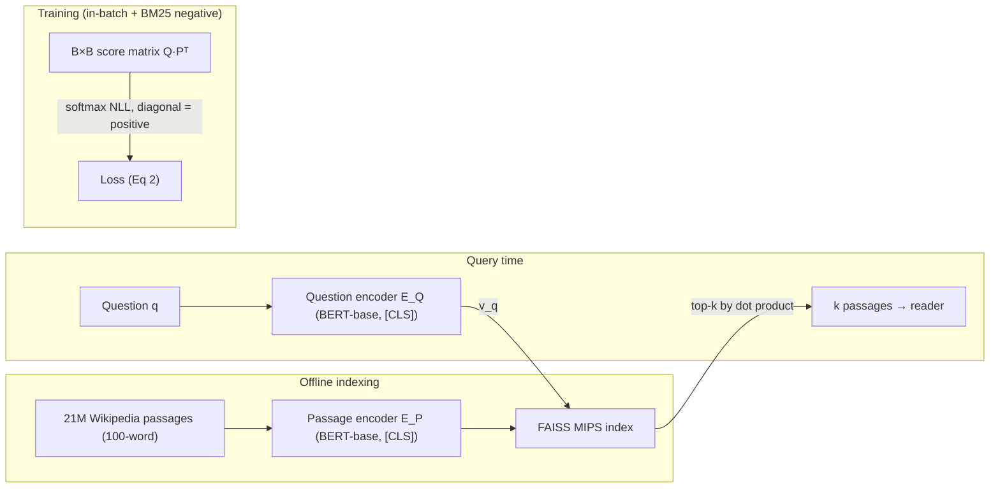

# Dense Passage Retrieval for Open-Domain Question Answering — Karpukhin et al., 2020

> **arXiv:** 2004.04906v3 · **Venue:** EMNLP 2020 · **Affiliation:** Facebook AI · University of Washington · Princeton University

## TL;DR
DPR shows that a **simple dual-encoder** — two independent BERT encoders scored by dot product — can be
trained on a modest number of question–passage pairs to **beat BM25 by 9–19 points** in top-20 passage
retrieval, *without* the expensive inverse-cloze pretraining that earlier dense retrievers (ORQA)
relied on. The decisive ingredient is the training scheme: a softmax **negative-log-likelihood** loss
with **in-batch negatives** plus one **hard BM25 negative** per question. Feeding DPR's passages to a
reader set new state-of-the-art on multiple open-domain QA benchmarks.

## Problem & motivation
Open-domain QA is a two-stage pipeline: a **retriever** narrows a huge corpus to a few passages, then a
**reader** extracts the answer. Retrieval was dominated by sparse **TF-IDF/BM25**, which matches exact
keywords but misses semantic paraphrase — e.g. it struggles to link *"bad guy"* to *"villain."* Dense
retrieval could fix that, but the prevailing belief was that learning good dense vectors needs **many**
labeled pairs or heavy extra pretraining (ORQA's inverse-cloze task). DPR asks: *can we train a strong
dense retriever using only existing question–passage pairs, no special pretraining?* The answer is yes —
with the right negatives.

## Key idea
Two independent BERT-base encoders map questions and passages into a shared space; relevance is a **dot
product** (Eq. 1):

$$
\mathrm{sim}(q,p)=E_Q(q)^{\top}E_P(p),
$$

where $E_Q,E_P$ take the **`[CLS]`** output ($d=768$). Because the similarity **factorizes**, all $M$
passage vectors are precomputed once and indexed with **FAISS** for maximum-inner-product search; only
the question is encoded at query time.

**Training = metric learning.** For a batch of $m$ instances, each a question $q_i$ with one positive
$p_i^{+}$ and $n$ negatives $p_{i,j}^{-}$, minimize the negative log-likelihood of the positive (Eq. 2):

$$
L\big(q_i,p_i^{+},p_{i,1}^{-},\dots,p_{i,n}^{-}\big)=-\log\frac{e^{\,\mathrm{sim}(q_i,p_i^{+})}}{e^{\,\mathrm{sim}(q_i,p_i^{+})}+\sum_{j=1}^{n}e^{\,\mathrm{sim}(q_i,p_{i,j}^{-})}}.
$$

**In-batch negatives.** With $B$ questions per batch, stack embeddings into $\mathbf{Q},\mathbf{P}\in\mathbb{R}^{B\times d}$;
$\mathbf{S}=\mathbf{Q}\mathbf{P}^{\top}$ is a $B\times B$ score matrix whose diagonal is positive and off-diagonal
entries are negatives. This reuses each passage as a negative for every *other* question — $B^2$ pairs
from $B$ examples, essentially free. The **best** recipe adds **one hard BM25 negative** per question
(a passage that scores high on BM25 but lacks the answer), shared across the batch.

## How it works



- **Corpus:** English Wikipedia (Dec 2018), split into **21,015,324** disjoint 100-word passages, each
  prefixed with its article title.
- **Encoders:** two separate BERT-base-uncased; `[CLS]` → 768-d vector.
- **End-to-end QA (§6):** a BERT reader takes the top-$k$ (≤100) passages, scores each for selection
  and extracts a span; span score × passage-selection score picks the answer.

## Training / data
- **Datasets:** Natural Questions, TriviaQA, WebQuestions, CuratedTREC, SQuAD (Table 1). A **Multi**
  encoder combines all except SQuAD.
- **Recipe:** in-batch negatives, **batch 128**, **1 BM25 negative** per question; Adam, lr $10^{-5}$,
  linear schedule, dropout 0.1; up to **40 epochs** (large sets) / **100** (small).
- **Efficiency:** FAISS serves **~995 questions/s** (top-100) vs BM25/Lucene's 23.7 q/s; indexing 21M
  passages ≈ 8.8 GPU-h (embeddings) + 8.5 h (FAISS build).

## Results
From the paper (Tables 2–4). Retrieval = % of top-$k$ passages containing the answer; QA = exact match.

| Benchmark | Metric | DPR | BM25 | Source |
|---|---|---|---|---|
| Natural Questions | Top-20 | **78.4** | 59.1 | §5.1, Table 2 |
| Natural Questions | Top-100 | **85.4** | 73.7 | §5.1, Table 2 |
| TriviaQA | Top-20 | **79.4** | 66.9 | §5.1, Table 2 |
| WebQuestions | Top-20 | **73.2** | 55.0 | §5.1, Table 2 |
| SQuAD | Top-20 | 63.2 | **68.8** | §5.1, Table 2 |
| NQ end-to-end QA | EM | **41.5** | 32.6 (BM25) / 33.3 (ORQA) | §6.2, Table 4 |
| TriviaQA end-to-end QA | EM | **56.8** | 52.4 | §6.2, Table 4 |

Ablations (Table 3): the **negative type barely matters for standard 1-of-N training**, but
**in-batch negatives + a BM25 hard negative** jump top-5 accuracy from ~47% to **65.8%**; accuracy rises
with batch size. DPR trained on **just 1,000 examples already beats BM25** (Fig. 1). SQuAD is the lone
loss — its questions were written while looking at the passage, giving BM25 an artificial lexical-overlap
edge. Dot product and L2 tie; cosine and triplet loss are slightly worse (Appendix B).

## Limitations & follow-ups
- **Rare salient phrases.** DPR can miss highly specific entities BM25 nails (e.g. *"Thoros of Myr"*),
  motivating hybrid **BM25 + DPR** scoring.
- **Fixed encoders after training** — no per-iteration hard-negative refresh (later fixed by **ANCE**).
- **Index build cost** is far higher than a Lucene inverted index (hours vs ~30 min).
- **Relation to neighbors.** DPR is the canonical **single-vector dual encoder** that
  [ColBERT](retrieval_2020_colbert-late-interaction.md)/[ColBERTv2](retrieval_2021_colbertv2.md)
  contrast against (one vector vs per-token), and the retrieval backbone reused by soft-token RAG
  compressors like [xRAG](softtoken_2024_xrag.md) and [COCOM](softtoken_2024_cocom.md). Its **in-batch
  negative** trick is the same contrastive recipe behind [Sentence-BERT](retrieval_2019_sentence-bert.md)
  and modern text embedders.

## Links
- **arXiv:** [abs](https://arxiv.org/abs/2004.04906) · [html](https://arxiv.org/html/2004.04906v3) · [pdf](https://arxiv.org/pdf/2004.04906)
- **Code:** [github.com/facebookresearch/DPR](https://github.com/facebookresearch/DPR)
- **BibTeX:**
  ```bibtex
  @inproceedings{karpukhin2020dpr,
    title     = {Dense Passage Retrieval for Open-Domain Question Answering},
    author    = {Karpukhin, Vladimir and O{\u{g}}uz, Barlas and Min, Sewon and Lewis, Patrick and Wu, Ledell and Edunov, Sergey and Chen, Danqi and Yih, Wen-tau},
    booktitle = {Proceedings of the 2020 Conference on Empirical Methods in Natural Language Processing (EMNLP)},
    pages     = {6769--6781},
    year      = {2020}
  }
  ```
- **Related papers:** [ColBERT](retrieval_2020_colbert-late-interaction.md) · [ColBERTv2](retrieval_2021_colbertv2.md) · [Sentence-BERT](retrieval_2019_sentence-bert.md) · [xRAG](softtoken_2024_xrag.md) · [COCOM](softtoken_2024_cocom.md)
- **In-repo:** [MixedDecoder](../mixed_decoder/mixed_decoder.md) · [Soft-token compression thread](../context/soft_token/soft_token.md) · [Long-context benchmarks thread](../context/benchmarks/benchmarks.md)
