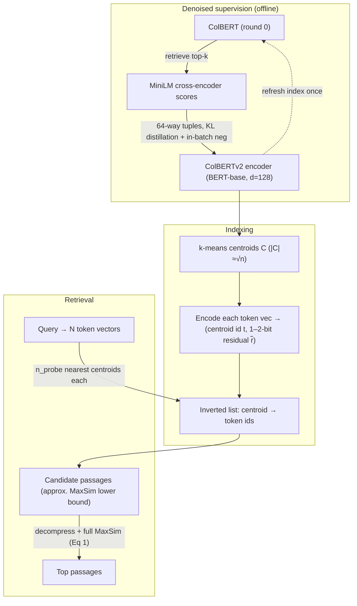

# ColBERTv2: Effective and Efficient Retrieval via Lightweight Late Interaction — Santhanam et al., 2021

> **arXiv:** 2112.01488v3 · **Venue:** NAACL 2022 · **Affiliation:** Stanford University · Georgia Institute of Technology

## TL;DR
ColBERTv2 keeps [ColBERT](retrieval_2020_colbert-late-interaction.md)'s token-level **late-interaction
(MaxSim)** scoring but fixes its two weaknesses at once: it **improves quality** with *denoised
supervision* (distill a cross-encoder into the multi-vector model + hard negatives) and **slashes the
index** with *residual compression* (store each token vector as a centroid id + a 1–2-bit quantized
residual). The result is **state-of-the-art retrieval** in- and out-of-domain across 28 datasets while
cutting late-interaction's space footprint **6–10×** — from 154 GiB to 16–25 GiB on MS MARCO. The paper
also introduces **LoTTE**, a long-tail out-of-domain retrieval benchmark.

## Problem & motivation
Late interaction ([ColBERT](retrieval_2020_colbert-late-interaction.md)) beats single-vector dual
encoders by keeping one vector **per token** and scoring with MaxSim — but that inflates storage by an
order of magnitude (billions of small vectors). Meanwhile, single-vector models had been catching up
through better **supervision** (cross-encoder distillation, hard-negative mining), raising the question
of whether late interaction's fixed token-level inductive bias could benefit from the same tricks.
ColBERTv2's thesis: late interaction is **both** highly amenable to compression (its token vectors
cluster tightly around a modest set of centroids) **and** hugely responsive to denoised supervision —
so one can get top quality *and* a single-vector-sized index.

## Key idea
Two orthogonal upgrades on top of the unchanged MaxSim scorer:

$$
S_{q,d}=\sum_{i=1}^{N}\max_{j=1,\dots,M} Q_i\cdot D_j^{\top},
$$

where $Q\in\mathbb{R}^{N\times d}$ encodes the query as $N$ token vectors and $D\in\mathbb{R}^{M\times d}$
the passage as $M$ token vectors ($d=128$, L2-normalized so the dot product is cosine).

**1. Denoised supervision (§3.2).** Start from a ColBERT model, retrieve top-$k$ passages per training
query, and score each query–passage pair with a **MiniLM cross-encoder** reranker. Form **$w$-way
tuples** ($w=64$: one positive + many hard negatives) and **distill** the cross-encoder's scores into
ColBERT via a **KL-divergence** loss (plus per-GPU in-batch cross-entropy negatives). Refresh the index
once to resample harder negatives. This transfers a strong teacher's judgments and avoids rewarding
false positives / penalizing false negatives.

**2. Residual compression (§3.3).** Token vectors cluster near a set of **centroids** $C$. Encode each
vector $v$ as its nearest centroid index $t$ plus a **quantized residual** $\tilde r$ approximating
$r=v-C_t$; reconstruct $\tilde v = C_t + \tilde r$. Quantizing every dimension of $r$ to **$b\in\{1,2\}$
bits** costs $\lceil\log_2|C|\rceil + b\,n$ bits per vector — in practice **20 or 36 bytes** (4-byte
centroid id + 16/32-byte residual) versus ColBERT's **256 bytes**. This is essentially **product
quantization generalized to the per-token matrix**, applied off-the-shelf with no architecture change.

## How it works



- **Indexing (§3.4):** (1) k-means centroids on a $\sqrt{n}$ sample of embeddings; (2) encode + compress
  every passage token; (3) build the **inverted list** (centroid → token ids).
- **Retrieval (§3.5):** for each query vector, probe its nearest $n_\text{probe}$ centroids, gather
  candidate token embeddings from the inverted list, compute an **approximate MaxSim lower bound** for
  candidate generation, then **decompress and fully rescore** the top $n_\text{candidate}$ with Eq. 1.
- **LoTTE (§4):** 12 StackExchange topic test sets (500–2000 queries, 100k–2M passages), scored by
  **Success@5**, targeting *natural, long-tail* queries that Wikipedia-centric benchmarks miss.

## Training / data
- **Backbone:** shared `bert-base-uncased` (110M), $d=128$; train on **MS MARCO** with 64-way distillation
  tuples, lr $10^{-5}$, batch 32, ~400k steps (two rounds, MiniLM teacher). FAISS only for k-means, not
  search; candidate generation is custom PyTorch.
- **Default:** $b=2$-bit residuals in evaluation.

## Results
From the paper (Tables 4 & 5, §5.3). In-domain MRR@10 on MS MARCO; out-of-domain nDCG@10 / Success@5.

| Benchmark | Metric | ColBERTv2 | Best baseline | ColBERT (v1) | Source |
|---|---|---|---|---|---|
| MS MARCO dev | MRR@10 | **39.7** | 38.8 (RocketQAv2) | 36.0 | §5.1, Table 4 |
| MS MARCO Local Eval | MRR@10 | **40.8** | 39.8 (RocketQAv2) | 36.7 | §5.1, Table 4 |
| BEIR NQ | nDCG@10 | **56.2** | 52.1 (SPLADEv2) | 52.4 | §5.2, Table 5a |
| BEIR TREC-COVID | nDCG@10 | **73.8** | 71.0 (SPLADEv2) | 67.7 | §5.2, Table 5a |
| Wikipedia OpenQA (NQ-dev) | Success@5 | **68.9** | 65.6 (SPLADEv2) | 65.7 | §5.2, Table 5b |
| LoTTE Pooled (search) | Success@5 | **71.6** | 69.8 (RocketQAv2) | 67.3 | §5.2, Table 5b |
| MS MARCO index size | GiB | **16–25** | ~25 (single-vec) | 154 | §5.3 |

ColBERTv2 wins **22 of 28** out-of-domain tests, up to ~8% relative over the next best, while its
2-bit-compressed index (16 GiB at 1-bit / 25 GiB at 2-bit) matches a single-vector model's footprint.
Compression is near-lossless: 2-bit MS MARCO MRR@10 is 36.2 (same as uncompressed), 1-bit 35.5
(Appendix B).

## Limitations & follow-ups
- **Training complexity.** Cross-encoder distillation + two-round hard-negative mining is far heavier
  than ColBERT's simple triples.
- **English-only, MS MARCO-trained** evaluation; other languages/training sets left to future work.
- **Latency 50–250 ms** per query in a Python implementation; systems work (**PLAID**, a later paper)
  pushes this much lower.
- **Relation to neighbors.** ColBERTv2 is the multi-vector counterpart to single-vector
  [DPR](retrieval_2020_dpr.md)/[Sentence-BERT](retrieval_2019_sentence-bert.md) — it keeps the
  token-level fidelity of [ColBERT](retrieval_2020_colbert-late-interaction.md) while reaching
  single-vector storage via residual PQ. Its **centroid + residual** trick is the same
  vector-compression lever that KV-cache and soft-token compressors pull (cf.
  [MixedDecoder](../mixed_decoder/mixed_decoder.md)'s late-interaction discussion in §3.1/§3.3).

## Links
- **arXiv:** [abs](https://arxiv.org/abs/2112.01488) · [html](https://arxiv.org/html/2112.01488v3) · [pdf](https://arxiv.org/pdf/2112.01488)
- **Code:** [github.com/stanford-futuredata/ColBERT](https://github.com/stanford-futuredata/ColBERT) · [LoTTE](https://github.com/stanford-futuredata/colbert-lotte)
- **BibTeX:**
  ```bibtex
  @inproceedings{santhanam2022colbertv2,
    title     = {ColBERTv2: Effective and Efficient Retrieval via Lightweight Late Interaction},
    author    = {Santhanam, Keshav and Khattab, Omar and Saad-Falcon, Jon and Potts, Christopher and Zaharia, Matei},
    booktitle = {Proceedings of the 2022 Conference of the North American Chapter of the Association for Computational Linguistics (NAACL)},
    year      = {2022}
  }
  ```
- **Related papers:** [ColBERT](retrieval_2020_colbert-late-interaction.md) · [DPR](retrieval_2020_dpr.md) · [Sentence-BERT](retrieval_2019_sentence-bert.md)
- **In-repo:** [MixedDecoder](../mixed_decoder/mixed_decoder.md) · [KV-cache compression thread](../context/kv_cache/kv_cache.md) · [Long-context benchmarks thread](../context/benchmarks/benchmarks.md)
