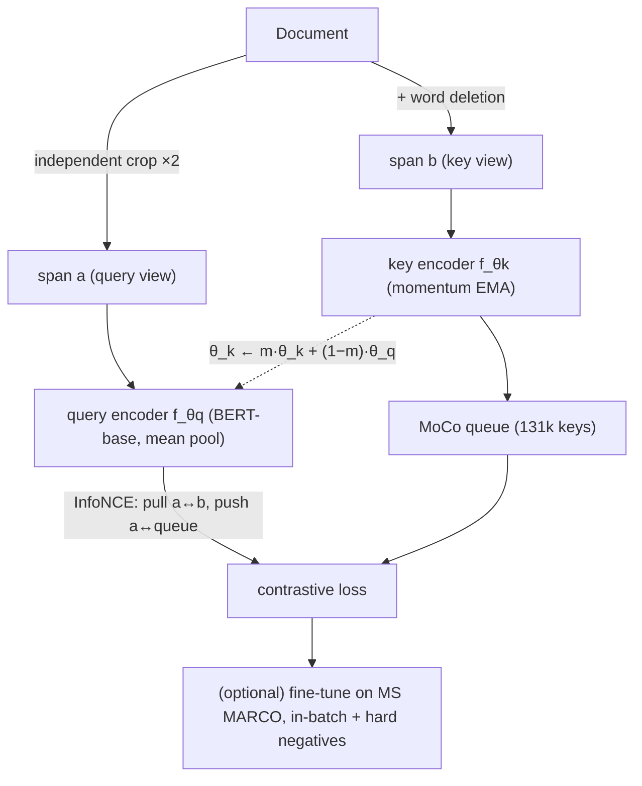

# Contriever: Unsupervised Dense Information Retrieval with Contrastive Learning — Izacard et al., 2021

> **arXiv:** 2112.09118v3 · **Venue:** TMLR 2022 · **Affiliation:** Facebook AI Research · ENS/PSL · Inria · UCL

## TL;DR
Contriever trains a dense retriever **without any labeled data** by borrowing self-supervised
**contrastive learning** from computer vision: two random text spans from the same document form a
positive pair, and a **MoCo** momentum queue supplies many negatives. The resulting unsupervised
encoder **beats BM25 on 11 of 15 BEIR datasets** (Recall@100) — the first dense retriever to be
competitive with BM25 zero-shot — and, when used as *pre-training* before MS MARCO fine-tuning, sets a
new state of the art on BEIR. It also extends to strong multilingual and cross-lingual retrieval
(mContriever).

## Problem & motivation
Dense retrievers like [DPR](retrieval_2020_dpr.md) beat BM25 *when* large labeled query–passage sets
exist, but they **transfer poorly zero-shot** and are outdone by unsupervised BM25 on new domains — and
labeled data barely exists outside English. Prior unsupervised pretext tasks (the **inverse cloze task**,
ICT) still trailed BM25 as standalone retrievers. Contriever asks: can pure **contrastive learning** —
which produces retrieval-friendly features in vision — train a dense retriever that *matches BM25 with
no supervision*, and serve as a better initialization when labels do arrive?

## Key idea
A shared Transformer encoder $f_\theta$ (BERT-base, **average pooling**) maps query and document to
vectors scored by dot product $s(q,d)=\langle f_\theta(q), f_\theta(d)\rangle$. Training uses the
**InfoNCE** contrastive loss over a positive key $k^{+}$ and $K$ negatives:

$$
\mathcal{L}(q,k^{+})=-\log\frac{\exp\!\big(s(q,k^{+})/\tau\big)}{\sum_{i=0}^{K}\exp\!\big(s(q,k_i)/\tau\big)},
$$

with temperature $\tau$. Two design choices carry the method:

**Positive pairs from one document.** Rather than ICT (a sentence as query, its complement as key),
Contriever uses **independent random cropping**: sample *two* contiguous spans from a document. Both
views follow the *same* distribution (symmetric) and can overlap, encouraging BM25-like exact matching;
ablations show cropping **beats ICT**. Extra augmentations (word deletion/replacement) help a little.

**Many negatives via MoCo.** Instead of needing a huge batch for in-batch negatives, Contriever keeps a
**momentum encoder** for keys and a FIFO **queue** of past key embeddings. The key network's parameters
follow an exponential moving average of the query network's:

$$
\theta_k \leftarrow m\,\theta_k + (1-m)\,\theta_q,
$$

so a large, slowly-drifting negative pool is available without backpropagating through keys.

## How it works



- **Pre-training:** 50/50 mix of Wikipedia + CCNet; crop 256-token docs into spans of 5–50% length;
  word-deletion p=0.1; MoCo queue 131,072, momentum 0.9995, $\tau=0.05$; AdamW, lr 5e-5, batch 2,048,
  500k steps, from `bert-base-uncased`.
- **Fine-tuning (optional):** MS MARCO with in-batch negatives + mined hard negatives.
- **mContriever:** same recipe from mBERT over 29 languages (queue 32,768).

## Training / data
Fully unsupervised pre-training needs only raw text (Wikipedia + CCNet). Fine-tuning reuses MS MARCO;
the multilingual variant fine-tunes on MS MARCO (English) and optionally Mr. TyDi. Evaluated on NQ /
TriviaQA (top-k accuracy) and **BEIR** (nDCG@10, Recall@100).

## Results
From the paper (Tables 1, 2, 10, 11). Recall@100 unless noted.

| Setting | Benchmark | Contriever | BM25 | Source |
|---|---|---|---|---|
| **Unsupervised** | NQ R@100 | **77.1** | 76.0 | §4.3, Table 11 |
| Unsupervised | BEIR (beats BM25 on) | **11 / 15 datasets** | — | §4.3 |
| Unsupervised | BEIR avg R@100 | **60.1** | 63.6 | Table 11 |
| **Pre-train + MS MARCO** | BEIR avg nDCG@10 | **46.6** (best dense) | 43.0 | §4.3, Table 2 |
| Pre-train + MS MARCO | BEIR avg R@100 | **67.1** (SOTA) | 63.6 | Table 10 |
| + cross-encoder re-rank | BEIR avg nDCG@10 | **50.2** (best on 9) | 48.6 | Table 2 |
| Few-shot (SciFact) | nDCG@10 | **84.0** | 66.5 | §4.3, Table 3 |

Ablations: **random cropping > ICT**; larger MoCo queue → better; MoCo ≈ in-batch negatives after
fine-tuning but scales to more negatives without huge batches. Contriever loses to BM25 mainly on
**Trec-COVID** (post-training-cutoff topic) and **Touché-2020** (long documents).

## Limitations & follow-ups
- **nDCG@10 still trails BM25** unsupervised (it wins on Recall@100) — the very top ranks need
  supervision or a re-ranker.
- **Weak on long-document / lexical-exact tasks** (Touché, FEVER).
- **Relation to neighbors.** Contriever is the **unsupervised contrastive** cousin of supervised
  [DPR](retrieval_2020_dpr.md) and [Sentence-BERT](retrieval_2019_sentence-bert.md); its cropping +
  in-batch/MoCo recipe is a direct ancestor of [E5](retrieval_2022_e5.md) and
  [BGE](retrieval_2023_bge-c-pack.md), which replace random crops with *curated* web text pairs. It is
  a candidate encoder for the note/latent embedders used in
  [agentic memory](../context/agentic_memory/agentic_memory.md) and RAG compressors
  ([xRAG](softtoken_2024_xrag.md), [COCOM](softtoken_2024_cocom.md)).

## Links
- **arXiv:** [abs](https://arxiv.org/abs/2112.09118) · [html](https://arxiv.org/html/2112.09118v3) · [pdf](https://arxiv.org/pdf/2112.09118)
- **Code:** [github.com/facebookresearch/contriever](https://github.com/facebookresearch/contriever)
- **BibTeX:**
  ```bibtex
  @article{izacard2022contriever,
    title   = {Unsupervised Dense Information Retrieval with Contrastive Learning},
    author  = {Izacard, Gautier and Caron, Mathilde and Hosseini, Lucas and Riedel, Sebastian and Bojanowski, Piotr and Joulin, Armand and Grave, Edouard},
    journal = {Transactions on Machine Learning Research (TMLR)},
    year    = {2022}
  }
  ```
- **Related papers:** [DPR](retrieval_2020_dpr.md) · [GTR](retrieval_2021_gtr.md) · [E5](retrieval_2022_e5.md) · [BGE / C-Pack](retrieval_2023_bge-c-pack.md) · [Sentence-BERT](retrieval_2019_sentence-bert.md)
- **In-repo:** [MixedDecoder](../mixed_decoder/mixed_decoder.md) · [Soft-token compression thread](../context/soft_token/soft_token.md) · [Agentic memory thread](../context/agentic_memory/agentic_memory.md)
