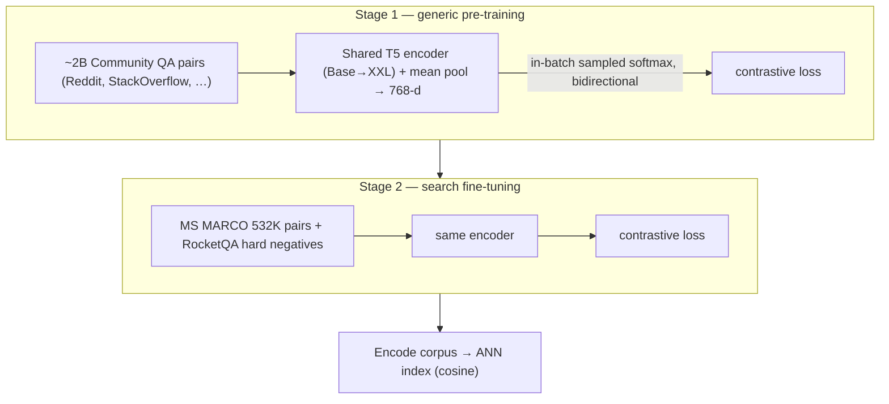

# GTR: Large Dual Encoders Are Generalizable Retrievers — Ni et al., 2021

> **arXiv:** 2112.07899v1 · **Venue:** EMNLP 2022 · **Affiliation:** Google Research

## TL;DR
GTR challenges the belief that a single-vector dual encoder's dot-product bottleneck caps
out-of-domain retrieval. By **scaling the T5 encoder from 110M to 4.8B parameters while keeping the
embedding size fixed at 768**, and training in two stages (web-scale community-QA pre-training →
MS MARCO fine-tuning), zero-shot generalization on **BEIR keeps improving with size** — GTR-XXL
outperforms sparse, dense, and even late-interaction ([ColBERT](retrieval_2020_colbert-late-interaction.md))
baselines. Surprisingly, the big models are **data-efficient**: 10% of MS MARCO already matches the best
out-of-domain performance.

## Problem & motivation
[BEIR](benchmark_2024_ruler.md) showed dual encoders "have issues for out-of-distribution data," and
the common explanation blamed the **bottleneck**: relevance reduced to one dot product between a fixed
768-d query vector and passage vector, too weak to generalize — hence interest in multi-vector
([ColBERT](retrieval_2020_colbert-late-interaction.md)) or sparse models. GTR's counter-hypothesis:
the bottleneck isn't the problem; the **encoder capacity** is. Scaling the backbone (not the embedding
dimension) should produce better *fixed-size* embeddings and close the gap to BM25 on the tasks where
dual encoders struggled.

## Key idea
A **T5-encoder dual encoder** with **shared** query/document towers and **mean pooling** to a fixed
768-d embedding, scored by cosine similarity. Train with an **in-batch sampled-softmax** contrastive
loss (bidirectional q→d and d→q), temperature $\tau=0.01$:

$$
\mathcal{L}=-\log\frac{e^{\,\mathrm{sim}(q_i,p_i^{+})/\tau}}{\sum_{j\in\mathcal{B}} e^{\,\mathrm{sim}(q_i,p_j^{+})/\tau}},
\qquad
\mathrm{sim}(q,p)=\cos\!\big(f(q),f(p)\big),
$$

extended with explicit hard negatives $p_j^{-}$ in the denominator. The **only variable is the encoder
size** — Base (110M), Large (335M), XL (1.24B), XXL (4.8B) — all emitting the same 768-d bottleneck, so
any gain is attributable to backbone capacity, not representation width.

## How it works



- **Pre-training:** ~2 billion **community question–answer** pairs mined from online forums.
- **Fine-tuning:** MS MARCO (532K human pairs) with RocketQA-mined hard negatives (or NQ).
- **Config:** Adafactor, lr 1e-3, batch 2,048, $\tau=0.01$, 800k pre-train + 20k fine-tune steps, JAX/TPU;
  only the **encoder half** of T5 is used.

## Training / data
Two-stage "generic pre-train → search fine-tune." Both stages matter (ablation Table 5): pre-training
alone (GTR-PT) is weak; fine-tuning alone (GTR-FT) is decent and scales; combined is best. Evaluated on
BEIR (nDCG@10, Recall@100) and MS MARCO (in-domain).

## Results
From the paper (Tables 3, 5, 6). BEIR nDCG@10.

| Model | Params | BEIR avg (w/o MS MARCO) | Source |
|---|---|---|---|
| BM25 | — | 0.423 | §5.2, Table 3 |
| DPR | 110M | 0.237 | Table 3 |
| ColBERT | 110M | 0.431 | Table 3 |
| TAS-B (best prior dense) | 66M | 0.415 | Table 3 |
| **GTR-Base** | 110M | 0.416 | Table 3 |
| **GTR-Large** | 335M | 0.445 | Table 3 |
| **GTR-XL** | 1.24B | 0.453 | Table 3 |
| **GTR-XXL** | 4.8B | **0.458** | Table 3 |
| GTR-XXL (MS MARCO in-domain) | 4.8B | 0.442 nDCG@10 · 0.388 MRR@10 | Table 7 |

Scaling **monotonically improves** OOD nDCG@10; GTR-Large already beats TAS-B and DocT5Query. **Data
efficiency** (Table 4): full GTR at **10% of MS MARCO** matches or beats 100%-data OOD performance.
Fine-tuning on weaker NQ instead of MS MARCO still improves with scale, and GTR-Base(NQ) beats DPR (0.360
vs 0.237). Cost: inference latency grows 17→349 ms (Base→XXL).

## Limitations & follow-ups
- **Latency/compute.** XXL is 4.8B params (~349 ms/query) — as slow as a re-ranker; scaling trades
  serving cost for quality.
- **Dot-product quirks.** Larger models retrieve *longer* documents (helps Touché, hurts Trec-COVID),
  an artifact of cosine training on length.
- **Relation to neighbors.** GTR is the **"scale the encoder, fix the bottleneck"** answer to
  [DPR](retrieval_2020_dpr.md)/[ColBERT](retrieval_2020_colbert-late-interaction.md); it shares the
  in-batch contrastive recipe with [Contriever](retrieval_2021_contriever.md) and is a direct baseline
  that [E5](retrieval_2022_e5.md) and [BGE](retrieval_2023_bge-c-pack.md) surpass with **10–40× fewer
  parameters** via better data curation. Sentence-T5 (same group) is its STS sibling.

## Links
- **arXiv:** [abs](https://arxiv.org/abs/2112.07899) · [html](https://arxiv.org/html/2112.07899v1) · [pdf](https://arxiv.org/pdf/2112.07899)
- **Models:** [tfhub.dev/google/collections/gtr](https://tfhub.dev/google/collections/gtr/1) · [sentence-transformers GTR](https://huggingface.co/sentence-transformers/gtr-t5-base)
- **BibTeX:**
  ```bibtex
  @inproceedings{ni2022gtr,
    title     = {Large Dual Encoders Are Generalizable Retrievers},
    author    = {Ni, Jianmo and Qu, Chen and Lu, Jing and Dai, Zhuyun and {\'A}brego, Gustavo Hern{\'a}ndez and Ma, Ji and Zhao, Vincent Y. and Luan, Yi and Hall, Keith B. and Chang, Ming-Wei and Yang, Yinfei},
    booktitle = {Proceedings of the 2022 Conference on Empirical Methods in Natural Language Processing (EMNLP)},
    year      = {2022}
  }
  ```
- **Related papers:** [DPR](retrieval_2020_dpr.md) · [ColBERT](retrieval_2020_colbert-late-interaction.md) · [Contriever](retrieval_2021_contriever.md) · [E5](retrieval_2022_e5.md) · [BGE / C-Pack](retrieval_2023_bge-c-pack.md)
- **In-repo:** [MixedDecoder](../mixed_decoder/mixed_decoder.md) · [Long-context benchmarks thread](../context/benchmarks/benchmarks.md) · [Soft-token compression thread](../context/soft_token/soft_token.md)
