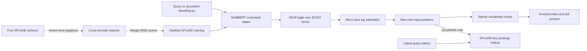
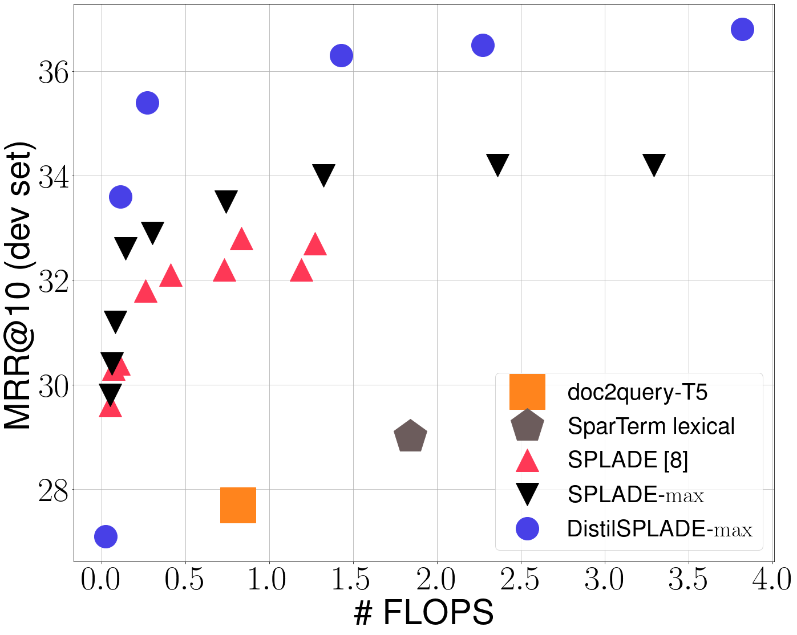
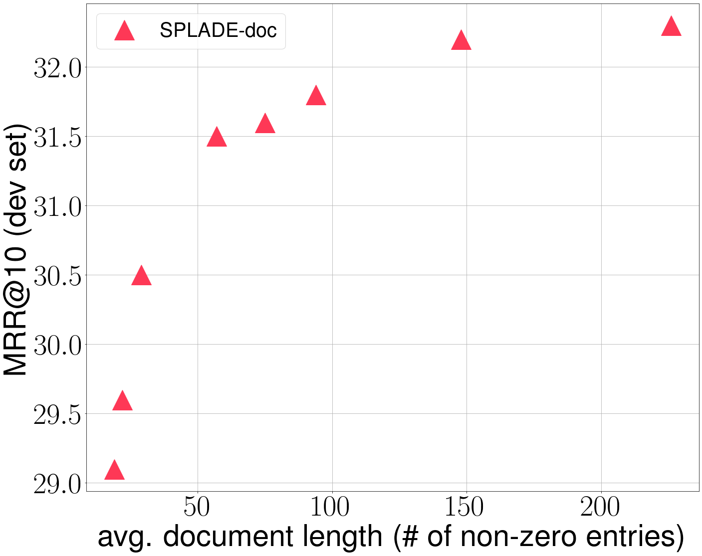

# SPLADE v2: Learned Sparse Expansion - Formal et al., 2021

> **arXiv:** 2109.10086v1 · **Venue:** arXiv preprint · **Affiliation:** Naver Labs Europe; Sorbonne Université, CNRS, LIP6

## TL;DR

SPLADE v2 turns a DistilBERT masked-language-model head into a learned bag of words: every query and document becomes a sparse, nonnegative vector over the 30,522-token WordPiece vocabulary, and relevance is their dot product. Unlike contextual term reweighting, SPLADE can activate terms absent from the input, so it performs expansion and weighting while remaining compatible with an inverted index.

The paper makes three changes to the original SPLADE: max-pooling vocabulary logits instead of summing them, a document-only expansion variant that removes neural query encoding, and cross-encoder distillation with SPLADE-mined hard negatives. Max pooling raises MS MARCO MRR@10 from 0.322 to 0.340; DistilSPLADE-max reaches 0.368 and averages 0.506 nDCG@10 over the paper's 13 zero-shot BEIR datasets. These gains are not free: the strongest distilled operating point activates more postings, and the FLOPS regularizer is the control knob between retrieval quality and sparse-index cost.

## Problem & motivation

First-stage retrieval needs to search millions of documents before an expensive reranker can be applied. Two established representations offer different compromises:

- **Bag-of-words retrieval** supports exact term matching and efficient inverted indexes, but literal overlap misses relevant documents that use different vocabulary.
- **Dense retrieval** compresses meaning into a low-dimensional vector and reduces vocabulary mismatch, but gives up an explicit lexical interface and usually requires exact or approximate nearest-neighbor infrastructure.

Earlier neural sparse systems addressed only part of this gap. DeepCT reweighted terms already present in a document, so it could not create a match to an absent synonym. Doc2query-T5 generated likely queries offline, but required multiple autoregressive beam-search passes and optimized an indirect text-generation objective. Other vocabulary-prediction models produced representations that were not sparse enough for efficient unrestricted retrieval or did not explicitly regularize index cost.

The original SPLADE showed that BERT's MLM vocabulary logits could provide contextual expansion and term importance in one differentiable model. Its central engineering tension remained: expanding into a 30,522-dimensional vocabulary improves recall, but every activated dimension creates a posting and increases query-document intersections. SPLADE v2 studies whether pooling, query asymmetry, distillation, and hard negatives can move this effectiveness-efficiency frontier.

The work is about **first-stage full retrieval**, not reranking. Its reported MS MARCO and TREC numbers come from searching the complete collection with the sparse representations. The cross-encoder appears only as a training teacher for DistilSPLADE-max.

## Key idea

Let a tokenized query or document be $t=(t_1,\ldots,t_N)$. DistilBERT produces contextual states $h_i\in\mathbb R^{768}$. For each input position $i$ and vocabulary token $j$, SPLADE reuses the MLM prediction head:

$$
z_{ij}=\operatorname{transform}(h_i)^\top E_j+b_j,
\qquad j\in\{1,\ldots,|V|\},
\qquad |V|=30{,}522,
$$

where $E_j$ is the tied input embedding of vocabulary token $j$, $b_j$ is its MLM bias, and `transform` is the MLM head's linear projection, GELU, and LayerNorm. Because this is the pretrained MLM output layer, an input such as “car” can assign positive evidence to vocabulary entries such as “automobile” even when they do not occur literally.

SPLADE v2 converts the position-level logits into one nonnegative vocabulary vector using max pooling:

$$
w_j(t)=\max_{1\le i\le N}
\log\!\left(1+\operatorname{ReLU}(z_{ij})\right).
$$

ReLU creates exact zeros, `log1p` saturates very large activations, and max pooling keeps the strongest contextual evidence for vocabulary term $j$. Query and document vectors are scored by sparse dot product:

$$
s(q,d)=w(q)^\top w(d)
=\sum_{j\in V}w_j(q)w_j(d).
$$

Only dimensions active on both sides contribute. This gives learned semantic expansion an ordinary inverted-index execution path: vocabulary dimensions are terms, document weights are posting impacts, and query weights scale the postings visited at search time.

## How it works

### 1. Encoder and vocabulary projection

The released v2 checkpoints are initialized from uncased DistilBERT:

| Property | Value | Role |
| --- | ---: | --- |
| Transformer layers | 6 | Shared query/document encoder |
| Hidden width | 768 | Contextual token states |
| Attention heads | 12 | DistilBERT self-attention |
| FFN width | 3,072 | GELU feed-forward block |
| Vocabulary / output width | 30,522 | BERT WordPiece sparse dimensions |
| Position limit in checkpoint | 512 | Paper truncates evaluation inputs to 256 |
| Similarity | sparse dot product | Executable through postings lists |

For a batch of $B$ sequences of length $N$, the encoder emits $H\in\mathbb R^{B\times N\times768}$. The tied MLM projection produces $Z\in\mathbb R^{B\times N\times30{,}522}$ before activation and pooling. This large dense intermediate is paid during encoding; the stored and searched result is sparse.

Literal and expansion dimensions use the same vocabulary. A nonzero coordinate may represent an input token that SPLADE reweighted or a token predicted from context. Consequently, the index remains interpretable at the WordPiece level, though subwords and spurious expansions limit word-level explanations.

### 2. Original SPLADE sum pooling

The original model aggregates evidence from every input position:

$$
w_j^{\mathrm{sum}}(t)
=\sum_{i=1}^{N}\log\!\left(1+\operatorname{ReLU}(z_{ij})\right).
$$

Repeated or diffuse evidence accumulates. This can make magnitude depend strongly on sequence length and allow many modest predictions to outweigh one decisive contextual signal.

### 3. SPLADE-max

SPLADE v2 replaces the sum with the maximum shown in the Key idea. Each vocabulary coordinate is now explained by its strongest source position. The change resembles max aggregation in SPARTA and EPIC, and conceptually echoes ColBERT's “best local match,” but the output is one scalar per vocabulary term rather than one dense vector per input token.

The architecture and score remain otherwise unchanged. This single pooling change moves MS MARCO MRR@10 from 0.322 to 0.340 and TREC DL 2019 nDCG@10 from 0.665 to 0.684 (Table 1).

### 4. SPLADE-doc

SPLADE-doc runs the neural expansion model only on documents. A query is an unweighted bag of its literal WordPiece tokens, so its score is

$$
s_{\mathrm{doc}}(q,d)=\sum_{j\in q}w_j(d).
$$

Document encoding, expansion, and posting construction occur offline. At query time there is no Transformer and no query expansion; retrieval looks up each literal query token and sums learned document impacts. This is faster online but loses contextual query weighting and expansion. It is not “one forward pass per search”: the one neural pass is per document during indexing, followed by ordinary sparse lookup for every query.

### 5. Ranking with hard and in-batch negatives

For batch item $i$, let $q_i$ be a query, $d_i^+$ its relevant passage, $d_i^-$ an explicit hard negative such as a BM25 result, and $d_{i,j}^-$ the positive passage paired with another query in the same batch. The ranking loss is

$$
\mathcal L_{\mathrm{rank\text{-}IBN}}^{(i)}
=-\log
\frac{\exp s(q_i,d_i^+)}
{\exp s(q_i,d_i^+)+\exp s(q_i,d_i^-)
+\sum_j\exp s(q_i,d_{i,j}^-)}.
$$

The explicit negative teaches fine distinctions near the query; in-batch positives create a much larger negative set without extra document encoding. The equation has no reported temperature. Because MS MARCO labels are shallow, both sources can contain false negatives.

### 6. FLOPS regularization

Merely minimizing each vector's $\ell_1$ norm does not ensure an efficient inverted index: a few globally frequent learned dimensions can create enormous posting lists. SPLADE instead uses the FLOPS surrogate introduced by Paria et al. Let

$$
\bar a_j=\frac{1}{B}\sum_{i=1}^{B}w_j(x_i)
$$

be a continuous batch estimate of how often and strongly dimension $j$ activates. The regularizer is

$$
\mathcal L_{\mathrm{FLOPS}}(X)
=\sum_{j\in V}\bar a_j^2
=\sum_{j\in V}
\left(\frac{1}{B}\sum_{i=1}^{B}w_j(x_i)\right)^2.
$$

Squaring penalizes dimensions that are active across many examples more heavily, encouraging a better-balanced posting distribution. Separate query and document penalties produce the complete loss

$$
\mathcal L
=\mathcal L_{\mathrm{rank\text{-}IBN}}
+\lambda_q\mathcal L_{\mathrm{FLOPS}}(Q)
+\lambda_d\mathcal L_{\mathrm{FLOPS}}(D).
$$

Query sparsity is especially important because active query terms determine how many posting lists are traversed. The paper sweeps regularization rather than proposing one universal operating point.

The reported evaluation metric called “FLOPS” is a probabilistic cost proxy,

$$
\operatorname{FLOPS}
=\mathbb E_{q,d}\left[
\sum_{j\in V}p_j(q)p_j(d)
\right],
$$

where $p_j(x)$ is the empirical activation probability of dimension $j$. It estimates expected overlapping nonzero dimensions over roughly 100,000 development queries. It is **not** a hardware profiler's count of every floating-point instruction used by Transformer encoding, indexing, or postings traversal.

### 7. DistilSPLADE-max

Distillation proceeds in two rounds:

1. Train a SPLADE retriever and a cross-encoder reranker on the Margin-MSE triplets released by Hofstätter et al. The teacher starts from `cross-encoder/ms-marco-MiniLM-L-12-v2`.
2. Use the distilled SPLADE retriever to mine harder negatives than BM25. Score the resulting positive-negative pairs with the cross-encoder, then train a new SPLADE model from scratch against those teacher scores. This final student is DistilSPLADE-max.

The cited Margin-MSE objective matches differences rather than absolute scores. If teacher $T$ and student $S$ score positive $d^+$ and negative $d^-$,

$$
\Delta_T=s_T(q,d^+)-s_T(q,d^-),
\qquad
\Delta_S=s_S(q,d^+)-s_S(q,d^-),
$$

$$
\mathcal L_{\mathrm{MarginMSE}}
=\left(\Delta_S-\Delta_T\right)^2.
$$

This formula comes from the explicitly cited Margin-MSE method; the SPLADE v2 paper names the loss but does not restate its equation or fully specify how it is combined with sparse regularization. The teacher influences training only. DistilSPLADE-max still performs standalone sparse first-stage retrieval at inference.



The solid upper path is normal SPLADE-max indexing and retrieval. The dotted path is training-only distillation. The lower path shows SPLADE-doc's asymmetric online interface.

### 8. What the figures establish



*Figure 1 from arXiv v1. Each point is a different regularization setting, so “SPLADE v2” denotes a frontier rather than one immutable latency-quality configuration. DistilSPLADE-max reaches 0.368 MRR@10 near 4 FLOPS and about 0.35 near 0.3 FLOPS (per Section 4.3).*



*Figure 2 from arXiv v1. The paper highlights an operating point with about 19 nonzero dimensions per document and 0.296 MRR@10, roughly matching doc2query-T5 quality with one offline non-autoregressive document pass.*

### 9. Indexing and inference

After encoding, retain nonzero token IDs and floating-point impacts. An inverted index maps each vocabulary token to documents and weights. At query time, traverse postings for active query dimensions and accumulate $w_j(q)w_j(d)$. The paper's implementation uses Python arrays and Numba-parallelized retrieval; the later official repository can also export quantized integer impacts for Anserini and supports PISA.

The paper does not publish end-to-end latency, throughput, memory, or index-byte measurements for the selected v2 models. FLOPS and average nonzero dimensions are informative proxies but do not capture Transformer query latency, cache behavior, compression, dynamic pruning, or posting skew completely.

## Training / data

### Supervision and evaluation collections

Training uses MS MARCO passage ranking: about 8.8M passages and hundreds of thousands of training queries with shallow labels averaging approximately 1.1 relevant passage per query. MS MARCO development contains 6,980 queries. TREC Deep Learning 2019 supplies 43 queries with denser human judgments.

For ordinary SPLADE-max, each example contains one positive, one explicit hard negative sampled through BM25, and in-batch negatives. DistilSPLADE-max additionally depends on external Margin-MSE triplets, a separately trained MiniLM cross-encoder teacher, and the first distilled SPLADE checkpoint used to remine negatives.

### Optimization

| Setting | SPLADE-max / distilled model | SPLADE-doc | Source |
| --- | ---: | ---: | --- |
| Initialization | DistilBERT-base | DistilBERT-base | Section 4 |
| Optimizer | Adam | Adam | Section 4 |
| Learning rate | $2\times10^{-5}$ | $2\times10^{-5}$ | Section 4 |
| Schedule | linear, 6,000-step warmup | same | Section 4 |
| Batch size | 124 | 124 | Section 4 |
| Maximum input length | 256 | 256 | Section 4 |
| Training steps | 150,000 | 50,000 | Section 4 |
| Checkpoint | best MRR@10 on 500-query approximate-retrieval validation | final step | Section 4 |
| Hardware | 4 Tesla V100 32GB | 4 Tesla V100 32GB | Section 4 |

The paper does not report wall-clock time, Adam betas, weight decay, random seeds, mixed-precision settings, exact hard-negative mining depth, or the final $(\lambda_q,\lambda_d)$ for every displayed operating point.

### Regularization schedule

To avoid suppressing useful dimensions before ranking is learned, each regularization coefficient grows quadratically until step $T=50{,}000$ and remains fixed:

$$
\lambda_x(t)=
\begin{cases}
\lambda_x^{\max}(t/T)^2,&t<T,\\
\lambda_x^{\max},&t\ge T,
\end{cases}
\qquad x\in\{q,d\}.
$$

The explored terminal coefficients are described only as typically lying between $10^{-4}$ and $10^{-1}$. Since changing batch size changes the scale of the batch-estimated FLOPS penalty, regularization values do not transfer mechanically across hardware configurations.

### BEIR protocol

BEIR evaluation is zero-shot after MS MARCO training. The paper evaluates the 13 available out-of-domain datasets plus MS MARCO, omitting CQADupStack, BioASQ, Signal-1M, TREC-NEWS, and Robust04 because they were not readily available. “Average all” covers 14 rows; “average zero-shot” excludes MS MARCO and covers 13. Baseline values are taken from the BEIR paper or its then-rolling benchmark rather than rerun in one uniform software stack.

### Released artifacts

The official repository provides training, sparse indexing, retrieval, and BEIR evaluation. The v2 checkpoints are `naver/splade_v2_max` and `naver/splade_v2_distil`; their current model cards expose a Sentence Transformers `SparseEncoder` interface and retain the original 30,522-dimensional max-pooled architecture. Both checkpoint cards say 512 tokens are accepted but specify 256 for reproducing the paper's evaluation.

The repository evolved after this paper and now includes configurations and data for SPLADE++, efficient SPLADE, pruning, Anserini, and PISA. Those later defaults are not evidence for v2's exact training recipe and should not be substituted into a strict reproduction without checking revision history.

## Results

### Full-corpus MS MARCO and TREC DL 2019

| First-stage model | MS MARCO MRR@10 | MS MARCO R@1000 | TREC DL 2019 nDCG@10 | TREC R@1000 | Source |
| --- | ---: | ---: | ---: | ---: | --- |
| BM25 | 0.184 | 0.853 | 0.506 | 0.745 | Table 1 |
| doc2query-T5 | 0.277 | 0.947 | 0.642 | 0.827 | Table 1 |
| DeepImpact | 0.326 | 0.948 | 0.695 | n/a | Table 1 |
| Original SPLADE, sum pooling | 0.322 | 0.955 | 0.665 | 0.813 | Table 1 |
| **SPLADE-max** | **0.340** | **0.965** | **0.684** | **0.851** | Table 1 |
| SPLADE-doc | 0.322 | 0.946 | 0.667 | 0.747 | Table 1 |
| **DistilSPLADE-max** | **0.368** | **0.979** | **0.729** | **0.865** | Table 1 |
| TCT-ColBERT, dense baseline | 0.359 | 0.970 | 0.719 | 0.760 | Table 1 |
| TAS-B, dense baseline | 0.347 | 0.978 | 0.717 | 0.843 | Table 1 |
| RocketQA, dense baseline | **0.370** | **0.979** | n/a | n/a | Table 1 |

Max pooling gives absolute gains of 0.018 MRR@10 and 0.019 nDCG@10 over original SPLADE while improving recall. Distillation adds another 0.028 MRR@10 over SPLADE-max and raises TREC nDCG@10 by 0.045. Relative to original SPLADE, 0.665 to 0.729 is a 9.6% relative nDCG@10 gain, matching the abstract's “more than 9%” claim.

SPLADE-doc recovers original SPLADE's MRR@10 without query inference, but its recall drops to 0.946 on MS MARCO and 0.747 on TREC. The asymmetric model is therefore an online-efficiency option, not a strict replacement for the full query/document model.

### BEIR transfer

| Dataset, nDCG@10 | ColBERT | BM25 | TAS-B | SPLADE-sum | SPLADE-max | DistilSPLADE-max | Source |
| --- | ---: | ---: | ---: | ---: | ---: | ---: | --- |
| MS MARCO | 0.425 | 0.228 | 0.408 | 0.387 | 0.402 | **0.433** | Table 2 |
| ArguAna | 0.233 | 0.315 | 0.427 | 0.447 | 0.439 | **0.479** | Table 2 |
| Climate-FEVER | 0.184 | 0.213 | 0.228 | 0.162 | 0.199 | **0.235** | Table 2 |
| DBPedia | 0.392 | 0.273 | 0.384 | 0.343 | 0.366 | **0.435** | Table 2 |
| FEVER | 0.771 | 0.753 | 0.700 | 0.728 | 0.730 | **0.786** | Table 2 |
| FiQA-2018 | 0.317 | 0.236 | 0.300 | 0.258 | 0.287 | **0.336** | Table 2 |
| HotpotQA | 0.593 | 0.603 | 0.584 | 0.635 | 0.636 | **0.684** | Table 2 |
| NFCorpus | 0.305 | 0.325 | 0.319 | 0.311 | 0.313 | **0.334** | Table 2 |
| NQ | **0.524** | 0.329 | 0.463 | 0.438 | 0.469 | 0.521 | Table 2 |
| Quora | **0.854** | 0.789 | 0.835 | 0.829 | 0.835 | 0.838 | Table 2 |
| SCIDOCS | 0.145 | **0.158** | 0.149 | 0.141 | 0.145 | **0.158** | Table 2 |
| SciFact | 0.671 | 0.665 | 0.643 | 0.626 | 0.628 | **0.693** | Table 2 |
| TREC-COVID | 0.677 | 0.656 | 0.481 | 0.655 | 0.673 | **0.710** | Table 2 |
| Touché-2020 v1 | 0.275 | **0.614** | 0.173 | 0.289 | 0.316 | 0.364 | Table 2 |
| **Average, all 14** | 0.455 | 0.440 | 0.435 | 0.446 | 0.460 | **0.500** | Table 2 |
| **Average, 13 zero-shot** | 0.457 | 0.456 | 0.437 | 0.451 | 0.464 | **0.506** | Table 2 |

DistilSPLADE-max is best or tied best on 11 of 14 rows under the paper's comparison. Its 0.506 zero-shot average is 4.2 points above SPLADE-max and 4.9 above ColBERT. The exceptions matter: ColBERT remains slightly stronger on NQ and clearly stronger on Quora, while tuned BM25 dominates Touché-2020. Learned expansion does not eliminate the value of a strong lexical baseline on every domain.

### What is actually ablated

The paper provides clean evidence for three decisions:

- **Pooling:** sum to max improves both selected headline scores by about 0.02 and shifts the full MRR-FLOPS frontier upward (Table 1, Figure 1).
- **Query encoding:** removing it preserves 0.322 MRR@10 but lowers recall, exposing the quality cost of an all-offline neural path (Table 1, Figure 2).
- **Training:** distillation plus SPLADE-mined negatives produces the largest gain, but the two interventions are bundled; the paper does not isolate teacher supervision from harder-negative quality (Section 3.4, Table 1).

It does not ablate log saturation, separate $\lambda_q$ versus $\lambda_d$, the cross-encoder teacher, or Margin-MSE against alternative distillation losses.

## Limitations & follow-ups

- **The best model is not the cheapest point.** DistilSPLADE-max reaches 0.368 MRR@10 near 4 expected posting intersections in Figure 1, whereas lower-cost settings trade away quality. “Sparse” does not identify one index size or latency.
- **FLOPS is a surrogate, not end-to-end latency.** The paper explicitly leaves experimental latency and throughput for future work. It does not report index bytes, encoding throughput, compressed posting size, or production query latency.
- **Distillation and negative mining are confounded.** The final student changes both teacher targets and negative difficulty. There is no factorial ablation showing how much each contributes.
- **The distillation recipe is not self-contained.** It relies on external Hofstätter et al. triplets and Margin-MSE machinery; teacher training, score generation, loss composition, and mining settings are not fully specified in this report.
- **Hyperparameter selection uses a small proxy set.** Checkpoints are selected by approximate retrieval MRR@10 on 500 queries. The paper does not report variance across seeds or sensitivity to this selection procedure.
- **MS MARCO labels are shallow.** In-batch and mined negatives can be relevant but unlabeled, particularly when a stronger retriever discovers alternatives BM25 missed.
- **BEIR coverage is partial and baseline execution is heterogeneous.** Five then-unavailable datasets are omitted, and baseline numbers come from external reports rather than a controlled rerun. The 0.506 average should not be compared directly with later full-BEIR leaderboards.
- **English-only scope.** DistilBERT uncased, MS MARCO, and the evaluated BEIR subset do not establish multilingual behavior. Expansion quality is tied to the English WordPiece vocabulary and pretrained MLM prior.
- **Expansion can create false lexical evidence.** Nonzero terms are interpretable enough to inspect but are not guaranteed faithful explanations; contextual MLM predictions can add misleading or corpus-biased terms.
- **Vocabulary projection is expensive during encoding.** Every position predicts all 30,522 dimensions before pooling. Sparse storage does not make document encoding itself sparse.
- **Short context.** The paper truncates inputs to 256 tokens, and released DistilBERT configs cap positions at 512. This is passage retrieval rather than long-document retrieval.
- **The license is noncommercial.** The arXiv paper, official repository, and released v2 checkpoints are CC BY-NC-SA 4.0; commercial deployment requires separate legal review or permission.

The direct successor, [SPLADE++](https://arxiv.org/abs/2205.04733), disentangles pretrained initialization, distillation, and hard-negative mining more systematically. [An Efficiency Study for SPLADE Models](https://doi.org/10.1145/3477495.3531833) adds disjoint query/document encoders, query-specific regularization, and latency-oriented evaluation. Later systems such as [BGE-M3](retrieval_2024_bge-m3.md) use a narrower learned lexical head that only weights input tokens; unlike SPLADE, they do not expand to arbitrary absent vocabulary terms.

## Links

- **arXiv:** [abs](https://arxiv.org/abs/2109.10086v1) · [html](https://arxiv.org/html/2109.10086v1) · [pdf](https://arxiv.org/pdf/2109.10086v1)
- **Code:** [naver/splade](https://github.com/naver/splade)
- **Hugging Face:** [SPLADE v2 max](https://huggingface.co/naver/splade_v2_max) · [DistilSPLADE v2](https://huggingface.co/naver/splade_v2_distil) · [Naver model collection](https://huggingface.co/naver)
- **Project page:** [Naver Labs Europe SPLADE models](https://europe.naverlabs.com/research/machine-learning-and-optimization/splade-models/)
- **Blog posts:** [SPLADE: a sparse bi-encoder BERT-based model](https://europe.naverlabs.com/blog/splade-a-sparse-bi-encoder-bert-based-model-achieves-effective-and-efficient-first-stage-ranking/)
- **Talks / videos:** —
- **OpenReview / venue page:** — (SPLADE v2 is an arXiv preprint; do not confuse it with the SIGIR 2022 SPLADE++ paper)
- **Papers-with-Code:** [SPLADE v2](https://paperswithcode.com/paper/splade-v2-sparse-lexical-and-expansion)
- **Related local reviews:** [BGE-M3](retrieval_2024_bge-m3.md) · [mGTE](retrieval_2024_mgte.md) · [ColBERT](retrieval_2020_colbert-late-interaction.md) · [ColBERTv2](retrieval_2021_colbertv2.md) · [DPR](retrieval_2020_dpr.md)
- **Related external papers:** [original SPLADE](https://arxiv.org/abs/2107.05720) · [SPLADE++](https://arxiv.org/abs/2205.04733) · [Efficient SPLADE](https://doi.org/10.1145/3477495.3531833)
- **Context overview:** [BERT-family encoders, section 16.5](../bert/overview.md#165-dense-sparse-late-interaction-and-contextual-retrieval-diverge)
- **Licenses:** [paper: CC BY-NC-SA 4.0](https://arxiv.org/abs/2109.10086v1) · [code: CC BY-NC-SA 4.0](https://github.com/naver/splade/blob/main/LICENSE) · [checkpoints: CC BY-NC-SA 4.0](https://huggingface.co/naver/splade_v2_distil)
- **BibTeX:**

```bibtex
@misc{formal2021spladev2,
  title     = {{SPLADE} v2: Sparse Lexical and Expansion Model for Information Retrieval},
  author    = {Formal, Thibault and Piwowarski, Benjamin and Lassance, Carlos and Clinchant, St{\'e}phane},
  year      = {2021},
  publisher = {arXiv},
  doi       = {10.48550/arXiv.2109.10086},
  url       = {https://arxiv.org/abs/2109.10086}
}
```
