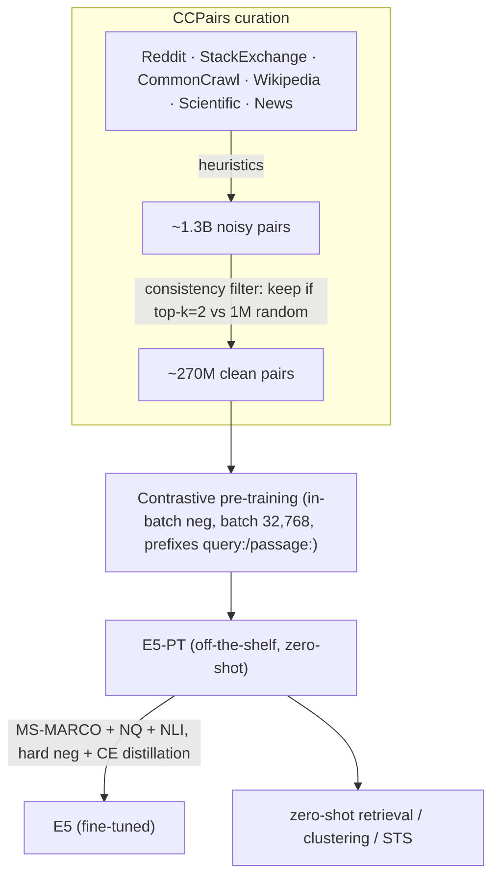

# E5: Text Embeddings by Weakly-Supervised Contrastive Pre-training — Wang et al., 2022

> **arXiv:** 2212.03533v2 · **Venue:** preprint (Microsoft) · **Affiliation:** Microsoft Corporation

## TL;DR
E5 (**Emb**Eddings from **bidir**Ectional **E**ncoder **r**Epresentations) is a general-purpose text
embedding trained by **contrastive pre-training on a curated web-scale text-pair dataset (CCPairs)**,
then optionally fine-tuned on labeled data. Its data recipe — harvest ~1.3B semi-structured pairs, then
**consistency-filter** down to 270M high-quality pairs — lets E5 become the **first model to beat BM25
on the BEIR zero-shot retrieval benchmark without any labels**, and, when fine-tuned, an
**E5-large (300M)** matches or beats [GTR](retrieval_2021_gtr.md)-XXL / Sentence-T5-XXL (4.8B, **40×
larger**) on the 56-task MTEB benchmark.

## Problem & motivation
General text embeddings power retrieval, clustering, classification, and RAG. Two paths existed:
**supervised** fine-tuning ([GTR](retrieval_2021_gtr.md), Sentence-T5) limited by scarce labels, and
**self-supervised** pairs from ICT / random cropping ([Contriever](retrieval_2021_contriever.md)) that
are abundant but **low quality** and fail to beat BM25 without fine-tuning. E5's thesis: the bottleneck
is **data quality**, not quantity. Curate *heterogeneous, filtered* web text pairs and a simple
contrastive recipe suffices to learn embeddings that are strong **off-the-shelf** in both zero-shot and
fine-tuned settings.

## Key idea
**CCPairs (Colossal Clean text Pairs).** Mine naturally-paired web text: (post, upvoted comment) from
Reddit, (question, upvoted answer) from StackExchange, (title, passage) from Common Crawl / News,
(entity+section, passage) from Wikipedia, (title, abstract) + citation pairs from Scientific papers.
Preliminary heuristics give ~1.3B noisy pairs; then a **consistency-based filter** — train a model on
the noisy data, score each pair against 1M random passages, and **keep a pair only if it ranks in the
top-$k$ ($k=2$)** — yields **~270M** clean pairs. (Rationale: networks memorize clean labels before
noisy ones.)

**Contrastive training.** A shared Transformer encoder with **average pooling** produces $\mathbf{E}_q,
\mathbf{E}_p$; the InfoNCE loss with **in-batch negatives** and a huge batch:

$$
\mathcal{L}_{\text{cont}}=-\frac{1}{n}\sum_i \log\frac{e^{s_\theta(q_i,p_i)}}{e^{s_\theta(q_i,p_i)}+\sum_j e^{s_\theta(q_i,p_{ij}^{-})}},
\qquad
s_\theta(q,p)=\cos(\mathbf{E}_q,\mathbf{E}_p)/\tau,
$$

with $\tau=0.01$. A shared encoder is disambiguated by **prefixes** `"query:"` and `"passage:"` — an
asymmetric trick that matters for tasks with query paraphrases in the corpus.

**Fine-tuning (optional).** Continue on labeled MS-MARCO + NQ + NLI with mined hard negatives and
**KL-distillation from a cross-encoder teacher**:
$$
\min\; D_{\mathrm{KL}}(p_{\text{ce}},\,p_{\text{stu}}) + \alpha\,\mathcal{L}_{\text{cont}}.
$$

## How it works



- **Backbones:** E5-small (MiniLM), E5-base (bert-base), E5-large (bert-large-wwm).
- **Pre-training:** batch **32,768**, ~20k steps (~2.5 epochs), lr {3,2,1}×10⁻⁴, on 16/32/64 V100s.
- **Fine-tuning:** 3 epochs, batch 256, 7 hard negatives/example.

## Training / data
CCPairs (270M filtered pairs) for pre-training; MS-MARCO + NQ + NLI for fine-tuning (STS/probing benefit
from NLI; retrieval from MS-MARCO+NQ). Evaluated on **BEIR** (15 datasets, nDCG@10) and **MTEB** (56
English datasets across classification, clustering, pair-classification, reranking, retrieval, STS,
summarization).

## Results
From the paper (Tables 1–3).

| Setting | Benchmark | E5 | Baseline | Source |
|---|---|---|---|---|
| **Unsupervised (E5-PT)** | BEIR avg nDCG@10, base | **42.9** | BM25 41.7 | §5.3, Table 1 |
| Unsupervised (E5-PT) | BEIR avg, large | **44.2** | Contriever 36.0 | Table 1 |
| **Fine-tuned** | BEIR avg nDCG@10, base | **48.7** | GTR-large 44.0 | §5.3, Table 2 |
| Fine-tuned | BEIR avg, large | **50.0** | GTR-XXL 47.0 | Table 2 |
| Fine-tuned | MTEB avg (56 tasks), large | **61.4** | GTR-XXL 59.0 (4.8B) | §5.4, Table 3 |

E5-PT-base is the **first unsupervised model to beat BM25 on BEIR** (+1.2). Fine-tuned E5-large (300M)
**matches the 4.8B GTR-XXL / ST5-XXL** on MTEB — 10–40× smaller. Ablations: batch **1k→32k** improves
all tasks; **in-batch negatives beat MoCo/pre-batch** at large batch; the **consistency filter** adds
~1.6–6 points; RoBERTa init and auxiliary MLM did *not* help (Appendix C).

## Limitations & follow-ups
- **Curation effort.** The quality win requires nontrivial data mining + filtering (vs. Contriever's
  free random crops), and BM25 hard-negative mining over 250M+ pairs is too costly (abandoned).
- **BM25 still wins** on long-tail (Trec-COVID), long-document (Touché), and exact-lexical (FEVER) tasks.
- **Relation to neighbors.** E5 is the **"curate the pairs"** refinement of
  [Contriever](retrieval_2021_contriever.md)'s random-crop contrastive recipe, and it dethrones
  [GTR](retrieval_2021_gtr.md)/Sentence-T5 at a fraction of the size. Its CCPairs + 3-stage idea is
  generalized to Chinese and scaled by [BGE / C-Pack](retrieval_2023_bge-c-pack.md). The `query:`/
  `passage:` prefix trick foreshadows instruction-tuned embedders. It is a natural encoder for RAG
  compressors ([xRAG](softtoken_2024_xrag.md), [COCOM](softtoken_2024_cocom.md)).

## Links
- **arXiv:** [abs](https://arxiv.org/abs/2212.03533) · [html](https://arxiv.org/html/2212.03533v2) · [pdf](https://arxiv.org/pdf/2212.03533)
- **Code / models:** [github.com/microsoft/unilm/tree/master/e5](https://github.com/microsoft/unilm/tree/master/e5)
- **BibTeX:**
  ```bibtex
  @article{wang2022e5,
    title   = {Text Embeddings by Weakly-Supervised Contrastive Pre-training},
    author  = {Wang, Liang and Yang, Nan and Huang, Xiaolong and Jiao, Binxing and Yang, Linjun and Jiang, Daxin and Majumder, Rangan and Wei, Furu},
    journal = {arXiv preprint arXiv:2212.03533},
    year    = {2022}
  }
  ```
- **Related papers:** [Contriever](retrieval_2021_contriever.md) · [GTR](retrieval_2021_gtr.md) · [BGE / C-Pack](retrieval_2023_bge-c-pack.md) · [Sentence-BERT](retrieval_2019_sentence-bert.md) · [DPR](retrieval_2020_dpr.md)
- **In-repo:** [MixedDecoder](../mixed_decoder/mixed_decoder.md) · [Soft-token compression thread](../context/soft_token/soft_token.md) · [Agentic memory thread](../context/agentic_memory/agentic_memory.md)
