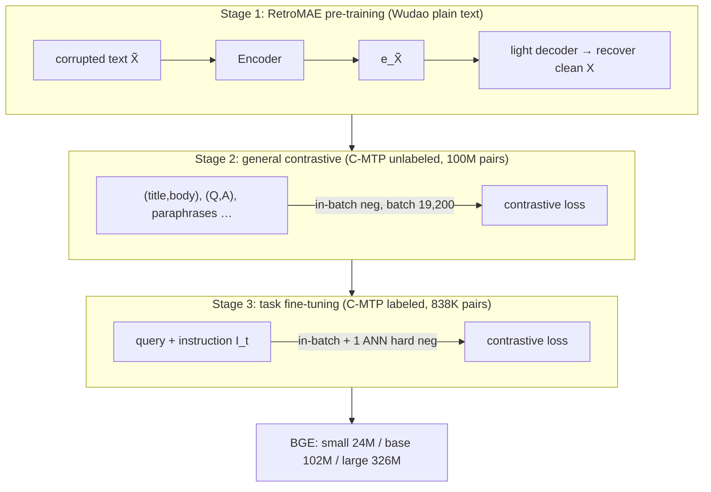

# C-Pack / BGE: Packed Resources for General Chinese Embeddings — Xiao et al., 2023

> **arXiv:** 2309.07597v4 · **Venue:** SIGIR 2024 · **Affiliation:** Beijing Academy of AI (BAAI) · Renmin University · HuggingFace · USTC · University of Montreal

## TL;DR
C-Pack is an open **package of resources** for general-purpose text embeddings: **C-MTEB** (a Chinese
embedding benchmark, 6 tasks / 35 datasets), **C-MTP** (a 100M-pair Chinese + 200M-pair English training
dataset), and **BGE** (BAAI General Embeddings, small/base/large). Its main technical contribution is a
fully-released **three-stage training recipe** — RetroMAE pre-training → contrastive learning on
unlabeled pairs with a **huge 19,200 batch** → instruction-based fine-tuning on labeled pairs — that
made BGE beat all prior Chinese embeddings on C-MTEB by **>10%** and reach state-of-the-art on the
English MTEB at release. BGE became one of the most-downloaded embedding families in the world.

## Problem & motivation
General text embeddings ([Contriever](retrieval_2021_contriever.md), [GTR](retrieval_2021_gtr.md),
[E5](retrieval_2022_e5.md), OpenAI Ada) advanced rapidly for **English**, but Chinese lagged badly:
**no large public training data, no comprehensive benchmark, and no strong open models**. More broadly,
building a general embedding needs three things done well — **data** (scale + diversity + quality),
**training** (a good encoder + a compound recipe), and a **benchmark** to measure generality — yet prior
work rarely released all three. C-Pack aims to supply the entire stack, openly, for Chinese (and, with
the same method, English).

## Key idea
A **compound, three-stage recipe** over a BERT-like encoder, each stage adding a different capability.

**Stage 1 — embedding-oriented pre-training (RetroMAE).** Encode a corrupted text $\tilde X$ into an
embedding, then reconstruct the clean $X$ with a *lightweight* decoder — an MAE-style bottleneck that
primes the encoder for retrieval:
$$
\min \sum_{x\in X} -\log \mathrm{Dec}\big(x \mid \mathbf{e}_{\tilde X}\big),\qquad \mathbf{e}_{\tilde X}\leftarrow \mathrm{Enc}(\tilde X).
$$

**Stage 2 — general-purpose contrastive learning** on C-MTP *(unlabeled)* with **in-batch negatives**
and a very large batch:
$$
\min \sum_{(p,q)} -\log\frac{e^{\langle \mathbf{e}_p,\mathbf{e}_q\rangle/\tau}}{e^{\langle \mathbf{e}_p,\mathbf{e}_q\rangle/\tau}+\sum_{q'\in Q'} e^{\langle \mathbf{e}_p,\mathbf{e}_{q'}\rangle/\tau}}.
$$
Rather than mining hard negatives, BGE just **scales the batch to 19,200** (via gradient checkpointing +
cross-device embedding sharing) so in-batch negatives suffice.

**Stage 3 — task-specific fine-tuning** on C-MTP *(labeled)* with two additions: (1) **instructions** —
a task prompt $I_t$ appended to the query, $q' \leftarrow q + I_t$ (e.g. *"search relevant passages for
the query"*), letting one model serve many tasks; and (2) **one ANN-mined hard negative** per pair on
top of in-batch negatives.

## How it works



- **Data cleaning:** web pairs (Wudao title/body, Zhihu, Baike, News) scored by a **Text2Vec-Chinese**
  model; drop pairs below **0.43** → 100M unlabeled pairs. Labeled = T2-Ranking, DuReader, mMARCO-Zh,
  NLI-Zh, etc. (838K).
- **Models:** BGE-small (24M), base (102M), large (326M); embedding dim 512/768/1024.
- **C-MTEB tasks & metrics:** retrieval (nDCG@10), reranking (MAP), STS (Spearman), classification &
  pair-classification (avg precision), clustering (V-measure).

## Training / data
C-MTP = 100M unlabeled (weak supervision, Stage 2) + 838K labeled (Stage 3); a parallel **200M-pair
English** set trains the English BGE with the same recipe. Evaluated on **C-MTEB** (Chinese) and **MTEB**
(English).

## Results
From the paper (Tables 2, 3, 5). C-MTEB / MTEB averages.

| Model | Benchmark | Avg | Retrieval | Source |
|---|---|---|---|---|
| BGE-small | C-MTEB | 58.28 | 63.07 | §4.1, Table 2 |
| BGE-base | C-MTEB | 62.80 | 69.53 | Table 2 |
| **BGE-large** | C-MTEB | **63.96** | **71.53** | Table 2 |
| Multilingual E5-large | C-MTEB | 58.84 | 63.66 | Table 2 |
| OpenAI Ada-002 | C-MTEB | 53.02 | 52.00 | Table 2 |
| **BGE-large (English)** | MTEB (56) | **64.23** | 54.29 | §4.1, Table 5 |
| GTE-large (prior SOTA) | MTEB (56) | 63.13 | 52.22 | Table 5 |
| E5-large | MTEB (56) | 62.25 | 50.56 | Table 5 |

BGE-large tops C-MTEB by large margins (>10% over prior Chinese models at release), with the biggest
gains on **retrieval, STS, pair-classification, reranking**; the English BGE-large set MTEB SOTA (+1.1
over GTE). Ablations: **batch 256→2,048→19,200** steadily lifts retrieval (57.25→60.96→63.90); **RetroMAE
pre-training** boosts retrieval specifically; **instructions** in Stage 3 improve retrieval/STS/rerank;
C-MTP *(unlabeled)* establishes general capability, C-MTP *(labeled)* jumps the average 59.0→63.96.

## Limitations & follow-ups
- **Recipe complexity.** Three stages + huge-batch engineering (gradient checkpointing, cross-device
  embedding sharing) raise the barrier to reproduce end-to-end.
- **Clustering/classification gains are modest** — the recipe most helps retrieval-family tasks.
- **Relation to neighbors.** BGE fuses the best of the lineage: RetroMAE pre-training, the curated-pair
  contrastive stage of [E5](retrieval_2022_e5.md), the scale lesson of [GTR](retrieval_2021_gtr.md), the
  in-batch-negative contrastive core of [Contriever](retrieval_2021_contriever.md)/[DPR](retrieval_2020_dpr.md),
  and instruction tuning. It is a strong default encoder for the note/latent embedders in
  [agentic memory](../context/agentic_memory/agentic_memory.md) and for RAG compressors
  ([xRAG](softtoken_2024_xrag.md), [COCOM](softtoken_2024_cocom.md)); the repo's own encoder
  ([Qwen3-Embedding](backbone_2025_qwen3-embedding.md)) sits in the same family.

## Links
- **arXiv:** [abs](https://arxiv.org/abs/2309.07597) · [html](https://arxiv.org/html/2309.07597v4) · [pdf](https://arxiv.org/pdf/2309.07597)
- **Code / models:** [github.com/FlagOpen/FlagEmbedding](https://github.com/FlagOpen/FlagEmbedding) · [huggingface.co/BAAI/bge-large-en](https://huggingface.co/BAAI/bge-large-en)
- **BibTeX:**
  ```bibtex
  @inproceedings{xiao2024cpack,
    title     = {C-Pack: Packed Resources For General Chinese Embeddings},
    author    = {Xiao, Shitao and Liu, Zheng and Zhang, Peitian and Muennighoff, Niklas and Lian, Defu and Nie, Jian-Yun},
    booktitle = {Proceedings of the 47th International ACM SIGIR Conference on Research and Development in Information Retrieval (SIGIR)},
    year      = {2024}
  }
  ```
- **Related papers:** [E5](retrieval_2022_e5.md) · [GTR](retrieval_2021_gtr.md) · [Contriever](retrieval_2021_contriever.md) · [DPR](retrieval_2020_dpr.md) · [Qwen3-Embedding](backbone_2025_qwen3-embedding.md)
- **In-repo:** [MixedDecoder](../mixed_decoder/mixed_decoder.md) · [Backbone components thread](../context/backbone/backbone.md) · [Agentic memory thread](../context/agentic_memory/agentic_memory.md)
