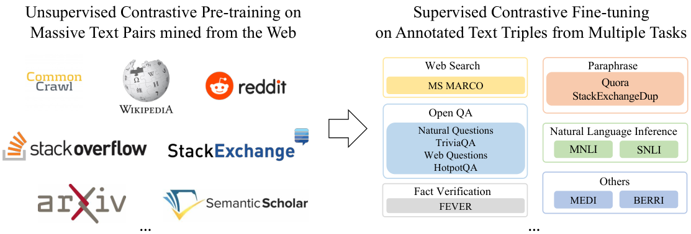
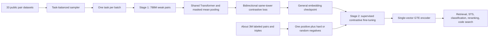

# GTE: General Text Embeddings - Li et al., 2023

**Paper:** *Towards General Text Embeddings with Multi-stage Contrastive Learning*  
**Authors:** Zehan Li, Xin Zhang, Yanzhao Zhang, Dingkun Long, Pengjun Xie, Meishan Zhang  
**Affiliation:** Alibaba Group / Alibaba DAMO Academy  
**Version reviewed:** [arXiv:2308.03281v1](https://arxiv.org/abs/2308.03281v1), submitted 7 August 2023  
**Venue:** arXiv preprint (cs.CL)

## TL;DR

GTE is a family of English, single-vector text encoders trained with a simple but carefully scaled two-stage recipe: contrastive pretraining on 788 million naturally paired texts from 33 public datasets, followed by contrastive fine-tuning on about 3 million labeled pairs and triples with hard negatives. It introduces no specialized encoder block. Its gains come from heterogeneous pair formats, task-balanced sampling, very large cross-device batches, and an objective that contrasts query-document pairs in both directions while also using same-tower query-query and document-document negatives.

The controlled result that best captures the paper is its stage ablation: BERT-base reaches 59.0 average MTEB after weakly supervised pretraining alone and 57.8 after supervised training alone, but 62.4 when the stages are applied sequentially (Table 9). The released 30M, 110M, and 330M models produce 384-, 768-, and 1024-dimensional embeddings. GTE-large reaches 63.1 average over the paper's 56-task English MTEB evaluation, while GTE-base obtains 44.2 average nDCG@10 on 15 BEIR datasets before supervised fine-tuning (Tables 5-6).

## Problem & motivation

Sentence-embedding work had split into two partially incompatible regimes. Models such as Sentence-BERT and SimCSE learned strong embeddings for symmetric sentence similarity, but were weaker when a short query had to match a longer, differently worded document. Dense retrievers learned that asymmetric relation, but often transferred poorly to classification, clustering, or semantic textual similarity. New general-purpose systems such as E5 and InstructOR showed that heterogeneous contrastive data could bridge the regimes, although some depended on private corpora or task-specific prefixes and instructions.

GTE asks whether one ordinary bidirectional Transformer can serve all of these uses without a task-conditioned input interface. The desired representation must support:

- symmetric matching, such as paraphrase and semantic similarity;
- asymmetric retrieval, such as question-to-passage and title-to-document search;
- frozen-feature classification and clustering;
- reranking and summary evaluation by embedding similarity; and
- text-to-code retrieval.

This is fundamentally a data-and-objective problem. Masked-language-model pretraining does not directly train a sequence-level metric space, while any one supervised embedding dataset is too narrow to define a general one. GTE therefore treats naturally co-occurring pairs as abundant weak supervision, then uses smaller human-labeled datasets to sharpen the resulting space.

## Key idea

GTE combines five choices rather than proposing a new backbone:

1. **Represent every task as paired texts.** Titles and bodies, questions and answers, citations and references, posts and comments, entities and descriptions, summaries and articles, and natural-language descriptions and code all become positive pairs.
2. **Pretrain at web scale.** The first stage uses 788M pairs spanning 33 datasets and nine broad source categories. Diversity matters independently of raw pair count: adding source datasets consistently improves MTEB in the paper's scaling study (Figure 3a).
3. **Control the mixture.** Dataset $i$ is sampled proportionally to the square root of its size, and each batch contains only one task. This reduces domination by the largest sources without turning unrelated cross-task examples into trivial negatives.
4. **Make every batch a larger contrastive problem.** Besides the usual query-to-document in-batch negatives, GTE trains the inverse document-to-query direction and adds same-tower query-query and document-document negatives.
5. **Refine with labels and hard negatives.** A second stage uses approximately 3M supervised examples, explicit hard/random negatives, longer inputs, and a smaller batch and learning rate.

The title says "multi-stage," but the paper's training pipeline has exactly **two contrastive stages**: weakly supervised pretraining and supervised fine-tuning. Initializing from an MLM checkpoint is not counted as a separate GTE training stage.



*Figure 1 from the paper. Open-source natural text pairs drive large-batch contrastive pretraining; labeled pairs and triples then drive hard-negative contrastive fine-tuning.*

## How it works

### Encoder and pooling

GTE is a shared-weight dual encoder. A query and candidate are tokenized separately but passed through the same Transformer $\operatorname{LM}_\theta$. For a token sequence $x=(x_1,\ldots,x_n)$, the final hidden states are

$$
H(x)=\operatorname{LM}_\theta(x)\in\mathbb{R}^{n\times d},
$$

where $n$ is the padded sequence length and $d$ is the backbone hidden width. The paper writes unmasked mean pooling; a batch implementation must exclude padding, as the released model card does:

$$
e(x)=\frac{\sum_{t=1}^{n}m_t H_t(x)}{\sum_{t=1}^{n}m_t}\in\mathbb{R}^{d},
$$

where $m_t\in\{0,1\}$ is the attention mask and $H_t(x)$ is token $t$'s final state. There is no learned projection head in the described model, so output width equals hidden width. Optional L2 normalization,

$$
\hat e(x)=\frac{e(x)}{\lVert e(x)\rVert_2},
$$

turns a matrix product between embeddings into cosine similarity. The paper defines

$$
s(a,b)=\frac{e(a)^\top e(b)}{\lVert e(a)\rVert_2\lVert e(b)\rVert_2}.
$$

The original family has three scales (paper Table 3 and official model cards):

| Variant | Parameters | Initialization | Output width | Deployment limit |
| --- | ---: | --- | ---: | ---: |
| GTE-small | 30M | `microsoft/MiniLM-L12-H384-uncased` | 384 | 512 tokens |
| GTE-base | 110M | `bert-base-uncased` | 768 | 512 tokens |
| GTE-large | 330M | `bert-large-uncased` | 1024 | 512 tokens |

### Baseline contrastive objective

For a query $q$, positive document $d^+$, and negative set $\mathcal D^-$, ordinary InfoNCE is

$$
\mathcal L_{\mathrm{cl}}
=-\log
\frac{\exp(s(q,d^+)/\tau)}
{\exp(s(q,d^+)/\tau)+\sum_{d^-\in\mathcal D^-}\exp(s(q,d^-)/\tau)},
$$

where $\tau$ is a temperature. With paired batch $B=\{(q_i,d_i)\}_{i=1}^{N}$, other examples' documents supply in-batch negatives for $q_i$. This is efficient, but it only constrains one direction and only uses cross-tower pairs.

### Improved bidirectional, same-tower loss

GTE enlarges the partition function for pair $i$ to include four groups:

$$
\begin{aligned}
Z_i={}&
\underbrace{\sum_{j=1}^{N}\exp(s(q_i,d_j)/\tau)}_{\text{query to documents}}
+\underbrace{\sum_{j\ne i}\exp(s(q_i,q_j)/\tau)}_{\text{query same-tower negatives}}\\
&+\underbrace{\sum_{j=1}^{N}\exp(s(q_j,d_i)/\tau)}_{\text{documents' inverse direction}}
+\underbrace{\sum_{j\ne i}\exp(s(d_j,d_i)/\tau)}_{\text{document same-tower negatives}}.
\end{aligned}
$$

The batch loss is

$$
\mathcal L_{\mathrm{icl}}
=-\frac{1}{N}\sum_{i=1}^{N}
\log\frac{\exp(s(q_i,d_i)/\tau)}{Z_i},
\qquad \tau=0.01.
$$

This formula deserves care in an implementation. The positive score occurs in both cross-tower directional sums in $Z_i$ as written in paper Equations 5-6. Same-tower self-similarities are excluded with $j\ne i$. For a batch with explicit negative documents in stage 2, those documents join the candidate pool in addition to in-batch texts.

Conceptually, the first two denominator terms ask, "Which document belongs to this query, and are other queries distinct?" The latter two reverse the role: "Which query belongs to this document, and are other documents distinct?" This makes better use of the same encoded vectors, though its measured gain is incremental rather than the main source of GTE's performance: +0.5 MTEB after shortened pretraining and +0.6 after full training (Table 11).

### End-to-end flow



### Inference interface

At inference time, encode queries and corpus items independently, mean-pool only non-padding tokens, and normally L2-normalize. Corpus vectors can be precomputed and indexed for approximate nearest-neighbor search. The original checkpoints do not require `query:`/`passage:` prefixes or task instructions; adding arbitrary prefixes changes the inputs from those used in training.

A minimal equivalent interface is:

```python
import torch.nn.functional as F

outputs = model(**batch)
mask = batch["attention_mask"].unsqueeze(-1)
embeddings = (outputs.last_hidden_state * mask).sum(1) / mask.sum(1)
embeddings = F.normalize(embeddings, p=2, dim=1)
scores = query_embeddings @ document_embeddings.T
```

Use truncation at 512 tokens for released checkpoints. For long documents, chunking and an explicit chunk aggregation or retrieval policy are necessary; silent truncation can discard the relevant passage.

## Training / data

### Stage 1: weakly supervised contrastive pretraining

The first stage converts relationships already present in public corpora into positives. It uses 788M pairs from 33 datasets (paper Table 1):

| Source category | Datasets | Pairs | Share | Typical relation |
| --- | ---: | ---: | ---: | --- |
| Web pages | 3 | 147M | 18.7% | title, body |
| Academic papers | 5 | 45M | 5.7% | title, abstract |
| Hyperlinks | 4 | 106M | 13.4% | citation/anchor context, referenced text |
| Social media | 2 | 327M | 41.5% | post, comment or title, body |
| Knowledge bases | 2 | 38M | 4.8% | entity, description |
| Community QA | 7 | 12M | 1.5% | question, answer or title, body |
| News | 5 | 3M | 0.4% | title/summary, article |
| Code | 2 | 20M | 2.5% | natural-language text, code |
| Other | 3 | 91M | 11.6% | reviews, debates, search/QA pairs |
| **Total** | **33** | **788M** | **100%** | heterogeneous positives |

Named sources in Appendix A include CCNet-processed Common Crawl, ClueWeb, MS MARCO documents, arXiv, Semantic Scholar/S2ORC, bioRxiv, medRxiv, PubMed, Reddit, StackExchange, Yahoo Answers, WikiHow, Amazon QA and reviews, Wikipedia, DBpedia, CCNews, Microsoft News, NPR, CNN/DailyMail, GitHub, Stack Overflow, and CodeSearchNet. Hyperlink pairs come from ClueWeb, Wikipedia, and scholarly citations. The recipe mostly reuses released corpora and applies little cleaning; some community data uses length and vote heuristics, and some datasets receive exact pair-level deduplication.

The source sizes differ by orders of magnitude. If dataset $D_i$ contains $n_i$ examples, GTE selects its next batch with

$$
p_i=\frac{n_i^\alpha}{\sum_{j=1}^{M}n_j^\alpha},
\qquad \alpha=0.5,
$$

where $M$ is the number of datasets. Thus $\alpha=0$ would sample tasks uniformly and $\alpha=1$ would sample examples uniformly across the concatenated corpus; square-root sampling is the compromise. Once a task is chosen, the whole batch comes from that task. This prevents the model from solving contrastive learning through easy dataset/style recognition, although it also means that cross-task examples are not used as negatives in the same batch.

Verified stage-1 settings (Section 3.4 and Table 3):

- maximum sequence length: 128 tokens;
- global batch size: 16,384 pairs, with negatives shared across GPUs;
- steps: 50,000, approximately one pass over 788M pairs;
- optimizer: AdamW with linear decay and 5% warmup;
- precision and memory: fp16, DeepSpeed ZeRO stage 1, gradient checkpointing;
- hardware: 2 A100 80GB for small, 4 for base, and 8 for large; and
- checkpoint selection: the final checkpoint, not best-on-validation selection.

The paper says the initial learning rate was tuned by model size, but the accessible arXiv rendering does not expose the three absolute values. Fine-tuning uses one tenth of the corresponding pretraining rate. This is a genuine reproduction gap and the rates should not be inferred from unrelated GTE implementations.


*Figure 4 from the paper. Larger backbones reach lower contrastive loss; fluctuations are attributed to varying batch difficulty and weak-pair quality.*

### Stage 2: supervised contrastive fine-tuning

The second stage combines about 3M human-labeled pairs or triples from:

- web search: MS MARCO, with high-ranked nonpositive passages as hard negatives;
- open-domain QA: Natural Questions, TriviaQA, WebQuestions, and HotpotQA, pairing questions with supporting passages and using retrieved answer-free passages as negatives;
- natural-language inference: MNLI and SNLI, using entailments as positives and contradictions as negatives;
- fact verification: FEVER claims and supporting evidence;
- paraphrases and duplicate questions: Quora and StackExchange; and
- heterogeneous MEDI and BERRI triples.

For MEDI and BERRI, GTE discards task instructions and keeps only triples. A sample of pretraining pairs is also mixed into fine-tuning to mitigate catastrophic forgetting. The recipe therefore deliberately favors one unconditioned embedding space over an instruction-selectable one.

Verified stage-2 settings are:

- maximum sequence length: 512 tokens;
- global batch size: 128 query groups;
- group size: 16 candidates, one positive and 15 hard or random negatives;
- additional negatives: in-batch texts through the improved objective;
- duration: one epoch;
- learning rate: one tenth of the stage-1 rate; and
- precision/hardware: fp16 training on up to 8 A100 80GB GPUs.

### Reimplementation checklist

A faithful training implementation should preserve the following details:

1. Share all encoder parameters between both sides; do not instantiate independent query and document encoders.
2. Mean-pool final hidden states with the attention mask and no projection head.
3. L2-normalize before cosine logits, or compute cosine explicitly.
4. Build each stage-1 batch from one sampled task, using $p_i\propto\sqrt{n_i}$.
5. Gather embeddings across workers before constructing stage-1 logits so the effective batch really is 16,384.
6. Implement all four denominator terms and mask same-tower diagonals.
7. Use $\tau=0.01$ in both stages.
8. Pretrain at length 128 for 50k steps, then fine-tune at length 512 for one epoch.
9. In stage 2, preserve candidate groups and combine their 15 explicit negatives with in-batch negatives.
10. Avoid E5-style prefixes and MEDI/BERRI instructions when reproducing the original GTE interface.

One caveat is false negatives. Naturally paired batches can contain semantically valid unpaired items, and same-tower negatives intensify this possibility. The paper does not describe positive-aware masking beyond excluding each item's own same-tower embedding.

## Results

### Evaluation design

The central evaluation is the then-current English MTEB suite: 56 datasets spanning 12 classification, 11 clustering, 3 pair-classification, 4 reranking, 15 retrieval, 10 STS, and 1 summarization task. Category metrics differ: accuracy for classification, v-measure for clustering, average precision for pair classification, MAP for reranking, nDCG@10 for retrieval, and Spearman correlation for STS and summarization. MTEB's average therefore summarizes broad transfer but is not one homogeneous metric.

The paper also evaluates zero-shot retrieval on 15 public BEIR datasets, zero-shot SST-2 classification by matching text embeddings to verbalized label embeddings, and CodeSearchNet text-to-code retrieval over six languages.

### Unsupervised retrieval and general embeddings

Before supervised fine-tuning, GTE-base averages 44.2 nDCG@10 on BEIR, matching E5-large and exceeding same-size E5-base by 1.3 points (paper Table 5). Results are not perfectly controlled: the paper borrows baseline values from E5, and Contriever uses dot product while most other rows use cosine.

| Unsupervised model | Parameters | BEIR nDCG@10 average |
| --- | ---: | ---: |
| BM25 | n/a | 41.7 |
| Contriever | 110M | 36.0 |
| E5-base | 110M | 42.9 |
| E5-large | 330M | 44.2 |
| **GTE-small** | **30M** | **43.4** |
| **GTE-base** | **110M** | **44.2** |
| **GTE-large** | **330M** | **44.6** |

*BEIR average over 15 datasets, nDCG@10; paper Table 5.*

On MTEB, the pretrained-only family scores 58.5/59.0/59.3 from small to large, versus 54.2/55.5/56.4 for the corresponding E5 sizes (paper Table 6). The relatively small differences among GTE sizes support the paper's broader claim: source and task diversity are at least as important as scaling this particular encoder from 30M to 330M parameters.

### Supervised MTEB

| Model | Parameters | Class. | Clust. | Pair | Rerank | Retr. | STS | Summ. | Avg. |
| --- | ---: | ---: | ---: | ---: | ---: | ---: | ---: | ---: | ---: |
| E5-large | 330M | 73.1 | 43.3 | 85.9 | 56.5 | 50.0 | 82.1 | 31.0 | 61.4 |
| InstructOR-large | 330M | 73.9 | 45.3 | 85.9 | 57.5 | 47.6 | 83.2 | 31.8 | 61.6 |
| InstructOR | 1.5B | 73.1 | 44.7 | 86.6 | 57.3 | 49.3 | 83.1 | 32.3 | 61.8 |
| GTR | 4.5B | 67.4 | 42.4 | 86.1 | 56.7 | 48.5 | 78.4 | 30.6 | 59.0 |
| Sentence-T5 | 4.5B | 73.4 | 43.7 | 85.1 | 56.4 | 42.2 | 82.6 | 30.1 | 59.5 |
| OpenAI embedding API | undisclosed | 70.9 | 45.9 | 84.9 | 56.3 | 49.3 | 81.0 | 30.8 | 61.0 |
| **GTE-small** | **30M** | **72.3** | **44.9** | **83.5** | **57.7** | **49.5** | **82.1** | **30.4** | **61.4** |
| **GTE-base** | **110M** | **73.0** | **46.1** | **84.3** | **58.6** | **51.2** | **82.3** | **30.7** | **62.4** |
| **GTE-large** | **330M** | **73.3** | **46.8** | **85.0** | **59.1** | **52.2** | **83.4** | **31.7** | **63.1** |

*English MTEB category averages over 56 datasets; paper Table 6. These are the paper's 2023 results and should not be compared directly with later MTEB leaderboard revisions.*

GTE-large's 63.1 is 1.5 points above same-size InstructOR-large and 1.7 above E5-large in this table. GTE-base's most important practical result is 62.4 at 110M parameters, above the reported 61.0 for the opaque OpenAI embedding API and above 1.5B-4.5B baselines. Parameter count is only a rough efficiency proxy, however; the baselines differ in architecture, sequence length, pretraining data, supervision, and inference stack.

### Classification and code search

For zero-shot SST-2, GTE-base scores 85.1% using plain `positive`/`negative` label texts and 87.2% when labels are verbalized as natural-language movie-review prompts (paper Table 4). The model was not instruction-trained, so this result shows ordinary semantic sensitivity to richer label descriptions rather than a learned task-instruction interface.

On the harder CodeSearchNet protocol, each natural-language query searches the combined development-and-test code corpus rather than 1,000 sampled candidates. GTE-base is evaluated jointly across languages without per-language fine-tuning:

| Model | Parameters | Average score |
| --- | ---: | ---: |
| CodeBERT | 110M | 69.3 |
| GraphCodeBERT | 110M | 71.3 |
| UniXcoder | 110M | 74.4 |
| CodeRetriever | 110M | 77.4 |
| **GTE-base** | **110M** | **83.2** |

*CodeSearchNet all-development/test-corpus setting across Ruby, JavaScript, Go, Python, Java, and PHP; paper Table 7.*

The comparison favors GTE's broad transfer story: it treats code as tokenized text and is not fine-tuned separately for each language. It does not prove that code structure is unnecessary in general. On the easier 1,000-candidate setting, GTE averages 85.9 and remains behind the much larger Codex-based cpt-code models at 93.4-93.5 (Appendix Table 13).

### What the ablations establish

**Two stages are complementary.** Starting every run from BERT-base, pretraining only gives 59.0 MTEB, supervised training only 57.8, and sequential pretraining plus fine-tuning 62.4 (paper Table 9). This +3.4 gain over pretraining alone is stronger causal evidence than comparisons against externally trained baselines.

| Training strategy | MTEB average |
| --- | ---: |
| Weakly supervised pretraining only | 59.0 |
| Supervised fine-tuning data only | 57.8 |
| **Pretraining then supervised fine-tuning** | **62.4** |

**Mixture smoothing matters.** Square-root sampling has the best overall score, while a slightly lower exponent has the best retrieval score (paper Table 10):

| $\alpha$ | Retrieval | STS | MTEB average |
| ---: | ---: | ---: | ---: |
| 0.0, uniform over tasks | 36.7 | 73.2 | 55.4 |
| 0.3 | **44.6** | 75.9 | 58.9 |
| **0.5** | 44.2 | **76.5** | **59.0** |
| 1.0, proportional to examples | 42.0 | 75.5 | 58.3 |

Thus the chosen $\alpha=0.5$ optimizes the broad average, not every category. Uniform task sampling over-amplifies small sources and loses 3.6 average points; raw-size sampling lets giant sources dominate and loses 0.7.

**The expanded loss helps modestly.** With the pretraining ablation shortened to 30k steps, vanilla in-batch InfoNCE scores 57.3 versus 57.8 for the improved loss; after fine-tuning the scores are 61.8 and 62.4 (paper Table 11). This validates the objective, but data scale, diversity, and staging explain more of the total result.

**More diversity beats more repetition.** Figure 3 reports consistent gains when pretraining expands from the five largest datasets to 15 and then all 33, and when fine-tuning expands from E5's three datasets to MEDI and BERRI mixtures. Batch-size gains saturate at roughly 10,000, so the selected 16,384 batch is near the observed plateau. Increasing parameters from 30M to 110M to 330M improves MTEB roughly linearly while parameter count grows multiplicatively.

**Training is noisy and plateaus early.** Pretraining checkpoints at 10k/20k/30k/40k/50k steps score 56.4/59.0/57.8/57.7/59.0 MTEB (paper Table 8). The absence of monotonic improvement is consistent with heterogeneous batch difficulty and weak-label noise. It also makes the use of the final checkpoint a reproducibility detail rather than an obvious optimum.

## Limitations & follow-ups

- **English only.** The original GTE checkpoints use English MiniLM/BERT initialization and English-focused data. The method may transfer to multilingual training, but the paper does not demonstrate that extension.
- **A 512-token ceiling.** Inputs are truncated at 512 tokens, while stage-1 pretraining sees only 128. Long-document retrieval therefore needs chunking, and relevant content beyond the truncation boundary is otherwise lost.
- **Contamination is not quantified.** Internet-scale sources can overlap BEIR, MTEB, or CodeSearchNet evaluation text. The pipeline performs exact pair matching only for some datasets, which cannot catch paraphrases, partial overlap, or a benchmark item appearing in a different pair.
- **Weak positives and false negatives.** Co-occurrence is an imperfect relevance label, and large/same-tower negative pools increase the chance that a useful semantic neighbor is treated as negative. The paper does not report a false-negative filter.
- **Comparisons are not apples-to-apples.** Baselines use different initializations, private or undisclosed corpora, instructions, metrics, and similarity functions. The paper explicitly acknowledges this and uses parameter count as an imperfect proxy for inference cost.
- **Incomplete optimizer disclosure.** Absolute learning rates are not recoverable from the accessible Table 3 rendering; weight decay, gradient clipping, random seeds, and detailed per-source preprocessing are also insufficiently specified for exact reproduction.
- **No instruction-conditioned task disambiguation.** Omitting prefixes makes the model easy to call, but one vector space must reconcile conflicting notions of similarity. Later instruction-based models can specify whether to retrieve evidence, find paraphrases, or classify by label descriptions.
- **Single-vector compression.** Mean pooling is efficient for ANN search but discards token-level matching signals available to late-interaction methods such as ColBERT. This is most consequential for long or compositional relevance judgments.
- **Static benchmark snapshot.** The reported MTEB numbers describe the 56-dataset English suite and implementations available in 2023. Dataset versions and leaderboard protocols have since evolved.

The most useful follow-ups are controlled data ablations at fixed pair counts, semantic benchmark deduplication, positive-aware negative masking, longer-context pretraining, multilingual mixtures, and comparisons that hold backbone and data constant while varying prefixes/instructions and the four-term loss.

## Links

- [arXiv abstract](https://arxiv.org/abs/2308.03281v1)
- [arXiv HTML](https://arxiv.org/html/2308.03281v1)
- [PDF](https://arxiv.org/pdf/2308.03281v1)
- [GTE-small model](https://huggingface.co/thenlper/gte-small)
- [GTE-base model](https://huggingface.co/thenlper/gte-base)
- [GTE-large model](https://huggingface.co/thenlper/gte-large)
- Related local reviews: [Sentence-BERT](retrieval_2019_sentence-bert.md), [DPR](retrieval_2020_dpr.md), [Contriever](retrieval_2021_contriever.md), [E5](retrieval_2022_e5.md), and [BGE / C-Pack](retrieval_2023_bge-c-pack.md)

```bibtex
@article{li2023towards,
  title   = {Towards General Text Embeddings with Multi-stage Contrastive Learning},
  author  = {Li, Zehan and Zhang, Xin and Zhang, Yanzhao and Long, Dingkun and Xie, Pengjun and Zhang, Meishan},
  journal = {arXiv preprint arXiv:2308.03281},
  year    = {2023}
}
```