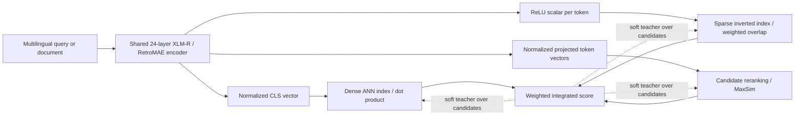
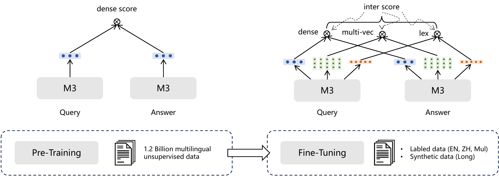
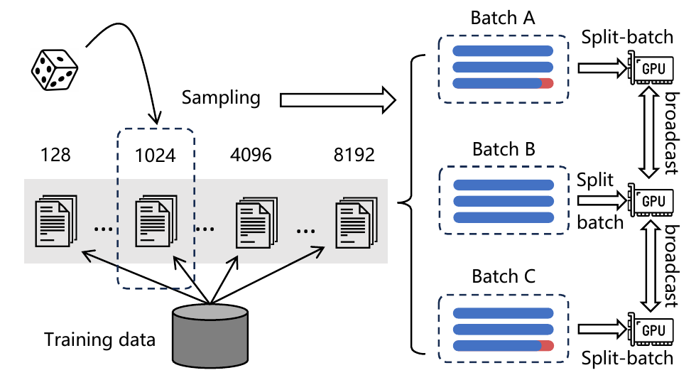

# BGE-M3: Multilingual, Multifunctional, Multigranular Retrieval - Chen et al., 2024

**Paper:** *M3-Embedding: Multi-Linguality, Multi-Functionality, Multi-Granularity Text Embeddings Through Self-Knowledge Distillation*  
**Authors:** Jianlv Chen, Shitao Xiao, Peitian Zhang, Kun Luo, Defu Lian, Zheng Liu  
**Affiliation:** University of Science and Technology of China; Beijing Academy of Artificial Intelligence  
**Version reviewed:** [arXiv:2402.03216v5](https://arxiv.org/abs/2402.03216v5), revised 12 December 2025  
**Venue:** Findings of the Association for Computational Linguistics: ACL 2024

## TL;DR

BGE-M3 turns one XLM-RoBERTa-large-derived encoder into three retrieval models: a single-vector dense retriever, a learned lexical sparse retriever, and a ColBERT-style token-level late-interaction model. It handles more than 100 working languages and inputs up to 8,192 tokens, hence the three M's: multi-linguality, multi-functionality, and multi-granularity.

The key training device is self-knowledge distillation (SKD). A weighted ensemble of the model's own three scores supplies soft targets to each individual retrieval head. This is most consequential for the sparse head: on MIRACL, SKD raises its mean nDCG@10 from 36.7 to 53.9, while dense and multi-vector retrieval improve more modestly. The complete three-mode system reports 71.5 MIRACL nDCG@10, 75.5 MKQA Recall@100, 65.0 MLDR nDCG@10, and 61.7 NarrativeQA nDCG@10.

## Problem & motivation

Text retrieval systems traditionally choose among three different compromises:

- **Dense retrieval** compresses a query or document into one vector. Approximate nearest-neighbor search is efficient and semantic matching is strong, but one vector can erase exact token-level evidence.
- **Lexical sparse retrieval** preserves exact terms and supports inverted indexes. BM25 is robust and interpretable, while learned sparse models can assign context-dependent importance to terms, but lexical matching alone has limited semantic reach.
- **Multi-vector retrieval** retains one representation per token and delays query-document interaction until scoring. ColBERT-style MaxSim is expressive, but its document index and candidate scoring are substantially more expensive.

Maintaining an unrelated backbone for every mode multiplies training and serving infrastructure. Earlier multilingual embedding models also tended to inherit short context windows, even though retrieval corpora contain long articles, legal opinions, and scientific documents. Meanwhile, multilingual systems need both same-language and cross-language matching, including languages with little task supervision.

BGE-M3 asks whether one encoder can expose all three retrieval interfaces without forcing them into one representation. Its answer is not one universal index: the shared Transformer emits three different representations, each with its own scoring rule and operational cost. The claimed unification is at the encoder and training level.

The paper addresses long inputs through staged 8,192-token adaptation and memory-aware batching. This avoids chunking as a mandatory preprocessing step, although quadratic self-attention and the multi-vector index still make long-document retrieval costly.

## Key idea

For text $x=(x_1,\ldots,x_L)$, a shared encoder produces contextual states

$$
H_x=\operatorname{Encoder}(x)\in\mathbb R^{L\times d},
$$

where the released model has hidden width $d=1024$. Three lightweight readouts convert $H_x$ into retrieval representations:

1. The normalized `[CLS]` state is the dense vector.
2. A scalar projection followed by ReLU gives a nonnegative learned weight for each input token.
3. A token projection followed by row-wise normalization gives the late-interaction vectors.

For query $q$ and passage $p$, the three scores are combined as

$$
s_{\mathrm{inter}}(q,p)
=w_1s_{\mathrm{dense}}(q,p)
+w_2s_{\mathrm{lex}}(q,p)
+w_3s_{\mathrm{mul}}(q,p).
$$

Here $s_{\mathrm{dense}}$, $s_{\mathrm{lex}}$, and $s_{\mathrm{mul}}$ are the dense, lexical, and multi-vector scores, while $w_1,w_2,w_3$ are mode weights. During SKD training the paper uses $(w_1,w_2,w_3)=(1,0.3,1)$. This integrated score is both a useful hybrid ranker and a teacher distribution: each individual head learns to imitate the consensus of all three heads over the same positive and negative candidates.

The mechanism is genuinely multi-objective rather than an ensemble of separately trained checkpoints. Dense, lexical, multi-vector, and integrated contrastive losses first teach the native tasks; cross-entropy distillation then transfers the ensemble's relative candidate preferences back into each head.

## How it works

### 1. Shared long-context multilingual encoder

The model starts from XLM-RoBERTa and is retrieval-adapted with RetroMAE. The released configuration is XLM-RoBERTa-large shaped:

| Property | Released value | Retrieval consequence |
| --- | ---: | --- |
| Transformer layers | 24 | Shared by all three modes |
| Hidden width $d$ | 1,024 | Dense-vector and default token-vector width |
| Attention heads | 16 | 64 dimensions per head |
| Feed-forward width | 4,096 | GELU MLP |
| Vocabulary | 250,002 | Shared multilingual SentencePiece vocabulary |
| Position slots | 8,194 | Supports 8,192 content/special-token positions |
| Position type | learned absolute | Extended during long-context adaptation |
| Released weight dtype | float32 in config | Inference can use lower precision subject to validation |

The paper describes support for more than 100 working languages. Its first adaptation corpus covers 105 languages, while the later unsupervised pair mixture reaches 194 languages. These are training-corpus counts, not evidence of equal quality in every language.

### 2. Dense representation

The dense head uses the first contextual state and L2 normalization:

$$
e_x=\frac{H_x[0]}{\lVert H_x[0]\rVert_2}\in\mathbb R^d,
\qquad
s_{\mathrm{dense}}(q,p)=e_q^\top e_p.
$$

The `[CLS]` vector gives one fixed-width representation per document, so this mode can use a standard exact or approximate nearest-neighbor vector index. It is the cheapest of the learned modes in storage and candidate scoring.

### 3. Learned lexical representation

For token position $i$, the sparse head computes

$$
w_{x,i}=\operatorname{ReLU}\!\left(W_{\mathrm{lex}}^\top H_x[i]\right),
\qquad W_{\mathrm{lex}}\in\mathbb R^{d\times1}.
$$

If the same vocabulary token $t$ occurs more than once, its document-level value is the maximum position weight:

$$
w_x^t=\max_{i:x_i=t}w_{x,i}.
$$

The lexical score is the sparse dot product over shared vocabulary entries:

$$
s_{\mathrm{lex}}(q,p)
=\sum_{t\in V}w_q^tw_p^t
=\sum_{t\in q\cap p}w_q^tw_p^t.
$$

Unlike SPLADE-style vocabulary expansion, this formulation assigns contextual importance to tokens that occur in the input; it does not predict arbitrary absent vocabulary terms. Nonzero token IDs and weights can be stored in an inverted index. Subword tokenization means “lexical” refers to shared XLM-R token IDs rather than whitespace words.

### 4. Multi-vector late interaction

A learned square projection creates normalized token vectors:

$$
E_x[i]
=\frac{W_{\mathrm{mul}}^\top H_x[i]}
{\lVert W_{\mathrm{mul}}^\top H_x[i]\rVert_2},
\qquad
W_{\mathrm{mul}}\in\mathbb R^{d\times d},
\qquad
E_x\in\mathbb R^{L\times d}.
$$

The ColBERT-style late-interaction score lets every query token select its best passage-token match and then sums those matches:

$$
s_{\mathrm{mul}}(q,p)
=\sum_{i=1}^{L_q}\max_{1\le j\le L_p}E_q[i]^\top E_p[j].
$$

The pairwise similarity matrix has shape $L_q\times L_p$. This preserves local evidence that a single dense vector can discard, but storing $L_p$ vectors per passage is far more expensive than storing one. The paper therefore evaluates multi-vector scoring as a reranker over candidates, not as an unrestricted full-corpus MaxSim scan.

### 5. Hybrid retrieval and serving route

Hybrid score weights are evaluation-specific. MIRACL and MKQA use dense+sparse weighting $(1,0.3,0)$ and the all-mode variant adds multi-vector weight 1. MLDR uses $(0.2,0.8,0)$ for dense+sparse and $(0.15,0.5,0.35)$ for all three, emphasizing exact evidence in long documents. Scores from different retrieval systems must be calibrated consistently before addition.



This diagram separates the shared computation from the retrieval engines. Corpus encoding can emit all representations in one pass, but dense ANN, sparse postings, and token-vector late interaction remain distinct storage and execution paths.



*Figure 2 from the pinned v5 paper. The staged design matters because the final supervised set is too small to create multilingual long-context behavior by itself.*

### 6. Efficient long-sequence batching

Naively padding every example to the longest item in a batch wastes most tokens and makes a useful contrastive batch impossible at 8K length. BGE-M3 groups training examples into length intervals, samples a group, and forms batches with similar lengths. It then splits a logical batch into smaller encoding batches, uses gradient checkpointing, and broadcasts embeddings across GPUs before computing contrastive losses.



*Figure 3 from the paper. At sequence length 8,192, the reported split-batch method raises the per-device maximum batch from 6 examples to 130; this is an encoding-memory result, not a claim that full 8K attention is inexpensive.*

The logical contrastive batch can therefore be much larger than the microbatch held in activation memory. Cross-device candidates act as additional negatives. Implementations must preserve gradient flow for local embeddings and correctly handle gathered remote embeddings; merely gathering detached vectors changes the objective.

### 7. Multiple-CLS long-input variant

The paper also studies MCLS, an inference strategy that inserts a `[CLS]` token every 256 tokens and averages the resulting final-layer CLS states before normalization. If $C(x)$ is the set of inserted CLS positions,

$$
e_x^{\mathrm{MCLS}}
=\operatorname{norm}\!\left(
\frac{1}{|C(x)|}\sum_{i\in C(x)}H_x[i]
\right).
$$

MCLS gives distant regions more direct aggregation points without changing the one-vector interface. In the no-long-document-fine-tuning ablation it improves MLDR dense nDCG@10 from 41.2 to 45.0. It does not eliminate full-sequence self-attention or replace actual long-context training.

### 8. Public inference interface

The official FlagEmbedding interface can return any combination of the three outputs:

```python
from FlagEmbedding import BGEM3FlagModel

model = BGEM3FlagModel("BAAI/bge-m3", use_fp16=True)
output = model.encode(
    ["A multilingual document to index."],
    return_dense=True,
    return_sparse=True,
    return_colbert_vecs=True,
)

dense = output["dense_vecs"]
sparse = output["lexical_weights"]
multi_vector = output["colbert_vecs"]
```

Production indexes should record the exact model revision, tokenizer, normalization, enabled head, truncation length, and score-fusion weights. Dense vectors, lexical weights, and token vectors are not interchangeable artifacts despite coming from one call.

## Training / data

### Contrastive and distillation objectives

For a query $q$, positive passage $p^+$, candidate set $D_q=\{p^+\}\cup P^-$, scoring mode $s$, and temperature $\tau$, the native contrastive loss is

$$
\mathcal L_s(q)
=-\log
\frac{\exp(s(q,p^+)/\tau)}
{\sum_{p\in D_q}\exp(s(q,p)/\tau)}.
$$

The paper applies this to the dense, lexical, multi-vector, and integrated scores. The pre-distillation multi-objective loss is

$$
\mathcal L
=\frac{
\lambda_1\mathcal L_{\mathrm{dense}}
+\lambda_2\mathcal L_{\mathrm{lex}}
+\lambda_3\mathcal L_{\mathrm{mul}}
+\mathcal L_{\mathrm{inter}}
}{4}.
$$

For distillation, let the integrated teacher and head-specific student distributions over $D_q$ be

$$
P_T(p\mid q)=
\frac{\exp(s_{\mathrm{inter}}(q,p)/\tau)}
{\sum_{p'\in D_q}\exp(s_{\mathrm{inter}}(q,p')/\tau)},
\qquad
P_s(p\mid q)=
\frac{\exp(s(q,p)/\tau)}
{\sum_{p'\in D_q}\exp(s(q,p')/\tau)}.
$$

Each head minimizes cross-entropy against the soft teacher:

$$
\mathcal L'_s(q)
=-\sum_{p\in D_q}P_T(p\mid q)\log P_s(p\mid q),
$$

and the combined distillation loss and final objective are

$$
\mathcal L'
=\frac{
\lambda_1\mathcal L'_{\mathrm{dense}}
+\lambda_2\mathcal L'_{\mathrm{lex}}
+\lambda_3\mathcal L'_{\mathrm{mul}}
}{3},
\qquad
\mathcal L_{\mathrm{final}}=\frac{\mathcal L+\mathcal L'}{2}.
$$

The reported training weights are $(\lambda_1,\lambda_2,\lambda_3)=(1,0.1,1)$ and $(w_1,w_2,w_3)=(1,0.3,1)$. Before enabling SKD, the authors warm up the three functions for about 6,000 steps. The paper does not report a numerical temperature, so implementations should not infer one from unrelated embedding models.

### Stage 1: RetroMAE long-context adaptation

The initial retrieval-oriented masked-autoencoding stage uses 184 million text samples from the Pile, Wudao, and mC4 across 105 languages. It extends the context to 8,192 tokens and runs for 20,000 steps on 32 A100 40GB GPUs. The reported learning rate is $7\times10^{-5}$, with batch size 32 and 16 gradient-accumulation steps.

RetroMAE uses a strongly masked encoder input and a shallow decoder conditioned on the encoder representation to reconstruct text, encouraging the encoder's representation to retain retrieval-relevant information. This stage adapts both positional capacity and document-level compression before pair supervision.

### Stage 2: multilingual unsupervised pair training

The dense head is next contrastively trained on 1.2 billion pairs spanning 194 languages. Sources include MTP, S2ORC, Wikipedia, xP3, mC4, CC-News, NLLB, CCMatrix, and a smaller text-code component from CodeSearchNet. Parallel NLLB and CCMatrix data provide 2,655 cross-lingual language-pair directions.

| Unsupervised source group | Reported size | Role |
| --- | ---: | --- |
| MTP | 291.1M | English and Chinese text pairs |
| S2ORC + Wikipedia | 48.3M | English scientific and encyclopedic text |
| xP3 + mC4 + CC-News | 488.4M | Multilingual text |
| NLLB + CCMatrix | 391.3M | Cross-lingual parallel text |
| CodeSearchNet | 344.1K | Text-code pairs |
| **Total** | **about 1.2B** | Dense contrastive pretraining |

This stage runs for 25,000 steps on 96 A800 80GB GPUs with learning rate $5\times10^{-5}$, warmup ratio 0.1, and weight decay 0.01. Queries are capped at 512 tokens and passages at 8,192. Length-dependent global batches range from 67,200 examples below 500 tokens to 9,984 examples in the 7,000-8,192 interval. A low-probability segment-shuffling augmentation discourages reliance only on the beginning of long documents.

### Stage 3: supervised unified fine-tuning

The last stage activates all three heads and mixes human-labeled with synthetic retrieval data:

| Fine-tuning group | Reported size | Examples |
| --- | ---: | --- |
| English | 1.1M | MS MARCO, Natural Questions, HotpotQA, TriviaQA, SQuAD, PubMedQA, COLIEE, NLI-derived similarity |
| Chinese | 386.6K | DuReader, mMARCO-zh, T2-Ranking, LawGPT, CMedQAv2, LeCaRDv2, Chinese NLI |
| Multilingual | 88.9K | MIRACL and Mr.TyDi |
| MultiLongDoc | 41.4K | Long-document pairs in 13 reported languages |

Synthetic questions are generated with GPT-3.5 for corpora lacking labeled queries. ANCE-style retrieval mines hard negatives, and every training query uses seven negatives. The fine-tuning run uses 24 A800 80GB GPUs. Length-bucketed global batches range from 1,152 below 500 tokens to 192 in the 7,000-8,192 interval.

The paper does not fully report the optimizer, fine-tuning step count, random seeds, wall-clock duration, or every mixture probability. Those omissions prevent exact end-to-end retraining from the paper alone, despite the unusually detailed data sizes, hardware, and length-specific batches.

## Results

### Multilingual and cross-lingual retrieval

| Benchmark / metric | BGE-M3 dense | Sparse | Multi-vector | All modes | Strong cited comparator | Source |
| --- | ---: | ---: | ---: | ---: | ---: | --- |
| MIRACL, nDCG@10 | 69.2 | 53.9 | 70.5 | **71.5** | mE5-large 66.6 | Table 1 |
| MIRACL, Recall@100 | n/a | n/a | n/a | **96.4** | mE5-large 94.1 | Table 12 |
| MKQA, Recall@100 | 75.1 | n/a | n/a | **75.5** | E5 70.1 | Table 2 |

MIRACL evaluates same-language retrieval over 18 languages. Dense retrieval uses Faiss, sparse retrieval uses Lucene, multi-vector scoring reranks the top 200 dense candidates, and hybrid variants rerank the union of dense and sparse candidates. Thus, “all modes” is a staged retrieval system and should not be compared with a single ANN lookup as if latency were equal.

MKQA evaluates non-English questions against English Wikipedia. The gain is especially large for Khmer in the paper's table: dense BGE-M3 reaches 68.6 Recall@100 versus 28.1 for mE5. The average does not establish equal quality across all languages, but it shows that the parallel-data stage contributes useful cross-lingual alignment.

### Long-document retrieval

| Model / mode | MLDR nDCG@10 | NarrativeQA nDCG@10 | Source |
| --- | ---: | ---: | --- |
| BGE-M3 dense, 8,192 tokens | 52.5 | n/a | Table 3 |
| BGE-M3 sparse, 8,192 tokens | 62.2 | n/a | Table 3 |
| BGE-M3 all modes | **65.0** | **61.7** | Tables 3-4 |
| Paper's tokenizer-matched BM25 | 53.6 | n/a | Table 3 |
| Lucene Analyzer BM25 | 64.1 | n/a | Appendix / v5 discussion |
| `text-embedding-3-large` | n/a | 51.6 | Table 4 |
| E5-Mistral-7B | n/a | 49.9 | Table 4 |

MLDR covers long documents in multiple languages, with inputs up to 8,192 tokens. The all-mode score of 65.0 is 12.5 points above dense alone, indicating that lexical and local token evidence become especially valuable as a document grows.

The BM25 comparison needs care. The main table's 53.6 baseline uses the XLM-R tokenizer to make tokenization comparable with BGE-M3. A conventional Lucene Analyzer BM25 reaches 64.1, exceeding the learned BGE-M3 sparse head at 62.2 and nearly matching the 65.0 three-mode system. The experiment therefore supports BGE-M3's unified interface and hybrid quality, but not a general claim that its sparse head supersedes a well-configured lexical baseline.


*Figure 5 from the pinned paper. Increasing the accepted length generally improves long-document retrieval, while the finite curve also cautions that context-window size alone is not a quality guarantee.*

### What the ablations establish

| Ablation | MIRACL dense | MIRACL sparse | MIRACL multi-vector | Source |
| --- | ---: | ---: | ---: | --- |
| Without SKD | 68.7 | 36.7 | 69.3 | Table 5 |
| With SKD | **69.2** | **53.9** | **70.5** | Table 5 |
| Absolute gain | +0.5 | **+17.2** | +1.2 | Derived from Table 5 |

This is the paper's cleanest test of its central mechanism. SKD improves every head, so the integrated teacher is not merely better at inference-time averaging. The effect is highly asymmetric: most of the benefit accrues to the undertrained sparse objective, whose native loss weight is only 0.1. A follow-up should disentangle teacher transfer from changing that loss weight or adding direct sparse supervision.

| Dense training path | MIRACL nDCG@10 | Source |
| --- | ---: | --- |
| Fine-tune XLM-R directly | 60.5 | Table 6 |
| RetroMAE + fine-tune | 66.1 | Table 6 |
| RetroMAE + unsupervised pairs + fine-tune | **69.2** | Table 6 |

RetroMAE contributes 5.6 points over direct fine-tuning, and the 1.2B-pair stage adds another 3.1. This supports staged representation learning, although data volume and objective changes are bundled together.

On MLDR, a dense model without long-document fine-tuning scores 41.2; applying MCLS raises it to 45.0. The complete dense model reaches 52.5. Multiple aggregation tokens recover some lost signal, but long-context data and training remain more important.

## Limitations & follow-ups

- **One encoder is not one retrieval engine.** Dense ANN, sparse postings, and MaxSim token vectors have different index formats, storage footprints, recall paths, and latency. The best “all” results include candidate union and reranking.
- **Long-context cost remains high.** An 8,192-token limit does not change quadratic attention complexity. Split-batch encoding reduces activation memory during training but does not make long-document encoding or token-vector storage cheap.
- **Late-interaction storage is underspecified.** The default 1,024-dimensional vector at every passage token is costly; the paper does not present a complete compression, pruning, quantization, or production latency study comparable to ColBERTv2.
- **Hybrid weights are benchmark-tuned.** MIRACL/MKQA and MLDR use different score weights. A deployment needs held-out calibration, and score ranges can shift with language, corpus, index implementation, and model revision.
- **BM25 conclusions depend on tokenization.** The main tokenizer-controlled baseline understates a conventional Lucene Analyzer setup on MLDR. Proper lexical baselines should be tuned and reported alongside learned sparse retrieval.
- **Benchmark exposure is possible.** MIRACL appears in the fine-tuning mixture and is also a headline evaluation. The paper evaluates its development set, so the result is not a clean unseen-benchmark transfer test.
- **Language counts do not guarantee language parity.** Corpus coverage reaches 194 languages, but evaluation is much narrower and low-resource quality varies. Per-language and script-specific validation is necessary.
- **Incomplete reproduction recipe.** Optimizer details, final-stage duration, seeds, complete sampling probabilities, and some data-generation details are not sufficient for exact retraining.
- **Teacher diversity is limited.** SKD's teacher is an ensemble of heads sharing one encoder and candidate set. It cannot teach distinctions absent from all heads or repair hard-negative blind spots outside that set.
- **Exact-match sparse semantics are subword based.** Learned lexical weights remain tied to input token IDs and do not provide SPLADE-like expansion to absent terms. Tokenizer behavior can dominate identifiers, morphology, and scripts.
- **The paper's own stated scope remains incomplete.** Generalization to diverse real-world corpora, documents beyond 8,192 tokens, efficiency at extreme length, and quality variation among low-resource languages require more study.

Useful follow-ups include compressing the multi-vector head, dynamically choosing a retrieval mode per query, calibrating fusion without benchmark-specific grid search, and distilling the three-head teacher into a cheaper dense-only deployment. The earlier [BGE / C-Pack](retrieval_2023_bge-c-pack.md) review explains the family’s contrastive data construction; [ColBERT](retrieval_2020_colbert-late-interaction.md) and [ColBERTv2](retrieval_2021_colbertv2.md) provide the late-interaction lineage and its index-compression trade-offs.

## Links

- **arXiv:** [abs](https://arxiv.org/abs/2402.03216v5) · [html](https://arxiv.org/html/2402.03216v5) · [pdf](https://arxiv.org/pdf/2402.03216v5)
- **Code:** [FlagEmbedding](https://github.com/FlagOpen/FlagEmbedding)
- **Hugging Face:** [BAAI/bge-m3](https://huggingface.co/BAAI/bge-m3)
- **Data:** [BAAI/MLDR](https://huggingface.co/datasets/BAAI/MLDR)
- **Project page:** [FlagEmbedding BGE](https://bge-model.com/)
- **Blog posts:** [BGE-M3 model card and usage guide](https://huggingface.co/BAAI/bge-m3)
- **Talks / videos:** —
- **OpenReview / venue page:** [ACL Anthology](https://aclanthology.org/2024.findings-acl.137/) · [DOI](https://doi.org/10.18653/v1/2024.findings-acl.137)
- **Papers-with-Code:** [M3-Embedding](https://paperswithcode.com/paper/m3-embedding-multi-linguality-multi)
- **Related local reviews:** [BGE / C-Pack](retrieval_2023_bge-c-pack.md) · [DPR](retrieval_2020_dpr.md) · [E5](retrieval_2022_e5.md) · [ColBERT](retrieval_2020_colbert-late-interaction.md) · [ColBERTv2](retrieval_2021_colbertv2.md) · [GTE](retrieval_2023_gte.md) · [Nomic Embed](retrieval_2024_nomic-embed.md) · [Jina Embeddings v3](retrieval_2024_jina-embeddings-v3.md)
- **Context overview:** [BERT-family encoders, section 16.5](../bert/overview.md#165-hybrid-multilingual-and-context-conditioned-retrieval)
- **Licenses:** [paper: CC BY 4.0](https://arxiv.org/abs/2402.03216v5) · [model: MIT](https://huggingface.co/BAAI/bge-m3)
- **BibTeX:**

```bibtex
@inproceedings{chen-etal-2024-m3,
  title     = {{M3}-Embedding: Multi-Linguality, Multi-Functionality, Multi-Granularity Text Embeddings Through Self-Knowledge Distillation},
  author    = {Chen, Jianlyu and Xiao, Shitao and Zhang, Peitian and Luo, Kun and Lian, Defu and Liu, Zheng},
  editor    = {Ku, Lun-Wei and Martins, Andre and Srikumar, Vivek},
  booktitle = {Findings of the Association for Computational Linguistics: ACL 2024},
  month     = aug,
  year      = {2024},
  address   = {Bangkok, Thailand},
  publisher = {Association for Computational Linguistics},
  url       = {https://aclanthology.org/2024.findings-acl.137/},
  doi       = {10.18653/v1/2024.findings-acl.137},
  pages     = {2318--2335}
}
```