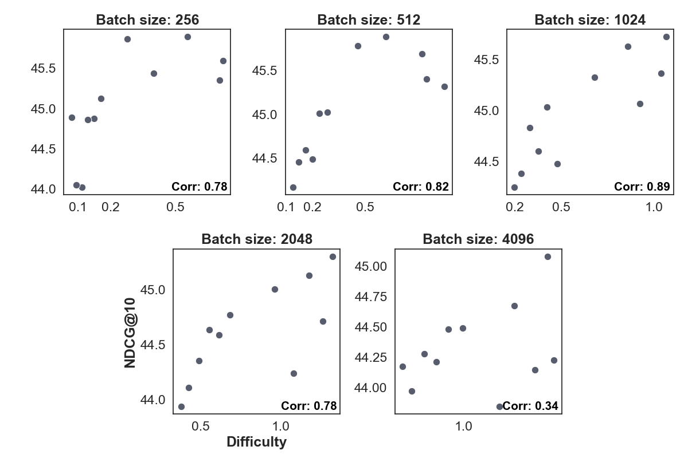
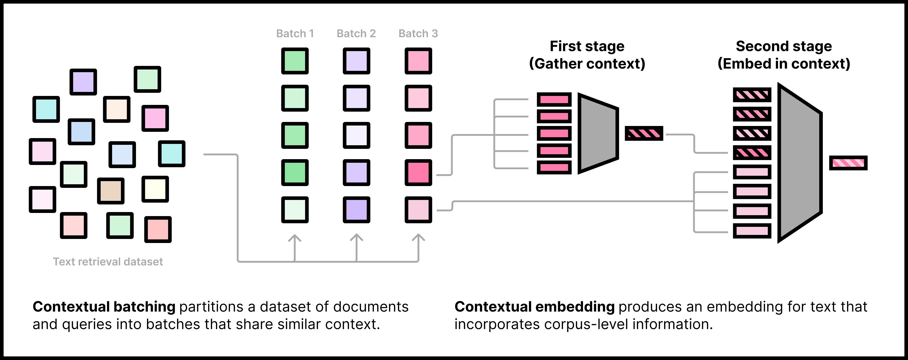
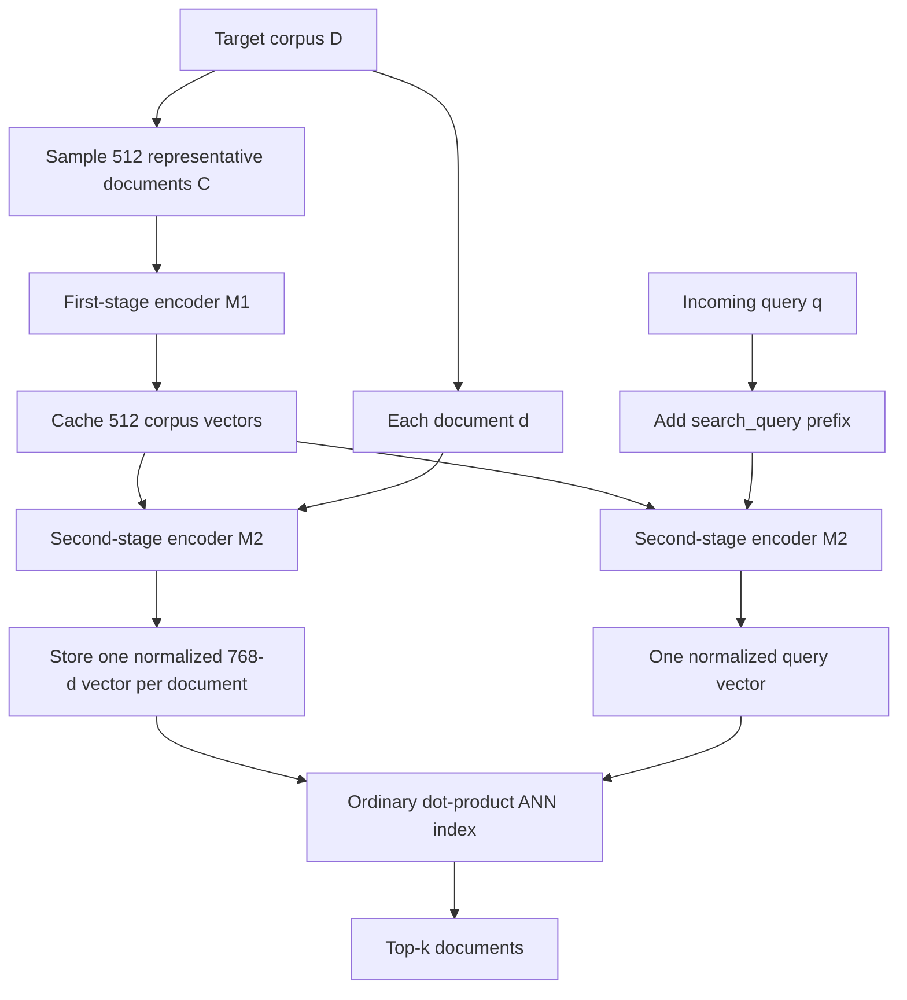

# Contextual Document Embeddings — Morris and Rush, 2024

> **arXiv:** 2410.02525v4 · **Venue:** ICLR 2025 submission / arXiv preprint · **Affiliation:** Cornell University

## TL;DR

Contextual Document Embeddings (CDE) argues that a retrieval embedding should depend on both its text and the corpus in which it will be searched, changing the usual document encoder from $\phi(d)$ to $\phi(d,\mathcal D)$. It contributes two complementary mechanisms: adversarially clustered contrastive batches that simulate narrow domains during training, and a two-stage encoder that conditions every query and document on a cached sample of the target corpus. The final representation remains one dense vector, so ordinary vector indexes still work, but corpus indexing and every query require the second-stage transformer to process up to 512 additional context vectors.

## Problem & motivation

Dense retrieval normally factorizes a query-document score as

$$
f(d,q)=\phi(d)^\top\psi(q),
$$

where $\phi$ and $\psi$ encode each input independently. This factorization is what permits all document vectors to be precomputed and searched with approximate nearest-neighbor infrastructure, as in [DPR](retrieval_2020_dpr.md), [GTR](retrieval_2021_gtr.md), and [Contriever](retrieval_2021_contriever.md). Its hidden assumption is that the best representation of a text is independent of the collection in which that text appears.

Classical sparse retrieval does not make that assumption. BM25 uses collection statistics such as inverse document frequency, so the significance of “NFL,” “draft,” or “annual” changes between a general encyclopedia, a sports corpus, and a collection about televised events. A learned dense encoder can internalize the statistics of its training data, but it has no corresponding mechanism for adapting those statistics when the test corpus changes.

The paper writes retrieval as a distribution over a finite corpus $\mathcal D$:

$$
p(d\mid q)
=
\frac{\exp f(d,q)}
{\sum_{d'\in\mathcal D}\exp f(d',q)}.
\tag{1}
$$

Here $q$ is a query, $d$ is its relevant document, and $f$ is a scalar relevance score. Computing the denominator over millions of documents is intractable during training, so dense retrievers replace it with a contrastive subset $\mathcal H(q)$ containing mined and in-batch negatives:

$$
\log \widehat p(d\mid q)
=
\log
\frac{\exp(f(d,q)/\tau)}
{\sum_{d'\in\mathcal H(q)}\exp(f(d',q)/\tau)},
$$

with temperature $\tau$. Independently sampled batches mostly contain unrelated, easy negatives. In a narrow test domain, however, many documents share vocabulary and topic, so the model must resolve much finer distinctions than its training batches demanded.

Two preliminary observations motivate CDE. First, across BEIR datasets, divergence between test-corpus and training-corpus IDF statistics correlates with neural retrievers losing ground to corpus-adaptive BM25 (Appendix §10.2, Figure 8). Second, nearest neighbors in a large weakly supervised corpus are often plausible answers to the same query; adversarially grouping them therefore creates both useful hard negatives and dangerous false negatives. The method addresses these two sides separately: construct difficult local pseudo-domains, then explicitly expose the encoder to a sample of the corpus.

## Key idea

CDE has two contributions that can be used together or independently.

**1. Contextual training.** Reorder query-document pairs into semantically coherent batches. Because every other document becomes an in-batch negative, clustering related pairs produces a harder contrastive approximation without requiring a large number of separately mined negatives. A surrogate model filters likely false negatives before the denominator is formed.

**2. Contextual architecture.** Sample a representative minicorpus $C=\{c_1,\ldots,c_J\}\subset\mathcal D$. A first-stage model $M_1$ compresses each sampled document to one vector; a second-stage model $M_2$ jointly processes those context vectors and the target query or document tokens. Thus,

$$
\phi(d,\mathcal D)\approx\phi(d,C),
\qquad
\psi(q,\mathcal D)\approx\psi(q,C).
$$

The same cached $C$ conditions both sides. It is not a nearest-neighbor set selected separately for each target, and it does not use example queries at test time. It is a corpus sample intended to let $M_2$ infer useful collection-level regularities.

The two-stage document encoder is

$$
\phi(d',\mathcal D)
=
\operatorname{Pool}_{d'}\!\left[
M_2\!\left(
M_1(c_1),\ldots,M_1(c_J),
E(d'_1),\ldots,E(d'_T)
\right)
\right],
\tag{5}
$$

and the query encoder is

$$
\psi(q,\mathcal D)
=
\operatorname{Pool}_{q}\!\left[
M_2\!\left(
M_1(c_1),\ldots,M_1(c_J),
E(q_1),\ldots,E(q_T)
\right)
\right].
\tag{6}
$$

$M_1$ and $M_2$ are separately parameterized bidirectional transformers; $E$ is $M_2$'s token embedding matrix; $J$ is the number of sampled corpus documents; $T$ is the target length; and pooling covers only the query or document positions, never the context positions. The paper prints $\phi(q,\mathcal D)$ on the left of Equation 6, but the surrounding text makes clear that this is the query encoder $\psi(q,\mathcal D)$.

The final score remains a dot product:

$$
f_C(d,q)=\phi(d,C)^\top\psi(q,C).
$$

This distinction is central to deployment: the stored object and search operator are unchanged, but producing those objects is more expensive and corpus-dependent.

## How it works

### Part A: adversarial contrastive batching

Let the training set be $\mathcal D_T=\{(d_j,q_j)\}_{j=1}^N$. The method partitions it into batches $\mathcal B_1,\ldots,\mathcal B_B$ and seeks batches whose cross-pair scores are high:

$$
\max_{\mathcal B_1,\ldots,\mathcal B_B}
\sum_b
\sum_{(d,q),(d',q')\in\mathcal B_b}
\left[
\phi(d)^\top\psi(q')+
\phi(d')^\top\psi(q)
\right].
\tag{2}
$$

For normalized vectors, maximizing dot products is equivalent to minimizing Euclidean distance. Define the symmetric cross-pair distance

$$
m\big((d,q),(d',q')\big)
=
\lVert\phi(d)-\psi(q')\rVert_2
+
\lVert\phi(d')-\psi(q)\rVert_2.
$$

The triangle inequality yields a centroid-based upper bound, giving the asymmetric K-means objective

$$
\min_{\mathcal B_1,\ldots,\mathcal B_B;\,\mu_1,\ldots,\mu_B}
\sum_b\sum_{(d,q)\in\mathcal B_b}
m\big((d,q),\mu_b\big).
\tag{3}
$$

It can be implemented with ordinary fast Euclidean K-means by representing each pair in both orientations:

$$
x_{d,q}=\phi(d)\oplus\psi(q),
\qquad
\widetilde x_{d,q}=\psi(q)\oplus\phi(d),
$$

where $\oplus$ denotes concatenation. Since the trainable encoders do not yet exist when batches are prepared, the authors use GTR embeddings as the surrogate $\phi$ and $\psi$, run FAISS K-means separately within each source domain for 100 steps, and retain the best of three attempts.

Clusters are not necessarily the desired batch size. The paper splits oversized clusters and merges small, nearby clusters. Its main model uses a greedy traveling-salesman-style packer: start from a random cluster, append the cluster with the nearest centroid, and continue until batches are filled. This preserves locality while changing boundaries across epochs; Appendix Figure 14 shows the largest gain at small cluster sizes, where packing has the most influence.

### False-negative filtering

Harder semantic neighborhoods contain more unlabeled relevant documents. For each positive $(q,d)$, a surrogate score $f_s$ defines

$$
S(q,d)
=
\left\{
d'\in\mathcal D:
f_s(q,d')\ge f_s(q,d)+\epsilon
\right\},
$$

where $\epsilon$ is a margin. Members of $S(q,d)$ are not trusted as negatives and are removed from the denominator:

$$
\log \widehat p(d\mid q)
=
\log
\frac{\exp(f(d,q)/\tau)}
{\exp(f(d,q)/\tau)+
\sum_{d'\notin S(q,d)}\exp(f(d',q)/\tau)}.
\tag{4}
$$

The implementation uses `nomic-embed-v1` for filtering. This rule is deliberately conservative and can discard true negatives, but the paper finds filtering critical: once likely false negatives are removed, smaller clusters give harder batches and higher downstream scores, while merely increasing batch size contributes little.



### Part B: corpus-conditioned encoding

At full scale, both stages start from the 137M-parameter NomicBERT backbone used by [Nomic Embed](retrieval_2024_nomic-embed.md). Their parameters are not shared with each other. Query and document inputs do share weights within a stage, so CDE is not maintaining separate query and passage towers. The first-stage model emits one vector per context document; the second-stage model receives those vectors as if they were additional input tokens.

For the paper configuration:

| Tensor | Shape | Meaning |
| --- | --- | --- |
| Context text tokens | $J\times L_c$ | $J=512$ sampled documents, each tokenized up to 512 tokens for $M_1$ |
| Context vectors | $J\times h$ | one pooled vector per context document |
| Target token vectors | $T\times h$ | query or document tokens, $T\le512$ |
| $M_2$ input | $(J+T)\times h$ | at most $1{,}024$ positions |
| Final embedding | $h$ | mean pool over target positions only; NomicBERT uses $h=768$ |

The released checkpoint configuration fixes `transductive_corpus_size=512`, `transductive_tokens_per_document=1`, `max_seq_length=512`, and mean pooling. The paper describes $M_1$ and $M_2$ as 137M-parameter backbones and the Hugging Face repository reports roughly 0.3B parameters for the complete checkpoint. This is worth separating from Table 2's “250M or fewer” comparison language: only cached outputs of $M_1$, not its weights, are needed in the online query path, but both stages exist for corpus preparation and training.



### Position handling, pooling, and dropout

The context set has no meaningful order. With learned absolute positions, one could simply omit positional embeddings for context slots. NomicBERT instead uses rotary position embeddings inside attention. The authors set context positions to zero for the self-attention operation and add a residual path that carries the original context vectors around that operation (Appendix §10.4). Target tokens retain their normal ordering.

During paper training, each context vector is independently replaced by a learned null vector $v_\varnothing$ with probability $p=0.005$. This sequence dropout teaches the second stage to function with partial or absent context. If no target corpus is available, all context slots can be replaced with null or fallback vectors, producing a less accurate context-agnostic mode. The released v1 configuration records a dropout probability of zero at inference, as expected.

### Indexing and query flow



Operationally, corpus preparation is:

1. Sample exactly 512 representative documents from the target corpus. The official example uses random sampling, not target-specific nearest-neighbor retrieval; a smaller corpus may be oversampled.
2. Prefix them with `search_document: `, tokenize to 512 tokens, run $M_1$, and cache the resulting $512\times768$ context matrix.
3. For every corpus document, run $M_2$ over the cached 512 context vectors plus that document's token vectors, mean-pool only its token positions, L2-normalize, and write one 768-dimensional vector to the index.
4. At query time, reuse the same context matrix, prefix with `search_query: `, run $M_2$, normalize, and perform standard dot-product search.

Only step 2 is amortized over the corpus. Compared with a conventional NomicBERT biencoder, both document indexing and online query encoding give $M_2$ up to 512 extra positions. The index still stores one vector per document and the ANN operation is unchanged, but it is incorrect to infer that CDE adds no encoding latency merely because $M_1$ is cacheable.

### Two-stage gradient caching

Naively retaining all activations for a large contrastive batch, 512 context documents, and a 1,024-position second stage exceeds practical memory. CDE extends GradCache:

1. Run $M_1$ and $M_2$ without retaining autograd graphs and save their final representations.
2. Compute the contrastive loss from those detached representations and obtain gradients with respect to $M_2$'s outputs.
3. Recompute $M_2$ in chunks with gradients enabled, inject the saved output gradients, and accumulate parameter gradients plus gradients with respect to $M_1$ outputs.
4. Recompute $M_1$ in chunks and backpropagate those saved context-vector gradients.

Each transformer forward is therefore performed twice. The method trades compute for enough memory to use larger contrastive batches, longer targets, and more context documents.


## Training / data

### Data and phases

Training follows the two-phase Nomic Embed recipe.

| Phase | Data | Scale | Notes |
| --- | --- | ---: | --- |
| Weakly supervised pretraining | Nomic meta-dataset, 29 listed sources | 234,553,344 pairs | Reddit 64,978,944; PAQ 52,953,088; Amazon Reviews 38,682,624; S2ORC title-abstract 35,438,592; 25 smaller sources (Appendix Table 5) |
| Supervised retrieval tuning | Human-written retrieval pairs including HotpotQA and MS MARCO | about 1.8M pairs | Nomic supervised meta-dataset |
| Final checkpoint tuning | BGE supervised meta-datasets | size not reported in this paper | Best checkpoint is the fourth supervised epoch |

The paper's prose rounds pretraining to 200M or 235M depending on context; Appendix Table 5 gives the exact 234,553,344 total. Task-type prefixes are hand-assigned per dataset from four strings: `search_query`, `search_document`, `classification`, and `clustering`. These are task labels, not dataset-specific natural-language instructions, which explains how the paper can use prefixes while claiming no dataset-specific instructions.

### Optimization recipe

| Setting | Value | Source |
| --- | --- | --- |
| Backbones | two independent NomicBERT / `nomic-bert-2048` models | §5 |
| Optimizer | Adam | §5 |
| Peak learning rate | $2\times10^{-5}$ | §5 |
| Warmup | 1,000 steps | §5 |
| Schedule | linear decay to zero | §5 |
| Contrastive temperature | $\tau=0.02$ | §5 |
| Training duration | three epochs unless specified; four for selected BGE checkpoint | §5, Figure 5 |
| Maximum target length | 512 tokens | §5 |
| Number of context vectors | 512 | §5 |
| Maximum $M_2$ length | 1,024 positions | §5 |
| Context-vector dropout | $p=0.005$ | §5 |
| Clustering | 100 FAISS steps, best of three attempts, per source domain | §5 |
| Filter surrogate | `nomic-embed-v1` | §5 |

Small ablations use a six-layer transformer, 64 target tokens, 64 context vectors, batch sizes $\{256,512,1024,2048,4096\}$, and cluster sizes from 64 through 4,194,304. They evaluate nine BEIR datasets by reranking only the top 1,024 GTR candidates per query. These are inexpensive candidate-reranking experiments, not full-corpus first-stage retrieval results.

The full model uses 512 target tokens and 512 context vectors and is evaluated on MTEB. For retrieval tasks, context documents are sampled from the corpus, never from queries; for classification, they are sampled from the text field rather than labels.

### Compute

All full pretraining runs use eight NVIDIA H100 GPUs. One 234.6M-pair unsupervised epoch takes about one day for the biencoder and two days for CDE. Short-sequence ablations are 10–20 times faster and can run on one GPU (Appendix §10.1). The paper does not report H100 memory size, total GPU-hours for all sweeps, energy use, random seeds, or variance.

Distributed contrastive learning is a specific reproducibility hazard. Appendix §10.3 warns that examples shared across GPUs can leak device identity if replicas diverge, while disabling synchronization can silently let each replica learn a degenerate solution. The authors recommend explicit DDP/non-DDP controls; adversarial batches reduce the need for cross-GPU negative sharing but do not remove synchronization requirements.

## Results

### Small controlled ablation

| Contextual batches | Contextual architecture | Batch | Cluster | Train loss | Train accuracy | BEIR NDCG@10 | Source |
| ---: | ---: | ---: | ---: | ---: | ---: | ---: | --- |
| No | No | 16,384 | n/a | 0.39 | 90.3 | 59.9 | Table 1 |
| Yes | No | 512 | 512 | 0.81 | 77.7 | 61.7 | Table 1 |
| No | Yes | 16,384 | n/a | 0.37 | 90.7 | 62.4 | Table 1 |
| Yes | Yes | 512 | 512 | 0.68 | 80.9 | **63.1** | Table 1 |

Adversarial batching contributes 1.8 NDCG@10 points, the contextual architecture contributes 2.5, and the combined system gains 3.2 over the 59.9 baseline. Because this study reranks GTR's top 1,024 candidates on nine datasets, it establishes a controlled representation/reranking improvement but cannot show whether CDE retrieves relevant documents that GTR fails to nominate.

### Full MTEB category comparison

| Model / context | Classification | Clustering | Pair classification | Reranking | Retrieval | STS | Summarization | Mean | Source |
| --- | ---: | ---: | ---: | ---: | ---: | ---: | ---: | ---: | --- |
| nomic-embed-v1 | 74.1 | 43.9 | 85.2 | 55.7 | 52.8 | 82.1 | 30.1 | 62.39 | Table 2 |
| bge-base-en-v1.5 | 75.5 | 45.8 | 86.6 | 58.9 | 53.3 | 82.4 | 31.1 | 63.56 | Table 2 |
| GIST-Embedding-v0 | 76.0 | 46.2 | 86.3 | 59.4 | 52.3 | 83.5 | 30.9 | 63.71 | Table 2 |
| gte-base-en-v1.5 | 77.2 | 46.8 | 85.3 | 57.7 | 54.1 | 82.0 | 31.2 | 64.11 | Table 2 |
| CDE, random training-document context | 81.3 | 46.6 | 84.1 | 55.3 | 51.1 | 81.4 | 31.6 | 63.81 | Table 2 |
| **CDE, target-corpus context** | **81.7** | **48.3** | **84.7** | **56.7** | 53.3 | 81.6 | 31.2 | **65.00** | Table 2 |

Target-corpus context adds 1.19 mean points over random fallback context, with the clearest category gains in retrieval (+2.2) and clustering (+1.7). It does not win every category: GTE leads retrieval in this table, GIST leads reranking and STS, and the random-context CDE row is slightly better on summarization. The paper's claim is the aggregate 65.00 state of the art among its compared small models, not uniform dominance.

The official model card reproduces 65.0 with corpus context and reports 63.8 when supplied fallback random strings. It now marks `cde-small-v1` deprecated and recommends `cde-small-v2`; that successor status postdates the paper and should not be read back into Table 2.

### Retrieval-category before/after comparison

| Training phase | Baseline mean NDCG@10 | Contextual mean | Gain | Largest positive changes | Source |
| --- | ---: | ---: | ---: | --- | --- |
| Unsupervised | 48.0 | **51.2** | +3.2 | TREC-COVID 62.2→77.1; NQ 48.6→57.8; FEVER 74.4→79.6; HotpotQA 63.8→68.8 | Appendix Table 7 |
| Supervised | 52.8 | **54.0** | +1.2 | ArguAna 49.3→53.8; FEVER 85.0→89.2; TREC-COVID 79.9→82.6 | Appendix Table 7 |

Contextualization is not monotonically beneficial per dataset. In the supervised row, DBPedia falls 45.0→43.3, MSMARCO 43.1→42.2, Quora 87.7→87.1, and Touché 28.2→27.8. The strongest improvements occur on some of the smaller or more distribution-shifted collections, matching the motivation, but the evidence does not support “context always helps.”


### Further ablations

- **Batch hardness:** within batch sizes 256–2,048, Pearson correlations between end-of-pretraining loss and downstream NDCG@10 range from 0.78 to 0.89; at batch size 4,096 the plotted correlation drops to 0.34 (Figure 2). This supports hardness within a fixed batch size, not the claim that arbitrary higher loss is always better.
- **Filtering:** Figures 3, 4, 12, and 13 show that false-negative filtering makes small clusters useful and that performance eventually decreases with oversized batches. Filtering and clustered sampling should be treated as a coupled recipe.
- **Context identity:** in-domain CQADupStack context is almost always within one NDCG@10 point of the best context; a few cross-forum contexts transfer (Figure 7).
- **Context amount:** partial context degrades gracefully and all-null context remains functional, while the full window performs best (Appendix Figure 16; numbering/captions in v4 are duplicated around Figures 15–16).
- **First-stage depth:** increasing $M_1$ from one to 12 layers produces less than one percent improvement, suggesting $M_2$ capacity dominates (Appendix Figure 17).
- **Context granularity:** with total context tokens fixed, datasets prefer different tokens-per-document settings (Appendix Figure 18). The released v1 model chooses one pooled vector per each of 512 documents.
- **Mined negatives:** Appendix Figure 11 says additional mined negatives generally decrease performance on the Nomic supervised data. Figure 5 nevertheless shows that the selected BGE checkpoint uses one mined negative per query.

The last point requires careful wording. The abstract claims state of the art “with no hard negative mining,” and §6 first says the best model uses one hard negative before immediately saying it uses none. The concrete Figure 5 legend identifies the highest curve as **BGE (1 mined negative)**. The defensible conclusion is that adversarial batching can work with zero mined negatives and reduces dependence on them, while the reported best checkpoint used one; the paper text is internally inconsistent beyond that.

## Limitations & follow-ups

- **Corpus conditioning is transductive.** Changing the corpus sample changes query and document vectors. A corpus update may require choosing a new representative sample and re-embedding the whole index if consistent conditioning is desired.
- **One sample stands in for the collection.** The paper uses 512 context documents but does not establish robust sampling under heavy imbalance, rare subdomains, temporal drift, multilingual mixtures, or adversarial corpus contamination. Random sampling can miss small but important strata.
- **Encoding cost increases.** $M_1$ is cached once, but $M_2$ still processes the cached context on every indexed document and every online query. Storage and ANN scoring stay conventional; transformer FLOPs, memory traffic, and latency do not. No production latency, throughput, or index-build benchmark is reported.
- **The small BEIR experiment is reranking.** It evaluates only GTR's top 1,024 candidates. Its 59.9→63.1 result is not evidence of full-corpus recall improvement and is coupled to the GTR candidate generator.
- **Parameter accounting is unclear.** Each stage is initialized from a 137M backbone and weights are not shared across stages, while Table 2 describes the comparison set as at most 250M parameters. The paper does not formally state whether it counts total stored weights, online weights, or active search-time weights.
- **False-negative filtering depends on a teacher.** Clustering uses GTR and filtering uses Nomic Embed v1. Their biases determine which neighborhoods are formed and which negatives disappear; the paper does not compare surrogate choices or report sensitivity to $\epsilon$.
- **Filtering over-prunes by design.** A document scoring above the labeled positive is removed even when it is a valid discriminative negative. This may improve benchmark accuracy while weakening calibration or fine-grained distinctions.
- **Hard-negative reporting is contradictory.** The abstract, §6 prose, and Figure 5 do not agree. Reproduction should follow the plotted checkpoint label and released configuration rather than the broad “no hard negatives” claim.
- **No uncertainty estimates.** The paper reports no multiple-seed means, confidence intervals, or significance tests for its benchmark comparisons. The many batch/cluster sweeps increase selection risk.
- **DDP can silently fail.** The authors explicitly warn about replica divergence and device-identity shortcuts in contrastive training. Their recommendation for control experiments is useful but not a complete distributed recipe.
- **English-centric evidence.** Training sources, prefixes, and MTEB evaluation do not establish multilingual corpus conditioning. See [BGE-M3](retrieval_2024_bge-m3.md), [mGTE](retrieval_2024_mgte.md), or [GTE](retrieval_2023_gte.md) for multilingual retrieval designs, though they do not provide the same corpus-conditioned architecture.
- **Task prefixes remain required.** “No dataset-specific instructions” does not mean raw text can be embedded without role information. The released checkpoint expects `search_query: ` and `search_document: ` or the corresponding Sentence Transformers prompts.
- **Remote code and model lifecycle matter.** The official checkpoint requires `trust_remote_code=True`, so consumers should inspect and pin repository revisions. The v1 model card is now deprecated in favor of [cde-small-v2](https://huggingface.co/jxm/cde-small-v2).
- **Artifact licenses differ.** The official code repository is MIT-licensed. The arXiv page uses arXiv's non-exclusive distribution license; the v1 model card does not expose a clear model-license field in the fetched metadata. Model deployment therefore needs separate license verification rather than inheriting the code license.

The paper opens several concrete follow-ups: learned or stratified corpus sampling, incremental context refresh without full reindexing, smaller or distilled $M_2$ models, explicit latency-quality curves, surrogate-free filtering, and controlled comparisons against pseudo-relevance feedback. Its broadest reusable result may be the batching method: clustered, filtered pseudo-domains can improve an ordinary biencoder without adopting the two-stage inference architecture.

## Links

- **arXiv:** [abs](https://arxiv.org/abs/2410.02525v4) · [html](https://arxiv.org/html/2410.02525v4) · [pdf](https://arxiv.org/pdf/2410.02525v4)
- **Code:** [jxmorris12/cde](https://github.com/jxmorris12/cde)
- **Hugging Face:** [cde-small-v1 paper checkpoint](https://huggingface.co/jxm/cde-small-v1) · [cde-small-v2 successor](https://huggingface.co/jxm/cde-small-v2)
- **Project page:** —
- **Blog posts:** —
- **Talks / videos:** —
- **OpenReview / venue page:** — (the v4 source is formatted as an ICLR 2025 submission, but the arXiv record does not provide a venue link)
- **Papers-with-Code:** —
- **Related local reviews:** [Nomic Embed](retrieval_2024_nomic-embed.md) · [DPR](retrieval_2020_dpr.md) · [GTR](retrieval_2021_gtr.md) · [Contriever](retrieval_2021_contriever.md) · [GTE](retrieval_2023_gte.md) · [BGE / C-Pack](retrieval_2023_bge-c-pack.md) · [BGE-M3](retrieval_2024_bge-m3.md) · [mGTE](retrieval_2024_mgte.md) · [SPLADE v2](retrieval_2021_splade-v2.md)
- **Related external work:** [GradCache](https://arxiv.org/abs/2101.06983) · [pseudo-relevance feedback for dense retrieval](https://doi.org/10.1145/3471158.3472250) · [CDE small v2 technical report](https://huggingface.co/jxm/cde-small-v2)
- **Context overview:** [BERT-family encoders, hybrid and contextual embeddings](../bert/overview.md#87-hybrid-and-contextual-embeddings)
- **Licenses:** [paper: arXiv non-exclusive distribution](https://arxiv.org/abs/2410.02525v4) · [code: MIT](https://github.com/jxmorris12/cde/blob/main/LICENSE)
- **BibTeX:**

```bibtex
@misc{morris2024contextualdocumentembeddings,
  title         = {Contextual Document Embeddings},
  author        = {Morris, John X. and Rush, Alexander M.},
  year          = {2024},
  eprint        = {2410.02525},
  archivePrefix = {arXiv},
  primaryClass  = {cs.CL},
  doi           = {10.48550/arXiv.2410.02525},
  url           = {https://arxiv.org/abs/2410.02525v4}
}
```