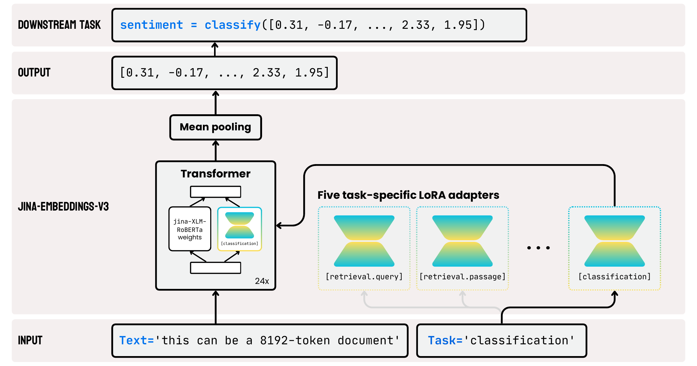
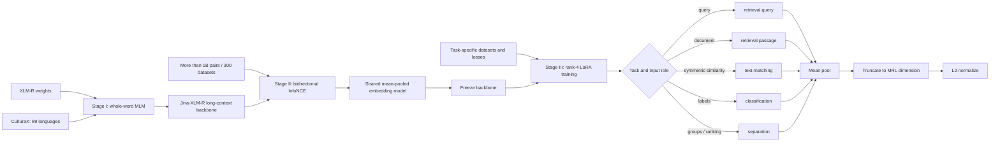
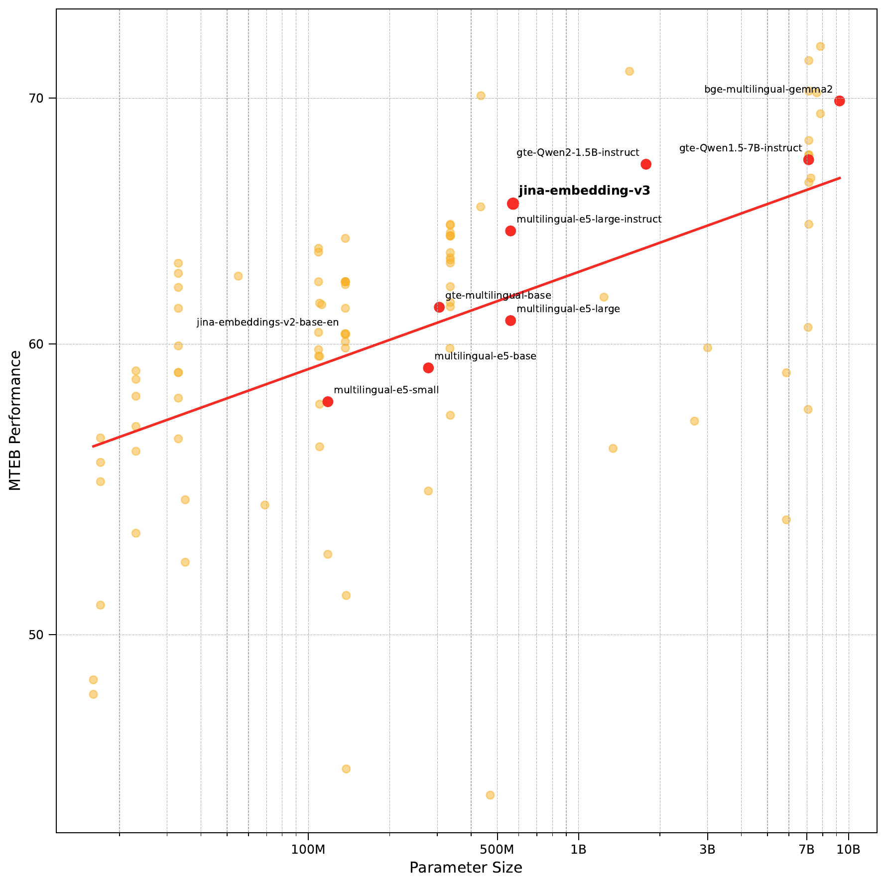

# Jina Embeddings v3: Multilingual Embeddings With Task LoRA - Sturua et al., 2024

**Paper:** *jina-embeddings-v3: Multilingual Embeddings With Task LoRA*  
**Authors:** Saba Sturua, Isabelle Mohr, Mohammad Kalim Akram, Michael Günther, Bo Wang, Markus Krimmel, Feng Wang, Georgios Mastrapas, Andreas Koukounas, Nan Wang, Han Xiao  
**Affiliation:** Jina AI GmbH  
**Version reviewed:** [arXiv:2409.10173v3](https://arxiv.org/abs/2409.10173v3), revised 19 September 2024  
**Venue:** preprint (cs.CL)

## TL;DR

Jina Embeddings v3 is a 559M-parameter XLM-R-derived encoder that supports 8,192-token inputs, 1,024-dimensional Matryoshka embeddings, and multilingual use. Its central contribution is task routing through five rank-4 LoRA adapters: separate query and passage adapters for asymmetric retrieval, plus adapters for classification, text matching, and separation-oriented clustering or reranking. The full released system has 572M parameters, so the adapters add about 13M parameters while avoiding separate full models for each embedding geometry.

The model is trained in three stages: whole-word masked-language-model continuation on 89-language CulturaX data, bidirectional contrastive pair training on more than one billion pairs from over 300 datasets, and task-specific adapter training with the backbone frozen. It reports a 65.52 English MTEB average, a 70.39 LongEmbed average, and useful embedding prefixes down to 32 dimensions. The strongest retrieval ablation uses two role-specific adapters plus textual instructions, showing that adapter routing complements rather than simply replaces input prompting.

## Problem & motivation

A single embedding space is asked to express several incompatible relationships. Semantic textual similarity needs symmetric distances: swapping two sentences should not change their relationship. Search is often asymmetric: a short question and a long evidence passage have different distributions and roles. Classification requires same-label examples to form separable groups, while reranking and clustering reward still different local geometry.

Earlier general-purpose embedders handled this conflict with textual prefixes or natural-language instructions. That strategy can work, but users must know the exact prompt convention, and one shared set of weights must still internalize every task. Deploying one independently fine-tuned encoder per task solves specialization at the cost of duplicating hundreds of millions of parameters.

The paper addresses four additional deployment pressures:

- **Multilingual breadth:** the encoder should transfer across many scripts and languages without decoder-LLM scale.
- **Long documents:** a 512-token limit discards evidence in documents used by retrieval-augmented generation systems.
- **Storage and latency:** a fixed 1,024-dimensional output may be unnecessary for every application or retrieval stage.
- **Systematic retrieval failures:** standard pair corpora encourage lexical-overlap shortcuts, entity confusion, weak handling of polar questions, and indifference to answer quality.

Jina Embeddings v3 therefore combines a shared multilingual long-context backbone with small, dynamically selected task modules. It remains much smaller than 7B-class decoder embedders: the paper compares its roughly 570M parameters and 1,024-dimensional output with `e5-mistral-7b-instruct` at 7.1B parameters and 4,096 dimensions, whose reported English MTEB average is only about one point higher.

## Key idea

The core idea is to learn a strong generic embedding backbone once, freeze it, and alter its representation geometry with a low-rank update selected by task and, for retrieval, by input role. For a frozen linear transformation $W_0\in\mathbb R^{d_{out}\times d_{in}}$, LoRA defines

$$
h = W_0x + \frac{\alpha}{r}BAx,
$$

where $x\in\mathbb R^{d_{in}}$ is the layer input, $A\in\mathbb R^{r\times d_{in}}$ and $B\in\mathbb R^{d_{out}\times r}$ are trainable adapter matrices, $r=4$ is the adapter rank, and the released configuration sets $\alpha=1$. Main-model parameters are frozen during adapter training. The low-rank branches are installed in the embedding layer and attention linear layers, and the selected adapter changes with the requested task.

The five public adapter identifiers are:

| Adapter | Intended geometry |
| --- | --- |
| `retrieval.query` | Queries in asymmetric query-document retrieval |
| `retrieval.passage` | Documents in asymmetric query-document retrieval |
| `separation` | Clustering, corpus visualization, and reranking |
| `classification` | Features for downstream text classifiers |
| `text-matching` | STS, symmetric retrieval, recommendations, similarity, and deduplication |

The two retrieval adapters are trained jointly because relevance is a relation between unlike roles. The other adapters are independently optimized. This distinction matters: there are four task families but five adapters.

Task specialization is combined with Matryoshka Representation Learning (MRL). Let $e(x)\in\mathbb R^{1024}$ be the full embedding and $e_{:m}(x)$ its first $m$ coordinates. Training applies the objective at multiple prefix dimensions

$$
\mathcal L_{\mathrm{MRL}}
= \sum_{m\in\{32,64,128,256,512,768,1024\}}
\lambda_m\,\mathcal L\!\left(e_{:m}\right),
$$

where $m$ is a retained dimensionality, $\lambda_m$ weights that dimensional objective, and $\mathcal L$ is the active contrastive or task loss. The paper does not report separate $\lambda_m$ values. The construction orders information so a prefix can be indexed directly rather than projected by another learned model.

## How it works

### 1. Shared multilingual backbone

The model initializes from XLM-RoBERTa and retains its 250,002-entry tokenizer. The released architecture has 24 Transformer layers, hidden width 1,024, 16 attention heads, and a 4,096-wide GELU feed-forward layer. It uses FlashAttention 2, activation checkpointing during training, and DeepSpeed for distributed execution.

| Property | Value | Source |
| --- | ---: | --- |
| Backbone parameters | 559M | Table 1 |
| Parameters with all adapters | 572M | Table 1 |
| Transformer layers | 24 | released config |
| Hidden / maximum output width | 1,024 | Table 1 and released config |
| Attention heads | 16 | released config |
| Feed-forward width | 4,096 | released config |
| Vocabulary | 250,002 tokens | released config |
| Maximum input | 8,192 tokens | Table 1 |
| Pooling | masked mean | Table 1 and model card |
| Position representation | RoPE; base 10,000 in training, 20,000 in inference | Section 3 |
| LoRA | rank 4, alpha 1, dropout 0 | Section 3 and released config |

Absolute position embeddings are replaced by Rotary Position Embeddings (RoPE). For token position $p$ and channel pair indexed by $i$, the rotation angle is

$$
\theta_{p,i}=p\,b^{-2i/d_h},
$$

where $b$ is the rotary base and $d_h$ is the attention-head width. The corresponding two-dimensional query or key subvector is rotated by

$$
R(\theta_{p,i})=
\begin{bmatrix}
\cos\theta_{p,i} & -\sin\theta_{p,i}\\
\sin\theta_{p,i} & \cos\theta_{p,i}
\end{bmatrix}.
$$

The authors train with $b=10{,}000$ and switch to $b=20{,}000$ at inference. Their experiments found this improved long-text tasks without degrading short-text performance. This is a fixed inference-time base change, not Nomic Embed's length-dependent Dynamic NTK formula.

After the final Transformer layer, masked mean pooling converts token states $H(x)\in\mathbb R^{n\times1024}$ into one vector:

$$
e(x)=\frac{\sum_{t=1}^{n}m_tH_t(x)}{\sum_{t=1}^{n}m_t},
\qquad
\hat e(x)=\frac{e(x)}{\lVert e(x)\rVert_2},
$$

where $m_t\in\{0,1\}$ masks padding and $\hat e(x)$ is the normalized embedding used for cosine or dot-product search. When using MRL, truncate first and normalize the retained prefix afterward.



*Figure 1 from the paper. The operationally important point is that task selection changes internal low-rank weights; it is not merely metadata attached after a generic embedding is produced.*

### 2. End-to-end route



### 3. Task-specific objectives

The generic pair stage uses bidirectional InfoNCE. For a batch $B=\{(p_i,q_i)\}_{i=1}^{k}$ and its swapped version $B^\dagger=\{(q_i,p_i)\}_{i=1}^{k}$,

$$
\mathcal L_{\mathrm{pairs}}(B)
=\mathcal L_{\mathrm{NCE}}(B)
+\mathcal L_{\mathrm{NCE}}(B^\dagger),
$$

with

$$
\mathcal L_{\mathrm{NCE}}(B)
=-\sum_{i=1}^{k}
\log
\frac{\exp(s(p_i,q_i)/\tau)}
{\sum_{j=1}^{k}\exp(s(p_i,q_j)/\tau)}.
$$

Here $p_i$ and $q_i$ are paired texts, $s$ is embedding similarity, and $\tau$ is temperature. Swapping the batch makes both directions contribute anchors and in-batch negatives.

The classification and retrieval adapters use an extended triplet-style InfoNCE objective. Each anchor-positive tuple can include $m$ explicit negatives in addition to positives from other tuples. Conceptually, one direction is

$$
\mathcal L_{\mathrm{triplet}}
=-\mathbb E_i\log
\frac{\exp(s(q_i,p_i)/\tau)}
{\sum_{u=1}^{k}\exp(s(q_i,p_u)/\tau)
+\sum_{u=1}^{k}\sum_{j=1}^{m}\exp(s(q_i,n_{j,u})/\tau)},
$$

with a symmetric $p_i\rightarrow q_i$ term. For classification, each tuple contains two same-class examples and seven different-class examples. Unique tuple IDs are appended to texts so same-class examples belonging to other tuples do not become accidental false negatives.

Text matching uses CoSENT, a ranking loss over pairwise similarity labels. If ground-truth similarity $\zeta(q_1,p_1)>\zeta(q_2,p_2)$, the loss penalizes a reversed model ordering:

$$
\mathcal L_{\mathrm{CoSENT}}(B)
=\log\left[
1+\sum_{\zeta_1>\zeta_2}
\exp\left(\frac{s(q_2,p_2)-s(q_1,p_1)}{\tau}\right)
\right].
$$

The separation adapter forms every within-label pair in a labeled batch and applies CoSENT:

$$
B=\{(x_i,x_j)\mid \exists\ell:(x_i,\ell),(x_j,\ell)\in B'\},
\qquad
\mathcal L_{\mathrm{sep}}(B')=\mathcal L_{\mathrm{CoSENT}}(B).
$$

Because directly labeled separation data are limited, pair-training data are mixed into this stage.

### 4. Retrieval failure patching

The authors inspect failures of the preceding Jina v2 family and define four categories:

1. **F1, misleading syntactic similarity:** lexical overlap outranks semantic relevance.
2. **F2, named-entity confusion:** partial names or common-word senses of names produce false matches.
3. **F3, polar-question failure:** related passages are retrieved even when they do not answer a yes/no question.
4. **F4, low-quality preference:** repetitive or uninformative text wins because it contains query terms.

For F1-F3, synthetic training examples contain one query, one preferred answer, and seven negatives designed around the failure. F4 uses OpenAssistant `oasst1` and `oasst2`: the highest-quality answer is positive and answers at least 0.3 quality points lower are negatives. This turns qualitative diagnosis into targeted contrastive data, although the paper's synthetic evaluation is not independent of the same failure templates.

### 5. Inference interface

The model card's direct Transformers path uses custom repository code:

```python
from transformers import AutoModel

model = AutoModel.from_pretrained(
    "jinaai/jina-embeddings-v3",
    trust_remote_code=True,
)

queries = model.encode(
    ["What is task-specific LoRA?"],
    task="retrieval.query",
    truncate_dim=256,
)
passages = model.encode(
    ["Task-specific LoRA selects a low-rank update for an embedding task."],
    task="retrieval.passage",
    truncate_dim=256,
)
scores = queries @ passages.T
```

The released task instructions for retrieval are `Represent the query for retrieving evidence documents: ` and `Represent the document for retrieval: `. They are empty for the other three task families. Sentence Transformers users should pass the task consistently through both `task` and `prompt_name` where required by the integration.

A historical `encode` implementation normalized the full vector before truncating it, leaving truncated MRL vectors non-unit-length. Current code truncates before normalization. Reproducing embeddings created with the old behavior requires the model card's pinned code revision `da863dd04a4e5dce6814c6625adfba87b83838aa`; new deployments should pin a current model and code revision instead.

## Training / data

### Stage I: multilingual whole-word MLM

The initialized XLM-R backbone undergoes whole-word masked-language modeling on CulturaX. The selected corpus covers 89 languages, with English contributing approximately 20%. Each batch contains one language, and the language rotates between batches. Adapters and the pooling layer are excluded from this stage.

Training first uses short sequences, then long sequences:

| Phase | Devices | Steps | Global batch | Length | Peak LR | Source |
| --- | ---: | ---: | ---: | ---: | ---: | --- |
| MLM, short text | 8 | 100,000 | $128\times8=1{,}024$ | 512 | $1\times10^{-4}$ | Table A1 |
| MLM, long text | 8 | 60,000 | $8\times8=64$ | 8,192 | $5\times10^{-5}$ | Table A1 |

The learning-rate schedule is linear with warmup; Table A1 calls the listed value the maximum learning rate but does not state the warmup fraction or optimizer. The long-text continuation is important because merely replacing positional embeddings did not match Jina v2 on long-document tasks.

### Stage II: generic embedding pair training

The model adds masked mean pooling and trains on more than one billion pairs from more than 300 domain- and language-specific sub-datasets. A batch is sampled from only one dataset and language, keeping its in-batch negatives semantically comparable. Pairs are filtered when at least 80% of the shorter text's words, with a minimum overlap of four words, occur as substrings in the longer text. This deliberately removes easy lexical-copy positives.

As in MLM, short-pair training precedes a long-text continuation drawn only from datasets with enough long examples:

| Phase | Devices | Steps | Global batch | Length | Peak LR | $\tau$ | Source |
| --- | ---: | ---: | ---: | ---: | ---: | ---: | --- |
| Pair training, short | 8 | 60,000 | $8\times2{,}048=16{,}384$ | 192 | $3\times10^{-5}$ | 0.05 | Table A1 |
| Pair training, long | 2 | 50,000 | $2\times512=1{,}024$ | 1,024 | $2\times10^{-5}$ | 0.02 | Table A1 |

The paper does not publish a source-by-source pair count or the complete mixture weights, so the claim is less reproducible than Nomic Embed's enumerated corpus.

### Stage III: frozen-backbone adapter training

The base model is frozen and each task adapter is trained independently, except `retrieval.query` and `retrieval.passage`, which are optimized jointly. Retrieval data include MS MARCO and Natural Questions with annotated hard negatives; for datasets without them, BGE-large and BM25 mine candidates. Text matching combines multilingual STS and NLI data, including machine translations of STS12 and SICK made with WMT19 and MADLAD-3B models. Classification covers sentiment, intent, and article categories. Separation uses grouping data plus generic pair-stage data.

| Adapter stage | Devices | Steps | Batch | Length | Peak LR | $\tau$ | Source |
| --- | ---: | ---: | ---: | ---: | ---: | ---: | --- |
| Retrieval query + passage | 1 | 20,000 | 128 | 512 | $5\times10^{-4}$ | 0.05 | Table A1 |
| Text matching | 1 | 15,000 | 256 | 192 | $1\times10^{-4}$ | 0.05 | Table A1 |
| Classification | 1 | 11,500 | 256 | 192 | $5\times10^{-4}$ | 0.02 | Table A1 |
| Separation | 1 | 12,500 | 512 | 192 | $5\times10^{-5}$ | 0.02 | Table A1 |

All rows use a linear schedule with warmup, but the optimizer, warmup duration, hardware model, wall-clock time, random seed, and MRL dimension weights are not reported. Consequently, the paper specifies the high-level recipe and major hyperparameters but not a turnkey reproduction budget.

## Results

### English and multilingual MTEB

The paper evaluates task families with different adapters: classification and pair classification use `classification`; STS, ArguAna, CQADupstack, and Quora retrieval use `text-matching`; other retrieval uses the two retrieval adapters; clustering and reranking use `separation`.

| Model | English MTEB average | Classification | Clustering | Retrieval | STS | Source |
| --- | ---: | ---: | ---: | ---: | ---: | --- |
| Jina Embeddings v3 | **65.52** | **82.58** | 45.27 | 53.87 | **85.80** | Table 4 |
| `text-embedding-3-large` | 64.60 | 75.45 | 49.01 | 55.44 | n/a | Table 4 |
| `multilingual-e5-large-instruct` | 64.41 | 77.56 | 47.10 | 52.47 | 84.78 | Table 4 |
| Cohere Embed Multilingual v3 | 64.01 | 76.01 | 46.60 | 53.84 | 83.15 | Table 4 |
| Jina Embeddings v2 base English | 60.38 | 73.45 | 41.73 | 47.87 | 80.70 | Table 4 |

These are averages over the paper's historical MTEB task selection, not a current leaderboard snapshot. Some comparator cells are unavailable because closed models were not run over the full multilingual suite. The paper reports that v3 surpasses `multilingual-e5-large` on the aggregate multilingual task families except reranking, while approaching the instruction-tuned E5 variant; individual language tables remain mixed.

### LongEmbed

| Model | Average | NarrativeQA | Needle | Passkey | QMSum | SummScreen | WikiQA | Source |
| --- | ---: | ---: | ---: | ---: | ---: | ---: | ---: | --- |
| Jina Embeddings v3, `text-matching` | **70.39** | 33.32 | 84.00 | 100.00 | 39.75 | 92.78 | 72.46 | Table 5 |
| Jina Embeddings v2 base English | 58.12 | 37.89 | 54.25 | 50.25 | 38.87 | 93.48 | 73.99 | Table 5 |
| BGE-M3 | 56.56 | 45.76 | 40.25 | 46.00 | 35.54 | **94.09** | **77.73** | Table 5 |
| `text-embedding-3-large` | 51.30 | **44.09** | 29.25 | 63.00 | 32.49 | 84.80 | 54.16 | Table 5 |

Scores are nDCG@10 percentages. The 12-point aggregate improvement over Jina v2 is concentrated in synthetic Needle and Passkey tasks; v3 is lower than v2 on NarrativeQA, SummScreen, and WikiQA. The table therefore supports strong long-context mechanics but not uniform dominance on natural long-document retrieval.

### Matryoshka dimensionality

| Dimensions | Retrieval nDCG@10 | STS Spearman | Source |
| ---: | ---: | ---: | --- |
| 32 | 52.54 | 76.35 | Table 7 |
| 64 | 58.54 | 77.03 | Table 7 |
| 128 | 61.64 | 77.43 | Table 7 |
| 256 | 62.72 | 77.56 | Table 7 |
| 512 | 63.16 | **77.59** | Table 7 |
| 768 | 63.30 | **77.59** | Table 7 |
| 1,024 | **63.35** | 77.58 | Table 7 |

MRL is especially effective beyond 256 dimensions: reducing storage by 4x from 1,024 to 256 dimensions costs only 0.63 retrieval points and 0.02 STS points in this ablation. At 32 dimensions, retrieval falls by 10.81 points, so the abstract's “as low as 32” claim should not be read as no-cost compression.

### Query-passage asymmetry

| Retrieval setup | Average nDCG@10 | Source |
| --- | ---: | --- |
| One adapter + instructions | 45.20 | Table 8 |
| Two adapters + instructions | **45.98** | Table 8 |
| One adapter, no instructions | 43.92 | Table 8 |
| Two adapters, no instructions | 45.62 | Table 8 |

Two role-specific adapters improve the average in both prompt settings. Instructions add 0.36 points with two adapters but 1.28 with one, suggesting that explicit query/document routing absorbs much of the role signal while textual guidance remains complementary. Individual tasks vary: two adapters without instructions score best on FiQA2018 and Touche2020, while the full two-adapter-plus-instruction setup leads the average.



*Figure 2 from the paper. The plot supports the efficiency argument, but it is observational: architecture, data, supervision, benchmark exposure, and parameter count all vary across points, and models without disclosed sizes are excluded.*

### Targeted failure evaluation

On the hand-selected cases in Table 6, retrieval-adapter tuning raises F1 mAP from 46.97 to 62.12, F3 from 27.27 to 45.45, and F4 from 9.09 to 81.82 relative to the pair-trained v3 checkpoint; F2 remains 45.45. These sets contain fewer than ten examples for most categories. A larger synthetic evaluation favors the final model across F1-F3, but the authors caution that generated tests may be too similar to generated training examples.

## Limitations & follow-ups

- **Incomplete reproducibility:** dataset names are discussed, but the billion-pair mixture, preprocessing code, mixture weights, optimizer, hardware, and several scheduler details are not fully specified. Released weights are usable; exact retraining is not documented at Nomic Embed's level.
- **Noncommercial model license:** the arXiv manuscript is CC BY-NC-SA 4.0, while the Hugging Face model is CC BY-NC 4.0. On-premises commercial use requires separate permission from Jina AI; the paper's accessible text must not be mistaken for permissively licensed weights.
- **Custom code trust boundary:** direct Transformers loading uses `trust_remote_code=True`. Production deployments should inspect and pin the code revision, model revision, Transformers version, and numerical precision.
- **Adapter selection is an API contract:** embeddings from the wrong adapters can be geometrically incompatible. Retrieval must route queries to `retrieval.query` and corpus items to `retrieval.passage`; index metadata should record model revision, task, dimension, normalization, and instruction policy.
- **MRL migration risk:** old `encode` code normalized before truncation. Mixing those vectors with embeddings from corrected code can silently change norms and rankings.
- **Long-context averages are synthetic-sensitive:** perfect Passkey and strong Needle scores drive much of the LongEmbed gain, while v3 does not lead several natural-document tasks. An 8,192-token limit does not guarantee evidence retention at every position.
- **Low-resource languages remain underexplored:** MLM covers 89 languages and the inherited foundation supports more, but tuning emphasizes 30 named languages. The authors identify systematic low-resource evaluation and improvement as future work.
- **Failure evaluation is small or coupled to generation:** hand-built sets are tiny, and synthetic tests may share the training generator's patterns. Named-entity failure F2 does not improve in the hand-selected study.
- **No isolated component ablation:** RoPE, long-text continuation, FlashAttention implementation, MRL, pair filtering, synthetic data, and adapters form one system. Table 8 isolates retrieval routing, but the paper does not assign causal gains to every architecture and data choice.
- **Leaderboard comparisons age quickly:** MTEB task sets, implementations, and closed APIs change. The reported 2024 protocol should be reproduced before comparing it with current scores.

Useful follow-up questions are whether adapter composition can replace one-adapter selection, whether a single index can safely support several passage-side tasks, and whether synthetic failure patching transfers to independently authored adversarial sets. A strong deployment evaluation should stratify by language, input length, evidence position, adapter choice, and MRL dimension rather than report only one aggregate.

## Links

- **arXiv:** [abs](https://arxiv.org/abs/2409.10173v3) · [html](https://arxiv.org/html/2409.10173v3) · [pdf](https://arxiv.org/pdf/2409.10173v3)
- **Code:** custom model implementation is distributed through the [Jina XLM-R Flash implementation](https://huggingface.co/jinaai/xlm-roberta-flash-implementation); no standalone training repository is linked by the paper
- **Hugging Face:** [jinaai/jina-embeddings-v3](https://huggingface.co/jinaai/jina-embeddings-v3) · [model collection](https://huggingface.co/collections/jinaai/jina-embeddings-v3)
- **Project page:** [Jina Embeddings API](https://jina.ai/embeddings/)
- **Blog posts:** [Jina Embeddings v3 announcement](https://jina.ai/news/jina-embeddings-v3-a-frontier-multilingual-embedding-model/)
- **Talks / videos:** —
- **OpenReview / venue page:** —
- **Papers-with-Code:** —
- **Related local reviews:** [Sentence-BERT](retrieval_2019_sentence-bert.md) · [DPR](retrieval_2020_dpr.md) · [E5](retrieval_2022_e5.md) · [GTE](retrieval_2023_gte.md) · [Nomic Embed](retrieval_2024_nomic-embed.md)
- **Related papers:** [Jina Embeddings 2](https://arxiv.org/abs/2310.19923) · [multilingual Jina Embeddings 2](https://arxiv.org/abs/2402.17016) · [LoRA](https://arxiv.org/abs/2106.09685) · [Matryoshka Representation Learning](https://arxiv.org/abs/2205.13147)
- **Context overview:** [BERT-family encoders, section 16.4](../bert/overview.md#164-from-one-vector-semantics-to-trained-retrieval-geometry)
- **Licenses:** [paper: CC BY-NC-SA 4.0](https://arxiv.org/html/2409.10173v3) · [model: CC BY-NC 4.0](https://huggingface.co/jinaai/jina-embeddings-v3)
- **BibTeX:**

```bibtex
@misc{sturua2024jina,
  title         = {jina-embeddings-v3: Multilingual Embeddings With Task LoRA},
  author        = {Saba Sturua and Isabelle Mohr and Mohammad Kalim Akram and Michael Günther and Bo Wang and Markus Krimmel and Feng Wang and Georgios Mastrapas and Andreas Koukounas and Nan Wang and Han Xiao},
  year          = {2024},
  eprint        = {2409.10173},
  archivePrefix = {arXiv},
  primaryClass  = {cs.CL},
  url           = {https://arxiv.org/abs/2409.10173}
}
```