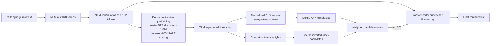
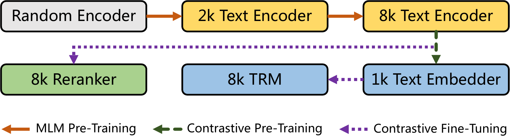
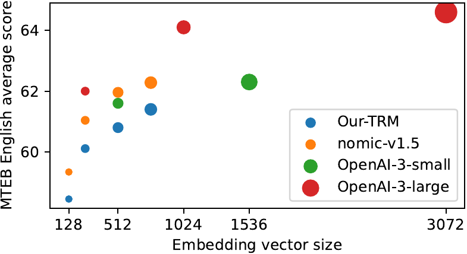
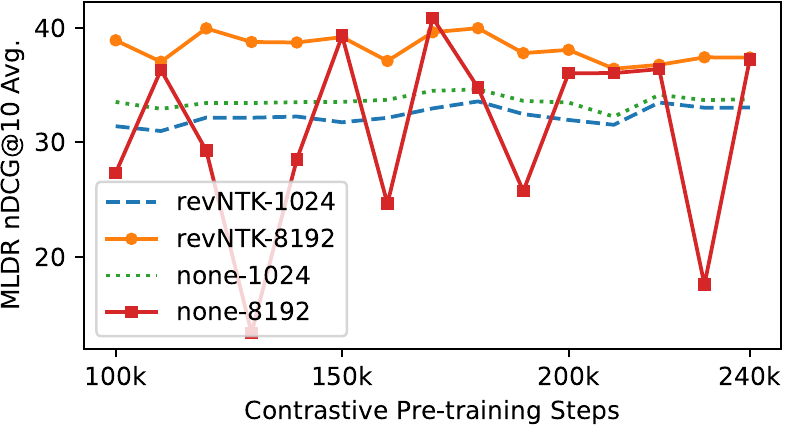

# mGTE: Multilingual Long-Context Retrieval - Zhang et al., 2024

> **arXiv:** 2407.19669v2 · **Venue:** EMNLP 2024 Industry Track · **Affiliation:** Tongyi Lab, Alibaba Group; The Hong Kong Polytechnic University

## TL;DR

mGTE is a from-scratch multilingual BERT-style encoder with native 8,192-token context, RoPE, GLU feed-forward blocks, and an unpadding path for efficient long-document processing. The authors turn it into two distinct retrieval systems: a 304M-parameter first-stage text representation model (TRM) that emits Matryoshka dense embeddings and learned sparse token weights, and a separate cross-encoder reranker. The hybrid TRM is strongest on long documents, reaching 71.3 MLDR nDCG@10 versus 64.8 for the much larger BGE-M3 hybrid in the authors' evaluation, while the reranker reaches 78.7 on the same benchmark.

The important architectural boundary is easy to miss: mGTE does **not** have a ColBERT-style multi-vector head. “Hybrid” means dense plus sparse first-stage retrieval; reranking is a second-stage joint query-document model, not a third representation emitted by the TRM.

## Problem & motivation

Retrieval systems commonly split work between a cheap retriever and a more accurate reranker. A retriever must encode a large corpus ahead of time and search it cheaply, which favors one dense vector per document or a sparse inverted index. A reranker only sees a small candidate set, so it can jointly encode each query-document pair and spend more computation on fine-grained interaction.

Before mGTE, multilingual encoder deployments faced three coupled limitations:

- XLM-R-class encoders usually accepted only 512 tokens. Truncation can discard the evidence that distinguishes long articles, books, reports, and multilingual documents.
- Extending an existing encoder's learned absolute position table does not create a model natively trained to use long context. BGE-M3 did extend XLM-R-large to 8,192 tokens, but its 568M-parameter backbone and three retrieval outputs impose substantial encoding and indexing cost.
- Dense retrieval, sparse exact-match evidence, and cross-encoder reranking were often supplied by unrelated models. Their tokenizers, context limits, multilingual coverage, and serving characteristics could differ.

mGTE asks whether a compact multilingual encoder can be trained from scratch for 8K inputs, then reused across first-stage hybrid retrieval and second-stage reranking. The design targets both quality and operational efficiency: RoPE supports staged context extension, unpadding avoids work on padding tokens, one TRM forward pass produces dense and sparse representations, and the reranker reuses the same pretrained encoder architecture.

The paper's strongest evidence is concentrated in long-context evaluation. On MLDR, the 304M TRM scores 56.6 with dense retrieval, 71.0 with sparse retrieval, and 71.3 after fusion; the reranker reaches 78.7 when evaluated over dense-retrieved candidates (Tables 4-5). On ordinary multilingual retrieval, however, BGE-M3 remains stronger on MIRACL and MKQA. mGTE is therefore best read as a long-context efficiency result, not as uniform dominance across languages and tasks.

## Key idea

For a tokenized text $x=(x_0,\ldots,x_{L-1})$, the shared bidirectional encoder produces

$$
H_x=\operatorname{Encoder}_\theta(x)\in\mathbb{R}^{L\times H},
\qquad H=768.
$$

The TRM reads the same states in two ways. Its dense representation is the `[CLS]` state,

$$
e_x=H_x[0],
\qquad
s_{\mathrm{dense}}(q,d)=
\frac{e_q^\top e_d}{\lVert e_q\rVert_2\lVert e_d\rVert_2},
$$

where $q$ is a query and $d$ is a document. Its sparse head assigns each input token position a nonnegative contextual weight,

$$
w_{x,i}=\operatorname{ReLU}(W_s^\top H_x[i]),
\qquad W_s\in\mathbb{R}^{H\times1}.
$$

Repeated vocabulary tokens are collapsed by maximum weight. If $w_x^t=\max_{i:x_i=t}w_{x,i}$, the sparse score is

$$
s_{\mathrm{sparse}}(q,d)
=\sum_{t\in q\cap d}w_q^t w_d^t.
$$

At retrieval time the paper combines the two candidate scores as

$$
s_{\mathrm{hybrid}}(q,d)
=s_{\mathrm{dense}}(q,d)+\gamma s_{\mathrm{sparse}}(q,d),
\qquad \gamma\in[0.001,0.01],
$$

with the dense coefficient fixed at 1 and the sparse coefficient selected in the reported range (Appendix E). A document absent from either retrieval result receives zero from that component. This coefficient range is an evaluation recipe, not a learned universal calibration.

The separate reranker concatenates the pair and predicts one scalar:

$$
x_{q,d}=[\mathrm{CLS}]\;q\;[\mathrm{SEP}]\;d,
\qquad
s_{\mathrm{rerank}}(q,d)=W_r^\top H_{q,d}[0],
\qquad W_r\in\mathbb{R}^{H\times1}.
$$

This gives mGTE a conventional two-stage serving path: dense and sparse indexes generate candidates, then the cross-encoder jointly reads the top 100 candidates. The TRM and reranker share an encoder design and initialization lineage, but they are separate checkpoints with different inputs and costs.

## How it works

### 1. Native 8K multilingual encoder

The authors train the backbone from random initialization with the XLM-R vocabulary rather than extending a pretrained XLM-R checkpoint. The base architecture is:

| Property | Paper / released configuration | Consequence |
| --- | ---: | --- |
| Parameters | 304M in Appendix Table 8; often rounded to 305M | Smaller than XLM-R-large/BGE-M3 |
| Transformer layers | 12 | BERT-base depth |
| Hidden width | 768 | Dense embedding width |
| Attention heads | 12 | 64 dimensions per head |
| FFN inner width | 3,072 | GLU replaces the standard BERT FFN |
| Vocabulary | 250,048 in released configs | XLM-R-derived multilingual tokenizer |
| Maximum positions | 8,192 | Native long-context target |
| Position encoding | RoPE | Relative phase in queries and keys |
| Hidden / attention dropout | 0.1 / 0.0 | Attention dropout removed for optimized kernels |
| Released RoPE config | $\theta=20{,}000$, NTK factor 8 | Recovers the 8K operating window after CPT scaling |
| QKV implementation | packed | Throughput-oriented released implementation |

RoPE rotates pairs of query and key coordinates by a position-dependent angle. For position $m$ and frequency $\omega_j=\theta^{-2j/d_h}$,

$$
\begin{aligned}
\widetilde q_{m,2j:2j+2}&=R(m\omega_j)q_{m,2j:2j+2},\\
\widetilde k_{m,2j:2j+2}&=R(m\omega_j)k_{m,2j:2j+2},\\
R(\phi)&=
\begin{bmatrix}
\cos\phi&-\sin\phi\\
\sin\phi&\cos\phi
\end{bmatrix}.
\end{aligned}
$$

Here $d_h=64$ is the attention-head width and $\theta$ is the RoPE base. The resulting attention dot product depends on relative displacement while retaining direction, which the authors argue is useful for bidirectional encoders.

The paper describes the feed-forward replacement as a gated linear unit. In implementation terms, the exact projection layout should be taken from the released custom modeling code; the paper does not give a complete GLU equation or name a gated activation variant. It also pads the token-embedding table to a multiple of 64 and removes attention-score dropout so memory-efficient attention kernels can be used.

### 2. End-to-end unpadding

Padding every item to the longest sequence in a batch wastes attention and MLP computation. mGTE removes padding tokens before the Transformer, records sequence boundaries, and sends the packed variable-length representation through xFormers memory-efficient attention. It also unpads MLM labels so the output classifier is evaluated only at masked positions rather than over every unmasked or padded token.

If sequence lengths are $\ell_1,\ldots,\ell_B$ and padded length is $L_{\max}$, ordinary attention materializes work proportional to $B L_{\max}^2$. Variable-length attention instead performs work closer to

$$
\sum_{b=1}^{B}\ell_b^2,
$$

although the exact kernel cost and memory behavior depend on hardware and implementation. Unpadding helps most when naturally occurring lengths vary substantially, as in the paper's efficiency experiment.

### 3. From encoder to retriever and reranker



The diagram emphasizes that the reranker starts from the 8K MLM encoder, not from the final TRM, and that its pairwise forward passes occur only after recall. It also separates mGTE's two first-stage representations from BGE-M3's additional multi-vector/MaxSim representation.



*Figure 1 from arXiv v2. “1K Text Embedder” describes the maximum document length used during contrastive pretraining, not the final model's inference limit.*

### 4. Dense Matryoshka embeddings

The `[CLS]` embedding has width 768, but Matryoshka Representation Learning (MRL-E) trains useful prefixes at every multiple of 32:

$$
D=\{32,64,96,\ldots,768\},
\qquad
e_x^{(d)}=e_x[0:d].
$$

Each prefix is normalized and receives its own dense InfoNCE loss. At serving time, an application can retain a shorter prefix to reduce vector-index memory and dot-product cost without training another model. Prefixes must be taken from the start of the feature dimension; arbitrary feature selection is not the trained operation.

![Figure 2: the paper's model heads. The TRM emits a `[CLS]` Matryoshka embedding and one scalar weight per token, whereas the reranker jointly consumes query and document and emits one pair score.](_assets/retrieval_2024_mgte/figure2-trm-reranker.png)

*Figure 2 from arXiv v2. There is no projected token-vector/MaxSim output: the circles marked $w$ are sparse scalar weights.*

The dimensionality curve shows the expected storage-quality trade-off. On the paper's MTEB English aggregate, the plotted mGTE points rise from roughly 58.5 at 128 dimensions to roughly 61.4 at 768 dimensions; exact intermediate values are not tabulated, so the plot should be read as a trend rather than a source of precise benchmark claims.



*Figure 4 from arXiv v2. Bubble area encodes model size; comparisons with commercial APIs do not control model scale or training data.*

### 5. Learned sparse retrieval

The sparse head is lexical rather than generative: it can assign a context-dependent importance to a token that occurs in the input, but it does not expand the document to absent vocabulary terms. A practical index stores token IDs and their maximum weights in postings. Query-time scoring multiplies weights only where query and document token IDs overlap.

This head is especially effective on long documents. In MLDR, sparse-only retrieval reaches 71.0 nDCG@10, far above the dense head's 56.6 (Appendix Table 18). Across the five aggregate benchmarks in Table 4, however, sparse-only averages 57.2; **57.2 is not the MLDR score**. Sparse retrieval performs poorly on cross-lingual MKQA, where exact token overlap is naturally limited (31.6 Recall@20 versus 65.8 for dense retrieval).

### 6. Hybrid candidate generation

Dense and sparse retrieval run independently. Their result sets are unioned, a missing component contributes zero, and calibrated scores are added. The paper fixes the dense coefficient at 1 and searches sparse coefficients from 0.001 through 0.01, but does not specify one globally selected value or a per-dataset table. Reproduction therefore requires a held-out calibration procedure rather than treating 0.001 or 0.01 as a universal default.

### 7. Cross-encoder reranking

The reranker receives `[CLS] query [SEP] document`, computes full bidirectional attention across the concatenated pair, and maps the final `[CLS]` state to one relevance logit. This permits token-level query-document interaction throughout all 12 layers, but corpus embeddings cannot be precomputed. The paper reranks 100 recalled documents per query.

The reranker is initialized from the 8K MLM encoder and fine-tuned directly; the authors report that a separate reranker contrastive-pretraining stage did not help. Its 8,192-token limit applies to the combined serialized pair, so query, separators, and document compete for the same context budget.

### 8. Reversed NTK scaling during contrastive pretraining

The MLM curriculum ends with RoPE base 160,000 at length 8,192. Contrastive pretraining would be expensive at that length and only truncates documents to 1,024 tokens, so mGTE reduces the base eightfold to 20,000. At inference, NTK scaling with factor 8 recovers an 8,192-token operating window; this is reflected in the released configuration.

The ablation compares this `revNTK` path with leaving RoPE unchanged. The reversed-NTK model is slightly weaker at the 1,024-token evaluation length but much more stable at 8,192 tokens across checkpoints. The unscaled 8K curve repeatedly collapses, so the result supports stability rather than a large peak-score gain.



*Figure 5 from arXiv v2. The caption contains a `revNTK-8912` typo; the method and surrounding text consistently describe 8,192 tokens.*

### 9. Released inference surface

The released embedder and reranker use custom Transformers classes (`model_type: "new"` and `auto_map` entries), so direct `AutoModel` loading requires reviewing and enabling remote repository code. The embedder model card also documents a Sentence Transformers path. Production use should pin the model revision and record tokenizer version, input truncation, normalization, selected Matryoshka width, and sparse-fusion coefficient.

The released embedder configuration sets `unpad_inputs: false` and `use_memory_efficient_attention: false` by default even though the paper's best efficiency result enables unpadding and xFormers MEA. The headline 52-second encoding time therefore describes an optimized execution mode, not necessarily out-of-the-box behavior.

## Training / data

### Objective

All retrieval objectives use InfoNCE. For query $q$, positive document $d^+$, candidate set $\{d^i\}_{i=1}^{N}$, score $s$, and temperature $\tau$,

$$
\mathcal L_s(q)
=-\log
\frac{\exp(s(q,d^+)/\tau)}
{\sum_{i=1}^{N}\exp(s(q,d^i)/\tau)}.
$$

Contrastive pretraining applies this to the full dense embedding with $\tau=0.01$. Supervised TRM fine-tuning jointly optimizes every dense prefix and the sparse head:

$$
\mathcal L_{\mathrm{TRM}}
=\lambda\mathcal L_{\mathrm{sparse}}
+\sum_{d\in D}w_d\mathcal L_{\mathrm{dense}}^{(d)},
\qquad D=\{32,64,\ldots,768\}.
$$

Here $\lambda$ weights sparse training and $w_d$ weights the loss for prefix dimension $d$. The dense-prefix temperature is 0.05 and sparse temperature is 0.01. The paper **does not report numerical values for $\lambda$ or $w_d$**, so this objective cannot be reconstructed exactly from the article alone.

The reranker uses the same InfoNCE form with $s=s_{\mathrm{rerank}}$. Its candidate set contains the positive, six mined hard negatives, and four random negatives.

### Stage 1: MLM at 2,048 tokens

The pretraining corpus contains 1.028 trillion XLM-R tokens in 4.47 TiB of Arrow files, covering 75 languages when simplified and traditional Chinese are counted together. Sources are C4, SkyPile 2021-2023, non-English mC4, CulturaX, Wikipedia, and proprietary books. The proprietary component and filtering pipeline prevent exact data reconstruction.

To reduce high-resource-language dominance, language $i$ is sampled with

$$
p_i=\frac{n_i}{\sum_j n_j},
\qquad
q_i=\frac{p_i^\alpha}{\sum_j p_j^\alpha},
\qquad \alpha=0.5,
$$

where $n_i$ is the number of texts in language $i$. The square-root-like smoothing upweights low-resource languages relative to proportional sampling.

The first stage uses 30% MLM masking, maximum length 2,048, global batch 8,192, RoPE base 10,000, and 250,000 steps (about 0.6 sampled epoch). It runs for 10.75 days on 32 A100 80GB GPUs with BF16 automatic mixed precision.

### Stage 2: MLM continuation at 8,192 tokens

The second stage down-samples texts shorter than 2,048 tokens, raises maximum length to 8,192 and the RoPE base to 160,000, lowers the global batch to 2,048, and continues for 30,000 steps. It takes 20.5 hours on the same 32 A100 80GB GPUs.

Both MLM stages use AdamW with decoupled weight decay $10^{-5}$, linear decay, $\beta_1=0.9$, $\beta_2=0.98$, $\epsilon=10^{-6}$, no gradient clipping, and warmup ratio 0.06. Peak learning rates are $5\times10^{-4}$ for MLM-2048 and $5\times10^{-5}$ for MLM-8192 (Appendix Table 8).

### Stage 3: dense contrastive pretraining

The weakly supervised pool contains 2.9388 billion raw pairs after deduplication and quality filtering: English and Chinese question-answer/title-content data, multilingual CC-News pairs, xP3x cross-lingual instructions, and NLLB translation pairs. Sampling with the same language/source distribution produces 3.93 billion seen pairs over 240,000 steps, about 0.4 sampled epoch.

Each batch comes from one source and contains 16,384 pairs. Queries are truncated to 512 tokens and documents to 1,024. Every other document in the batch acts as a negative; no mined hard negatives are used at this stage. Training uses FP16, DeepSpeed ZeRO stage 1, AdamW, linear decay, warmup 0.05, $\beta_1=0.9$, $\beta_2=0.999$, $\epsilon=10^{-7}$, and gradient clipping 1.0. The run takes 154 hours on 16 A100 80GB GPUs.

There is a source inconsistency in the learning rate. Section 2.2 states $5\times10^{-4}$, while the detailed Appendix B.3 recipe states $2\times10^{-4}$. The appendix value is more specific but the paper provides no correction; a reproduction should test both or inspect released training configuration rather than silently choosing one.

### Stage 4: supervised TRM fine-tuning

Fine-tuning uses only public datasets: 1.4M English examples (including MS MARCO, NQ, TriviaQA, HotpotQA, SQuAD, FEVER, and AllNLI), 2.0M Chinese examples (including DuReader, mMARCO-zh, T2-Ranking, CMedQAv2, SimCLUE, and Multi-CPR), and 118.9K multilingual examples from MIRACL, Mr.TyDi, and MLDR. The CPT model mines eight hard negatives for each positive.

Examples are grouped by sequence length. Each logical batch is divided into sub-batches, encoded sequentially with gradient checkpointing, and gathered before the contrastive loss:

| Length bucket | TRM batch / sub-batch | Reranker batch / sub-batch |
| --- | ---: | ---: |
| 0-500 | 768 / 256 | 512 / 256 |
| 500-1,000 | 384 / 128 | 384 / 128 |
| 1,000-2,000 | 256 / 64 | 256 / 64 |
| 2,000-3,000 | 160 / 48 | 160 / 48 |
| 3,000-8,000 | 80 / 16 | 80 / 16 |

TRM fine-tuning runs for 10 epochs on eight A100 80GB GPUs. The appendix says all other optimizer settings match CPT. It does not report wall-clock time, random seeds, $\lambda$, or MRL weights $w_d$.

### Stage 5: reranker fine-tuning

The reranker starts from the MLM-8192 encoder and uses the same supervised datasets. It trains in one stage with six hard and four random negatives per query, rather than the TRM's eight hard negatives. Apart from the length-dependent batch sizes above, the appendix says its training parameters match TRM fine-tuning; it does not report a reranker-specific duration.

## Results

### Encoder quality

| Benchmark / metric | XLM-R-base | mGTE-MLM-2048 | mGTE-MLM-8192 | Interpretation | Source |
| --- | ---: | ---: | ---: | --- | --- |
| XTREME-R zero-shot average | 62.02 | **65.24** | 64.44 | Both mGTE encoders beat same-sized XLM-R; the 8K continuation is not uniformly better | Table 1 |
| GLUE dev average, no WNLI | 80.44 | 83.42 | **83.47** | Better than XLM-R, below English-only RoBERTa-base at 86.4 | Table 2 |

These are fine-tuned NLU evaluations of the MLM encoders, not zero-shot embedding scores. XTREME-R uses English task fine-tuning followed by multilingual evaluation; GLUE uses task-specific fine-tuning.

### Embedding quality

| Model | English MTEB | Chinese MTEB | French MTEB | Polish MTEB | Source |
| --- | ---: | ---: | ---: | ---: | --- |
| mGTE-CPT, 512 evaluation | 60.16 | 58.67 | 59.72 | 57.66 | Table 3 / Tables 14-17 |
| mGTE-CPT, 8,192 evaluation | 60.04 | 58.63 | 59.74 | 57.11 | Table 3 / Tables 14-17 |
| mGTE-TRM dense | **61.40** | **62.72** | **59.79** | 58.22 | Table 3 / Tables 14-17 |
| BGE-M3 dense | 59.84 | 60.80 | 58.79 | **60.35** | Table 3 / Tables 14-17 |

Supervised fine-tuning helps most clearly in Chinese. The Polish result remains below BGE-M3, which the authors attribute to limited Polish contrastive pairs. CPT's 8K setting is not better than its shorter setting on these broad MTEB aggregates, so accepting long inputs should not be confused with improving short-task representation quality.

### First-stage retrieval

| Mode | Five-benchmark average | MLDR nDCG@10 | MIRACL nDCG@10 | MKQA Recall@20 | BEIR nDCG@10 | LoCo nDCG@10 | Source |
| --- | ---: | ---: | ---: | ---: | ---: | ---: | --- |
| BGE-M3 dense | 64.3 | 52.5 | **67.7** | **67.8** | 48.7 | 84.9 | Table 4 |
| BGE-M3 dense+sparse | 67.7 | 64.8 | **68.9** | **68.1** | 49.4 | 87.4 | Table 4 |
| mGTE dense | 66.7 | 56.6 | 62.1 | 65.8 | 51.1 | 88.9 | Table 4 |
| mGTE sparse | 57.2 | 71.0 | 55.9 | 31.6 | 39.2 | 88.1 | Table 4 |
| mGTE dense+sparse | **68.9** | **71.3** | 64.5 | 66.0 | **51.4** | **91.3** | Table 4 |

The pattern is task-dependent. Sparse evidence drives the MLDR result, while dense semantics are essential for cross-lingual MKQA. Fusion improves mGTE over dense alone by 14.7 points on MLDR but only 0.3 on BEIR and 0.2 on MKQA. BGE-M3 remains ahead on MIRACL and MKQA; mGTE leads on MLDR, BEIR, and LoCo in the authors' run.

There is a parameter-label inconsistency around LoCo. Table 4 groups all mGTE rows under 304M, while detailed Appendix Table 22 labels the LoCo mGTE variants as 434M despite listing 768-dimensional output. The paper does not reconcile these labels, so the 91.3 score should not be used for a size-normalized claim without checking the exact evaluated checkpoint.

### Reranking

Table 5 evaluates every reranker over candidates retrieved by the **mGTE dense** model, making the comparison internally controlled but different from the hybrid-recall pipeline described in Appendix E.

| Reranker | Parameters | MLDR nDCG@10 | MIRACL nDCG@10 | MKQA Recall@20 | BEIR nDCG@10 | Four-task average | Source |
| --- | ---: | ---: | ---: | ---: | ---: | ---: | --- |
| Jina reranker v2 multilingual | 278M | 53.2 | 65.8 | **68.8** | 49.7 | 59.4 | Table 5 |
| BGE reranker v2 M3 | 568M | 66.8 | **72.6** | 68.7 | 54.6 | 65.7 | Table 5 |
| mGTE reranker | 304M | **78.7** | 68.5 | 67.2 | **55.4** | **67.4** | Table 5 |

Again, the long-document result dominates the conclusion. mGTE gains 11.9 points over BGE's reranker on MLDR and 0.8 on BEIR, but loses 4.1 on MIRACL and 1.5 on MKQA. In the detailed end-to-end MLDR table, hybrid mGTE recall at 71.3 rises to 73.8 after reranking; this differs from Table 5's 78.7 because candidate generation differs.

### Efficiency

| Model / execution | Unpadding | Encoding time | Search latency | Source |
| --- | --- | ---: | ---: | --- |
| BGE-M3, eager attention | No | 1,800 s | 20.35 ms | Table 6 |
| BGE-M3, PyTorch SDPA-MEA | No | 744 s | n/a | Table 6 |
| mGTE, eager attention | No | 695 s | 15.07 ms | Table 6 |
| mGTE, PyTorch SDPA-MEA | No | 298 s | n/a | Table 6 |
| mGTE, PyTorch SDPA-MEA | Yes | 279 s | n/a | Table 6 |
| mGTE, xFormers MEA | Yes | **52 s** | 15.07 ms | Table 6 |

The encoding experiment uses one A100 in FP16 on 3,806 MLDR-Hindi documents, averaging 4,456 tokens after truncation to 8,192, without grouping documents by length. Search latency uses a Faiss index of 8.8M texts. The cited 14x gain compares optimized mGTE (52 s) with BGE-M3 under SDPA-MEA (744 s), not with both models using an identical xFormers-unpadding implementation. The result demonstrates a compelling complete implementation, but it does not isolate architecture, model size, unpadding, and kernel choice.

## Limitations & follow-ups

- **The training recipe is incomplete.** Sparse loss weight $\lambda$ and Matryoshka weights $w_d$ are unspecified; the main text and appendix disagree on CPT learning rate; filtering thresholds, source-mixture probabilities, seeds, and TRM wall-clock time are not fully reported.
- **Some labels conflict internally.** The base model is alternately called 304M and 305M, and the detailed LoCo table labels mGTE as 434M while the aggregate table says 304M. These appear to be rounding or checkpoint/table issues, but the paper does not resolve them.
- **Benchmark train/evaluation proximity matters.** MIRACL and MLDR training sets are part of supervised fine-tuning and their dev/test sets are headline evaluations. This is valid supervised benchmark training, but not unseen-dataset transfer.
- **Multilingual coverage is uneven.** The MLM corpus covers 75 languages, yet several have extremely little data. The authors specifically connect weak Polish MTEB performance to insufficient Polish contrastive pairs. A language count is not a quality guarantee.
- **Part of the corpus is unavailable.** MLM uses proprietary books, and the full 2.94B-pair curation/filtering pipeline is not released as a reproducible dataset snapshot.
- **The sparse head cannot bridge scripts by itself.** It only weights input token IDs and has no vocabulary expansion. Its MKQA score illustrates how exact overlap weakens in cross-lingual retrieval.
- **Hybrid retrieval needs calibration and two indexes.** Dense and sparse scores have different ranges; the paper tunes $\gamma$ in a range and does not report a universal setting. Serving requires both ANN and inverted-index infrastructure plus candidate union.
- **Long context is still quadratic.** Unpadding removes wasted padding work, not attention among real tokens. Throughput depends heavily on length distribution and kernel support.
- **The best efficiency path is not the released default.** Custom code and xFormers are required to reproduce the paper's fastest path; the checked-in model configs disable unpadding and memory-efficient attention by default.
- **Remote custom code expands the trust boundary.** Direct Transformers loading uses `auto_map`; deployments should pin and audit the repository revision before enabling `trust_remote_code`.
- **The reranker result is candidate-dependent.** Table 5 uses dense candidates, while Appendix E describes reranking hybrid recall. Scores from those protocols should not be mixed.
- **No ColBERT-style mode is available.** Compared with [BGE-M3](retrieval_2024_bge-m3.md), mGTE saves the cost of a token-vector index but cannot expose late-interaction scores when dense and lexical evidence are insufficient.

Useful follow-ups are to publish the exact loss weights and training configurations, evaluate language-balanced quality beyond the best-resourced languages, isolate unpadding from kernel and parameter-count effects, learn robust dense/sparse calibration, and compare dense-candidate versus hybrid-candidate reranking under equal latency. A later encoder such as [EuroBERT](bert-modern-encoder_2025_eurobert.md) is relevant for the multilingual long-context backbone question, while BGE-M3 remains the direct retrieval-system comparator.

## Links

- **arXiv:** [abs](https://arxiv.org/abs/2407.19669v2) · [html](https://arxiv.org/html/2407.19669v2) · [pdf](https://arxiv.org/pdf/2407.19669v2)
- **Code:** [released model implementation](https://huggingface.co/Alibaba-NLP/gte-multilingual-base/tree/main) · [NLU evaluation scripts](https://github.com/izhx/nlu-evals)
- **Hugging Face:** [gte-multilingual-base](https://huggingface.co/Alibaba-NLP/gte-multilingual-base) · [gte-multilingual-reranker-base](https://huggingface.co/Alibaba-NLP/gte-multilingual-reranker-base) · [Alibaba-NLP collection](https://huggingface.co/Alibaba-NLP)
- **Project page:** —
- **Blog posts:** —
- **Talks / videos:** —
- **OpenReview / venue page:** [ACL Anthology](https://aclanthology.org/2024.emnlp-industry.103/) · [DOI](https://doi.org/10.18653/v1/2024.emnlp-industry.103)
- **Papers-with-Code:** —
- **Related local reviews:** [BGE-M3](retrieval_2024_bge-m3.md) · [GTE](retrieval_2023_gte.md) · [Nomic Embed](retrieval_2024_nomic-embed.md) · [Jina Embeddings v3](retrieval_2024_jina-embeddings-v3.md) · [DPR](retrieval_2020_dpr.md) · [EuroBERT](bert-modern-encoder_2025_eurobert.md)
- **Context overview:** [BERT-family encoders, section 16.5](../bert/overview.md#165-hybrid-multilingual-and-context-conditioned-retrieval)
- **Licenses:** [paper: CC BY 4.0](https://arxiv.org/abs/2407.19669v2) · [released checkpoints: Apache 2.0](https://huggingface.co/Alibaba-NLP/gte-multilingual-base/blob/main/LICENSE)
- **BibTeX:**

```bibtex
@inproceedings{zhang-etal-2024-mgte,
  title     = {{mGTE}: Generalized Long-Context Text Representation and Reranking Models for Multilingual Text Retrieval},
  author    = {Zhang, Xin and Zhang, Yanzhao and Long, Dingkun and Xie, Wen and Dai, Ziqi and Tang, Jialong and Lin, Huan and Yang, Baosong and Xie, Pengjun and Huang, Fei and Zhang, Meishan and Li, Wenjie and Zhang, Min},
  booktitle = {Proceedings of the 2024 Conference on Empirical Methods in Natural Language Processing: Industry Track},
  month     = nov,
  year      = {2024},
  address   = {Miami, Florida, US},
  publisher = {Association for Computational Linguistics},
  url       = {https://aclanthology.org/2024.emnlp-industry.103/},
  doi       = {10.18653/v1/2024.emnlp-industry.103},
  pages     = {1393--1412}
}
```
