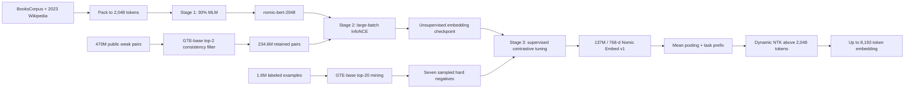
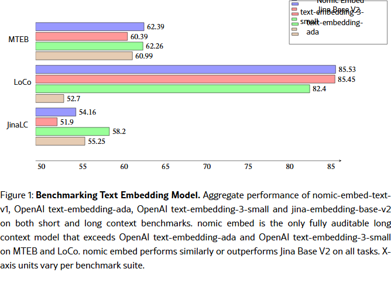

# Nomic Embed: Reproducible Long-Context Text Embeddings - Nussbaum et al., 2024

**Paper:** *Nomic Embed: Training a Reproducible Long Context Text Embedder*  
**Authors:** Zach Nussbaum, John X. Morris, Brandon Duderstadt, Andriy Mulyar  
**Affiliation:** Nomic AI; Cornell University  
**Version reviewed:** [arXiv:2402.01613v2](https://arxiv.org/abs/2402.01613v2), revised 3 February 2025  
**Venue:** OpenReview technical report (cs.CL)

## TL;DR

Nomic Embed is a 137M-parameter, 768-dimensional English bi-encoder built to make a strong long-context embedding recipe auditable end to end. Its three stages are masked-language-model pretraining of a modified BERT at 2,048 tokens, weakly supervised contrastive pretraining on 234.6M filtered public pairs, and supervised contrastive fine-tuning on 1.6M examples with seven hard negatives per pair. The project releases the code, intermediate and final weights, and curated data under permissive terms.

The important qualification is that the model is **trained at 2,048 tokens**, then evaluated up to 8,192 by Dynamic NTK scaling with factor 2. It reaches 62.4 on the paper's 56-task MTEB evaluation and 85.5 on LoCo at 8,192 tokens, but only 54.2 on the Jina Long Context aggregate at 8,191 tokens. Thus the report demonstrates useful long-context extrapolation, not uniformly dominant 8K retrieval.

## Problem & motivation

In early 2024, high-performing open embedding models such as E5, GTE, and BGE generally accepted at most 512 tokens. Models with longer advertised contexts were either closed, difficult to audit, weaker than short-context systems on MTEB, or expensive 7B-parameter decoders. This created two separate deficits:

- **Capability:** sentence-scale models truncate documents whose meaning is distributed across many paragraphs.
- **Reproducibility:** released weights often omitted the exact source mixture, filtering model, hard-negative procedure, code, or intermediate checkpoints needed to reproduce the embedding geometry.

Nomic Embed targets both deficits. It asks whether a BERT-base-scale encoder can retain ordinary short-text quality, extrapolate to 8K inputs, and expose the complete route from raw public corpora to a deployable checkpoint. The goal is not a new retrieval loss. It is a fully specified system in which architecture, data curation, optimization, evaluation, and artifacts are all inspectable.

The report also separates two meanings of “open.” Open weights permit inference and fine-tuning; reproducibility additionally requires the data and executable training recipe. Nomic releases the `contrastors` training library, the filtered contrastive corpus, the MLM and unsupervised checkpoints, the ablated checkpoint, and the final model.

## Key idea

Nomic Embed combines four established ideas into one reproducible pipeline:

1. Train an efficient long-sequence BERT from scratch with RoPE, SwiGLU, FlashAttention, no dropout, and 30% masking.
2. Convert public text relationships into positive pairs and discard noisy pairs with a documented nearest-neighbor consistency filter.
3. Contrast queries against documents in very large, task-homogeneous batches, then refine the space with labeled data and mined hard negatives.
4. Preserve task intent with required prefixes and extrapolate the trained 2,048-token RoPE geometry to 8,192 tokens at inference.

For a batch $B=\{(q_i,d_i)\}_{i=1}^{N}$, the weakly supervised stage uses unidirectional query-to-document InfoNCE:

$$
\mathcal L_{\mathrm{con}}
=-\frac{1}{N}\sum_{i=1}^{N}
\log
\frac{\exp(s(q_i,d_i)/\tau)}
{\exp(s(q_i,d_i)/\tau)+
\sum_{j\ne i}\exp(s(q_i,d_j)/\tau)},
$$

where $q_i$ is a prefixed query, $d_i$ its positive document, $s$ is cosine similarity, and $\tau$ is the contrastive temperature. Unlike GTE's enhanced objective, this loss is not made bidirectional: the document-to-query direction is absent.

Supervised fine-tuning adds $H$ explicit hard negatives $d_{i,m}^{\mathrm{hn}}$:

$$
\mathcal L_{\mathrm{sup}}
=-\frac{1}{N}\sum_{i=1}^{N}
\log
\frac{\exp(s(q_i,d_i)/\tau)}
{\exp(s(q_i,d_i)/\tau)+
\sum_{j\ne i}\exp(s(q_i,d_j)/\tau)+
\sum_{m=1}^{H}\exp(s(q_i,d_{i,m}^{\mathrm{hn}})/\tau)}.
$$

The released recipe sets $H=7$. The batch still supplies in-batch negatives, so each query must reject both other examples' positives and its own mined distractors.

## How it works

### 1. Backbone and embedding interface

`nomic-bert-2048` retains the BERT-base macro-shape but changes several internals. The released configuration specifies 12 layers, hidden width 768, 12 attention heads of width 64, a 3,072-wide SwiGLU intermediate layer, and a 30,528-token BERT-uncased vocabulary padded to a multiple of 64. It has approximately 137M parameters.

The modifications are:

| Component | Original BERT-base | Nomic backbone | Purpose |
| --- | --- | --- | --- |
| Position | Learned absolute table | RoPE on all head dimensions, base 1,000 | Relative-position structure and length scaling |
| MLP | GELU | SwiGLU | Stronger gated feed-forward block; reported faster than GeGLU in the selected kernel |
| Attention | Standard implementation | FlashAttention | Exact attention with lower memory traffic |
| Dropout | 0.1 in several paths | 0 | Simplified, throughput-oriented pretraining |
| Vocabulary | 30,522 | 30,528 | Hardware-aligned multiple of 64 |
| Sequence length | 512 | 2,048 during every training stage | Learn long-document representations before extrapolation |

Given final token states $H(x)\in\mathbb R^{n\times768}$ and attention mask $m_t$, inference uses masked mean pooling:

$$
e(x)=\frac{\sum_{t=1}^{n}m_tH_t(x)}{\sum_{t=1}^{n}m_t},
\qquad
\hat e(x)=\frac{e(x)}{\lVert e(x)\rVert_2}.
$$

The output is one 768-dimensional vector. The paper L2-normalizes embeddings for retrieval, clustering, pair classification, reranking, STS, and summarization evaluation, but reports better MTEB classification performance without normalization.

### 2. Task prefixes are part of the interface

The model uses prefixes to disambiguate different meanings of similarity:

| Prefix | Use |
| --- | --- |
| `search_query:` | Short information need or question |
| `search_document:` | Candidate passage or document |
| `classification:` | Both sides of classification, pair-classification, STS, and summarization-style tasks |
| `clustering:` | Both sides of symmetric grouping tasks |

Without this conditioning, a question such as “What is the capital of France?” receives incompatible signals: semantic similarity favors a paraphrased question, while retrieval favors a passage containing “Paris.” Omitting or changing a prefix is therefore an interface violation, not cosmetic prompt variation.

### 3. Consistency filtering

The authors initially collect approximately 470M weak pairs across 29 public datasets. For each source independently:

1. Sample one million examples.
2. Encode queries and documents with `gte-base`.
3. For every query, retrieve the top two documents by cosine similarity.
4. Keep the original pair only if its paired document appears in those top two.

This top-$k$ rule retains 234,553,344 pairs, roughly half of the initial pool. The authors reject a fixed cosine threshold because manual inspection showed that valid asymmetric retrieval pairs can have low absolute similarity. They also replace the smaller `all-MiniLM-L6-v2` filter used by prior work because it discarded too many true retrieval positives with little lexical overlap.

The filter is reproducible but not neutral. It transfers `gte-base`'s notion of relevance into the retained corpus, potentially removing relations that GTE does not already recognize.

### 4. Long-context pair construction

Most public contrastive datasets contain short sequences. The recipe deliberately adds Wikipedia title-to-body pairs and S2ORC abstract-to-full-paper pairs so that the contrastive stages see examples extending toward 2,048 tokens. This matters because positional support alone cannot teach mean pooling to preserve evidence spread through a document.

### 5. Hard-negative mining

For MS MARCO, Natural Questions, HotpotQA, and FEVER, `gte-base` retrieves the top 20 corpus documents for each query after excluding the labeled positive. Fine-tuning randomly selects seven from this pool per pair. Random selection is important: always selecting the highest-ranked negatives introduced more false negatives. For non-retrieval tasks, random corpus negatives performed as well as or better than mined negatives.

### 6. Length extrapolation

All three stages use maximum length $L=2{,}048$. At inference, the model modifies the RoPE base for a current sequence longer than $L$. Let $L'$ be the target length, $s=L'/L$, $D$ the attention-head dimension, $b=1{,}000$ the trained RoPE base, and $\alpha=2$. Dynamic NTK scaling uses

$$
b'=b\left((\alpha s)-(\alpha-1)\right)^{D/(D-2)}.
$$

For lengths at or below $L$, the original geometry is retained. Above $L$, the effective base changes progressively rather than applying one abrupt rescaling. The released configuration exposes this as dynamic RoPE with factor 2 and a declared maximum of 8,192 positions.

This is extrapolation, not 8K training. The long-context result therefore tests whether the 2K-trained attention and pooling behavior survive a changed frequency schedule.

### End-to-end flow





*Figure 1 from the report. It summarizes the central trade-off: Nomic matches or exceeds the named compact baselines on MTEB and LoCo, while the Jina Long Context aggregate remains lower than the OpenAI baselines. The benchmark axes use different metrics, so bars should only be compared within each row.*

### Inference sketch

```python
import torch
import torch.nn.functional as F
from transformers import AutoModel, AutoTokenizer

tokenizer = AutoTokenizer.from_pretrained(
    "bert-base-uncased", model_max_length=8192
)
model = AutoModel.from_pretrained(
    "nomic-ai/nomic-embed-text-v1",
    rope_parameters={"rope_theta": 1000.0, "rope_type": "dynamic", "factor": 2.0},
)

texts = [
    "search_query: What is Dynamic NTK scaling?",
    "search_document: Dynamic NTK scaling changes the RoPE base as context grows.",
]
batch = tokenizer(texts, padding=True, truncation=True, return_tensors="pt")
with torch.no_grad():
    states = model(**batch).last_hidden_state

mask = batch["attention_mask"].unsqueeze(-1)
embeddings = (states * mask).sum(dim=1) / mask.sum(dim=1)
embeddings = F.normalize(embeddings, p=2, dim=1)
similarity = embeddings @ embeddings.T
```

The original model card historically required `trust_remote_code=True`; current Transformers releases can load the text architecture natively. Pin the model revision and library version when reproducing older results.

## Training / data

### Stage 1: masked-language-model pretraining

BooksCorpus and a 2023 English Wikipedia dump are tokenized with the BERT-base-uncased tokenizer and packed across document boundaries into 2,048-token chunks. Long documents are split; short documents are followed by additional documents until the chunk is full. The objective masks 30% of tokens and omits next-sentence prediction.

| Setting | Value |
| --- | --- |
| Maximum sequence length | 2,048 |
| Global batch | 4,096 sequences |
| Gradient accumulation | 8 steps |
| Optimizer | AdamW, $\beta_1=0.9$, $\beta_2=0.98$ |
| Peak learning rate | $5\times10^{-4}$ |
| Schedule | 6% linear warmup, then linear decay to zero |
| Weight decay | $10^{-5}$ |
| Gradient clipping | Disabled |
| Precision / sharding | bfloat16, FP32 accumulation, DeepSpeed ZeRO stage 2 |
| Wall time | Roughly 4 days on one 8×H100 node |

### Stage 2: weakly supervised contrastive pretraining

The filtered corpus spans retrieval, QA, duplicate detection, summarization, scientific relations, reviews, news, code search, and classification-like pairs. The largest retained sources in Appendix B are:

| Dataset | Retained pairs | Share |
| --- | ---: | ---: |
| Reddit | 64,978,944 | 28% |
| PAQ | 52,953,088 | 23% |
| Amazon Reviews | 38,682,624 | 16% |
| S2ORC title-abstract | 35,438,592 | 15% |
| WikiAnswers | 9,912,320 | 4% |
| S2ORC citation titles | 7,585,792 | 3% |
| S2ORC abstract-citation | 7,503,872 | 3% |
| S2ORC abstract-body | 6,389,760 | 3% |
| Wikipedia title-body | 6,078,464 | 3% |
| Remaining 20 sources | 5,130,496 | about 2% |
| **Total** | **234,553,344** | **100%** |

Each batch contains examples from one source, preventing easy dataset-identity shortcuts from dominating cross-source negatives. Training runs for one epoch at length 2,048. GradCache makes the very large effective batch possible without retaining every activation simultaneously.

| Setting | Value |
| --- | --- |
| Global batch | 16,384 pairs |
| Optimizer | AdamW, $\beta_1=0.9$, $\beta_2=0.999$ |
| Learning rate | $2\times10^{-4}$ |
| Schedule | 700-step warmup, inverse-square-root decay |
| Weight decay | 0.01 |
| Gradient clipping | 1.0 |
| Epochs | 1 |
| Memory methods | GradCache and mixed precision |
| Wall time | Roughly 3.5 days on one 8×H100 node |

### Stage 3: supervised contrastive fine-tuning

The final 1,692,672 examples are drawn from MS MARCO (484,864), NLI (275,200), Reddit (199,680), MEDI SuperNLI (177,408), HotpotQA (169,728), FEVER (139,776), MEDI StackExchange (100,352), Natural Questions (69,888), MEDI Flickr (50,944), and MEDI Wiki (24,832). The report rounds this mixture to 1.6M in prose.

| Setting | Value |
| --- | --- |
| Batch | 256 positive pairs |
| Explicit negatives | 7 per pair, sampled from mined top 20 for retrieval tasks |
| Optimizer | AdamW, $\beta_1=0.9$, $\beta_2=0.999$ |
| Learning rate | $2\times10^{-5}$ |
| Schedule | 400-step warmup, linear decay to zero |
| Weight decay | 0.01 |
| Gradient clipping | 1.0 |
| Epochs | 1; additional epochs hurt validation performance |
| Wall time | Roughly 1 hour on one 8×H100 node |

The full pipeline is reported to complete within one week on one eight-H100 node: about four days for MLM, 3.5 days for contrastive pretraining, and one hour for fine-tuning.

## Results

### Short-context MTEB

The paper evaluates the legacy 56-task English MTEB suite at a 512-token truncation limit. Prefixes follow task type; classification alone uses unnormalized vectors.

| Model | Params | Classification | Clustering | Retrieval | STS | Average | Source |
| --- | ---: | ---: | ---: | ---: | ---: | ---: | --- |
| Nomic Embed v1 | 137M | 74.1 | 43.9 | 52.8 | 82.1 | **62.4** | Table 4 |
| Nomic Embed v1 ablated | 137M | 73.6 | 43.7 | 51.4 | 80.2 | 61.4 | Table 4 |
| Jina Embeddings v2 base | 137M | 73.5 | 41.7 | 47.9 | 80.7 | 60.4 | Table 4 |
| E5-base-v2 | 110M | 75.2 | 44.2 | 50.6 | 82.1 | 61.6 | Table 4 |
| GTE-base | 110M | 73.0 | 46.2 | 51.1 | 82.3 | 62.4 | Table 4 |
| BGE-base | 110M | 75.5 | 45.8 | 53.3 | 82.4 | **63.6** | Table 4 |
| `text-embedding-3-small` | undisclosed | 73.2 | 46.7 | 51.1 | 81.6 | 62.3 | Table 4 |

Nomic is strongest among the compared 137M long-context open models and narrowly exceeds `text-embedding-3-small` on this protocol, but it does not beat BGE-base. The ablated model excludes FEVER, HotpotQA, and MEDI to reduce overlap with benchmark training sets. Its 1.0-point average drop shows that part of the full checkpoint's score depends on supervised data with MTEB/BEIR relationships.

### Long-context aggregates

| Benchmark / length | Nomic v1 | Nomic ablated | Jina v2 base | OpenAI 3-small | Metric and source |
| --- | ---: | ---: | ---: | ---: | --- |
| Jina Long Context, 128 | 48.5 | 47.6 | 44.0 | 50.2 | Four-task aggregate, Table 5 |
| Jina Long Context, 512 | 52.1 | 50.7 | 47.3 | 54.5 | Four-task aggregate, Table 5 |
| Jina Long Context, 8,191 | 54.2 | 53.5 | 51.9 | 58.3 | Four-task aggregate, Table 5 |
| LoCo, 2,048 | 85.3 | 85.4 | 83.0 | n/a | Five retrieval tasks, Table 6 |
| LoCo, 4,096 | 85.6 | 86.7 | n/a | n/a | Five retrieval tasks, Table 6 |
| LoCo, 8,192 | 85.5 | **86.9** | 85.5 | 82.4 | Five retrieval tasks, Table 6 |

The direction is benchmark-dependent. On Jina Long Context, Nomic improves as the limit rises and beats Jina v2, but remains below all three reported OpenAI systems at 8K. On LoCo, it beats `text-embedding-3-small` and `text-embedding-ada-002`; the ablated model is actually better than the full model, suggesting that FEVER/HotpotQA/MEDI tuning is not generally useful for LoCo and may trade away some long-document transfer.

The LoCo average also hides task saturation: QASPER abstract-to-article retrieval is near 100 for several models. The authors explicitly warn that this component may not discriminate long-context quality well. Conversely, WikiCities scores in the Jina suite fall with length for several models, raising questions about that task's own validity as a length test.

### Backbone sanity check

Before contrastive training, `nomic-bert-2048` averages 0.84 over the eight reported GLUE tasks, close to the 2K MosaicBERT result of 0.85 and below the cited RoBERTa-base result of 0.86 (Table 2). The comparison verifies that architecture modifications did not destroy ordinary encoder quality; it does not isolate which modification helped because corpus, sequence length, steps, and positional scheme differ.

## Limitations & follow-ups

- **8K is extrapolated.** Every training stage stops at 2,048 tokens. Dynamic NTK scaling makes 8K inference possible, but does not prove stable behavior on every evidence position or task.
- **Long-context evidence is mixed.** Nomic leads the compact open comparison on LoCo but trails the closed models on the Jina 8K aggregate. “Long context” should not be collapsed into one score.
- **Benchmark contamination is acknowledged.** The full model trains on FEVER and HotpotQA data represented in BEIR/MTEB. The ablated checkpoint is the cleaner transfer comparison, though it also removes MEDI and therefore changes more than one variable.
- **Teacher bias enters twice.** `gte-base` determines which weak pairs survive and which retrieval negatives appear difficult. The released pipeline is auditable, but its corpus inherits another model's semantic blind spots.
- **English and uncased only.** The BERT-uncased vocabulary and English data limit multilingual use and preserve the 30K WordPiece tokenizer's fertility issues.
- **One-vector pooling remains a bottleneck.** Mean pooling compresses up to 8,192 tokens into 768 values. The report does not measure exact entity, number, or evidence-position retention.
- **No component-level architecture ablation.** RoPE, SwiGLU, zero dropout, FlashAttention, masking rate, and corpus all change together. The study validates the complete recipe rather than assigning causal gains to each choice.
- **The comparison protocol is historical.** MTEB versions, model APIs, and closed baselines have changed since the report. Reproduce the paper protocol before comparing its numbers with a current leaderboard.

The immediate successor, `nomic-embed-text-v1.5`, adds Matryoshka Representation Learning so prefixes of the 768-dimensional vector remain useful at 512, 256, 128, and 64 dimensions. Nomic Embed v2 moves in a different direction: multilingual training with sparse mixture-of-experts layers and a 512-token context. Neither makes v2 a direct long-context replacement for v1.

## Links

- **arXiv:** [abs](https://arxiv.org/abs/2402.01613v2) · [html](https://arxiv.org/html/2402.01613v2) · [pdf](https://arxiv.org/pdf/2402.01613v2)
- **Code:** [nomic-ai/contrastors](https://github.com/nomic-ai/contrastors)
- **Hugging Face:** [Nomic Embed v1](https://huggingface.co/nomic-ai/nomic-embed-text-v1) · [ablated](https://huggingface.co/nomic-ai/nomic-embed-text-v1-ablated) · [unsupervised](https://huggingface.co/nomic-ai/nomic-embed-text-v1-unsupervised) · [nomic-bert-2048](https://huggingface.co/nomic-ai/nomic-bert-2048) · [model collection](https://huggingface.co/collections/nomic-ai/nomic-embed)
- **Data:** [access instructions](https://github.com/nomic-ai/contrastors#data-access) · [5M-pair Atlas visualization](https://atlas.nomic.ai/map/nomic-text-embed-v1-5m-sample)
- **Project page:** [Nomic](https://www.nomic.ai/)
- **Blog posts:** [Nomic Embed v1.5 / Matryoshka](https://blog.nomic.ai/posts/nomic-embed-matryoshka)
- **Talks / videos:** —
- **OpenReview / venue page:** [forum](https://openreview.net/forum?id=IPmzyQSiQE)
- **Papers-with-Code:** —
- **Related local reviews:** [Sentence-BERT](retrieval_2019_sentence-bert.md) · [DPR](retrieval_2020_dpr.md) · [Contriever](retrieval_2021_contriever.md) · [E5](retrieval_2022_e5.md) · [GTE](retrieval_2023_gte.md)
- **Successor:** [Nomic Embed v2 paper](https://arxiv.org/abs/2502.07972) · [v2 model](https://huggingface.co/nomic-ai/nomic-embed-text-v2-moe)
- **Context overview:** [BERT-family encoders, §16.4](../bert/overview.md#164-from-one-vector-semantics-to-trained-retrieval-geometry)
- **BibTeX:**

```bibtex
@misc{nussbaum2024nomic,
  title         = {Nomic Embed: Training a Reproducible Long Context Text Embedder},
  author        = {Zach Nussbaum and John X. Morris and Brandon Duderstadt and Andriy Mulyar},
  year          = {2024},
  eprint        = {2402.01613},
  archivePrefix = {arXiv},
  primaryClass  = {cs.CL},
  url           = {https://arxiv.org/abs/2402.01613}
}
```