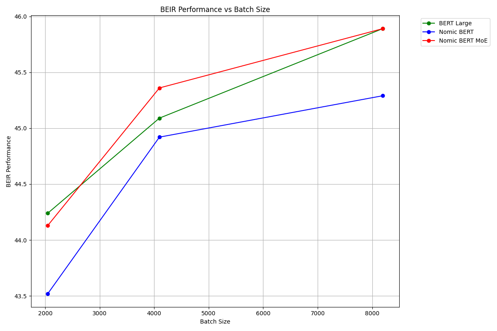
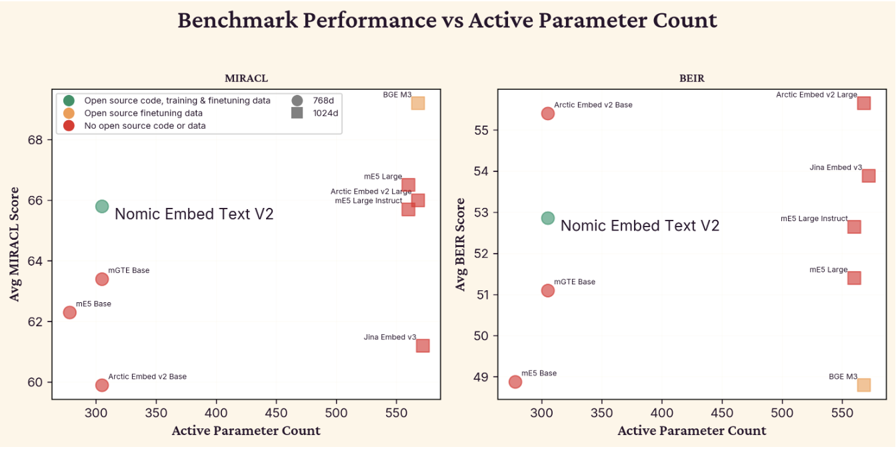
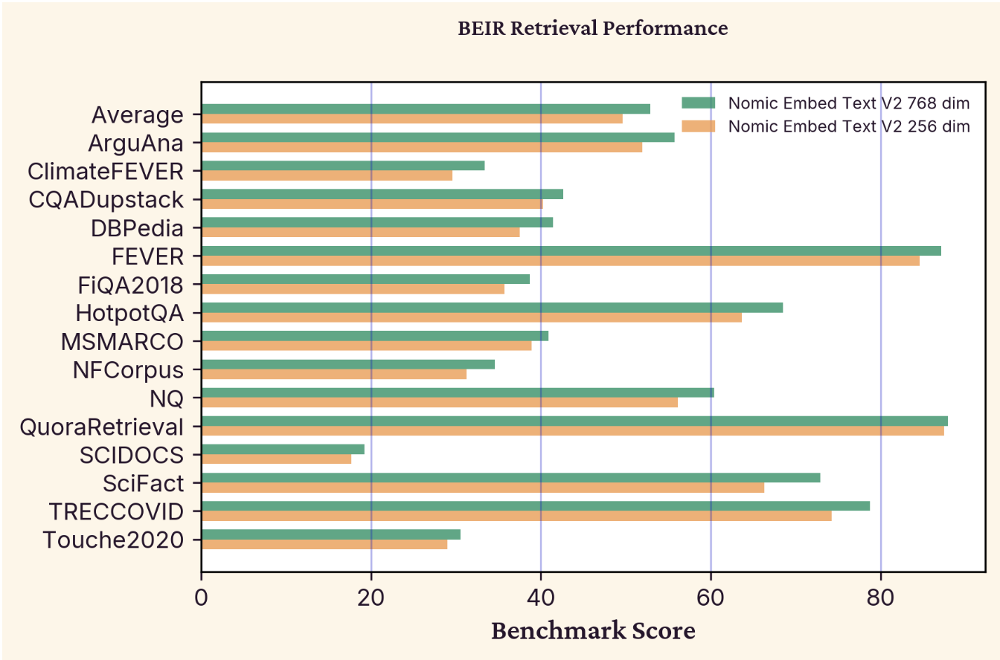

# Nomic Embed v2: Sparse MoE Text Embeddings — Nussbaum and Duderstadt, 2025

> **arXiv:** 2502.07972v3 · **Venue:** preprint · **Affiliation:** Nomic AI

## TL;DR

Nomic Embed v2 adapts sparse mixture-of-experts (MoE) layers to a multilingual text bi-encoder. It stores 475M parameters but routes each token through two of eight experts in six alternating feed-forward layers, activating about 305M parameters per forward pass; the final 768-dimensional embedding can also be truncated to a separately trained 256-dimensional Matryoshka prefix. Trained on 1.6B filtered multilingual pairs, it reaches 52.86 NDCG@10 on BEIR and 65.80 on the 16-language MIRACL average, improving over similarly active mE5-base and mGTE-base while remaining behind the best larger models on some benchmarks.

The efficiency claim needs precise boundaries. Sparse routing reduces active computation relative to the model's full capacity, but all 475M weights still exist and usually must be stored or resident; practical latency depends on MegaBlocks or another efficient sparse implementation. Unlike the 8K-capable [Nomic Embed v1](retrieval_2024_nomic-embed.md), v2's released embedding interface is limited to 512 tokens.

## Problem & motivation

General-purpose embedding models improve as their encoders, training sets, and embedding widths grow. Multilingual models face an additional “curse of multilinguality”: a fixed-capacity encoder must represent many languages, so competitive systems often move from base-size encoders near 300M parameters to dense models around 560M parameters and 1,024-dimensional outputs. That increases three separate deployment costs:

- every document and query executes all dense parameters;
- all model weights consume accelerator memory;
- every stored vector and similarity operation scales with embedding dimension.

These costs matter twice in retrieval-augmented generation: corpus ingestion encodes every document, while user-visible query latency includes another encoder pass. Sparse MoE language models increase total capacity without activating every expert for every token, but before this work that recipe had not been established for a general-purpose contrastively trained embedding model.

The paper asks whether sparse capacity can improve dense retrieval at roughly base-model active compute. Its comparison spans English retrieval on BEIR and multilingual retrieval on MIRACL. The relevant baseline gap in Table 1 is not uniform: mGTE-base (305M, 768 dimensions) scores 51.10/63.40 on BEIR/MIRACL, while larger dense models around 560M and 1,024 dimensions range from 48.80–55.65 on BEIR and 61.20–69.20 on MIRACL. A successful MoE therefore needs to improve the base-size frontier without pretending that one score dominates both benchmark families.

Nomic Embed v2 also extends the reproducibility objective of v1. The authors release the base model, unsupervised checkpoint, final model, training code, evaluation setup, and the filtered-data access path. This is consequential because competing rows in Table 1 often disclose weights but not pretraining data, fine-tuning data, or executable training code.

## Key idea

Start from XLM-RoBERTa-base, replace its absolute position table with RoPE, and continue masked-language-model training at 2,048 tokens to obtain `mNomic-BERT`. Then **upcycle every alternate feed-forward block, beginning with the second transformer layer, into an eight-expert sparse block**. Six of the 12 transformer layers become MoE layers; attention and the other six feed-forward layers remain dense.

For token state $x\in\mathbb R^h$, a learned router produces expert probabilities

$$
p_i(x)
=
\frac{\exp(w_i^\top x)}
{\sum_{j=1}^{E}\exp(w_j^\top x)},
\qquad i\in\{1,\ldots,E\},
$$

where $h=768$, $E=8$, and $w_i$ is expert $i$'s router vector. Let $T_k(x)$ be the indices of the $k$ largest probabilities. The sparse feed-forward output is conceptually

$$
\operatorname{MoE}(x)
=
\sum_{i\in T_k(x)}p_i(x)\,E_i(x),
$$

where $E_i$ is an expert MLP. The final multilingual model uses $k=2$: each token can choose a different pair of experts, so routing is token-level rather than one expert per sentence or language.

Sparse routers can collapse onto a few experts. The paper adds the auxiliary loss

$$
\mathcal L_{\mathrm{balance}}
=
\alpha\sum_{i=1}^{E}r_i p_i,
\tag{1}
$$

where $r_i$ is the fraction of batch tokens dispatched to expert $i$, $p_i$ is expert $i$'s mean router probability over the batch, and $\alpha=1$. This penalizes correlated traffic and confidence concentration. It does not force experts to specialize by language or domain, and the paper does not present an expert-specialization analysis.

The encoder mean-pools token states and L2-normalizes the result. During supervised tuning, the contrastive objective is applied to both the full vector and its first 256 coordinates:

$$
z_m(x)
=
\operatorname{normalize}\!\left(z(x)_{1:m}\right),
\qquad m\in\{256,768\}.
$$

This Matryoshka training makes the 256-dimensional prefix directly usable; arbitrary truncation of a model trained only at 768 dimensions would not provide the same guarantee. Truncation must occur **before** the final normalization.

## How it works

### Architecture

| Component | Configuration | Role |
| --- | --- | --- |
| Base encoder | XLM-RoBERTa-base / `mNomic-BERT` | 12 bidirectional transformer layers, width 768, 12 heads, multilingual SentencePiece vocabulary |
| Position scheme | RoPE, base 10,000 | Replaces XLM-R's learned absolute table during continued MLM |
| MoE placement | alternate MLPs starting at layer 2 | six MoE layers and six dense MLP layers |
| Experts | 8 per MoE layer | increase stored feed-forward capacity |
| Routing | token-choice top-2 | activate two experts per token in the final model |
| Parameters | 475M total, 305M active | total controls storage; active count approximates per-token computation |
| Pooling | attention-mask-aware mean | produce one sentence/document vector |
| Output | 768 or trained 256 prefix | L2-normalized dense embedding |
| Released maximum | 512 tokens | query and document limit in the final model card and evaluation |

The 305M figure is an **active-parameter count**, not the number of weights in the checkpoint. Attention, embeddings, dense MLPs, router parameters, and two selected experts contribute to each forward pass; the other six experts in each MoE layer are inactive for that token. Different tokens in one sequence can activate different experts, so a batch may touch much more than 305M unique stored weights even though each token's path is sparse.


### Contrastive objective

For a batch $B=\{(q_i,d_i)\}_{i=1}^{N}$, weakly supervised pretraining uses unidirectional InfoNCE:

$$
\mathcal L_C
=
-\frac{1}{N}\sum_{i=1}^{N}
\log
\frac{\exp(s(q_i,d_i)/\tau)}
{\exp(s(q_i,d_i)/\tau)+
\sum_{j\ne i}\exp(s(q_i,d_j)/\tau)},
\tag{2}
$$

where $q_i$ is a query, $d_i$ its positive document, $s$ is similarity between normalized embeddings, and $\tau=0.02$. Every other batch document is an in-batch negative. Batches contain one source dataset at a time, reducing trivial source-identification shortcuts.

Supervised tuning adds $H=10$ explicit hard negatives $d_{i,m}^{\mathrm{hn}}$:

$$
Z_i
=
\exp(s(q_i,d_i)/\tau)
+\sum_{j\ne i}\exp(s(q_i,d_j)/\tau)
+\sum_{m=1}^{H}\exp(s(q_i,d_{i,m}^{\mathrm{hn}})/\tau),
\tag{3}
$$

$$
\mathcal L_C
=
-\frac{1}{N}\sum_{i=1}^{N}
\log\frac{\exp(s(q_i,d_i)/\tau)}{Z_i}.
\tag{4}
$$

The trainable objective combines this contrastive term, the router-balancing term, and the two Matryoshka widths during the final stage. The paper gives the component definitions but does not fully spell out one scalar equation with all weighting coefficients.

### Consistency filtering

The multilingual weak corpus comes from mC4 and multilingual CC News; English examples reuse the filtered Nomic Embed v1 corpus. For each language:

1. Divide candidate pairs into shards of one million examples.
2. Encode all queries and documents with multilingual-E5-small.
3. Retrieve each query's two nearest documents.
4. Retain the source pair only when its labeled document appears in that top two.

The result is 1.6B pairs over 101 language identifiers. Top-2 filtering is stricter than the top-20 rule used by Arctic Embed 2.0 and transfers multilingual-E5-small's semantic biases into the retained mixture.

### Positive-aware hard-negative mining

Naively taking a teacher's nearest documents introduces unlabeled positives. If the teacher score of the labeled positive is $s^+$, the method accepts candidate negatives below

$$
t=s^+\rho,
\tag{5}
$$

where $\rho$ is a percentage margin, usually 0.95 or 0.98. A candidate scoring too close to or above the positive is filtered. The final training data uses already mined data from BGE-M3 and applies BGE-M3 filtering for English and multilingual examples; the controlled ablation compares Arctic Embed Large, NV-Embed v1, and Stella 1.5B teachers.

### Inference interface

The released model requires role prefixes:

| Input | Prefix / Sentence Transformers prompt |
| --- | --- |
| Retrieval query | `search_query: ` / `prompt_name="query"` |
| Indexed document | `search_document: ` / `prompt_name="passage"` |

A faithful Transformers path is:

```python
import torch
import torch.nn.functional as F
from transformers import AutoModel, AutoTokenizer

model_id = "nomic-ai/nomic-embed-text-v2-moe"
tokenizer = AutoTokenizer.from_pretrained(model_id)
model = AutoModel.from_pretrained(model_id, trust_remote_code=True).eval()

texts = [
    "search_query: What is sparse expert routing?",
    "search_document: An MoE router selects a subset of expert MLPs per token.",
]
batch = tokenizer(
    texts,
    padding=True,
    truncation=True,
    max_length=512,
    return_tensors="pt",
)

with torch.no_grad():
    states = model(**batch).last_hidden_state

mask = batch["attention_mask"].unsqueeze(-1)
embeddings = (states * mask).sum(dim=1) / mask.sum(dim=1).clamp_min(1)
embeddings = F.normalize(embeddings[:, :256], p=2, dim=1)
scores = embeddings @ embeddings.T
```

The model card recommends installing `nomic-ai/megablocks` for efficient GPU execution. `trust_remote_code=True` executes code from the model repository, so deployments should inspect and pin a model revision. Dense runtimes that lack the custom architecture or efficient sparse kernels may not realize the active-parameter compute advantage.



Figure 1 uses a monolingual ablation with eight experts and **top-1 Switch routing**, not the final multilingual model's top-2 routing. It supports the claim that sparse upcycling can improve contrastive encoders, but should not be read as a latency curve or as the final model's exact architecture.

## Training / data

### Stage 1: multilingual backbone adaptation

XLM-RoBERTa-base is adapted to long sequences by replacing absolute positions with RoPE at base 10,000. Continued MLM uses reconstructed CC100 packed into 2,048-token segments. Language sampling temperature 0.3 upweights lower-resource languages relative to raw corpus frequency.

| Setting | Value | Source |
| --- | --- | --- |
| Steps | 10,000 | Table 2 |
| Global batch | 4,096 sequences | Table 2 |
| Sequence length | 2,048 | Table 2 |
| Masking probability | 0.30 | Table 2 |
| Peak learning rate | $4\times10^{-4}$ | Table 2 |
| Warmup | 500 steps | Table 2 |
| Schedule | linear | Table 2 |
| Gradient accumulation | 8 | Table 2 |
| Maximum gradient norm | 1.0 | Table 2 |
| RoPE base | 10,000 | Table 2 |

The resulting `mNomic-BERT` has 279M parameters. It retains 2,048-token backbone capability, but the final embedding model is trained and released with a 512-token retrieval limit.

### Stage 2: 1.6B-pair corpus construction

After per-language top-2 consistency filtering, Appendix Table 10 reports 1.6B pairs across 101 language identifiers. The mixture is highly imbalanced:

| Language | Pairs | Source |
| --- | ---: | --- |
| English | 234,553,344 | Appendix Table 10 |
| Spanish | 210,010,112 | Appendix Table 10 |
| French | 172,769,280 | Appendix Table 10 |
| German | 169,426,944 | Appendix Table 10 |
| Italian | 104,251,392 | Appendix Table 10 |
| Portuguese | 87,982,080 | Appendix Table 10 |
| Chinese | 18,661,376 | Appendix Table 10 |
| Yoruba | 16,384 | Appendix Table 10 |

Thus “101 languages” describes coverage, not balanced evidence. English plus four large European languages account for a substantial fraction of all pairs, while many low-resource languages have fewer than one million examples.

### Stage 3: weakly supervised MoE pretraining

The six alternating MLPs are upcycled to eight experts with top-2 routing. Training makes one pass over all 1.6B pairs.

| Setting | Value | Source |
| --- | --- | --- |
| Global batch | 16,384 pairs | §4.3 |
| Query / document length | 32 / 256 tokens | §4.3 |
| Peak learning rate | $8\times10^{-5}$ | §4.3 |
| Warmup | 1,000 steps | §4.3 |
| Schedule | cosine decay | §4.3 |
| InfoNCE temperature | 0.02 | §4.3 |
| Balance coefficient | $\alpha=1$ | §4.3 |
| Epochs | 1 | §4.3 |
| Hardware | 16 NVIDIA H100 GPUs | §4.3 |
| Parallelism | distributed data parallel | §4.3 |
| Memory method | activation checkpointing | §4.3 |

The paper does not report wall-clock duration, H100 memory size, total GPU-hours, energy, expert-capacity factor, dropped-token rate, or end-to-end throughput.

### Stage 4: hard-negative preparation

The positive-aware mining analysis uses about 500K StackExchange title-body, SQuAD, and Natural Questions examples. Stella 1.5B with ten negatives performs best among newly mined variants, but filtering BGE-M3's released mined data is one BEIR point better. The final recipe therefore uses BGE-M3 data and filtering rather than equating teacher parameter count with mining quality.

### Stage 5: supervised Matryoshka tuning

The final mixture contains 1,029,632 examples (Appendix Table 11): MS MARCO 485,120; StackExchange 249,856; SQuAD 87,552; HotpotQA 82,432; NQ 57,856; FEVER 28,672; and smaller MIRACL training splits across 18 languages.

| Setting | Value | Source |
| --- | --- | --- |
| Batch | 256 positive pairs | §4.5 |
| Hard negatives | 10 per query | §4.5 |
| Query / document length | 512 / 512 tokens | §4.5 |
| Peak learning rate | $2\times10^{-5}$ | §4.5 |
| Warmup | 400 steps | §4.5 |
| Schedule | linear decay | §4.5 |
| Epochs | 1 | §4.5 |
| Trained dimensions | 768 and 256 | §4.5 |

Evaluation uses `search_query` and `search_document`, truncates inputs to 512 tokens, measures NDCG@10, and runs through FlagEmbedding except for imported mE5 results.

## Results

### Main English and multilingual retrieval comparison

| Model | Active params | Dim. | BEIR | MIRACL | Artifact openness | Source |
| --- | ---: | ---: | ---: | ---: | --- | --- |
| mE5 Base | 278M | 768 | 48.88 | 62.30 | no pretraining/fine-tuning data or code | Table 1 |
| mGTE Base | 305M | 768 | 51.10 | 63.40 | no pretraining/fine-tuning data or code | Table 1 |
| Arctic Embed v2 Base | 305M | 768 | **55.40** | 59.90 | weights, not training data/code | Table 1 |
| **Nomic Embed v2** | **305M** | **768** | 52.86 | **65.80** | code plus pretraining and tuning data | Table 1 |
| mE5 Large | 560M | 1,024 | 51.40 | 66.50 | no pretraining/fine-tuning data or code | Table 1 |
| BGE-M3 | 568M | 1,024 | 48.80 | **69.20** | fine-tuning data only | Table 1 |
| Arctic Embed v2 Large | 568M | 1,024 | **55.65** | 66.00 | weights, not training data/code | Table 1 |
| Jina Embed v3 | 572M | 1,024 | 53.88 | 61.20 | weights, not training data/code | Table 1 |

Table 1 labels the comparison column “Params,” but the paper and model card use Nomic's **305M active parameters** there; its checkpoint contains 475M total parameters. Dense baselines activate all listed parameters. Nomic v2 leads the compared base-size models on MIRACL and beats mE5-base/mGTE-base on BEIR, but Arctic Base is 2.54 points higher on BEIR. Among large models, BGE-M3 leads MIRACL and Arctic Large leads BEIR.



### MIRACL by language

| Model | Average (18) | Arabic | English | French | Hindi | Japanese | Russian | Chinese | Source |
| --- | ---: | ---: | ---: | ---: | ---: | ---: | ---: | ---: | --- |
| mE5 Base | 62.2 | 71.6 | 51.2 | 49.7 | 58.4 | 64.7 | 61.5 | 51.5 | Table 5 |
| mGTE Base | 63.6 | 71.4 | 54.0 | 54.5 | 51.9 | 65.8 | 63.2 | 61.8 | Table 5 |
| **Nomic Embed v2** | **66.0** | **76.7** | 54.7 | 55.8 | **60.5** | 67.0 | 65.2 | 59.5 | Table 5 |
| BGE-M3 | **69.2** | 78.5 | **56.9** | **58.2** | 59.5 | **72.8** | **70.1** | **62.6** | Table 5 |

The official 65.80 headline excludes German and Yoruba to match the 16 languages available for every baseline; Table 5 also gives Nomic a 66.0 average over all 18 MIRACL languages. Nomic does not win every language: BGE-M3 is higher overall and in most displayed columns, while Nomic is stronger on Hindi in this subset.

### Matryoshka compression

| Width | BEIR average | Relative storage | Source |
| ---: | ---: | ---: | --- |
| 768 | 52.86 | 1.0× | Appendix Table 12 |
| 256 | 49.63 | 0.33× | Appendix Table 12 |

The 256-dimensional vector cuts raw vector storage and dot-product arithmetic by three, but loses 3.23 BEIR points on average. The per-dataset loss is uneven: Quora changes only 87.95→87.49, whereas SciFact falls 72.89→66.31 and HotpotQA 68.53→63.67 (Appendix Table 12).



### MoE and routing ablations

| Upcycled layers | Batch 2,048 | Batch 4,096 | Batch 8,192 | Source |
| ---: | ---: | ---: | ---: | --- |
| 6 | 44.13 | **45.36** | **45.89** | Table 7 |
| 12 | **44.28** | 44.89 | 45.48 | Table 7 |

Converting every MLP is slightly better at the smallest batch but worse at larger batches. The selected six-layer pattern is therefore an empirical optimization choice, not evidence that more sparse capacity is always harmful.

In the multilingual controlled study (Table 9), XLM-R Large reaches 46.91 BEIR / 42.71 MIRACL at batch 8,192. Top-2 XLM-MoE reaches 45.00 / 39.81, top-1 reaches 44.11 / 39.17, and dense XLM-R Base reaches 43.96 / 37.92. Sparse routing improves the base architecture, but unlike the monolingual Figure 1 result it does not close the gap to the large dense encoder.

### Hard-negative ablation

| Teacher / filtering | Margin | Negatives | NQ | FiQA | HotpotQA | Source |
| --- | ---: | ---: | ---: | ---: | ---: | --- |
| Arctic Embed Large | none | 4 | 52.87 | 42.68 | 59.47 | Table 8 |
| Arctic Embed Large | 0.95 | 4 | 55.20 | 44.98 | 62.75 | Table 8 |
| Stella 1.5B | 0.95 | 4 | 57.22 | 45.18 | 64.06 | Table 8 |
| Stella 1.5B | 0.95 | 10 | **57.45** | 45.17 | **64.48** | Table 8 |

Positive-aware filtering is clearly useful: with the same Arctic teacher and four negatives, it adds 2.33 NQ points, 2.30 FiQA points, and 3.28 HotpotQA points. Increasing Stella negatives from four to ten gives smaller gains, indicating diminishing returns. The paper separately reports that filtered BGE-M3 mined data averages about one point above its best newly mined variant.

### Backbone preservation

Before contrastive training, mNomic-BERT averages 81.63 on the reported GLUE tasks versus 82.35 for XLM-R-base and 80.77 for mGTE-base (Table 3). On XTREME-R it scores 62.70 versus 62.31 for XLM-R-base and 64.63 for mGTE-base (Table 4). The RoPE adaptation largely preserves the base model's multilingual understanding, but does not establish a consistent gain over dense baselines.

## Limitations & follow-ups

- **Active parameters are not stored parameters.** The checkpoint has 475M weights even though about 305M participate in each token's path. Weight memory can therefore exceed a 305M dense model, and a batch may collectively touch many experts.
- **Sparse speedups are hardware- and kernel-dependent.** Routing, token permutation, expert dispatch, and communication add overhead. The paper reports active counts but no latency, throughput, memory, FLOP, or index-build measurements. MegaBlocks is recommended; unsupported CPU, edge, or generic dense runtimes may be slower than the count suggests.
- **The final context is 512 tokens.** The base is adapted at 2,048 MLM tokens, but contrastive fine-tuning and released usage cap queries and documents at 512. V2 is multilingual and sparse, not a direct long-context upgrade over Nomic Embed v1.
- **MoE benefits depend on data scale.** §7.2 reports that an initial 100M-pair multilingual MoE underperformed its dense counterpart. The successful model uses 1.6B filtered pairs, so sparse upcycling is not demonstrated as a low-data shortcut.
- **The language mixture is highly imbalanced.** Coverage spans 101 identifiers, but English has 234.6M pairs while Yoruba has 16K. MIRACL evaluates only 18 languages and cannot validate the full advertised coverage.
- **Teacher bias enters data selection.** Multilingual-E5-small decides which weak pairs survive; BGE-M3 and other dense teachers determine hard negatives. The model can inherit their blind spots and benchmark overlap.
- **Benchmark training overlap is substantial.** Final tuning uses training splits from BEIR and MIRACL, including MS MARCO, HotpotQA, NQ, FEVER, and all evaluated MIRACL languages. Results are supervised benchmark performance, not zero-shot transfer.
- **Top-2 evidence is limited.** The final model selects two experts, but Figure 1's clean monolingual comparison uses top-1 routing. Table 9 compares top-2 only at the largest batch. Routing choice is not exhaustively controlled across scales.
- **No specialization analysis.** The paper does not show whether experts organize by language, script, domain, syntax, or task, nor whether low-resource languages collapse onto high-resource expert paths.
- **Matryoshka quality loss is nonuniform.** The 256-dimensional option saves threefold vector storage but loses 3.23 average BEIR points and more than six points on SciFact.
- **Remote custom code is required.** `trust_remote_code=True` expands the supply-chain surface. Production systems should pin revisions and audit the repository implementation and MegaBlocks dependency.
- **Training cost is incompletely reported.** Pretraining uses 16 H100s, but wall time, total GPU-hours, seeds, variance, and energy are omitted. Benchmark comparisons have no confidence intervals.
- **“First general-purpose MoE embedder” is scope-dependent.** The paper distinguishes its large-scale contrastive bi-encoder from prior domain-specific MoE embeddings and concurrent generative/embedding MoE work; it is not the first use of experts anywhere in representation learning.

The paper proposes expert-count and active-parameter scaling studies, alternative and loss-free routing, and distillation from MoE back into dense encoders. Other valuable follow-ups are expert specialization diagnostics, balanced low-resource sampling, end-to-end retrieval latency on multiple hardware classes, and controlled comparisons at equal total memory as well as equal active compute.

## Links

- **arXiv:** [abs](https://arxiv.org/abs/2502.07972v3) · [html](https://arxiv.org/html/2502.07972v3) · [pdf](https://arxiv.org/pdf/2502.07972v3)
- **Code:** [nomic-ai/contrastors](https://github.com/nomic-ai/contrastors)
- **Hugging Face:** [final model](https://huggingface.co/nomic-ai/nomic-embed-text-v2-moe) · [unsupervised checkpoint](https://huggingface.co/nomic-ai/nomic-embed-text-v2-moe-unsupervised) · [mNomic-BERT / nomic-xlm-2048](https://huggingface.co/nomic-ai/nomic-xlm-2048) · [model collection](https://huggingface.co/collections/nomic-ai/nomic-embed-v2)
- **Project page:** [Nomic](https://www.nomic.ai/)
- **Blog posts:** [Nomic Embed v2](https://www.nomic.ai/blog/posts/nomic-embed-text-v2)
- **Talks / videos:** —
- **OpenReview / venue page:** —
- **Papers-with-Code:** —
- **Licenses:** [paper: CC BY 4.0](https://creativecommons.org/licenses/by/4.0/) · [code: Apache 2.0](https://github.com/nomic-ai/contrastors/blob/main/LICENSE) · [model: Apache 2.0](https://huggingface.co/nomic-ai/nomic-embed-text-v2-moe)
- **Related local reviews:** [Nomic Embed v1](retrieval_2024_nomic-embed.md) · [BGE-M3](retrieval_2024_bge-m3.md) · [mGTE](retrieval_2024_mgte.md) · [Jina Embeddings v3](retrieval_2024_jina-embeddings-v3.md) · [E5](retrieval_2022_e5.md) · [GTE](retrieval_2023_gte.md)
- **Related external work:** [Sparse Upcycling](https://arxiv.org/abs/2212.05055) · [Switch Transformers](https://arxiv.org/abs/2101.03961) · [Matryoshka Representation Learning](https://arxiv.org/abs/2205.13147) · [Arctic Embed 2.0](https://arxiv.org/abs/2412.04506)
- **Context overview:** [BERT-family encoders, hybrid and contextual embeddings](../bert/overview.md#87-hybrid-and-contextual-embeddings)
- **BibTeX:**

```bibtex
@misc{nussbaum2025trainingsparsemixtureexperts,
  title         = {Training Sparse Mixture Of Experts Text Embedding Models},
  author        = {Nussbaum, Zach and Duderstadt, Brandon},
  year          = {2025},
  eprint        = {2502.07972},
  archivePrefix = {arXiv},
  primaryClass  = {cs.CL},
  doi           = {10.48550/arXiv.2502.07972},
  url           = {https://arxiv.org/abs/2502.07972v3}
}
```