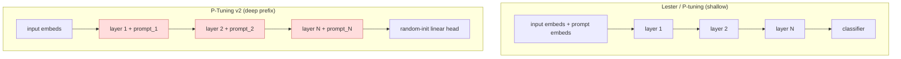

# P-Tuning v2: Prompt Tuning Can Be Comparable to Fine-tuning Universally — Liu et al., 2021

> **arXiv:** 2110.07602v3 · **Venue:** ACL 2022 (short) · **Affiliation:** Tsinghua KEG, BAAI, Shanghai Qi Zhi

## TL;DR
Shallow prompt tuning ([Lester et al.](softtoken_2021_prompt-tuning.md), P-tuning) only matches
fine-tuning **at 10B+ scale** and **fails on hard sequence-labeling** tasks (NER, extractive QA, SRL).
P-Tuning v2 fixes both by making the prompts **deep**: trainable continuous prompts are added as **prefix
tokens at every Transformer layer** (an NLU-adapted re-implementation of Deep Prompt Tuning /
[Prefix-Tuning](softtoken_2021_prefix-tuning.md)). With only **0.1%–3%** tuned parameters and the backbone
frozen, it **matches fine-tuning universally** — across 330M→10B models (BERT, RoBERTa, DeBERTa, GLM) and
across classification *and* sequence-tagging tasks — turning prompt tuning into a genuine drop-in
alternative to fine-tuning rather than a large-model-only trick.

## Problem & motivation
Prompt tuning is attractive (frozen backbone, tiny per-task storage, low training memory), but prior work
lacks **universality** on two axes:
- **Across scales:** below ~10B parameters, single-layer prompt tuning trails fine-tuning badly.
- **Across tasks:** hard **sequence labeling** (predict a label per token) is incompatible with verbalizer
  cloze prompts and performs poorly (e.g. BERT-large PT vs FT: RTE 53.5 vs 70.4; ReCoRD 44.2 vs 70.6;
  SQuAD 2.0 near chance).

Root causes of shallow prompts: (1) tunable capacity is capped by how many prompt tokens fit in the input,
and (2) input-layer prompts have only **indirect** influence on predictions.

## Key idea
Move from **shallow** to **deep** prompts. In Lester/P-tuning the trainable embeddings $[h_0,\dots,h_i]$
enter only the input sequence:

$$
[\,\mathbf{e}(x),\,h_0,\dots,h_i,\,\mathbf{e}(\text{[MASK]})\,].
$$

P-Tuning v2 instead adds independent trainable **prefix tokens to the key/value sequence of every layer**
(as in Prefix-Tuning): each layer $\ell$ gets its own prompt vectors, prepended so all real tokens can
attend to them. This (a) raises tunable capacity from ~0.01% to **0.1%–3%**, and (b) gives prompts a
**direct** path to predictions at every depth. Prompts at deeper layers (closer to output) matter most.

**Optimization / implementation details that make it "universal":**
- **Classification head, not verbalizer.** Drop the LM head + verbalizer; put a **randomly-initialized
  linear classification head** on token representations (BERT-style). Necessary for sequence labeling,
  and no worse on classification (Table 4: CLS+linear ≈ verbalizer+LM head).
- **Reparameterization is optional** — an MLP over prompts helps on some datasets (RTE, CoNLL04) but hurts
  on others (BoolQ, CoNLL12); unlike Prefix-Tuning it's not always used.
- **Prompt length is task-dependent** — simple classification prefers short (<20); hard sequence tagging
  prefers long (~100).
- **Multi-task learning is optional** — sharing prompts across a task family first can give a better init.

Sequence labeling is framed as per-token tagging (IOB2 for NER; start/end tags for extractive QA with an
unanswerable threshold; per-word roles for SRL), each with its own linear head over frozen representations.

## How it works

Only the per-layer prompt vectors (orange) and the small linear head are trained; the backbone is frozen.

## Training / data
Frozen backbones **BERT-large (335M), RoBERTa-large (355M), DeBERTa-xlarge (750M), GLM-xlarge/xxlarge
(2B/10B)** — all bidirectional NLU models. Fully-supervised (not few-shot). Tasks: **SuperGLUE** (general
NLU) plus a sequence-labeling suite — NER (**CoNLL03, OntoNotes 5.0, CoNLL04**), extractive QA (**SQuAD
1.1 / 2.0**), SRL (**CoNLL05 WSJ/Brown, CoNLL12**). Multi-task variant (MPT-2) shares prompts across a task
family with per-dataset linear heads. Reported task-specific parameter ratio: **0.1%–3%** of the backbone.

## Results
SuperGLUE dev across scales (FT = fine-tune, PT = Lester/P-tuning, PT-2 = P-Tuning v2):

| Backbone | Task | FT | PT | PT-2 | Source |
|---|---|---:|---:|---:|---|
| BERT-large 335M | RTE | 70.4 | 53.5 | **78.3** | Table 2 |
| BERT-large 335M | ReCoRD (F1) | 70.6 | 44.2 | **72.8** | Table 2 |
| RoBERTa-large 355M | RTE | 86.6 | 58.8 | **89.5** | Table 2 |
| RoBERTa-large 355M | WiC | 75.6 | 56.9 | 73.4 | Table 2 |
| GLM-xxlarge 10B | avg | ≈ | ≈ | ≈ | Table 2 |

Hard sequence labeling (micro-F1 / EM-F1); PT collapses, PT-2 ≈ FT:

| Backbone | Task | FT | PT | PT-2 | Source |
|---|---|---:|---:|---:|---|
| BERT-large | CoNLL03 NER | 92.8 | 81.9 | **90.2** | Table 3 |
| RoBERTa-large | CoNLL03 NER | 92.6 | 86.1 | **92.8** | Table 3 |
| RoBERTa-large | SQuAD 2.0 (F1) | 89.4 | 50.2 | 85.5 | Table 3 |
| DeBERTa-xlarge | OntoNotes 5.0 | 90.4 | 85.1 | **90.4** | Table 3 |
| RoBERTa-large | CoNLL05 WSJ SRL | 90.2 | 76.8 | **89.2** | Table 3 |

- **Universal parity:** PT-2 matches fine-tuning from **330M→10B** and on all task types, at **0.1%–3%**
  params; it even *beats* FT on RTE at small scale.
- **Prompt depth (Fig. 3):** for a fixed number of prompted layers, adding prompts to **deeper** layers
  (descending order, near output) beats shallow layers — e.g. RTE layers 17–24 ≈ all layers.
- **Multi-task (MPT-2)** generally helps NER/SRL further, but not QA.
- **SQuAD 2.0** is the hardest for shallow PT (unanswerable questions break single-layer optimization),
  where deep prompts recover most of the gap.

## Limitations & follow-ups
- **"Not conceptually novel"** (the authors' own framing) — it's an optimized adaptation of Deep Prompt
  Tuning / Prefix-Tuning for NLU; contribution is the empirical universality finding + recipe.
- Optimal **prompt length and reparameterization are task-specific** (Fig. 4), needing per-task tuning.
- Evaluated in the **fully-supervised** setting; few-shot behavior is out of scope (see PPT for that).
- Weight-editing alternatives ([LoRA](peft_2021_lora.md)) reach similar parity **without** consuming input
  length or adding per-layer prefixes, and merge into weights at inference.

## Links
- **arXiv:** [abs](https://arxiv.org/abs/2110.07602) · [html](https://arxiv.org/html/2110.07602v3) · [pdf](https://arxiv.org/pdf/2110.07602)
- **Code:** <https://github.com/THUDM/P-tuning-v2>
- **BibTeX:**
  ```bibtex
  @inproceedings{liu2022ptuningv2,
    title     = {P-Tuning v2: Prompt Tuning Can Be Comparable to Fine-tuning Universally Across Scales and Tasks},
    author    = {Liu, Xiao and Ji, Kaixuan and Fu, Yicheng and Tam, Weng Lam and Du, Zhengxiao and Yang, Zhilin and Tang, Jie},
    booktitle = {Proceedings of the 60th Annual Meeting of the Association for Computational Linguistics (ACL), Short Papers},
    year      = {2022},
    url       = {https://arxiv.org/abs/2110.07602}
  }
  ```
- **Related papers:** [Prefix-Tuning](softtoken_2021_prefix-tuning.md) ·
  [Prompt Tuning](softtoken_2021_prompt-tuning.md) · [LoRA](peft_2021_lora.md)
- **In-repo:** [§6.6 in mixed_decoder](../mixed_decoder/mixed_decoder.md)
