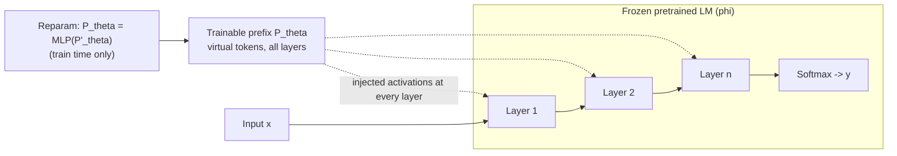

# Prefix-Tuning: Optimizing Continuous Prompts for Generation — Li & Liang, 2021

> **arXiv:** 2101.00190v1 · **Venue:** ACL 2021 · **Affiliation:** Stanford University
>
> *No arXiv HTML build exists for this paper, so the diagrams below are original,
> authored from the paper's Figures 1–2 rather than downloaded reproductions.*

## TL;DR
Prefix-tuning freezes the entire pretrained language model and learns only a small
**continuous, task-specific prefix** — a set of "virtual token" activations prepended to
every layer that later tokens attend to. Training just **~0.1%** of the parameters, it
**matches full fine-tuning** on table-to-text generation, **beats** it in low-data regimes
and on unseen topics, and stores a **1000×** smaller artifact per task. It is the ancestor
of the "soft context" idea that soft-token context-compression methods build on.

## Problem & motivation
Fine-tuning adapts a pretrained LM to a task by updating **all** its weights and storing a
**full copy per task** — 774M parameters for GPT-2 Large, 175B for GPT-3. Deploying many
tasks means many full copies: prohibitive storage and no modularity. Discrete prompting
(GPT-3-style) avoids new parameters but is brittle and only manipulates the input embedding
layer. Prefix-tuning asks: can we steer a frozen LM with a **tiny** continuous parameter set
that is as expressive as touching every layer?

## Key idea
Prepend a length-$|P_{\text{idx}}|$ block of free vectors (the prefix) to the sequence and
optimize only those vectors. For an autoregressive LM the layer-stacked activation at
position $i$ is redefined so prefix positions read directly from a trainable matrix
$P_\theta$, while real positions are computed by the frozen LM as usual:

$$
h_i =
\begin{cases}
P_\theta[i,:], & i \in P_{\text{idx}}, \\[4pt]
\mathrm{LM}_\phi(z_i, h_{<i}), & i \notin P_{\text{idx}}.
\end{cases}
\tag{3}
$$

Symbols:
- $z=[\text{PREFIX};x;y]$ — input sequence (autoregressive); for encoder-decoder (BART)
  $z=[\text{PREFIX};x;\text{PREFIX}';y]$ with a prefix on **both** sides.
- $P_{\text{idx}}$ — the set of prefix positions (e.g. $\{1,\dots,10\}$).
- $h_i=[h_i^{(1)};\dots;h_i^{(n)}]$ — concatenation of **all $n$ layers'** activations at
  position $i$; so a length-$L$ prefix injects trainable activations at every layer, not just
  the embedding.
- $P_\theta$ — trainable matrix of shape $|P_{\text{idx}}| \times \dim(h_i)$.
- $\phi$ — the **frozen** pretrained LM weights; only $\theta$ is learned.

Even for $i \notin P_{\text{idx}}$, $h_i$ depends on $P_\theta$ because the prefix sits in the
left context and propagates rightward through causal self-attention.

## How it works (reimplementation-grade walkthrough)
1. **Choose a prefix length** (default 10 for table-to-text; 100 for summarization). Reserve
   those leading positions as virtual tokens with no vocabulary item.
2. **Parametrize the prefix.** Rather than optimize $P_\theta$ directly (unstable), store a
   **smaller** matrix $P'_\theta \in \mathbb{R}^{|P_{\text{idx}}| \times k}$ and expand it
   through an MLP — the **reparametrization trick**:
   $$
   P_\theta[i,:] = \mathrm{MLP}_\theta\big(P'_\theta[i,:]\big),
   $$
   with $k=512$ (table-to-text) or $k=800$ (summarization). This smooths optimization.
   **After training, $P'_\theta$ and the MLP are discarded** — only the expanded $P_\theta$
   (the per-layer prefix activations) is saved and reused at inference.
3. **Train only the prefix.** Maximize the usual generation log-likelihood, but backprop into
   $\theta$ only ($\phi$ frozen):
   $$
   \max_{\theta}\; \log p_\phi(y\mid x) = \sum_{i \in Y_{\text{idx}}} \log p_\phi(z_i \mid h_{<i}),
   \qquad
   p_\phi(z_{i+1}\mid h_{\le i}) = \mathrm{softmax}\big(W_\phi\, h_i^{(n)}\big).
   $$
4. **Initialize well.** In low-data settings, initializing the prefix from **real word
   embeddings** (e.g. task-related words) is far more stable than random init.
5. **Serve.** Store one small $P_\theta$ per task; at inference, prepend it and run the frozen
   LM — many tasks share one backbone, and requests for different tasks can even be **batched**
   by stacking their prefixes.



### ASCII view of the sequence layout
```
Autoregressive (GPT-2):  [ PREFIX(1..k) | x (source) | y (target) ]
                           ^trainable      ^frozen LM computes h_i
Encoder-decoder (BART):  enc:[ PREFIX | x ]     dec:[ PREFIX' | y ]
```

## Training / data
- **Base models:** GPT-2 Medium (362M) & GPT-2 Large (774M) for table-to-text; BART-Large
  (406M) for summarization. Only the prefix (~0.1%) is trained.
- **Datasets:** E2E (~50K), WebNLG (22K), DART (82K) for table-to-text; XSUM (225K) for
  summarization.
- **Optimizer:** AdamW, LR $5\text{–}8\times10^{-5}$, linear warmup+decay; prefix length 5–100
  by task; reparametrization MLP width $k\in\{512,800\}$.

## Results
| Benchmark (metric) | Full fine-tune (100%) | Prefix (0.1%) | Adapter (0.1%) | Notes |
|---|---:|---:|---:|---|
| E2E — BLEU | 68.2 | **69.7** | 66.3 | GPT-2 Medium (per Table 1) |
| E2E — NIST | 8.62 | **8.81** | 8.41 | |
| E2E — ROUGE-L | 71.0 | **71.4** | 69.8 | |
| E2E — CIDEr | 2.47 | **2.49** | 2.40 | |
| WebNLG — BLEU (unseen) | 27.7 | **45.6** | — | strong extrapolation |
| XSUM — ROUGE-L | **37.25** | 35.05 | — | prefix underperforms here |
| Low-data avg — BLEU | baseline | **+2.9** | — | across sizes {50,100,200,500} |

- **Headline:** on E2E, **0.1% of parameters *beats* full fine-tuning** (69.7 vs 68.2 BLEU).
- **Extrapolation:** on WebNLG unseen categories, 45.6 vs 27.7 BLEU — freezing $\phi$ preserves
  general knowledge.
- **Where it lags:** XSUM summarization (large data + long inputs) drops ~2.2 ROUGE-L vs full
  fine-tuning; a 2% prefix narrows this to 36.05.

## Limitations & follow-ups
- Underperforms full fine-tuning on high-data, long-input tasks (XSUM).
- Prefixes longer than ~200 overfit; init sensitivity in low-data.
- **Successors:** [Gisting](softtoken_2023_gisting.md) *predicts* the prefix from the prompt
  (zero-shot, no per-task training); the encoder–decoder soft-token line
  ([ICAE](softtoken_2023_icae.md), [AutoCompressor](softtoken_2023_autocompressor.md),
  [LCLM](../context/ctx_compression.md)) reuses this "continuous vectors as context" idea to
  compress *inputs* rather than encode *tasks*. See the
  [soft-token thread](../context/soft_token/soft_token.md).

## Links
- **arXiv:** [abs](https://arxiv.org/abs/2101.00190) · [pdf](https://arxiv.org/pdf/2101.00190) · (no HTML build)
- **Code:** https://github.com/XiangLi1999/PrefixTuning
- **Venue:** ACL-IJCNLP 2021 (pp. 4582–4597)
- **Related / successor papers:** [Gisting](softtoken_2023_gisting.md) · [ICAE](softtoken_2023_icae.md) · [AutoCompressor](softtoken_2023_autocompressor.md) · [LCLM thread](../context/soft_token/soft_token.md)
