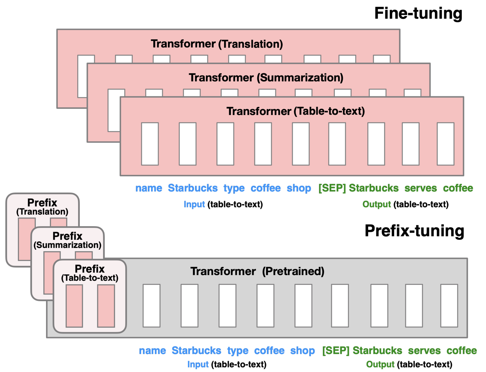
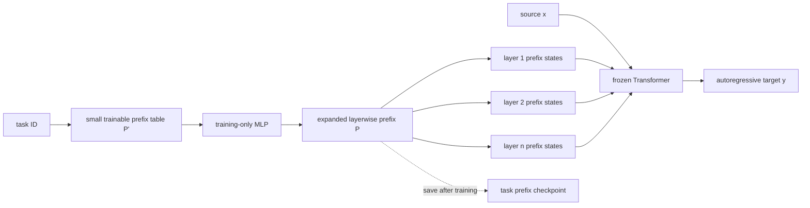
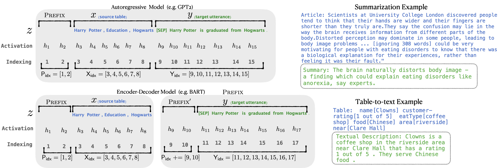
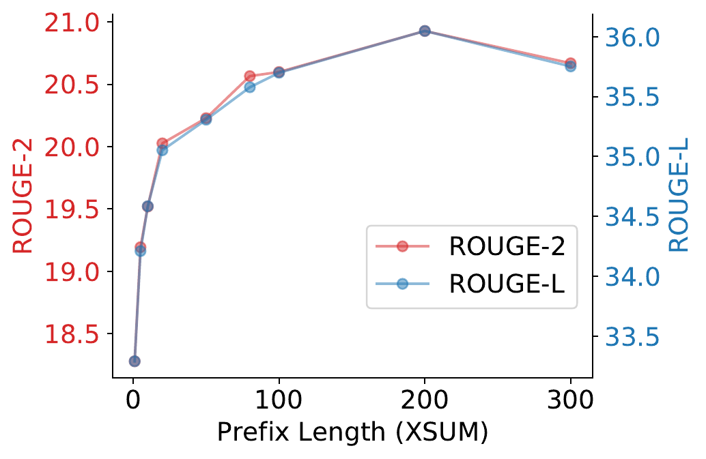
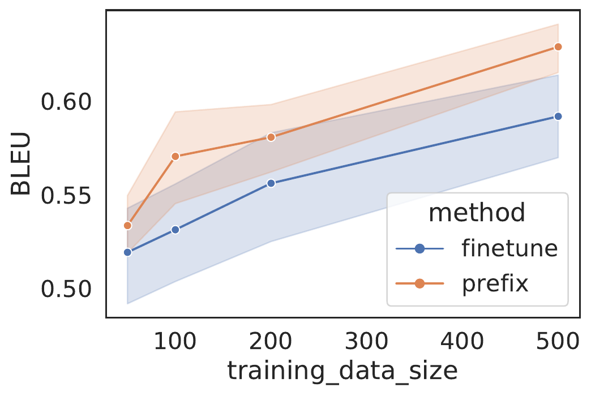

# Prefix-Tuning: Optimizing Continuous Prompts for Generation — Li & Liang, 2021

> **Authors:** Xiang Lisa Li, Percy Liang
> **arXiv:** 2101.00190v1 (1 January 2021) · **Venue:** ACL-IJCNLP 2021 · **Affiliation:** Stanford University

## TL;DR

Prefix-tuning freezes a pretrained Transformer and learns a small task-specific sequence of continuous
activations that every later token can attend to. Unlike an ordinary soft prompt, the prefix supplies
trainable states at every Transformer layer; unlike full fine-tuning, one shared backbone serves all
tasks. With about 0.1% task-specific parameters, it is competitive with full fine-tuning on GPT-2
table-to-text generation, trails it on full-data BART XSUM summarization, but performs better in the
paper's low-data and unseen-topic experiments. The method established the layerwise continuous-prefix
design later generalized by prompt tuning and other parameter-efficient adaptation methods.

## Problem & motivation

Full fine-tuning adapts a pretrained language model by changing all parameters $\phi$. It therefore
stores a complete model for every task: GPT-2 Large has 774M parameters and GPT-3 has 175B (§1). This is
expensive when one backbone must support many tasks or users, and task addition/deletion is no longer a
small modular operation.

Other approaches expose different tradeoffs:

- Discrete prompts leave the model unchanged, but searching over token sequences is difficult and the
  prompt is restricted to existing vocabulary embeddings. In-context examples also consume the bounded
  context window (§2).
- [Bottleneck adapters](peft_2019_bottleneck-adapters.md) retain a shared frozen backbone, but insert
  task-specific modules between layers. Prior adapters used roughly 2–4% task parameters; Prefix-Tuning
  targets about 0.1% (§1–2).
- Tuning only the top layers still saves and executes task-specific model weights, while changing fewer
  layers can reduce quality (Table 1).

The paper asks whether an optimized *continuous context* can steer a frozen model through attention.
The context should be task-specific rather than example-specific, expressive enough to affect all
layers, and small enough to store and swap independently of the backbone.



*Official Figure 1 (§1). Fine-tuning stores a full Transformer per task; Prefix-Tuning shares one frozen
Transformer and stores only a small prefix per task.*

## Key idea

Consider conditional generation from source $x$ to target $y$. For an autoregressive Transformer, let
$z=[x;y]$, let $X_{\mathrm{idx}}$ and $Y_{\mathrm{idx}}$ identify source and target positions, and let

$$
h_i=[h_i^{(1)};\ldots;h_i^{(n)}]\in\mathbb{R}^{d}
$$

concatenate the activations of all $n$ Transformer layers at position $i$. A frozen language model with
parameters $\phi$ normally computes

$$
h_i=\operatorname{LM}_{\phi}(z_i,h_{<i}),
\qquad
p_{\phi}(z_{i+1}\mid h_{\le i})
=\operatorname{softmax}(W_{\phi}h_i^{(n)}).
$$

Prefix-Tuning introduces $m=|P_{\mathrm{idx}}|$ virtual positions and a trainable matrix
$P_{\theta}\in\mathbb{R}^{m\times d}$. The recurrence becomes

$$
h_i=
\begin{cases}
P_{\theta}[i,:], & i\in P_{\mathrm{idx}},\\[4pt]
\operatorname{LM}_{\phi}(z_i,h_{<i}), & i\notin P_{\mathrm{idx}}.
\end{cases}
$$

Only $\theta$ is optimized; $\phi$ and $W_\phi$ remain frozen. Non-prefix states still depend on
$P_\theta$ because attention can read the prefix from their left context. Since each row concatenates
states across all layers, this is not merely prepending $m$ trainable input embeddings: the method
directly supplies a trainable prefix state at every layer (§3–4).

For GPT-2, the effective sequence is
$[\text{Prefix};x;y]$. For BART, prefixes are attached to both sides:
$[\text{Prefix};x]$ at the encoder and $[\text{Prefix}';y]$ at the decoder. The encoder prefix can affect
source representations bidirectionally; the decoder prefix conditions autoregressive generation.

## How it works

### Layerwise data flow


```mermaid
flowchart LR
    ID["task ID"] --> EMB["small trainable prefix table P'"]
    EMB --> MLP["training-only MLP"]
    MLP --> EXP["expanded layerwise prefix P"]
    EXP --> K1["layer 1 prefix states"]
    EXP --> K2["layer 2 prefix states"]
    EXP --> KN["layer n prefix states"]
    X["source x"] --> FROZEN["frozen Transformer"]
    K1 --> FROZEN
    K2 --> FROZEN
    KN --> FROZEN
    FROZEN --> Y["autoregressive target y"]
    EXP -. "save after training" .-> CKPT["task prefix checkpoint"]
```



*Official Figure 2 (§3–4). GPT-2 receives one prefix before the source; BART receives separate encoder
and decoder prefixes. The figure's prefix positions are illustrative; experimental lengths are larger.*

### Reimplementation sequence

1. **Choose the frozen backbone and target layout.** For a decoder-only model, insert $m$ prefix slots
   before the source. For an encoder-decoder model, maintain encoder and decoder prefix slots. Do not
   include prefix positions in the target likelihood.
2. **Materialize per-layer states.** For GPT-2, each $h_i^{(n)}$ is represented as a key/value pair; the
   paper notes that each GPT-2 key and value has dimension 1024. Implementations therefore reshape the
   expanded prefix into layer, key/value, head, prefix-position, and head-dimension axes expected by the
   model's attention cache (§3.1 and official code).
3. **Use an MLP reparameterization.** Directly optimizing $P_\theta$ was sensitive to initialization and
   learning rate. During training, learn a smaller table
   $P'_\theta\in\mathbb{R}^{m\times k}$ and an MLP such that

   $$
   P_\theta[i,:]=\operatorname{MLP}_\theta(P'_\theta[i,:]),
   $$

   with $k=512$ for table-to-text and $k=800$ for summarization (§4.3). This MLP increases the number of
   training-time parameters; the reported deployment footprint counts the expanded prefix that remains.
4. **Optimize conditional likelihood.** Freeze all pretrained weights and maximize

   $$
   \max_{\theta}\log p_{\phi}(y\mid x)
   =\sum_{i\in Y_{\mathrm{idx}}}
   \log p_{\phi}(z_i\mid h_{<i};P_\theta).
   $$

5. **Discard the reparameterization network.** After training, evaluate the MLP once, save
   $P_\theta$, and remove $P'_\theta$ and the MLP. Serving prepends cached layerwise states without
   modifying the shared model (§4.3).
6. **Batch different tasks if needed.** Each row in a batch can select a different prefix while using the
   same frozen model weights. The paper contrasts this with task-specific modules interleaved inside the
   backbone (§8.2).

### Ablations that define the method

- **Layerwise versus embedding-only.** On E2E, full Prefix-Tuning scores 69.7 BLEU, while optimizing only
  virtual-token embeddings gives 48.1, 62.2, and 61.9 at lengths 1, 10, and 20 (Table 4). The layerwise
  intervention, not continuity alone, is central to the original method.
- **Prefix versus infix.** Placing trainable states between $x$ and $y$ scores 67.9 BLEU at length 1 and
  67.2 at length 10, below a length-5 prefix at 69.7 (Table 4). A leading prefix can influence both the
  source representation and target generation; an infix affects only the target side (§7.3).
- **Length.** More prefix states help only to a point: the paper reports thresholds near 10 for
  table-to-text and 200 for XSUM, followed by slight test degradation despite lower training loss (§7.1).



*Official Figure 4, left panel (§7.1). XSUM ROUGE improves steeply from zero-length conditioning,
peaks around 200 prefix positions, and then declines slightly at 300.*

## Training / data

### Models, datasets, and metrics

| Task | Backbone | Dataset | Scale and evaluation | Source |
|---|---|---|---|---|
| Table-to-text | GPT-2 Medium (345M in the paper's parameter comparison) and GPT-2 Large (774M) | E2E | About 50K examples, 8 fields, average output length 22.9; BLEU, NIST, METEOR, ROUGE-L, CIDEr | §5.1 |
| Table-to-text | GPT-2 Medium / Large | WebNLG | 22K examples; 9 seen and 5 test-only DBpedia categories; BLEU, METEOR, TER | §5.1 |
| Table-to-text | GPT-2 Medium / Large | DART | 82K open-domain examples, average output length 21.6; BLEU, METEOR, TER, MoverScore, BERTScore, BLEURT | §5.1 |
| Summarization | BART-Large (406M) | XSUM | 225K examples; articles average 431 words, summaries 23.3; articles truncated to 512 BPE tokens; ROUGE-1/2/L | §5.1–5.3 |

The implementation uses Hugging Face Transformers, AdamW, and a linear learning-rate scheduler. The
authors tune epochs, batch size, learning rate, and prefix length (§5.3). Appendix Table 5 gives the main
Prefix-Tuning settings:

| Dataset | Learning rate | Epochs | Batch size | Prefix length | Source |
|---|---:|---:|---:|---:|---|
| E2E | $8\times10^{-5}$ | 5 | 10 | 5 | Appendix Table 5 |
| WebNLG | $5\times10^{-5}$ | 5 | 5 | 5 | Appendix Table 5 |
| DART | $5\times10^{-5}$ | 10 | 5 | 10 | Appendix Table 5 |
| XSUM | $5\times10^{-5}$ | 30 | 14 | 100 | Appendix Table 5 |

Table-to-text runs use TITAN Xp or GeForce GTX TITAN X GPUs; the paper reports 0.2 hours per epoch on
22K examples for Prefix-Tuning versus 0.3 hours for fine-tuning. XSUM uses Tesla V100 GPUs and takes
1.25 hours per epoch (§5.3). Decoding uses beam 5 for table-to-text and beam 6 with length normalization
0.8 for XSUM. Reported latency is 1.2 seconds per unbatched table-to-text sentence and 2.6 seconds per
XSUM batch of 10; these are absolute measurements, not matched overhead comparisons (§5.3).

Deployment prefixes contain 250K parameters for E2E and WebNLG and 500K for DART, compared with the
paper's 345M-parameter GPT-2 backbone (Table 1 footnote). The XSUM experiment reports 0.1% and 2%
prefix configurations rather than one fixed prefix size (Table 2). Training-time MLP parameters are
discarded and are therefore not represented by these deployment percentages.

For low-data experiments, the authors sample E2E and XSUM subsets of 50, 100, 200, and 500 examples.
At each size they draw five datasets and train two random seeds, averaging 10 models; the development
split is 30% of training-set size and controls early stopping (§6.3).

## Results

### Full-data table-to-text

Table 1 reports many metrics; representative rows below preserve the seen/unseen distinction for
WebNLG. Higher is better except TER.

| Backbone / method | E2E BLEU | E2E ROUGE-L | WebNLG BLEU S / U / A | DART BLEU | DART TER | Source |
|---|---:|---:|---:|---:|---:|---|
| GPT-2 Medium fine-tune | 68.2 | 71.0 | 64.2 / 27.7 / 46.5 | 46.2 | 0.46 | Table 1 |
| GPT-2 Medium adapter 0.1% | 66.3 | 69.8 | 54.5 / 45.1 / 50.2 | 42.4 | 0.48 | Table 1 |
| GPT-2 Medium Prefix 0.1% | **69.7** | **71.4** | 62.9 / **45.6** / **55.1** | **46.4** | 0.46 | Table 1 |
| GPT-2 Large fine-tune | 68.5 | 69.9 | **65.3** / 43.1 / 55.5 | **47.0** | 0.46 | Table 1 |
| GPT-2 Large Prefix | **70.3** | **71.7** | 63.4 / **47.7** / **56.3** | 46.7 | **0.45** | Table 1 |

At matched 0.1% budgets, Prefix-Tuning improves over the adapter by 4.1 BLEU on average across the
three table-to-text datasets (§6.1). The WebNLG unseen-category result is especially large for GPT-2
Medium: 45.6 BLEU versus 27.7 for full fine-tuning, while fine-tuning remains stronger on seen categories
(62.9 versus 64.2). This supports an extrapolation advantage, not uniform dominance.

### Summarization

| BART-Large method | ROUGE-1 | ROUGE-2 | ROUGE-L | Source |
|---|---:|---:|---:|---|
| Fine-tune | **45.14** | **22.27** | **37.25** | Table 2 |
| Prefix 2% | 43.80 | 20.93 | 36.05 | Table 2 |
| Prefix 0.1% | 42.92 | 20.03 | 35.05 | Table 2 |

Prefix-Tuning does not match full fine-tuning on full-data XSUM. The paper points to XSUM's larger
dataset, inputs roughly 17 times longer than the table inputs, and greater task complexity as possible
explanations, but does not isolate their causal contributions (§6.2).

### Low-data and unseen-topic generalization



*Official Figure 3, E2E BLEU panel (§6.3). Across 50–500 examples, Prefix-Tuning is above full
fine-tuning; shaded regions reflect variation across sampled datasets and seeds. The paper reports a
2.9 BLEU average advantage across the four E2E data sizes.*

On topic-held-out XSUM, Prefix-Tuning also beats fine-tuning on every reported ROUGE metric:

| Split / method | ROUGE-1 | ROUGE-2 | ROUGE-L | Source |
|---|---:|---:|---:|---|
| News-to-sports fine-tune | 38.15 | 15.51 | 30.26 | Table 3 |
| News-to-sports Prefix | **39.23** | **16.74** | **31.51** | Table 3 |
| Within-news fine-tune | 39.20 | 16.35 | 31.15 | Table 3 |
| Within-news Prefix | **39.41** | **16.87** | **31.47** | Table 3 |

The authors hypothesize that preserving pretrained weights helps extrapolation. Adapter tuning also
generalizes well on WebNLG, so the evidence supports a broader frozen-backbone effect rather than a
mechanism unique to prefixes (§6.4 and §8.3).

## Limitations & follow-ups

- **Full-data quality is task dependent.** Prefix-Tuning is competitive on table-to-text but remains
  1.20–2.20 ROUGE-L behind full fine-tuning on XSUM, depending on prefix budget (Table 2).
- **Prefixes consume attention context and compute.** The paper observes negligible speed impact for its
  tested lengths because prefix attention is parallelized, but every layer still attends to $m$ extra
  positions. This is not zero-overhead inference, and the cost grows with prefix length and batch size.
- **Optimization is sensitive.** Direct prefix optimization is unstable; the MLP reparameterization and
  real-word initialization are important, especially with little data (§4.3 and §7.4). The paper does
  not provide a principled prefix-length selector.
- **Evidence is generation-only.** Experiments cover GPT-2 table-to-text and BART summarization, not NLU,
  multilingual tasks, substantially larger backbones, or modern instruction tuning.
- **Automatic metrics dominate evaluation.** BLEU, ROUGE, and related metrics do not fully measure
  factuality. Appendix A.4 finds both methods can undergenerate or hallucinate on unseen WebNLG topics;
  Prefix-Tuning tends toward omission while fine-tuning more often produces unfaithful statements.
- **The learned state is task-constant.** It does not compress an input or adapt its prefix per example;
  those are different problems despite using continuous vectors.

[Prompt Tuning](softtoken_2021_prompt-tuning.md) later simplifies the method to input-layer soft tokens
and studies scale; [P-Tuning v2](softtoken_2021_p-tuning-v2.md) extends deep prompts to NLU; and
[LoRA](peft_2021_lora.md) adapts low-rank weight updates that can be merged for inference. Input-dependent
methods such as [Gisting](softtoken_2023_gisting.md), [ICAE](softtoken_2023_icae.md), and
[AutoCompressor](softtoken_2023_autocompressor.md) reuse continuous states for compression rather than
storing one constant task prefix.

## Links

- **Primary paper:** [arXiv abstract](https://arxiv.org/abs/2101.00190) · [HTML](https://arxiv.org/html/2101.00190v1) · [PDF](https://arxiv.org/pdf/2101.00190) · [ACL Anthology](https://aclanthology.org/2021.acl-long.353/) · [DOI](https://doi.org/10.18653/v1/2021.acl-long.353)
- **Official implementation:** [XiangLi1999/PrefixTuning](https://github.com/XiangLi1999/PrefixTuning)
- **Talk:** [ACL Anthology video](https://aclanthology.org/2021.acl-long.353.mp4)
- **Related local recaps:** [Bottleneck Adapters](peft_2019_bottleneck-adapters.md) · [LoRA](peft_2021_lora.md) · [Prompt Tuning](softtoken_2021_prompt-tuning.md) · [P-Tuning v2](softtoken_2021_p-tuning-v2.md) · [Gisting](softtoken_2023_gisting.md)
- **In-repo context:** [BERT overview §16.10](../bert/overview.md#1610-parameter-efficient-fine-tuning-peft) · [Soft-token overview](../context/soft_token/soft_token.md) · [MixedDecoder §6.6](../mixed_decoder/mixed_decoder.md#66-parameter-efficient-fine-tuning)
- **BibTeX:**

  ```bibtex
  @inproceedings{li-liang-2021-prefix,
    title     = {Prefix-Tuning: Optimizing Continuous Prompts for Generation},
    author    = {Li, Xiang Lisa and Liang, Percy},
    booktitle = {Proceedings of the 59th Annual Meeting of the Association for
                 Computational Linguistics and the 11th International Joint
                 Conference on Natural Language Processing (Volume 1: Long Papers)},
    pages     = {4582--4597},
    year      = {2021},
    doi       = {10.18653/v1/2021.acl-long.353}
  }
  ```