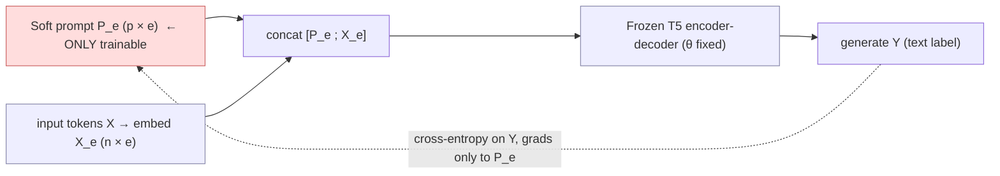

# The Power of Scale for Parameter-Efficient Prompt Tuning — Lester, Al-Rfou & Constant, 2021

> **arXiv:** 2104.08691v2 · **Venue:** EMNLP 2021 · **Affiliation:** Google Research

## TL;DR
Freeze the **entire** pretrained model and learn only a small matrix of $P$ **soft-prompt** embeddings
prepended to the input; train it end-to-end by backprop while the model stays fixed. This is a radical
simplification of [Prefix-Tuning](softtoken_2021_prefix-tuning.md) — **no** per-layer prefixes, **no**
reparameterization, **no** task-specific output head — yet the headline finding is that **it works better
the bigger the model gets**: at T5-XXL (11B) prompt tuning **matches full fine-tuning** on SuperGLUE while
tuning ~**20,000× fewer** task-specific parameters (20,480 params for a 5-token prompt). It beats GPT-3
few-shot prompt design by a wide margin, and — because the base model is frozen — gives better **domain
transfer** and enables **prompt ensembling** at the cost of a larger batch.

## Problem & motivation
Two ways to adapt a pretrained LM, each with a drawback:
- **Model tuning (fine-tuning):** best quality, but stores a full **separate model copy per task** (11B
  params each for T5-XXL) and needs separate inference batches per task.
- **Prompt design (GPT-3 priming):** a single frozen model serves all tasks, but discrete text prompts are
  error-prone, capped by context length, and lag far behind fine-tuning (GPT-3 175B few-shot is **17.5
  points below** fine-tuned T5-XXL on SuperGLUE, 71.8 vs 89.3, despite 16× more params).

Can we keep the frozen-model serving benefits *and* close the quality gap? Prompt tuning learns a
continuous prompt instead of searching discrete tokens.

## Key idea
Cast every task as T5 text-to-text: model $\Pr_\theta(Y\mid X)$. Normal prompting prepends tokens $P$ whose
embeddings come from the **frozen** embedding table. Prompt tuning removes that restriction — the prompt
gets its **own** parameters $\theta_P$, trained by maximizing $\Pr_{\theta;\theta_P}(Y\mid[P;X])$ **while
updating only $\theta_P$**.

Concretely, embed the $n$ input tokens into $X_e\in\mathbb{R}^{n\times e}$; the soft prompt is a parameter
$P_e\in\mathbb{R}^{p\times e}$; concatenate and run the frozen encoder-decoder on

$$
[P_e;X_e]\in\mathbb{R}^{(p+n)\times e}.
$$

Only $P_e$ receives gradient updates. Parameter cost is $e\cdot p$ (embedding dim × prompt length) — under
**0.01%** of total for billion-parameter models. Contrast with Prefix-Tuning, which prepends learned
activations at **every** layer (and needs a stabilizing reparameterization MLP during training).

**Three design choices that matter (mostly at smaller scale):**
- **Prompt length $p$** — cost is $Ep$; find the shortest that works.
- **Initialization** — random uniform $[-0.5,0.5]$ < sampled-vocab < **class-label embeddings** (best).
- **LM adaptation** — T5's span-corruption pretraining leaves it unable to emit natural text; continuing
  T5 pretraining with an **LM objective** for 100K steps ("LM-adapted T5") is important for a
  promptable frozen model.

The punchline: **all three matter less as the model grows** — at XXL, even a 1-token, randomly-initialized,
span-corruption prompt is strong.

## How it works


Serving benefit: one frozen model runs **mixed-task batches** — each example carries its own prompt in the
batch, so $N$ tasks (or $N$ prompts) cost a single forward pass with batch size $N$, not $N$ model copies.

## Training / data
Base: public **T5.1.1** checkpoints, Small→XXL, using LM-adapted (100K-step) versions. Default config:
prompt length **100**, class-label init, 30K training steps, cross-entropy, constant lr **0.3**, batch 32,
Adafactor (weight decay 1e-5, $\beta_2$ decay 0.8, parameter-scaling off), JAX/Flax; early stopping on dev.
Benchmark: **SuperGLUE** (8 tasks), each prompt trained on a single task (no multi-task mixing), dev-set
metrics. Domain-shift: train on SQuAD, evaluate zero-shot on MRQA out-of-domain sets; and QQP⇔MRPC.

## Results
SuperGLUE dev (T5, single-task); "closing the gap" with scale:

| Model size | Prompt Tuning | Model Tuning | GPT-3 few-shot | Source |
|---|---:|---:|---:|---|
| T5-Small | ~ matches GPT-3 XL | higher | — | Fig. 1 |
| T5-Large | **> GPT-3 175B** | higher | — | Fig. 1 |
| T5-XXL (11B) | **≈ 89.3** (matches, even multi-task MT) | 89.3 | 71.8 | Fig. 1 |

- **Parameter efficiency:** at XXL, prompt tuning matches the stronger *multi-task* fine-tuning baseline
  with **>20,000× fewer** task-specific params (<0.01%).
- **Ablations (Fig. 3):** prompt length — >1 token critical below XXL, gains plateau past ~20; init —
  class-label best, differences vanish at XXL; LM adaptation — clearly helps, longer is better up to 100K,
  but XXL robust even to span-corruption.
- **Domain shift (MRQA, F1, train on SQuAD):** prompt tuning beats model tuning on most out-of-domain sets,
  **+12.5** on TextbookQA, +1.2 BioASQ; QQP→MRPC +3.2 acc / +3.1 F1. Freezing the LM avoids overfitting
  lexical cues.
- **Prompt ensembling:** 5 prompts on one frozen T5-XXL, majority vote → SuperGLUE dev **91.3**, beating
  the best single prompt (91.0) and the average (90.5), far cheaper than model ensembling.
- **Interpretability:** nearest-neighbor tokens to learned prompt embeddings form tight semantic clusters
  (e.g. {Technology/technologies/technological}); class-label inits persist as neighbors.

## Limitations & follow-ups
- **Underperforms at small/medium scale** and on **hard sequence-labeling** tasks — the motivation for
  [P-Tuning v2](softtoken_2021_p-tuning-v2.md), which restores deep (per-layer) prompts.
- Learned prompts are **not human-interpretable** as sequences; longer prompts show redundant tokens
  (excess capacity / no positional structure).
- Uses input sequence length for the prompt, unlike weight-editing methods such as
  [LoRA](peft_2021_lora.md) that add no tokens and no inference latency.
- Depends on **LM adaptation** of T5; a span-corruption-only frozen model is unreliable below XXL.

## Links
- **arXiv:** [abs](https://arxiv.org/abs/2104.08691) · [html](https://arxiv.org/html/2104.08691v2) · [pdf](https://arxiv.org/pdf/2104.08691)
- **Code:** Google Research T5X / prompt-tuning — <https://github.com/google-research/prompt-tuning>
- **BibTeX:**
  ```bibtex
  @inproceedings{lester2021power,
    title     = {The Power of Scale for Parameter-Efficient Prompt Tuning},
    author    = {Lester, Brian and Al-Rfou, Rami and Constant, Noah},
    booktitle = {Proceedings of the 2021 Conference on Empirical Methods in Natural Language Processing (EMNLP)},
    year      = {2021},
    url       = {https://arxiv.org/abs/2104.08691}
  }
  ```
- **Related papers:** [Prefix-Tuning](softtoken_2021_prefix-tuning.md) ·
  [P-Tuning v2](softtoken_2021_p-tuning-v2.md) · [LoRA](peft_2021_lora.md)
- **In-repo:** [§6.6 in mixed_decoder](../mixed_decoder/mixed_decoder.md) ·
  soft-prompt compression cousins: [Gisting](softtoken_2023_gisting.md), [ICAE](softtoken_2023_icae.md)
