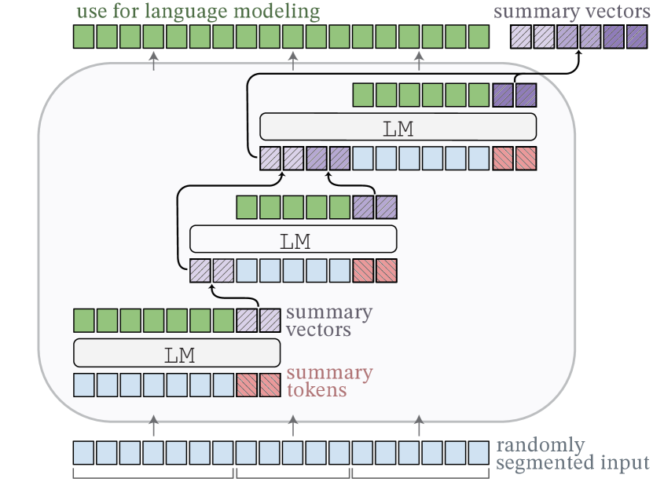
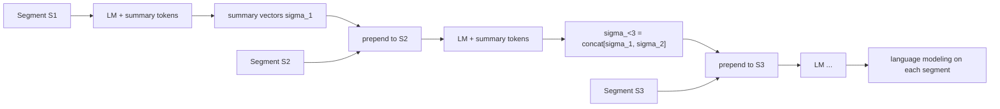
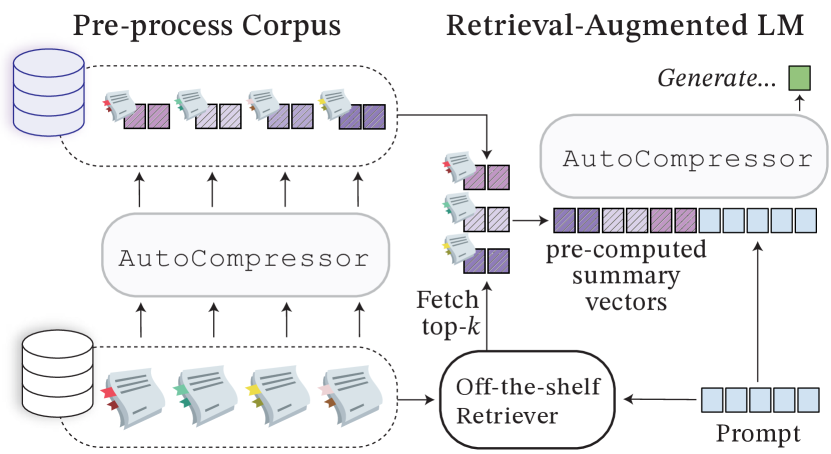

# Adapting Language Models to Compress Contexts (AutoCompressor) — Chevalier et al., 2023

> **arXiv:** 2305.14788v2 · **Venue:** EMNLP 2023 · **Affiliation:** Princeton NLP · **Code:** github.com/princeton-nlp/AutoCompressors

## TL;DR
AutoCompressors turn an off-the-shelf LM into a recursive context compressor: a long document
is split into segments, each segment is summarized into a few **summary vectors** (soft
prompts), and those vectors **accumulate** and are fed forward so later segments condition on
the compressed history. This extends the effective context to **30,720 tokens**, *improves*
perplexity over the base model, makes in-context learning cheaper (150 summary vectors beat 150
plain demonstration tokens on 8/11 tasks), and speeds up retrieval-augmented generation and
passage re-ranking by **3–4×**.

*Figure 1 — The input is **randomly segmented**; each segment is processed by the LM together
with **summary tokens** (red). The resulting **summary vectors** (purple) are **prepended to
the next segment**, so information flows recursively across the whole document while the model
still does ordinary language modeling on each segment (green outputs).*

## Problem & motivation
Transformers have a hard context limit and quadratic attention cost, yet many workloads reuse
long, static contexts (documents, retrieved passages, long few-shot prompts). Re-reading them
every call is wasteful. AutoCompressors aim to (a) *extend* usable context far beyond the base
window, (b) produce **reusable, cacheable** compact representations, and (c) do so by
**lightly adapting an existing LM** rather than training a new architecture — so the same model
both compresses and consumes summaries.

## Key idea
Add $\kappa$ special **summary tokens** `<Sum>_1..<Sum>_κ` to the vocabulary ($\kappa=50$ works
best). Process the document as segments $S_1,\ldots,S_n$. For segment $S_i$, append the summary
tokens; the LM's output activations at those positions are the segment's **summary vectors**
$\sigma_i$. Crucially the summaries **accumulate**:

$$
\sigma_{<i} \;=\; \operatorname{Concat}\big[\sigma_1,\ldots,\sigma_{i-1}\big]
\quad\in\ \mathbb{R}^{(i-1)\kappa \times d},
$$

and $\sigma_{<i}$ is **prepended to every subsequent segment**, so segment $i$ conditions on a
compressed summary of *all* earlier text. The model is trained with the ordinary
next-token objective, but each token may attend to the accumulated summaries:

$$
\mathcal{L} \;=\; -\frac{1}{N}\sum_{i=1}^{n}\sum_{t=1}^{m_i}
\log p\big(x^{i}_{t} \mid x^{i}_{1},\ldots,x^{i}_{t-1},\ \sigma_{<i}\big).
$$

Here $m_i$ is the length of segment $i$ and $N=\sum_i m_i$. The summaries are the only new
"context"; the base weights are adapted (full for OPT, LoRA for Llama-2).

## How it works (reimplementation-grade walkthrough)
1. **Summary tokens.** Add $\kappa$ (=50) summary-token embeddings. Their output activations
   after a segment become that segment's summary vectors $\sigma_i$.
2. **Randomized segmenting.** Split the document into segments of **randomly** chosen length
   (1024–2048 tokens) so the model learns to compress at varying granularities.
3. **Recursive accumulation.** Maintain $\sigma_{<i}=\text{Concat}[\sigma_1..\sigma_{i-1}]$;
   prepend it to segment $S_i$'s tokens (plus fresh summary tokens for $S_i$). This grows the
   *compressed* context by only $\kappa$ vectors per segment while the raw context could be tens
   of thousands of tokens.
4. **Positional handling.** For **OPT**, summary tokens get **no positional embedding** (they
   are treated as position-free memory); for **Llama-2**, normal **RoPE** is applied.
5. **Efficient training via BPTT with stop-gradients.** Backpropagate through time across
   segments, but **stop gradients after 2 compression steps**, cutting ~50% GPU memory so long
   sequences fit.
6. **Serve.** Pre-compute and **cache** summary vectors for corpus passages; at query time fetch
   the relevant summaries and prepend them — no re-encoding of the raw passages.

### Application: retrieval-augmented generation with cached summaries

*Figure 2 — The corpus is **pre-compressed** into summary vectors offline. At query time an
off-the-shelf retriever fetches the top-$k$ passages; their **pre-computed summary vectors** are
concatenated in front of the prompt so the LM generates over compressed evidence — cheaper than
re-reading full passages and amenable to a **"Fused Summaries"** re-ranking scheme.*

## Training / data
- **Base models:** OPT-1.3B, OPT-2.7B (full fine-tuning of the adaptation); Llama-2-7B (LoRA
  rank 16).
- **Data:** ~**2B tokens** from the Pile / **Books3** (OPT); ~**15B tokens** from **RedPajama**
  (Llama-2).
- **Hyperparameters:** $\kappa=50$ summary tokens; segment length 1024–2048 (randomized);
  BPTT with stop-gradient after 2 compression steps; extends effective context to **30,720
  tokens**.

## Results
| Task | Setting | AutoCompressor | Baseline |
|---|---|---:|---|
| Language modeling (OPT-2.7B, 8K in-domain) | PPL | **5.94–6.14** | 6.28 (full context) |
| In-context learning (11 tasks) | summary vs plain tokens | **wins 8/11** with 150 summary vecs | 150 demonstration tokens |
| RAG (Fused Summaries, top-10, 512-tok) | PPL gain | **+8.54%** | uncompressed passages |
| Passage re-ranking | throughput | **3–4× faster** | full-passage scoring |
| Effective context | tokens | **30,720** | base window (2K) |

- **Compression that *helps*:** summary-conditioned LM perplexity is **lower** than the
  full-context baseline in-domain (5.94 vs 6.28), i.e. compression acts as useful denoising.
- **Cheaper ICL:** 150 summary vectors beat 150 raw demonstration tokens on most tasks — soft
  summaries pack more signal per slot.
- **Faster retrieval pipelines:** pre-computed summaries give 3–4× re-ranking throughput and an
  8.54% PPL gain in the Fused-Summaries RAG setup.

## Limitations & follow-ups
- Summary vectors are model-specific and must be recomputed if the backbone changes.
- Recursive accumulation still grows linearly in the number of segments ($\kappa$ per segment).
- **Relation to the thread:** AutoCompressor is the **recursive long-document** member of the
  soft-token family — where [Gisting](softtoken_2023_gisting.md) compresses a prompt and
  [ICAE](softtoken_2023_icae.md) autoencodes a single context, AutoCompressor chains summaries
  across an entire corpus; all descend from
  [Prefix-Tuning](softtoken_2021_prefix-tuning.md)'s continuous-prompt idea. See the
  [soft-token thread](../context/soft_token/soft_token.md) and the
  [context-compression review](../context/ctx_compression.md).

## Links
- **arXiv:** [abs](https://arxiv.org/abs/2305.14788) · [html](https://arxiv.org/html/2305.14788v2) · [pdf](https://arxiv.org/pdf/2305.14788)
- **Code:** https://github.com/princeton-nlp/AutoCompressors
- **Venue:** EMNLP 2023 (Findings)
- **Related papers:** [Prefix-Tuning](softtoken_2021_prefix-tuning.md) · [Gisting](softtoken_2023_gisting.md) · [ICAE](softtoken_2023_icae.md) · [LCLM thread](../context/soft_token/soft_token.md)
