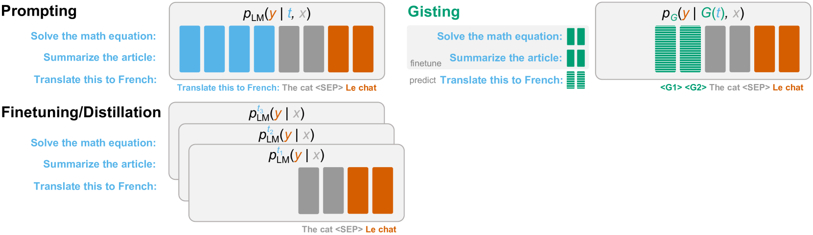
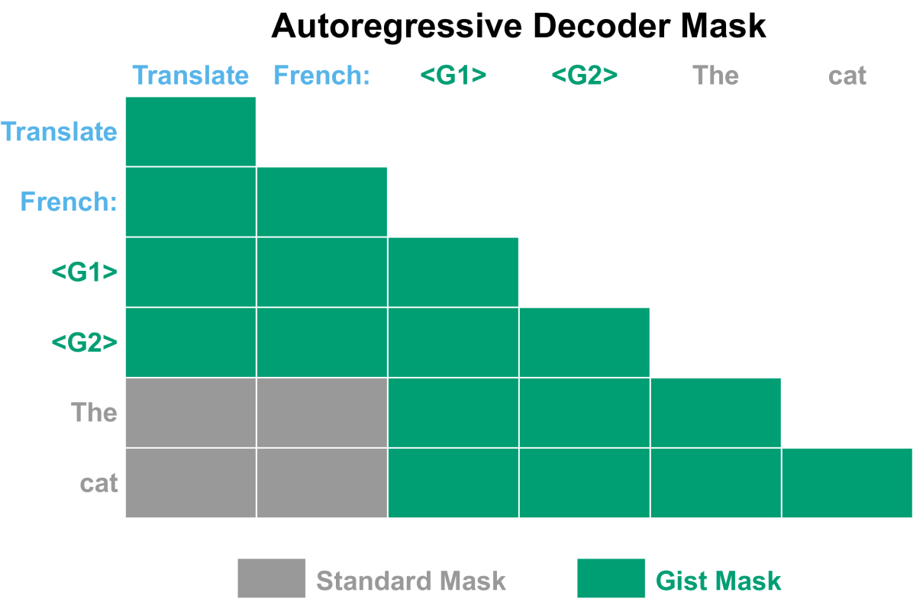
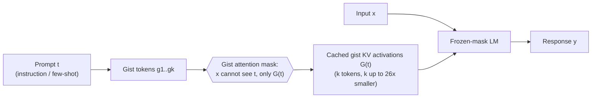
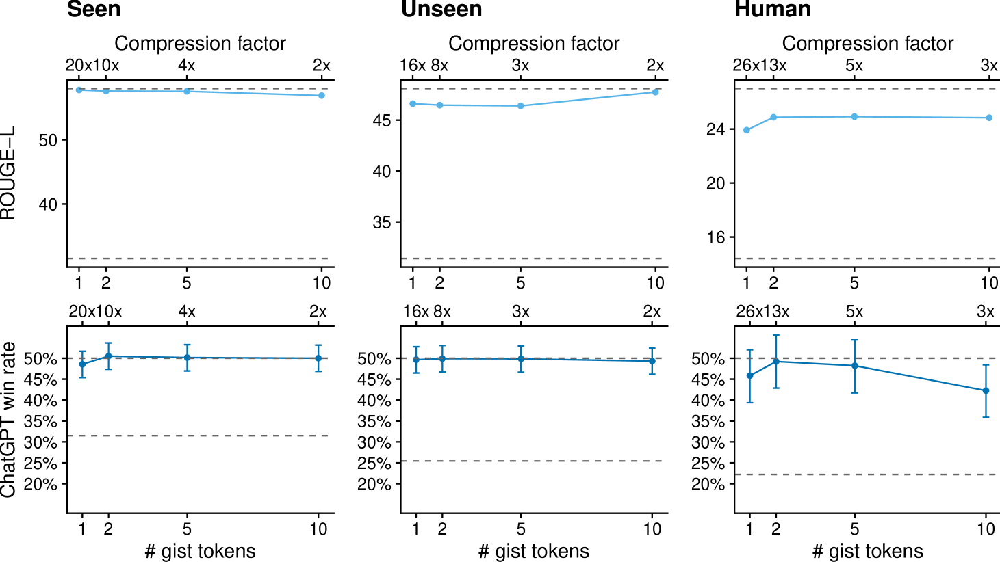

# Learning to Compress Prompts with Gist Tokens — Mu, Li & Goodman, 2023

> **arXiv:** 2304.08467v3 · **Affiliation:** Stanford University · **Code:** github.com/jayelm/gisting

## TL;DR
Gisting trains a language model to **compress an arbitrary prompt into a handful of "gist"
key–value activations** by a tiny change to the **attention mask** — no architecture change,
no extra training stage, learned *for free* during ordinary instruction fine-tuning. At
inference the prompt is replaced by its cached gist tokens, giving **up to 26× prompt
compression**, **40% fewer FLOPs**, and **26× more prompts cacheable** in memory, with
negligible quality loss.

*Figure 1 — Standard **prompting** conditions on the full instruction $t$ every time;
**fine-tuning/distillation** bakes one task into weights (one model per task); **gisting**
learns a single model $G$ that maps any prompt $t$ to compact gist activations $G(t)$ reused
across inputs $x$.*

## Problem & motivation
Instruction-following LMs re-encode a long, often-repeated prompt prefix (system message,
few-shot exemplars, task description) on **every** call. That prefix dominates compute and KV
memory. Prior fixes each cost something: prompt/prefix-tuning
([Prefix-Tuning](softtoken_2021_prefix-tuning.md)) needs **per-task gradient training**;
context distillation needs a **distillation run per prompt**. Gisting instead learns a single
*meta* model that emits the compressed representation for **any unseen prompt in one forward
pass** — amortizing compression to zero marginal cost.

## Key idea
Add a small number $k$ of special **gist tokens** $g_1\ldots g_k$ to the vocabulary and insert
them **between the prompt $t$ and the input $x$**: the sequence becomes $(t, g_1\ldots g_k, x,
y)$. Then modify the attention mask so that **everything after the gist tokens cannot attend
to anything before them** — all information must flow through the $k$ gist positions, forcing
the model to pack the prompt into those activations.

Gisting is derived as a cheap approximation to **context distillation**. Distillation matches a
prompted teacher with an unprompted student for a *fixed* prompt $t$:

$$
\mathcal{L}_{\text{CD}}(p_{\text{CD}},\, t) \;=\;
\mathbb{E}_{x}\Big[ D_{\text{KL}}\big(p_{\text{LM}}(y\mid t,x)\,\Vert\, p_{\text{CD}}(y\mid x)\big)\Big].
\tag{1}
$$

Gisting **meta-learns** across the whole prompt distribution $\mathcal{T}$ in one model $G$
that outputs gist activations $G(t)$:

$$
\mathcal{L}_{G}(p_{G}) \;=\;
\mathbb{E}_{t\sim\mathcal{T},\,x}\Big[ D_{\text{KL}}\big(p_{\text{LM}}(y\mid t,x)\,\Vert\, p_{G}(y\mid G(t),x)\big)\Big].
\tag{2}
$$

In practice the KL is replaced by the standard LM cross-entropy under the gist mask — so
**gisting adds zero cost over normal instruction fine-tuning**; the only change is the mask.

## How it works (reimplementation-grade walkthrough)
1. **Vocabulary.** Add $k$ gist token embeddings (Gist authors find **a single gist token,
   $k=1$, already suffices** for LLaMA-7B; they test $k\in\{1,2,5,10\}$).
2. **Sequence layout.** Build `(t, g_1..g_k, x, y)`.
3. **Gist attention mask.** Standard causal mask **plus** a block that zeroes attention from
   any position after the gist block to any position **strictly before** it. So $x$ and $y$
   see the gist tokens but **not** the raw prompt $t$; $t$ and the gist tokens attend causally
   among themselves.

*Figure 2 — In a decoder LM, tokens after the two gist tokens `<G1> <G2>` (e.g. "The", "cat")
have their attention to the pre-gist prompt ("Translate", "French:") **masked out** (grey),
while attention through the gist positions stays open (green). The gist activations become a
bottleneck the model must compress the instruction through.*

4. **Train** with ordinary next-token cross-entropy on an instruction dataset — the mask does
   the rest; no auxiliary loss, no second stage.
5. **Cache & serve.** After training, run the prompt once to produce the gist **key/value
   activations**, store them, and prepend them in place of $t$ for every future input $x$.
   Because the gist KV is tiny, **~26× more prompts fit in the same cache**.

## Training / data
- **Data:** **Alpaca+** — 130,321 examples over **104,664 unique tasks** (Self-Instruct +
  Stanford Alpaca), with held-out **Seen**, **Unseen**, and hand-written **Human** prompt
  splits to test generalization to novel instructions.
- **Base models:** **LLaMA-7B** (decoder-only) and **FLAN-T5-XXL** (encoder–decoder) — gisting
  works for both; enc-dec uses an analogous cross-attention gist mask.
- **Recipe:** standard instruction fine-tuning hyperparameters; the gist mask is the only
  modification. Single gist token used in the main runs.

*Figure 3 — Quality vs. number of gist tokens: performance is essentially flat, confirming even
one gist token captures most Alpaca prompts.*

## Results
| Model / split | Metric | Full prompt | **Gist** | Notes |
|---|---|---:|---:|---|
| LLaMA-7B — Seen | ROUGE-L | 58.2 | **57.8** | 99.2% of full-prompt ROUGE |
| LLaMA-7B — Seen | ChatGPT win-rate | 50.0 | **48.6** | 92.4% |
| LLaMA-7B — Unseen | ChatGPT win-rate | 50.0 | **49.7** | generalizes to new prompts |
| LLaMA-7B — Human | ROUGE-L | — | **23.9** | hardest split |
| LLaMA-7B — Human | ChatGPT win-rate | — | **45.8** | competitive with full prompt |

Efficiency (LLaMA-7B, single gist token):
- **Up to 26× prompt compression** (avg prompt length → 1 gist token).
- **~40% FLOPs reduction** and **4.2% wall-clock speedup** per generation.
- **26× more prompts cacheable** in the same KV budget.

## Limitations & follow-ups
- Compression ratio is bounded by prompt length/complexity; very long, information-dense
  prompts lose more on the Human split.
- Gist KV is prompt-specific — reuse assumes the same instruction is applied to many inputs.
- **Relation to the thread:** Gisting *predicts* a soft context in one pass, whereas
  [Prefix-Tuning](softtoken_2021_prefix-tuning.md) *trains* one per task. The
  encoder–decoder compressors [ICAE](softtoken_2023_icae.md) and
  [AutoCompressor](softtoken_2023_autocompressor.md) push the same "compress context into soft
  tokens" idea toward long documents. See the
  [soft-token thread](../context/soft_token/soft_token.md) and the
  [context-compression review](../context/ctx_compression.md).

## Links
- **arXiv:** [abs](https://arxiv.org/abs/2304.08467) · [html](https://arxiv.org/html/2304.08467v3) · [pdf](https://arxiv.org/pdf/2304.08467)
- **Code:** https://github.com/jayelm/gisting
- **Venue:** NeurIPS 2023
- **Related papers:** [Prefix-Tuning](softtoken_2021_prefix-tuning.md) · [ICAE](softtoken_2023_icae.md) · [AutoCompressor](softtoken_2023_autocompressor.md) · [LCLM thread](../context/soft_token/soft_token.md)
