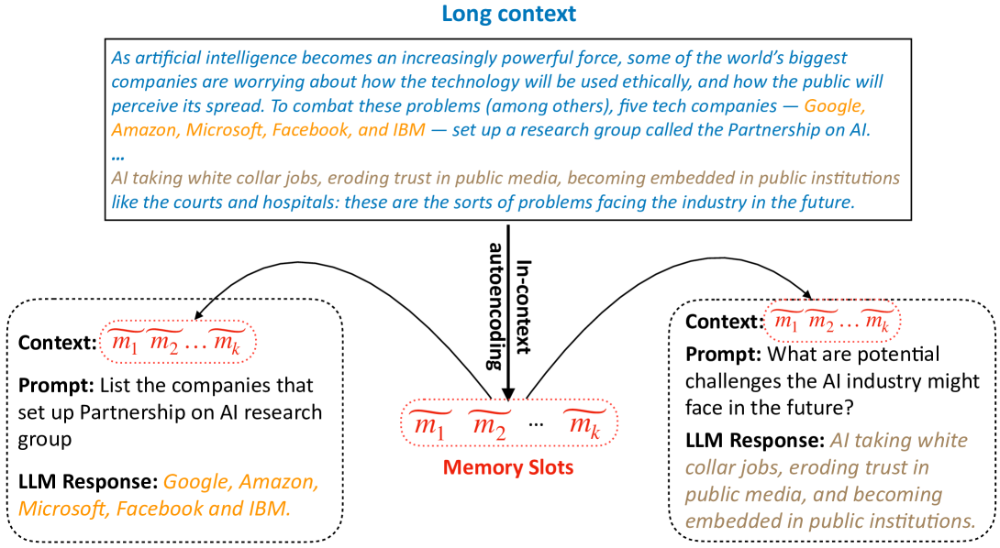
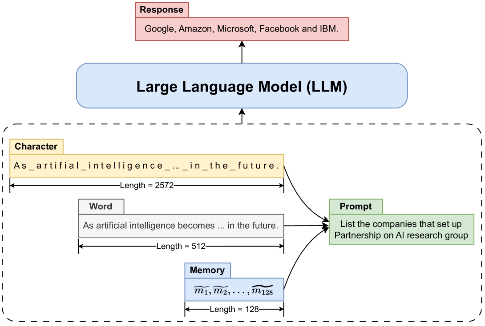
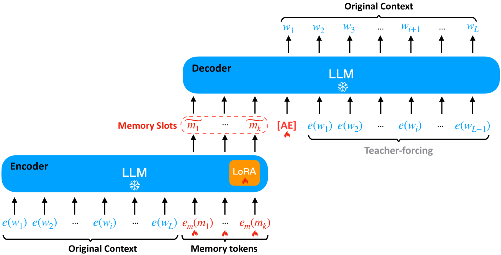
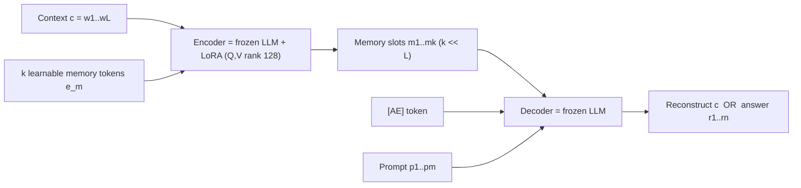

# In-Context Autoencoder for Context Compression in a Large Language Model (ICAE) — Ge et al., 2023

> **arXiv:** 2307.06945v3 · **Affiliation:** Microsoft · **Code:** github.com/getao/icae

## TL;DR
ICAE compresses a long context into a small set of dense **memory slots** by autoencoding it
*with the target LLM itself*. A **LoRA-adapted copy** of the LLM acts as an **encoder** that
reads the context plus $k$ learnable memory tokens and emits $k$ memory-slot activations
($k \ll L$); the **frozen** LLM acts as the **decoder** that conditions on those slots. With
$k=128$ per 512 tokens (**4× compression**), reconstruction reaches **99% BLEU**, and the slots
serve downstream prompts with a **~3.3× latency speedup** and better quality than feeding a
GPT-4 text summary.

*Figure 1 — A long context is compressed once into $k$ memory slots $\tilde m_1\ldots\tilde m_k$
via **in-context autoencoding**; those slots are then prepended to arbitrary prompts, letting
the LLM answer questions about the context without re-reading it.*

## Problem & motivation
Long contexts inflate attention cost and KV memory, and the same document is often reused
across many queries. Text summaries are lossy and lossily *fixed*. ICAE asks: can we produce a
**compact, LLM-native** representation — soft memory slots living in the model's own activation
space — that (a) can reconstruct the context nearly losslessly and (b) works as a drop-in
context for downstream prompting? The information-density gap motivates it directly:

*Figure 2 — 2,572 characters ≈ 512 word-tokens ≈ **128 memory slots** carry the same content:
memory slots are a far denser medium than raw tokens.*

## Key idea
Take the target LLM. Make an **encoder** by adding **LoRA** adapters (so the backbone stays
frozen but gains a light compression skill). Append $k$ **learnable memory-token embeddings**
$e_m$ to the context $c=(w_1,\ldots,w_L)$. Run the encoder; read out the hidden states at the
memory positions as the **memory slots** $(\tilde m_1,\ldots,\tilde m_k)$, $k\ll L$. The
**frozen** LLM is the **decoder**: it conditions on the memory slots (optionally a special
`[AE]` token to trigger reconstruction) and generates.

*Figure 3 — **Encoder** = frozen LLM + LoRA reading context tokens $e(w_i)$ and memory tokens
$e_m(m_j)$, producing memory slots $\tilde m_j$. **Decoder** = frozen LLM; given the slots and
the `[AE]` token it reconstructs the original context under teacher forcing.*

## How it works (reimplementation-grade walkthrough)
1. **Encoder.** Clone the target LLM, freeze it, attach **LoRA** on the attention **Q and V**
   projections (**rank 128**). Append $k$ learnable memory-token embeddings after the context.
   Default **$k=128$ per 512 context tokens → 4× compression** (they test $k\in\{32,64,128,256\}$).
2. **Memory slots.** The encoder's hidden states at the $k$ memory positions are the compressed
   representation $(\tilde m_1,\ldots,\tilde m_k)$ — continuous vectors in the LLM's activation
   space, not text.
3. **Decoder = frozen LLM.** Prepend the memory slots as a soft prefix. Three training/inference
   modes, each a conditional log-likelihood over the *frozen* LLM parameters $\Theta_{\text{LLM}}$
   (only LoRA + memory embeddings are learned):
   - **Autoencoding (reconstruct the context).** A special `[AE]` token cues reconstruction:
     $$
     \mathcal{L}_{\text{AE}} \;=\; \max \; P\big(c \mid \tilde m_1,\ldots,\tilde m_k;\ \Theta_{\text{LLM}}\big).
     $$
   - **Language-model continuation (pretraining aux task).** Predict the next $N$ tokens
     $o=(w_{L+1},\ldots,w_{L+N})$ from the slots:
     $$
     \mathcal{L}_{\text{LM}} \;=\; \max \; P\big(o \mid \tilde m_1,\ldots,\tilde m_k\big).
     $$
   - **Instruction fine-tuning (downstream use).** Given slots and a prompt $p_1\ldots p_m$,
     produce the response $r_1\ldots r_n$:
     $$
     \mathcal{L}_{\text{FT}} \;=\; \max \; P\big(r_1,\ldots,r_n \mid \tilde m_1,\ldots,\tilde m_k,\ p_1,\ldots,p_m\big).
     $$
4. **Two-phase training.** **Pretrain** with $\mathcal{L}_{\text{AE}}+\mathcal{L}_{\text{LM}}$
   on generic text, then **fine-tune** with $\mathcal{L}_{\text{FT}}$ on prompt–context–response
   data so the slots become useful for real queries.
5. **Serve.** Compress each document once, cache its slots, and prepend them to any prompt;
   with cached memory, latency drops up to **~7×** vs. re-encoding.

## Training / data
- **Base models:** Llama-7B, Llama-2-7B-chat, Llama-2-13B-chat.
- **Pretraining:** the **Pile**; 8×A100-80GB; AdamW, LR $1\times10^{-4}$, batch 256, **200K
  updates**, context length 512.
- **Fine-tuning:** **PwC** dataset — 240K train / 18K test prompt–context–response triples
  (GPT-4 generated); LR $5\times10^{-5}$, 30K updates.
- **Trainable params:** only LoRA (rank 128 on Q,V) + the $k$ memory-token embeddings; backbone
  frozen throughout.

## Results
| Setting | Metric | Result | Baseline |
|---|---|---:|---|
| 512 → 128 slots (Llama-7B) | Reconstruction BLEU | **99.1%** | — |
| 512 → 128 slots | PPL shift | 9.01 → **9.50** (+0.49) | frozen LLM 9.01 |
| Memory slots vs GPT-4 summary | downstream quality | **1.9× better** | GPT-4 text summary |
| Pretraining benefit | win / lose ratio | **6.4 / 1.2** | no-pretrain ablation |
| Inference (8×2048 batch) | latency speedup | **3.3×** | re-encoding; up to ~7× with cached memory |

- **Near-lossless at 4×:** 99% reconstruction BLEU, only +0.49 PPL.
- **Beats text summaries:** soft memory slots outperform GPT-4-written summaries by ~1.9× on
  downstream tasks — dense activations preserve more than prose.
- **Pretraining matters:** the AE+LM pretraining stage gives a 6.4-vs-1.2 win/lose ratio over
  skipping it.

## Limitations & follow-ups
- Fixed $k$ trades compression against fidelity; higher ratios (e.g. 512→32) degrade
  reconstruction.
- Slots are tied to the specific backbone/LoRA that produced them.
- **Relation to the thread:** ICAE realizes the encoder–decoder soft-token compressor that
  [Gisting](softtoken_2023_gisting.md) foreshadows for prompts and that
  [Prefix-Tuning](softtoken_2021_prefix-tuning.md) seeds conceptually;
  [AutoCompressor](softtoken_2023_autocompressor.md) extends the idea to *recursive* long-doc
  compression. See the [soft-token thread](../context/soft_token/soft_token.md) and the
  [context-compression review](../context/ctx_compression.md).

## Links
- **arXiv:** [abs](https://arxiv.org/abs/2307.06945) · [html](https://arxiv.org/html/2307.06945v3) · [pdf](https://arxiv.org/pdf/2307.06945)
- **Code:** https://github.com/getao/icae
- **Venue:** ICLR 2024
- **Related papers:** [Prefix-Tuning](softtoken_2021_prefix-tuning.md) · [Gisting](softtoken_2023_gisting.md) · [AutoCompressor](softtoken_2023_autocompressor.md) · [LCLM thread](../context/soft_token/soft_token.md)
