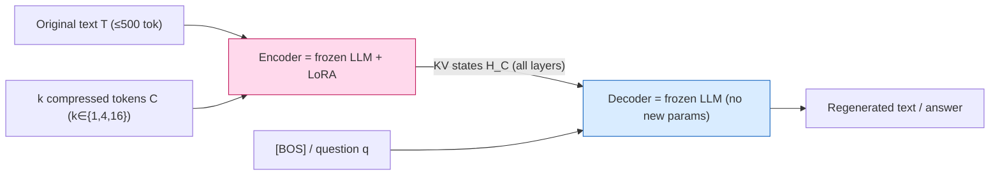

# 500xCompressor: Generalized Prompt Compression for LLMs — Li et al., 2024

> **arXiv:** 2408.03094v1 · **Venue:** preprint · **Affiliation:** University of Cambridge (Language Technology Lab)

## TL;DR
500xCompressor compresses up to ~500 natural-language tokens into **as few as one** special token,
reaching compression ratios of **6× to 480×** while adding only ~0.3% parameters (a LoRA on the
encoder). Its key departure from [ICAE](softtoken_2023_icae.md): the decoder is conditioned on the
compressed tokens' **key–value (KV) states in every layer**, not on their output embeddings — which
preserves far more information at high compression ratios. On a **strictly unseen** ArXiv benchmark
(published after the LLM's knowledge cutoff, ruling out data leakage), the frozen LLM retains
**62–73%** of its full-prompt QA ability from the compressed tokens.

## Problem & motivation
Long prompts slow inference, raise cost, and hit context limits. Soft-prompt compressors
([Gist](softtoken_2023_gisting.md), [AutoCompressor](softtoken_2023_autocompressor.md),
[ICAE](softtoken_2023_icae.md)) squeeze text into a few learned tokens, but the paper flags three
problems: (1) **low compression ratios** (ICAE tops out ≈15×); (2) **unquantified information loss**
(win-rate metrics don't measure what was dropped); and (3) **potential data leakage** — evaluation
texts (e.g. from the Pile) may overlap the LLM's pretraining, so "regenerated" content could be
recalled from parameters rather than the compressed tokens. 500xCompressor pushes the ratio to the
limit *and* evaluates on strictly-unseen, post-cutoff ArXiv text with **extractive** QA so information
loss is measurable against gold spans.

## Key idea
An autoencoder over a frozen LLM. The **encoder** is the frozen LLM $\boldsymbol{\Theta}_{\text{LLM}}$
with trainable LoRA $\boldsymbol{\Theta}_{\text{Lora}}$; the **decoder** is the same frozen LLM with
**no** added parameters. The encoder reads the original tokens $\mathbf{T}=(t_1,\dots,t_l)$ followed by
$k$ learnable **compressed tokens** $\mathbf{C}=(c_1,\dots,c_k)$; attention writes the text's
information into those $k$ slots, and their **KV values across all layers**, $\mathbf{H_C}$, are handed
to the decoder.

- **Regeneration (pretraining) objective** — reconstruct the original text from the KV states,
  triggered by the `[BOS]` token, with teacher forcing:
  $$
  \mathcal{L}_P=-\sum_{i=1}^{l}\log P\big(t_i \mid \mathbf{H_C},[\mathbf{BOS}],t_{1:i-1};\boldsymbol{\Theta}_{\text{LLM}},\boldsymbol{\Theta}_{\text{Lora}}\big).
  $$
- **QA (fine-tuning) objective** — answer a question from the KV states:
  $$
  \mathcal{L}_F=-\sum_{j=1}^{n}\log P\big(a_j \mid \mathbf{H_C},q_{1:m},a_{1:j-1};\boldsymbol{\Theta}_{\text{LLM}},\boldsymbol{\Theta}_{\text{Lora}}\big).
  $$

**Why KV, not embeddings?** ICAE feeds the decoder a single output **embedding** per compressed token;
500xCompressor instead supplies each token's **per-layer KV pair**, a much higher-capacity carrier that
**adds no inference cost and negligible memory**. Two design contrasts with ICAE: KV values in place of
embeddings, and the plain `[BOS]` token (rather than a new trainable token) to trigger regeneration.
The decoder's weights never change, so nothing about the evaluation text can be memorized in it.

## How it works

![Figure 2 (500xCompressor): the three phases. Left — Regeneration (pretraining): the LoRA-tuned LLM encodes the original text plus a compressed token 'c' into KV values, and the frozen LLM regenerates the original text from those KV values (triggered by [BOS]), trained by cross-entropy against the original. Middle — Question Answering (fine-tuning): the same KV values plus a question are fed to the frozen LLM, trained against the target answer. Right — Prediction: all parameters frozen; the compressed KV values plus a question yield the generated answer. Green 'KV values', pink = trainable (LoRA), blue = non-trainable.](_assets/softtoken_2024_500xcompressor/process.png)



Compression ratio is set by the number of compressed tokens $k$: 1, 4, or 16 slots absorb 96–480
original tokens, giving 6×–480×. An ablation shows the slots are **not equally used** — going 16→4
barely changes regeneration quality, but 4→1 drops it sharply, and 500xCompressor degrades **more
gracefully than ICAE** as $k$ shrinks.

## Training / data
- **Encoder LoRA only** (~0.3% params); decoder frozen. AdamW, batch 4; pretraining LR 1e-4,
  fine-tuning LR 5e-5.
- **Pretraining:** ArXiv Corpus (abstracts). Papers **before Jul 2023** → training; **Jan–Apr 2024** →
  dev/test. Since LLaMA-3's cutoff is Mar 2023, the test set is **strictly unseen**, so regenerations
  must come from the compressed tokens.
- **Fine-tuning:** ArxivQA — extractive QA pairs generated by LLaMA-3-70B-chat over the abstracts.
- **Backbone:** LLaMA-3-8B-Instruct. Baseline: ICAE (same backbone). Gold standards: zero-shot and
  instructed full-context.

## Results
From the paper (§4, Tables 2 & 5 normalized to instructed full-context = 100). Metrics: F1/EM (QA),
Rouge-l-f/BLEU (regeneration). "Retention" = % of full-prompt capability kept.

| Setting | Metric | 500xCompressor | ICAE | Source |
|---|---|---|---|---|
| Avg QA retention, 500→**16** | F1 (norm.) | **72.89%** | 71.16% | §4.2, Table 5 |
| Avg QA retention, 500→**4** | F1 (norm.) | **67.12%** | 66.01% | §4.2, Table 5 |
| Avg QA retention, 500→**1** | F1 (norm.) | **62.26%** | 40.90% | §4.2, Table 5 |
| Relation-Extraction gain @ 500→1 | F1 (abs.) | **+18.62** over ICAE | — | §4.2, Table 2 |
| Regeneration vs ICAE (all ratios) | Rouge-l-f | **+12.18 – 18.96** | — | §4.1 |
| Regeneration vs ICAE (all ratios) | BLEU | **+12.41 – 26.50** | — | §4.1 |

The headline is the **500→1** column: ICAE collapses to 40.9% average F1 while 500xCompressor holds
**62.3%** — direct evidence that **KV values preserve information far better than embeddings at extreme
compression**. Gains widen as the ratio increases, confirming KV's high-ratio advantage.

## Limitations & follow-ups
- **Small training corpora.** Pretrained/fine-tuned only on ArXiv abstracts + ArxivQA; broader,
  more diverse data is expected to extend it to more tasks.
- **Fidelity still falls at 480×.** One token cannot losslessly hold 500 tokens; fine-grained
  regeneration degrades, though QA often survives the loss.
- **Relation to neighbors.** 500xCompressor is the **"KV-carrier, frozen-decoder"** point of the
  soft-token family — it keeps [ICAE](softtoken_2023_icae.md)'s frozen-LLM convenience but swaps the
  embedding bottleneck for per-layer KV, contrasting with [COCOM](softtoken_2024_cocom.md)'s
  *decoder-tuning* route and [xRAG](softtoken_2024_xrag.md)'s single reused retriever embedding. The
  paper frames compressed tokens as a possible **"new LLM language"** (encode → transmit → adapt). For
  the repo's [MixedDecoder](../mixed_decoder/mixed_decoder.md) it is a strong argument to carry
  compressed context as **KV states** rather than one blown-up gist embedding.

## Links
- **arXiv:** [abs](https://arxiv.org/abs/2408.03094) · [html](https://arxiv.org/html/2408.03094v1) · [pdf](https://arxiv.org/pdf/2408.03094)
- **Code / models / demo:** [github.com/ZongqianLi/500xCompressor](https://github.com/ZongqianLi/500xCompressor)
- **BibTeX:**
  ```bibtex
  @article{li2024500xcompressor,
    title   = {500xCompressor: Generalized Prompt Compression for Large Language Models},
    author  = {Li, Zongqian and Su, Yixuan and Collier, Nigel},
    journal = {arXiv preprint arXiv:2408.03094},
    year    = {2024}
  }
  ```
- **Related papers:** [ICAE](softtoken_2023_icae.md) · [COCOM](softtoken_2024_cocom.md) · [xRAG](softtoken_2024_xrag.md) · [Gist Tokens](softtoken_2023_gisting.md) · [AutoCompressor](softtoken_2023_autocompressor.md)
- **In-repo:** [MixedDecoder](../mixed_decoder/mixed_decoder.md) · [Soft-token compression thread](../context/soft_token/soft_token.md) · [LCLM context-compression survey](../context/ctx_compression.md)
