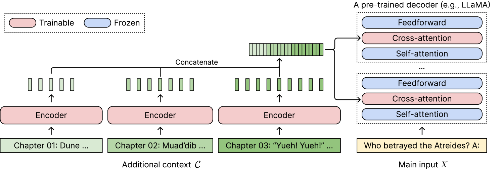
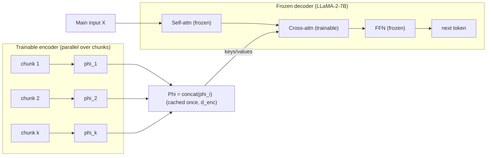

# CEPE: Long-Context Language Modeling with Parallel Context Encoding — Yen, Gao & Chen, 2024

> **arXiv:** 2402.16617v2 · **Venue:** ACL 2024 · **Affiliation:** Princeton NLP · **Code:** github.com/princeton-nlp/CEPE

## TL;DR
CEPE (Context Expansion with Parallel Encoding) bolts a **small frozen bidirectional encoder**
onto a **frozen** decoder-only LLM and connects them with **trainable cross-attention layers**
inserted into every decoder block. Long context is split into chunks, encoded **in parallel**,
and consumed by the decoder through cross-attention — so a model trained only on **8K-token**
inputs generalizes to **128K** with **10× the throughput** and **~1/6 the memory** of a fully
fine-tuned long-context baseline, and it shines on retrieval-augmented tasks where standard
long-context models degrade.

*Figure 1 — Additional context $\mathcal{C}$ is chunked; a **trainable encoder** (red) encodes
each chunk in parallel; the concatenated encoder states feed **trainable cross-attention**
layers (red) inserted between the **frozen** self-attention and feed-forward of every decoder
block (blue). The main input $X$ ("Who betrayed the Atreides?") is processed normally by the
frozen decoder.*

## Problem & motivation
Extending an LLM's context is bottlenecked by three problems at once: (1) quadratic attention
cost and KV memory, (2) positional encodings (RoPE/ALiBi) that fail to **extrapolate** beyond
the trained length, and (3) scarcity of high-quality **long** instruction data (long *unlabeled*
documents are plentiful). Existing fixes trade one for another — full fine-tuning is memory-
brutal, streaming attention loses information, and re-encoding contexts per pass (RePlug) is
slow. CEPE targets all three with a **lightweight, trainable add-on** that keeps the decoder
frozen and learns only from unlabeled text.

## Key idea
Keep the decoder frozen. Add a **small RoBERTa-style bidirectional encoder** (435M, LLaMA-2
vocab) that reads the extra context. Insert **one cross-attention module per decoder layer**
(between self-attention and FFN). The decoder's tokens form the **queries**; the encoder's
concatenated hidden states $\Phi$ form the **keys/values**. Because chunks are encoded
independently, encoding is embarrassingly parallel and its cost is linear in context length;
because $\Phi$ is cached **once** (at encoder dimension $d_{\text{enc}}\ll d_{\text{dec}}$)
rather than as per-layer decoder KV, memory collapses.

## How it works (reimplementation-grade walkthrough)
1. **Split** the input into $m$ context tokens (encoder side) and $n$ decoder tokens (e.g.
   $m=4\text{K}, n=4\text{K}$). Partition the context into **$k$ chunks of ~256 tokens**.
2. **Encode in parallel.** For each chunk $C_i$, $\phi_i = M_{\text{enc}}(C_i)$ (last-layer
   bidirectional states). Concatenate: $\Phi = [\phi_1;\dots;\phi_k]\in\mathbb{R}^{m\times d_{\text{enc}}}$.
3. **Cross-attend in every decoder layer $\ell$.** Query from decoder hidden states $X^{(\ell)}$
   (length $n$); key/value are up-projected from $\Phi$ (to $d_{\text{dec}}$):
   $$
   \mathrm{Attn}_\ell(Q,K,V) = \mathrm{softmax}\!\Big(\tfrac{QK^\top}{\sqrt d}\Big)V,\qquad
   Q = X^{(\ell)},\; K = \Phi W_k^{(\ell)},\; V = \Phi W_v^{(\ell)}.
   $$
   Cross-attention modules are **initialized from the decoder's own self-attention** (first
   $d_{\text{enc}}$ rows of K/V) with the **output projection zeroed**, so training starts as a
   no-op and gently learns to route encoder info in.
4. **Objective.** Next-token cross-entropy through the augmented model (encoder + cross-attn
   trainable, decoder frozen):
   $$
   \mathcal{L}_{\text{CE}} = -\log p_{\text{CEPE}}\big(x_{i+1}\mid x_1,\dots,x_i,\ M_{\text{enc}}(\mathcal{C})\big).
   $$
5. **Robustness masking.** During training, mask **30%** of encoder context (10% whole-chunk,
   90% suffix of a chunk) so the model tolerates variable chunk counts/lengths.
6. **Warmup.** First 4K steps feed the **same** short input to encoder and decoder so
   cross-attention learns to *copy* encoder states — teaching the decoder that encoder
   representations are worth reading.
7. **CEPED (distilled variant).** Add a KL term matching a full-context **teacher** (top-50
   vocab) to preserve instruction-following on LLaMA-2-Chat:
   $$
   \mathcal{L}_{\text{KL}} = D_{\text{KL}}\big(M_{\text{dec}}^{\text{teacher}}(S)\,\Vert\, M_{\text{CEPE}}(\mathcal{C},X)\big),\quad
   \mathcal{L}_{\text{total}} = \mathcal{L}_{\text{CE}} + 2\,\mathcal{L}_{\text{KL}}.
   $$

## Training / data
- **Base:** LLaMA-2-7B decoder (frozen); encoder = 435M RoBERTa-large config (24L/1024d),
  MLM-pretrained on RedPajama, then fine-tuned; **~1.8B** added params (encoder + 32
  cross-attn modules).
- **Data:** RedPajama, 2:1 mix of naturally-long docs (`RPtrain-filter`, ArXiv/Books ≥8K) to
  concatenated docs (`RPtrain-cat`). Each sequence 8192 tokens (4K context + 4K decoder input).
- **Compute:** 20B tokens (~1% of LLaMA-2 budget), 20K steps, batch 128, peak LR $3\times10^{-4}$
  cosine, AdamW; 8×A100-80GB (~750 GPU-hours).

## Results
| Setting | Metric | CEPE | Baseline |
|---|---|---:|---|
| LM @128K (avg 5 domains) | perplexity | **lower** than YaRN-128K on most | full-FT YaRN-128K |
| LM @128K | throughput | **9.90×** | 1.00× (YaRN-128K) |
| LM @128K | memory | **38.6 GB** | 235.6 GB (YaRN, 4×A100) |
| RA-LM (RedPajama, k=50 passages) | PPL | keeps improving | full-context models plateau/degrade |
| Open-domain QA (NQ, 60 psg) | EM | **34.07** | 30.58 (LLaMA-2-32K) |
| Open-domain QA (TriviaQA) | EM | **62.26** | 60.31 (LLaMA-2) |
| ICL (9 tasks, 2+38 demos) | acc | **62.8%** | 42.3% (2 demos) |

- Trained on **8K**, generalizes to **128K** with lower perplexity than a fully fine-tuned
  128K model — **10× throughput, 6× less memory**.
- Excels at **retrieval-augmented** settings: unlike full-context models, CEPE keeps improving
  as more (even irrelevant) passages are added.
- **CEPED** beats LLaMA-2-32K-Instruct on 4/6 ZeroSCROLLS tasks despite training only on
  *unlabeled* data.

## Limitations & follow-ups
- Studied only at LLaMA-2-7B scale; fixed Contriever retriever.
- Encoder has no cross-chunk (demo–demo) interaction → an ICL ceiling vs. a 40-demo oracle.
- Struggles on synthetic needle-in-haystack at certain lengths (train/test length mismatch).
- **Relation to the thread:** CEPE is the **parallel cross-attention** member of the soft-token
  family — where [ICAE](softtoken_2023_icae.md)/[AutoCompressor](softtoken_2023_autocompressor.md)
  feed soft tokens as a *prefix*, CEPE injects encoder states via *cross-attention*.
  [REFRAG](softtoken_2025_refrag.md) later beats CEPE on TTFT by making expansion selective,
  and [LCLM](../context/ctx_compression.md) scales the prefix-style variant to >350B tokens.
  See the [soft-token thread](../context/soft_token/soft_token.md) and the
  [context-compression review](../context/ctx_compression.md).

## Links
- **arXiv:** [abs](https://arxiv.org/abs/2402.16617) · [html](https://arxiv.org/html/2402.16617v2) · [pdf](https://arxiv.org/pdf/2402.16617)
- **Code:** https://github.com/princeton-nlp/CEPE
- **Venue:** ACL 2024
- **Related papers:** [ICAE](softtoken_2023_icae.md) · [AutoCompressor](softtoken_2023_autocompressor.md) · [xRAG](softtoken_2024_xrag.md) · [E2LLM](softtoken_2025_e2llm.md) · [REFRAG](softtoken_2025_refrag.md) · [LCLM thread](../context/soft_token/soft_token.md)
