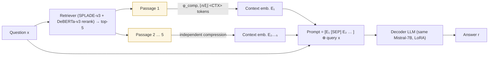

# COCOM: Context Embeddings for Efficient Answer Generation in RAG — Rau et al., 2024

> **arXiv:** 2407.09252v2 · **Venue:** WSDM 2025 · **Affiliation:** University of Amsterdam · University of Queensland · Naver Labs Europe

## TL;DR
COCOM (**CO**ntext **CO**mpression **M**odel) compresses each retrieved passage into a **handful of
context embeddings** and feeds them to the LLM in place of the raw tokens, cutting RAG answer-generation
time by up to **5.69×** and FLOPs by up to **22×**. Its two distinguishing choices versus prior
embedding compressors ([ICAE](softtoken_2023_icae.md), [xRAG](softtoken_2024_xrag.md),
[AutoCompressor](softtoken_2023_autocompressor.md)): it **tunes the decoder** (not just the compressor)
and it **handles multiple documents** at once, with an **adaptable compression rate** $\xi\in\{4,16,128\}$.
A single Mistral-7B plays both compressor and decoder; a lighter BERT-compressor variant (COCOM-light)
trades quality for cheaper offline compression.

## Problem & motivation
RAG improves knowledge-intensive QA by prepending retrieved passages, but that **inflates the input** —
often 5+ documents — and transformer self-attention makes long inputs slow, directly increasing the
latency a user waits for an answer. Embedding-based compressors shrink the context into a few soft
tokens, but the paper argues prior methods leave three gaps:

- **Frozen decoder.** ICAE/xRAG tune only the compressor and apply the decoder zero-shot; the authors
  hypothesize that **context embeddings differ fundamentally from token embeddings**, so a frozen
  decoder cannot use them well.
- **Fixed compression rate.** No trade-off knob between latency and answer quality.
- **Single-document only.** Effective prior methods compress one passage, but multi-doc reasoning is
  where RAG shines.

COCOM targets all three: tune everything, expose $\xi$, and support many passages.

## Key idea
Compress a context $\mathcal{C}=\{t_1,\dots,t_n\}$ with a compressor $\phi_{\text{comp}}$ into a small
set of **context embeddings** $\mathcal{E}=\{e_1,\dots,e_k\}$, $k\ll n$, each $e_i\in\mathbb{R}^d$ living
in the **LLM's hidden dimension** $d$:

$$
\phi_{\text{comp}}:\{t_1,\dots,t_n\}\rightarrow\{e_1,\dots,e_k\}\in\mathbb{R}^{d},
\qquad
\theta_{\text{LLM}}:\{\mathcal{E},x\}\rightarrow r,
$$

where $x$ is the user question and $r$ the generated answer. The **number of embeddings** follows the
compression rate $\xi$ and input length $n$:

$$
k=\left\lfloor \frac{n}{\xi} \right\rfloor .
$$

For the full model, **the compressor *is* the decoder** ($\phi_{\text{comp}}=\theta_{\text{LLM}}$): a
special `<AE>` token is prepended and $k$ learnable `<CTX>` tokens are appended; the compressor's
**last-layer hidden states at the `<CTX>` positions** become $\mathcal{E}$, then fed back into the same
model for answer generation. **Multiple passages** are compressed independently and concatenated with
`[SEP]` separators. Because contexts are compressed *independently of the query*, embeddings can be
**pre-computed offline and cached**.

## How it works




- **COCOM (full):** one Mistral-7B-Instruct-v0.2 does both jobs; LoRA-tuned. Context embeddings = its
  last hidden states at `<CTX>` positions.
- **COCOM-light:** compressor = `bert-base-uncased`. Because BERT's hidden size $b$ differs from the LLM's
  $d$, a learned linear projection $W\in\mathbb{R}^{\gamma\, b\times d}$ maps **blocks of $\gamma$ token
  representations** into one context embedding — a block-wise aggregation. Cheaper to run offline (up to
  **89×** faster compression) but weaker at high $\xi$.

## Training / data
Everything is **parameter-efficient LoRA**, in two phases:

**1. Pre-training** — two auto-regressive tasks sampled with equal probability, on **Wikipedia-KILT**
split into 128-token chunks (Llama-2 tokenizer), **10M samples**:

- **Auto-encoding (AE):** reconstruct the input from its own context embeddings —
  $$
  \mathcal{E}=\phi_{\text{comp}}(x_1,\dots,x_T),\qquad
  \mathcal{L}=-\!\!\sum_{x_t\in\mathcal{X}}\log P_{\theta_{\text{LLM}}}\!\big(x_t\mid\mathcal{E},x_1,\dots,x_{t-1}\big).
  $$
- **Language Modeling from Context Embeddings (LMCE):** split $\mathcal{X}$ into $\mathcal{X}_A,\mathcal{X}_B$;
  compress $\mathcal{X}_A$ and generate the continuation $\mathcal{X}_B$ —
  $$
  \mathcal{L}=-\!\!\sum_{x_t\in\mathcal{X}_B}\log P_{\theta_{\text{LLM}}}\!\big(x_t\mid\phi_{\text{comp}}(\mathcal{X}_A),x_1,\dots,x_{t-1}\big).
  $$
  AE alone biases the model toward *copying*; LMCE forces it to actually **use** the compressed content.

**2. Fine-tuning** — instruction tuning on a combined QA pool (~493K examples: NQ, MS MARCO, Adversarial
QA, HotpotQA, WikiQA, SciQ, ASQA, TriviaQA, FreebaseQA, SQuAD), loss on the target response only:
$$
\mathcal{L}=-\!\!\sum_{r_t\in R}\log P_{\theta_{\text{LLM}}}\!\big(r_t\mid I_{\mathcal{E},q},r_1,\dots,r_{t-1}\big).
$$

Retrieval uses **SPLADE-v3** with **DeBERTa-v3** reranking (top-50 → top-5). Backbone **Mistral-7B-Instruct-v0.2**.

## Results
From the paper (Tables 2, 3, 6), Exact Match (EM) on five QA sets; efficiency on NQ.

| Setting | Metric | Value | Source |
|---|---|---|---|
| Quality drop vs. uncompressed RAG (upper bound), $\xi=4$ | avg EM | **−4 pts** | §5.1 |
| Quality drop vs. uncompressed RAG, $\xi=128$ | avg EM | −10 pts | §5.1 |
| Gain over closed-book (no context) | avg EM | **+17 pts** | §5.1 |
| vs. xRAG Mixtral-8×7B (8× params) | avg EM | **COCOM wins by large margin** | §5.1 |
| Decoding time, $\xi=4$ / $16$ / $128$ | ms (speedup) | 371 (2.87×) / 213 (5.00×) / 187 (**5.69×**) | §5.3, Table 3 |
| GFLOPs, $\xi=128$ | speedup | **22×** | §5.3, Table 3 |
| **Ablation:** freeze decoder ($\xi=128$, NQ) | EM | 0.519 → **0.421** | §5.4.4, Table 6 |
| **Ablation:** no pre-training ($\xi=128$, NQ) | EM | 0.519 → 0.490 | §5.4.4, Table 6 |

The **decoder-tuning ablation is the headline**: freezing the decoder (as prior methods do) drops NQ EM
from 0.519 to 0.421 — direct evidence for the paper's central hypothesis. Reconstruction quality (Table 7)
stays near-perfect at $\xi=4$ (AE Rouge-L 0.998) but collapses at $\xi=128$ (0.555), explaining the
quality/latency trade.

## Limitations & follow-ups
- **7B-scale, 5-doc, English QA only.** Compute limits cap experiments at Mistral-7B, top-5 documents,
  and QA — the multi-doc efficiency edge should widen with more documents but isn't tested at scale.
- **High-ratio fidelity.** At $\xi=128$ both variants struggle to reconstruct/answer; COCOM-light
  degrades more (its projection capacity scales with $\gamma$).
- **Relation to neighbors.** COCOM is the "**tune-everything, multi-context, AE+LM pre-training**" point
  in the soft-token family — contrast [ICAE](softtoken_2023_icae.md) (frozen decoder, single doc),
  [xRAG](softtoken_2024_xrag.md) (reuse frozen retriever embeddings, one token), and
  [AutoCompressor](softtoken_2023_autocompressor.md) (recurrent summary vectors, NTP-only). It directly
  validates design choices explored in the repo's [MixedDecoder](../mixed_decoder/mixed_decoder.md):
  emit several latents per chunk, tune the decoder, and pre-train with reconstruction **plus** an LM
  objective — the same recipe [LCLM](../context/ctx_compression.md) later scales.

## Links
- **arXiv:** [abs](https://arxiv.org/abs/2407.09252) · [html](https://arxiv.org/html/2407.09252v2) · [pdf](https://arxiv.org/pdf/2407.09252)
- **Code:** integrated in [BERGEN](https://github.com/naver/bergen) (Naver Labs RAG library)
- **BibTeX:**
  ```bibtex
  @inproceedings{rau2024cocom,
    title     = {Context Embeddings for Efficient Answer Generation in RAG},
    author    = {Rau, David and Wang, Shuai and D{\'e}jean, Herv{\'e} and Clinchant, St{\'e}phane},
    booktitle = {Proceedings of the 18th ACM International Conference on Web Search and Data Mining (WSDM)},
    year      = {2025}
  }
  ```
- **Related papers:** [ICAE](softtoken_2023_icae.md) · [xRAG](softtoken_2024_xrag.md) · [AutoCompressor](softtoken_2023_autocompressor.md) · [Gist Tokens](softtoken_2023_gisting.md) · [LLMLingua](hardtoken_2023_llmlingua.md)
- **In-repo:** [MixedDecoder](../mixed_decoder/mixed_decoder.md) · [Soft-token compression thread](../context/soft_token/soft_token.md) · [LCLM context-compression survey](../context/ctx_compression.md)
