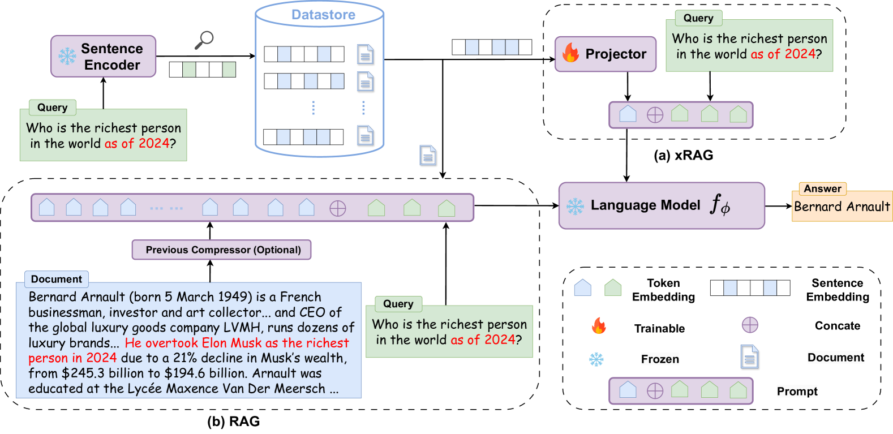
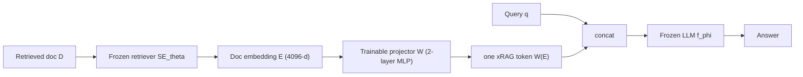

# xRAG: Extreme Context Compression for RAG with One Token — Cheng et al., 2024

> **arXiv:** 2405.13792v2 · **Venue:** NeurIPS 2024 · **Code:** github.com/Hannibal046/xRAG

## TL;DR
xRAG compresses **an entire retrieved document into a single token** by treating the dense
**retriever's embedding as a new "modality"** and projecting it into the LLM's input space with
a tiny trainable MLP. Both the **retriever and the LLM stay frozen** — only the projector
(~0.1–0.5% of the LLM) is trained, via paraphrase pretraining + self-distilling instruction
tuning. The result is **~178× token compression**, **3.53× fewer FLOPs**, and a **~10% average
gain** across six knowledge-intensive QA benchmarks, with strong robustness to noisy retrieval.

*Figure 1 — **(a) xRAG:** the frozen sentence encoder's document embedding is mapped by a
**trainable projector** (🔥) into one token that is concatenated with the query and fed to the
**frozen** LLM $f_\phi$. **(b) RAG:** the full document text is concatenated with the query
(many tokens). xRAG replaces the whole blue document span with a single projected token.*

## Problem & motivation
RAG improves factuality but pays for it in prompt length: full documents blow up compute and
overflow context windows. Prior compressors each fall short for web-scale RAG — soft-prompt
methods ([Gisting](softtoken_2023_gisting.md), [AutoCompressor](softtoken_2023_autocompressor.md),
[ICAE](softtoken_2023_icae.md)) must **store LLM activations** (~1 MB/token) for *millions* of
documents; hard-prompt methods (LLMLingua, RECOMP) only reach 8–26× and often need full LLM
fine-tuning. xRAG's insight: a modern dense retriever **already** distilled each document into
a single high-dimensional embedding via contrastive learning — so *reuse that embedding* as the
compressed representation instead of recomputing anything.

## Key idea
Project the frozen retriever's document embedding $E=\mathcal{SE}_\theta(D)\in\mathbb{R}^{d_e}$
directly into the LLM embedding space with a two-layer MLP projector $W:\mathbb{R}^{d_e}\to
\mathbb{R}^{d_h}$, yielding a **single input token** $W(E)$. Insert it where the document would
have gone; the frozen LLM reads it like any embedding. The only trainable object is $W$.

## How it works (reimplementation-grade walkthrough)
1. **Offline.** Encode every corpus document once with the frozen retriever (SFR, 4096-d) and
   cache the embeddings — the same vectors the retriever already produces, so **zero extra
   memory** vs. plain RAG.
2. **Projector.** A 2-layer MLP maps the 4096-d embedding to the LLM hidden size; the output is
   one **xRAG token** $W(E)$ placed in front of the query tokens: input $=W(E)\oplus\mathrm{Emb}(q)$.
3. **Stage 1 — paraphrase pretraining** (~2M pairs). Teach the LLM to *read* the projected
   token by making it reconstruct the document text conditioned on $W(E)$:
   $$
   \mathcal{L}_{\text{nll}} = -\sum_{i=1}^{L}\log p_\phi\big(d_i \mid W(E),\ \mathcal{X}_{\text{instruct}},\ d_{<i}\big).
   $$
   Diverse instruction templates ("The above text could be paraphrased as: …") prevent
   overfitting to one phrasing.
4. **Stage 2 — context-aware instruction tuning** (~1M triples). Optimize answer likelihood
   **plus a self-distillation KL** that treats *uncompressed* RAG as the teacher and xRAG as the
   student:
   $$
   \mathcal{L}_{\text{kl}} = D_{\text{KL}}\big(p_\phi(\text{ans}\mid \text{context},\cdot)\,\Vert\,p_\phi(\text{ans}\mid W(E_{\text{context}}),\cdot)\big),\qquad
   \mathcal{L}_{\text{total}} = \mathcal{L}_{\text{nll}} + \alpha\,\mathcal{L}_{\text{kl}},\ \ \alpha=2.
   $$
   The KL is what makes xRAG **robust to noisy retrieval**: when the single token is misleading,
   the student learns to fall back on the LLM's internal knowledge.
5. **Serve.** Retrieve → look up cached embedding → project → prepend one token → generate. Input
   length per document drops from ~175 tokens to **1**.

## Training / data
- **LLMs (frozen):** Mistral-7B-Instruct, Mixtral-8×7B-Instruct.
- **Retriever (frozen):** SFR embedding (4096-d, MTEB top at the time); ablated with
  E5-Mistral, BGE, Dragon, DPR — stronger embeddings → better downstream.
- **Data:** paraphrase pretraining ~2M (doc, embedding) pairs from Wikipedia (Dec-2021, ~37M
  passages); instruction tuning ~955K (reading comprehension + open-domain QA + summarization).
- **Trainable params:** projector only — **0.46%** of Mistral-7B, **0.07%** of Mixtral;
  LR 6e-3 (stage 1) / 2e-5 (stage 2), $\alpha=2$, 8×A100.

## Results
| Metric | xRAG (Mistral-7B) | xRAG (Mixtral-8×7B) | Baseline |
|---|---:|---:|---|
| Avg over 6 QA benchmarks | 44.58% | **51.45%** | +~10% vs. no-retrieval |
| Natural Questions (EM) | 39.10 | 47.48 | — |
| TriviaQA (EM) | 65.77 | 74.14 | — |
| HotpotQA (multihop EM) | 34.05 | 39.66 | weakest area |
| Token compression | **178×** | 178× | 175.1 → 1 token |
| GFLOPs | **3.53× fewer** | — | vs. full RAG |
| Resilience rate (noisy docs) | 82.3% | 84.9% | 75.2% (RAG) |

- **178× compression** at essentially one token per document, with **3.53× FLOPs** reduction.
- **Self-distillation is decisive:** removing the KL term drops average performance and
  robustness (resilience 82–85% vs. RAG's 75%).
- **Weak spot:** multi-hop reasoning (HotpotQA/FactKG) lags — reasoning data is under-represented.

## Limitations & follow-ups
- Single dense vector only (no sparse/multi-vector retrieval); document-level granularity only.
- Multi-hop reasoning underperforms; evaluated mostly top-1 retrieval.
- **Relation to the thread:** xRAG is the **extreme-ratio, RAG-specialized** member — it reuses a
  frozen *retriever* embedding rather than learning an encoder like
  [CEPE](softtoken_2024_cepe.md)/[E2LLM](softtoken_2025_e2llm.md). Its "embedding-as-modality"
  framing echoes the [LLaVA](../context/soft_token/soft_token.md)-style adapter that
  [E2LLM](softtoken_2025_e2llm.md) and [LCLM](../context/ctx_compression.md) also adopt.
  See the [soft-token thread](../context/soft_token/soft_token.md) and the
  [context-compression review](../context/ctx_compression.md).

## Links
- **arXiv:** [abs](https://arxiv.org/abs/2405.13792) · [html](https://arxiv.org/html/2405.13792v2) · [pdf](https://arxiv.org/pdf/2405.13792)
- **Code:** https://github.com/Hannibal046/xRAG
- **Venue:** NeurIPS 2024
- **Related papers:** [ICAE](softtoken_2023_icae.md) · [CEPE](softtoken_2024_cepe.md) · [E2LLM](softtoken_2025_e2llm.md) · [REFRAG](softtoken_2025_refrag.md) · [LCLM thread](../context/soft_token/soft_token.md)
