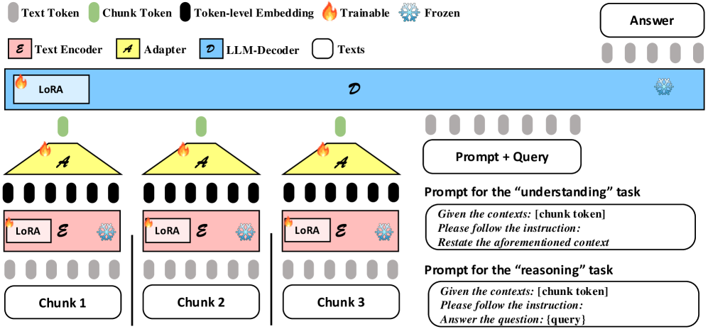
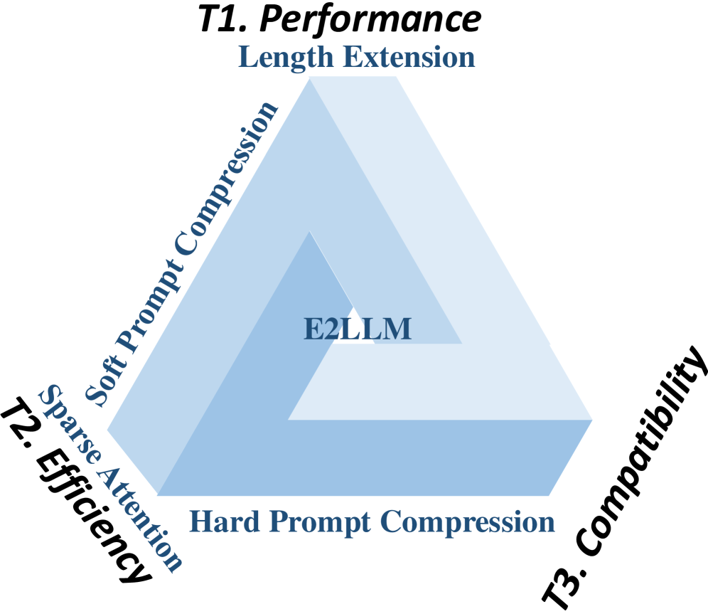
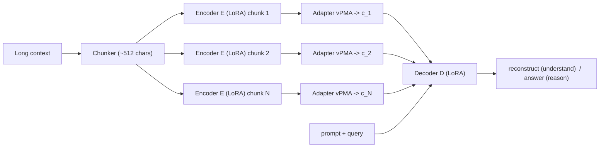

# E2LLM: Encoder Elongated Large Language Models for Long-Context Understanding — Liao et al., 2025

> **arXiv:** 2409.06679 · **Venue:** EMNLP 2025 · **Code:** github.com/codefuse-ai/E2LLM

## TL;DR
E2LLM chunks a long context, encodes each chunk with a **pretrained text encoder** into
token-level embeddings, compresses each chunk to a **single soft "chunk token"** via a small
pooling-attention **adapter**, and feeds those tokens to a decoder LLM (LoRA-tuned). A **dual
objective** — reconstruct the context ("understanding") *and* answer queries ("reasoning") —
lets the decoder interpret the compressed tokens. With only **~11M trainable params** and ~13K
samples it tops long-context benchmarks (best on LongBench-v2 among 7B models) at **~100×
compression** and lower inference latency.

*Figure 1 — Each **chunk** is encoded (LoRA'd frozen text encoder $\mathcal{E}$, red) into
token-level embeddings, compressed by the **adapter** $\mathcal{A}$ (yellow) into one green
**chunk token**, and passed to the **decoder** $\mathcal{D}$ (LoRA'd, blue). Two prompts drive
training: the "understanding" prompt asks the decoder to restate the context; the "reasoning"
prompt asks it to answer the query.*

## Problem & motivation
Long-context methods sit inside an **"impossible triangle"**: strong task **performance**, low
compute **efficiency**, and **compatibility** with pretrained models — most methods win two and
lose one. Length-extension (RoPE scaling) needs billions of continued-pretraining tokens; sparse
attention loses mid-sequence information; LLM-as-encoder compressors diverge from the decoder's
next-token objective. E2LLM's bet: **reuse a pretrained *embedding* encoder** (already optimized
to summarize a span via contrastive learning) and align it to a frozen-ish decoder with a tiny
adapter — hitting all three corners at once.

*Figure 2 — Performance, efficiency, and pretrained-model compatibility are hard to satisfy
together; E2LLM claims all three by combining a pretrained encoder + decoder via a light adapter.*

## Key idea
Four components in series: **Chunker** → **text encoder** $\mathcal{E}_\theta$ → **adapter**
$\mathcal{A}_\phi$ (a variant of *Pooling by Multihead Attention*, vPMA) → **decoder**
$\mathcal{D}_\eta$. The adapter compresses a chunk's token-level embeddings into a **single chunk
token** in the decoder's embedding space; the decoder consumes the sequence of chunk tokens plus
the prompt with **full attention**.

## How it works (reimplementation-grade walkthrough)
1. **Chunk** the context at ~512-character (~100-token) boundaries, backtracking to sentence/line
   ends so chunks stay semantically clean; a length-$L$ context yields $L/C$ chunks.
2. **Encode** each chunk with a frozen (LoRA) encoder (GTE-Large-en / BGE), keeping **all** token
   embeddings $\mathbf{X}\in\mathbb{R}^{C\times d_{\text{enc}}}$ (not just `[CLS]`).
3. **Compress + align with vPMA.** A learnable query $\mathbf{q}$ attends over the chunk's tokens
   and projects to the decoder dimension in one shot:
   $$
   \mathbf{K}=\mathbf{X}\mathbf{W}_K,\quad \mathbf{V}=\mathbf{X}\mathbf{W}_V,\quad
   \mathbf{h}=\mathrm{LN}\big(\mathrm{MHA}(\mathbf{q},\mathbf{K},\mathbf{V})+\mathbf{q}\big),\quad
   \mathbf{c}=\mathrm{LN}\big(\mathbf{h}+\mathrm{FFN}(\mathbf{h})\big),
   $$
   with $\mathbf{W}_K,\mathbf{W}_V\in\mathbb{R}^{d_{\text{enc}}\times d_{\text{dec}}}$, 4 heads
   (ablation-optimal). Output $\mathbf{c}$ is the chunk token. All chunks run in parallel.
4. **Interleave** chunk tokens with the prompt: `[prompt] c_1 c_2 … c_N [query]` → decoder.
5. **Dual objective.**
   - *Understanding* (self-supervised reconstruction over a sliding window of chunks):
     $$
     \mathcal{L}_{\text{recon}} = -\sum_{t=1}^{T_{\text{ctx}}}\log P\big(x_t \mid \mathbf{c}_1,\dots,\mathbf{c}_k,\ x_{<t}\big).
     $$
   - *Reasoning* (answer generation from the full chunk-token set + query):
     $$
     \mathcal{L}_{\text{reason}} = -\sum_{t=1}^{T_{\text{ans}}}\log P\big(y_t \mid \mathbf{c}_1,\dots,\mathbf{c}_N,\ \text{query}\big).
     $$
   - Combined: $\mathcal{L}_{\text{total}} = \lambda_{\text{recon}}\,\mathcal{L}_{\text{recon}} + \mathcal{L}_{\text{reason}}$,
     with $\lambda_{\text{recon}}$ tiny (~1e-7–1e-9) because reconstruction generates far more
     (sliding-window) samples; model selection uses the reasoning loss only.
6. **Serve.** Encode + compress each chunk once; the decoder attends over ~100× fewer positions
   than raw tokens, so long-context inference is faster and fits one 80 GB GPU.

## Training / data
- **Encoder:** GTE-Large-en (or BGE), LoRA rank 16–32; **Decoder:** Llama-2-7B-chat (Qwen2.5-7B-
  Instruct for LongBench-v2), LoRA rank 8–16. **~11M** trainable params total (0.15% of 7B).
- **Data:** ~13K samples across QMSum, GovReport, QuALITY, NarrativeQA, TriviaQA (95/5
  train/val); LongBench-v2 adds self-distillation to avoid forgetting.
- **Recipe:** LR 1e-4, batch 12, AdamW + DeepSpeed + FlashAttention-2, 16×A100; vPMA 4 heads.

## Results
| Benchmark | Metric | E2LLM | Notable baseline |
|---|---|---:|---|
| Doc summ/QA (avg over 5 sets) | mixed | **best across all** | LLoCO / LongLoRA / YaRN |
| GovReport | G-mean | **18.43** | 16.35 (LongLoRA) |
| LongBench-v2 (Qwen2.5-7B dec) | overall | **31.8** | 31.2 (Qwen2.5-7B SFT), 30.0 (orig) |
| LongBench-v2 "Long" (128K–2M) | acc | **28.7** | 24.1 (orig Qwen2.5-7B); +19% rel. |
| Inference (Long, Transformers) | time | **46.3 s** | 34.3 s vLLM SFT; SFT OOM in HF |

- **Best 7B model on LongBench-v2**, surpassing Qwen2.5-7B-ft, Llama3.1-8B, and even some 70B
  models; +19% relative on the hardest "Long" split.
- **~41.8% inference-time reduction** vs. the SFT decoder in the same framework; ~100×
  compression vs. LLoCO's 32×.
- **Ablation lesson:** the reconstruction ("understanding") loss is essential but must be
  down-weighted; 4 vPMA heads and moderate LoRA ranks are optimal.

## Limitations & follow-ups
- Long fine-tuning data is expensive; chunk-size still needs tuning per domain.
- Lossy (semantic) compression → weak on exact needle-in-a-haystack recall (helped by adding RAG).
- **Relation to the thread:** E2LLM is the **embedding-encoder + adapter + dual-objective**
  member, sitting between [CEPE](softtoken_2024_cepe.md) (cross-attention connector) and
  [LCLM](../context/ctx_compression.md) (which confirms embedding-init + MLP adapter + NTP/
  reconstruction mixture at >350B tokens). Its dual objective is the recurring
  [ICAE](softtoken_2023_icae.md)→E2LLM→LCLM lesson that **reconstruction + NTP** beats either
  alone. See the [soft-token thread](../context/soft_token/soft_token.md) and the
  [context-compression review](../context/ctx_compression.md).

## Links
- **arXiv:** [abs](https://arxiv.org/abs/2409.06679) · [html](https://arxiv.org/html/2409.06679v2) · [pdf](https://arxiv.org/pdf/2409.06679)
- **Code:** https://github.com/codefuse-ai/E2LLM
- **Venue:** EMNLP 2025
- **Related papers:** [ICAE](softtoken_2023_icae.md) · [CEPE](softtoken_2024_cepe.md) · [xRAG](softtoken_2024_xrag.md) · [REFRAG](softtoken_2025_refrag.md) · [LCLM thread](../context/soft_token/soft_token.md)
