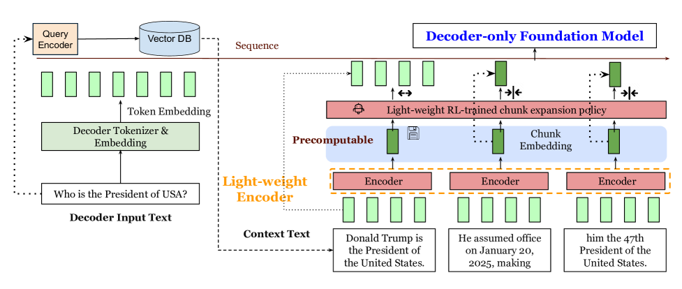
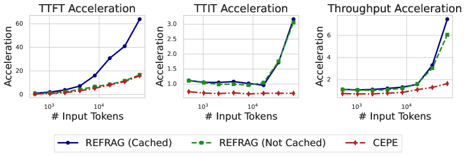
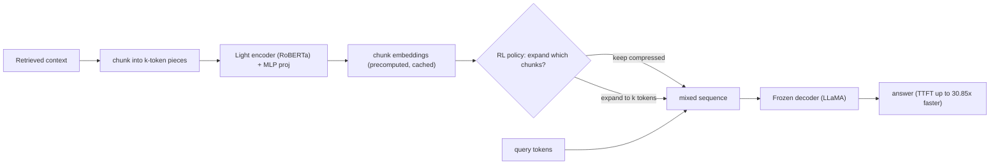

# REFRAG: Rethinking RAG based Decoding — Lin et al., 2025

> **arXiv:** 2509.01092v1 · **Affiliation:** Meta Superintelligence Labs · NUS · Rice · **Code:** github.com/facebookresearch/refrag

## TL;DR
REFRAG accelerates RAG decoding by **compressing** each retrieved chunk into one embedding via a
lightweight encoder, feeding those embeddings straight to the decoder, and using a **reinforcement-
learning policy to selectively *expand*** the few chunks that matter back into full tokens. This
**compress–sense–expand** loop exploits the **block-diagonal attention sparsity** of RAG contexts
to deliver up to **30.85× time-to-first-token speedup (3.75× over CEPE)** with **no perplexity
loss** and **16× context extension**.

*Figure 1 — Context text is chunked and encoded by a **lightweight encoder** into **precomputable
chunk embeddings**. A **light-weight RL-trained expansion policy** decides which chunks to expand
(dark green, full tokens) vs. keep compressed (single embedding); the mixed sequence of token +
chunk embeddings is decoded by the frozen **decoder-only foundation model**.*

## Problem & motivation
RAG prompts concatenate many retrieved passages, but only a few are relevant, and prefill cost
grows **quadratically** — so time-to-first-token (TTFT) dominates latency. Two signals are wasted:
the **passage embeddings** already computed at retrieval, and the observation that retrieved
passages are mutually dissimilar, producing **block-diagonal attention** (strong within-passage,
weak cross-passage) — very different from generic long-context. REFRAG turns both into speed.

*Figure 2 — Empirical acceleration exploiting RAG sparsity: attention concentrates within
passages (diagonal blocks) and is weak across passages, so most cross-passage computation is
wasted — the structural justification for compressing chunks by default.*

## Key idea
Split the context into fixed **$k$-token chunks** (e.g. $k=16$). Encode each with a small
**RoBERTa** encoder and project to the decoder's embedding size — one embedding per chunk,
shrinking the sequence by ~$k×$. Then a learned **RL policy** *senses* which chunks are important
and **expands** them back to full tokens; everything else stays compressed. The decoder runs over
the mixed sequence, preserving autoregressive causality and allowing compression **anywhere**
(not just prefixes) — so multi-turn and non-prefix RAG are supported.

## How it works (reimplementation-grade walkthrough)
1. **Compress.** Chunk context tokens into $L=s/k$ chunks $C_i$; encode + project:
   $$
   \mathbf{e}_i^{\text{cnk}} = \phi\big(\mathcal{M}_{\text{enc}}(C_i)\big),\qquad
   C_i=\{x_{q+ki},\dots,x_{q+ki+k-1}\},
   $$
   where $\phi$ is a 2-layer MLP. Chunk embeddings are **precomputable and cacheable** across
   requests.
2. **Feed the decoder** a shortened sequence — query tokens + $L$ chunk embeddings:
   $$
   \hat y \sim \mathcal{M}_{\text{dec}}\big(\{\mathbf{e}_1,\dots,\mathbf{e}_q,\ \mathbf{e}_1^{\text{cnk}},\dots,\mathbf{e}_L^{\text{cnk}}\}\big),
   $$
   cutting attention cost from $O(s^2)$ toward $O((s/k)^2)$.
3. **Train in 3 phases.**
   - *Reconstruction* (freeze decoder; train encoder+projection): rebuild $x_{1:s}$ from
     compressed embeddings, under a **curriculum** from single-chunk to multi-chunk (geometric
     schedule) — the paper shows this is essential (recon PPL 0.669 vs. 3.719 without curriculum).
   - *Continual pretraining* (unfreeze all): next-paragraph prediction
     $\mathcal{L}_{\text{CPT}}=-\log P(x_{s+1:s+o}\mid E(x,\{l_j\}))$, again with curriculum.
   - *Selective compression via RL* + downstream SFT.
4. **RL expansion policy.** Sequentially pick $T'=pL$ chunks to expand. State = chunk embeddings;
   a 2-layer transformer $g_\theta$ scores them; sample without replacement:
   $$
   \pi_\theta(l_t=i\mid \text{state}) = \frac{\exp(s_i)}{\sum_{j\notin\{l_1,\dots,l_{t-1}\}}\exp(s_j)},\qquad
   \mathbf{s}=g_\theta(\{\mathbf{c}_i\}).
   $$
   **Reward** = negative next-token perplexity of the decoder given the expansion set,
   $r=-\mathcal{M}_{\text{dec}}(x_{s+1:s+o}\mid E(x,\{l_j\}))$, optimized with **GRPO** (grouped
   baseline advantage $A_t^{(i)}=(r_i-\mathrm{mean})/\mathrm{std}$, PPO clip).
5. **Serve.** Cache chunk embeddings; at query time expand the RL-selected chunks and decode —
   TTFT drops sharply because most of the context is a handful of embeddings.

## Training / data
- **Decoder:** LLaMA-2-7B / -13B (also LLaMA-3.1-8B, 3.2-3B); **Encoder:** RoBERTa-Base (125M) /
  -Large (355M); projection = 2-layer MLP.
- **Data:** 20B-token CPT set from SlimPajama (50% ArXiv + 50% Books); eval on PG19, Proof-Pile,
  and RAG suites (MMLU, NQ, TriviaQA, HotpotQA, multi-turn TopiOCQA/ORConvQA/QReCC, ArXiv/PubMed
  summarization); retriever DRAGON+ over 400M passages.
- **Compute:** 64×H100 (8 nodes), bf16, FSDP, 4 epochs; compression $k\in\{8,16,32\}$; LRs recon
  2e-4 / CPT 5e-5 / SFT 2e-5.

## Results
| Metric | REFRAG | Baseline |
|---|---:|---|
| TTFT @16K, $k=16$ (cached) | **16.53×** vs LLaMA | 2.01× (CEPE) |
| TTFT, $k=32$ | **32.99×** vs LLaMA; 3.75× vs CEPE | — (abstract: 30.85×) |
| CPT perplexity (avg 4 sets) | **9.3% better** than CEPE | CEPE |
| Context extension | **16×** (extrapolates 4× beyond train len) | — |
| Multi-choice RAG @80 passages | ~49–51% (near full) | CEPE collapses to ~26% |
| ArXiv summ (1024 tok, ROUGE-1) | **43.88** | 25.20 (CEPE), 4.34 (LLaMA-32K) |

- **No accuracy tax:** despite aggressive compression, perplexity **improves ~9.3% over CEPE**
  and matches full-context LLaMA, while cutting TTFT by up to **30.85×**.
- **Selective RL expansion beats heuristics** (random / perplexity-ordered) across compression
  rates — spending tokens only where they help.
- **Robust at scale:** at 80 passages, CEPE (prefix-only compression) collapses to ~26% while
  REFRAG stays near full-context accuracy.

## Limitations & follow-ups
- Compression beyond $k=32$ degrades sharply (at $k=64$ quality drops).
- Benefits are specific to block-diagonal (RAG / long-context) attention; RL policy adds minor
  overhead; requires external caching infrastructure.
- **Relation to the thread:** REFRAG is the **selective-expansion** member — it keeps
  [CEPE](softtoken_2024_cepe.md)'s parallel-encoder idea but adds an RL policy for the
  **expand-on-demand** operation that [LCLM](../context/ctx_compression.md) mirrors with its
  agentic `EXPAND(i)` tool. It directly targets the TTFT metric the
  [soft-token thread](../context/soft_token/soft_token.md) tracks. See also the
  [context-compression review](../context/ctx_compression.md).

## Links
- **arXiv:** [abs](https://arxiv.org/abs/2509.01092) · [html](https://arxiv.org/html/2509.01092v1) · [pdf](https://arxiv.org/pdf/2509.01092)
- **Code:** https://github.com/facebookresearch/refrag
- **Affiliation:** Meta Superintelligence Labs · NUS · Rice University
- **Related papers:** [CEPE](softtoken_2024_cepe.md) · [xRAG](softtoken_2024_xrag.md) · [E2LLM](softtoken_2025_e2llm.md) · [ICAE](softtoken_2023_icae.md) · [LCLM thread](../context/soft_token/soft_token.md)
