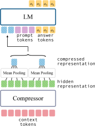
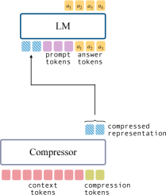
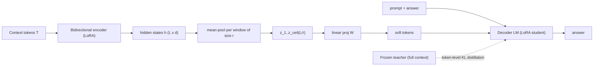
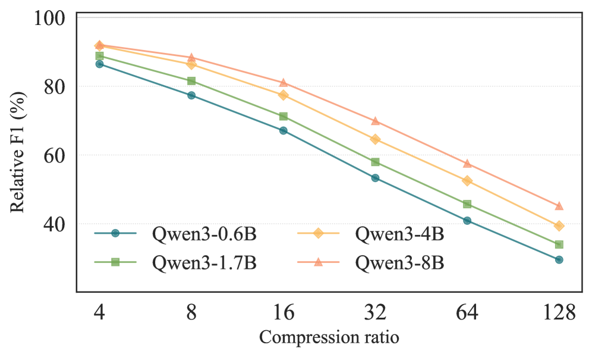

# Simple Context Compression: Mean-Pooling & Multi-Ratio Training — Feldman & Artzi, 2025

> **arXiv:** 2510.20797 · **Title (v2):** *No Mean Feat: Simple, Strong Baselines for Context
> Compression* · **Affiliation:** Cornell University / Cornell Tech · **Code:** github.com/lil-lab/benchpress

## TL;DR
This paper shows that the **simplest possible** soft-token compressor — **mean-pooling** the
hidden states of a **bidirectional** encoder over non-overlapping windows — **beats learned
special compression tokens** (Gist/ICAE-style) with **zero extra parameters**. It adds
**multi-ratio training**: one model trained to compress at 4×/8×/16×/…/128× **simultaneously**,
so a single deployed compressor serves any compute budget. It also introduces **BenchPress**, a
standardized, paradigm-agnostic evaluation, revealing that prior work under-rated these simple
baselines.

*Figure 1 — The **mean-pooling** baseline: a **Compressor** (bidirectional encoder) reads the
context tokens; its hidden states are **mean-pooled** over non-overlapping windows into a short
**compressed representation**, which is prepended (as soft tokens) to the prompt and decoded by
the **LM**. No special tokens, no added parameters beyond a small linear projection.*

## Problem & motivation
Soft-token context compression had accumulated many methods
([AutoCompressor](softtoken_2023_autocompressor.md), [ICAE](softtoken_2023_icae.md),
[xRAG](softtoken_2024_xrag.md), COCOM, PCC, GMSA…) but **incompatible evaluations** — different
datasets, context lengths, models, and metrics — made progress impossible to measure and left
**weak baselines** unchallenged. The authors ask two questions: (1) how strong is the *simplest*
compressor when evaluated fairly, and (2) can one model cover **many compression ratios** instead
of training a separate model per ratio?

## Key idea
Two simple ideas, rigorously benchmarked:
1. **Mean-pooling over a bidirectional encoder.** Remove the causal mask from a pretrained LM to
   make it a bidirectional **encoder**; average its hidden states over non-overlapping blocks of
   size $r$ to get $\lceil L/r\rceil$ soft tokens. This needs **no new parameters** and naturally
   supports **any** ratio by resizing the pooling window.
2. **Multi-ratio training.** Encode each document **once**, pool it at *all* target ratios, and
   sum a distillation loss over ratios — one model, all budgets, ~2.3× cheaper than training
   per-ratio models.

They also improve the *learned-token* baseline: allow **bidirectional attention among the
compression tokens** (while keeping causal attention over the context) so the tokens are aware of
the compression budget.

*Figure 2 — The learned **compression-tokens** baseline (Gist/ICAE lineage): $\lceil L/r\rceil$
special tokens are appended and their final hidden states become the compressed representation.
The paper's improvement is to let these tokens attend **bidirectionally to each other**. Even so,
plain mean-pooling matches or beats it at low/medium ratios.*

## How it works (reimplementation-grade walkthrough)
1. **Compression signature.** $f_c:\mathcal{V}^L\times\mathcal{R}\to\mathbb{R}^{C\times d}$ with
   $C=\lceil L/r\rceil$; goal is to preserve the decoder's conditional distribution
   $p_{\mathcal{M}}(\cdot\mid T,P)\approx p_{\tilde{\mathcal{M}}}(\cdot\mid f_c(T;r),P)$.
2. **Encode bidirectionally.** $h=\mathrm{Encoder}(T)\in\mathbb{R}^{L\times d}$ (causal mask
   removed; encoder initialized from an instruction-tuned checkpoint, LoRA rank 16).
3. **Partition + mean-pool** into non-overlapping windows:
   $$
   S_k=\{(k-1)r+1,\dots,\min(kr,L)\},\qquad
   z_k=\frac{1}{|S_k|}\sum_{i\in S_k}h_i,\qquad k=1,\dots,\lceil L/r\rceil .
   $$
4. **Project + decode.** Apply a learned $W\in\mathbb{R}^{d\times d}$ to each $z_k$, prepend the
   $\lceil L/r\rceil$ soft tokens to the prompt/answer, and decode with a LoRA-adapted student.
5. **Train by token-level distillation** against a frozen teacher that sees the *full* context:
   $$
   \mathcal{L}_{\text{KD}}(T,P,A;r)=\sum_{i=1}^{m}\mathrm{KL}\!\big(q_i(\cdot\mid T,P,A_{<i})\,\Vert\,p_\theta(\cdot\mid f_c(T,r),P,A_{<i})\big).
   $$
6. **Multi-ratio objective** — sum over the ratio set $\mathcal{R}=\{4,8,16,32,64,128\}$ from a
   single encode:
   $$
   \mathcal{L}_{\text{multi}}(T,P,A)=\sum_{r\in\mathcal{R}}\mathcal{L}_{\text{KD}}(T,P,A;r).
   $$
7. **Fair metric.** Report a **teacher-normalized** score so models are comparable:
   $$
   M_{\text{norm}}=\frac{M_{f_c}-M_T^{\emptyset}}{M_T-M_T^{\emptyset}},
   $$
   where $M_T$ = full-context teacher, $M_T^{\emptyset}$ = no-context teacher.

## Training / data
- **Backbones (encoder = decoder family):** Qwen3-0.6B/1.7B/4B/8B, Gemma2-2B, Llama3.2-1B; a
  long-context Qwen3-1.7B at 32K.
- **Data:** ~850K short-context (<1K tok) reading-comprehension + summarization examples (SQuAD,
  NarrativeQA, HotpotQA, DROP, RACE, CNN/DM, XSum, …); long-context eval on LongBench-E (8K).
- **Recipe:** AdamW, peak LR 2e-4 cosine → 2e-5, 48K steps, batch 32, LoRA rank/alpha 16/16,
  max answer 256; teacher LoRA-finetuned then frozen; encoder+decoder trained with **separate**
  LoRA (~4.7M params each) + a $d\times d$ projection.

## Results
| Setting | Metric | Mean-Pooling | Best learned-token baseline |
|---|---|---:|---|
| Qwen3-8B, 4× (multi-ratio) | macro-F1 | **70.55** | 69.57 (bidir tokens) / 65.90 (causal) |
| Qwen3-8B, 16× | macro-F1 | **64.67** | 63.01 / 58.41 |
| Long-context 8K, single-doc QA, 4× | F1 | **39.7** | 35.9 / 33.3 |
| Long-context 8K, multi-doc QA, 16× | F1 | **41.4** | 38.2 / 32.5 |
| vs. LLMLingua2 (hard), Qwen3-8B 16× | F1 | **63.85** | 24.39 |
| Multi-ratio vs single-ratio (mean-pool) | ΔF1 | ~−1 to −2 | (bidir tokens *gain* +2.7 at 16×) |

- **Bidirectional attention is the key knob:** +5–11 F1 over causal compression tokens; simple
  mean-pooling then adds another +2–3 at low/medium ratios (and the gap **widens at 8K**).
- **Multi-ratio is nearly free:** one model covering all ratios costs mean-pooling only ~1–2 F1
  while giving deployment flexibility and ~2.3× cheaper training; learned bidirectional tokens
  actually *improve* under multi-ratio.
- **Compression scales with model size:** larger backbones retain a higher *fraction* of teacher
  performance under the same ratio — compression pays off more as models grow.
- **Ablations:** the **encoder is the most critical** component (freezing it costs ~10.7 F1);
  decoder trainability matters; the projection is a small, consistent win.

*Figure 3 — Teacher-normalized F1 vs. Qwen3 model scale (0.6B→8B) at 4×/16×/128×: larger models
keep a larger share of full-context performance under compression.*

## Limitations & follow-ups
- Mostly short-context English QA; long-context tested with a single 1.7B model.
- Encoder and decoder are always the same size — mismatched (small-encoder/large-decoder) setups
  are unexplored; extreme 128× still trades off.
- Open question: give **mean-pooling** explicit budget-awareness (the advantage bidirectional
  tokens have) and explore attention-weighted/adaptive pooling.
- **Relation to the thread:** SimpleCC is the **"simple baseline"** that validates the
  [LCLM](../context/ctx_compression.md) recipe — *embedding/bidirectional encoder init + mean/
  concat pooling + multi-ratio training* beats learned `EOS`/`CLS`/memory tokens
  ([Gisting](softtoken_2023_gisting.md), [ICAE](softtoken_2023_icae.md),
  [AutoCompressor](softtoken_2023_autocompressor.md)). It is the concrete first step toward the
  **adaptive multi-ratio** direction the thread flags as open. See the
  [soft-token thread](../context/soft_token/soft_token.md) and the
  [context-compression review](../context/ctx_compression.md).

## Links
- **arXiv:** [abs](https://arxiv.org/abs/2510.20797) · [html](https://arxiv.org/html/2510.20797v2) · [pdf](https://arxiv.org/pdf/2510.20797)
- **Code / benchmark:** https://github.com/lil-lab/benchpress · https://github.com/lil-lab/simple-context-compression
- **Venue:** arXiv preprint (v1 Oct 2025; v2 *No Mean Feat*, 2026)
- **Related papers:** [Gisting](softtoken_2023_gisting.md) · [ICAE](softtoken_2023_icae.md) · [AutoCompressor](softtoken_2023_autocompressor.md) · [xRAG](softtoken_2024_xrag.md) · [E2LLM](softtoken_2025_e2llm.md) · [LCLM thread](../context/soft_token/soft_token.md)
