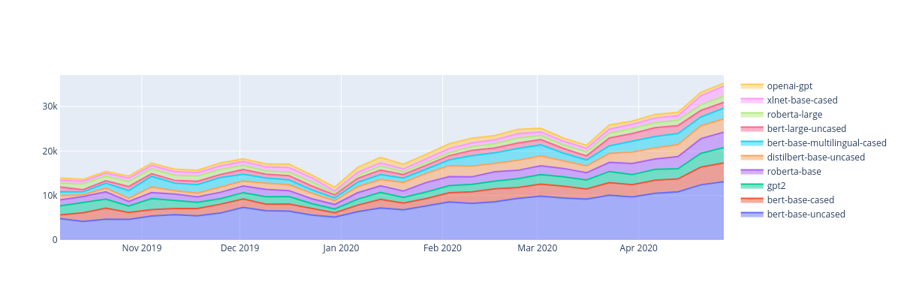
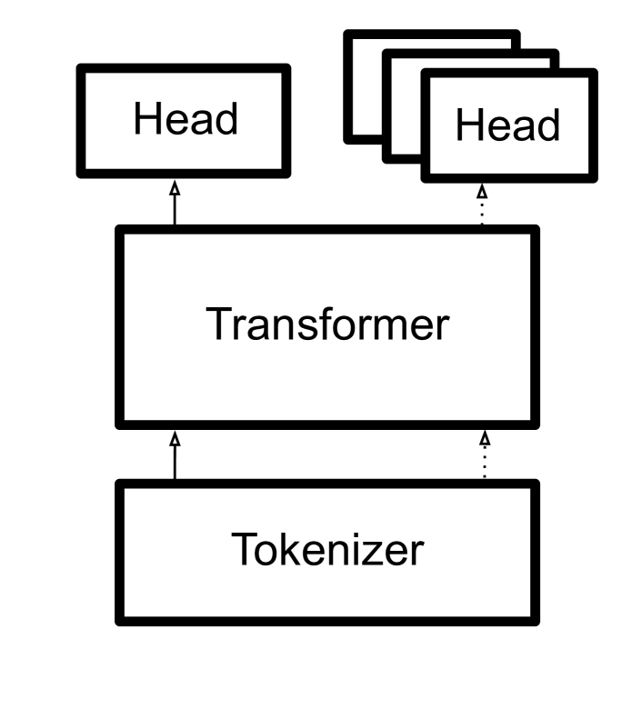
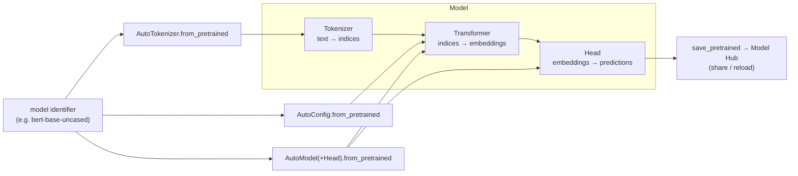
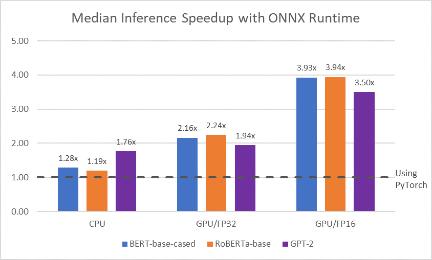

# Transformers: State-of-the-Art Natural Language Processing (HuggingFace) — Wolf et al., 2019

> **arXiv:** 1910.03771v5 · **Venue:** EMNLP 2020 (System Demonstrations, Best Demo Honorable Mention) · **Affiliation:** Hugging Face

## TL;DR
A **systems / library** paper — not an algorithm. `transformers` packages dozens of pretrained
Transformer architectures behind one consistent API so practitioners can load, fine-tune, and share
state-of-the-art NLP models in a few lines. Its design choices — a **three-file philosophy**
(Tokenizer + Transformer + Head per model), **`from_pretrained` / `save_pretrained`**, **Auto** and
**Configuration** classes, framework interop (PyTorch / TF / JAX), and a **community Model Hub** — made
Transformer models broadly accessible. At writing it exposed **15+ architectures** and hosted **2,097
community models**; that accessibility, not novelty, is the contribution.

## Problem & motivation
By 2019 the Transformer had become dominant, but every new model (BERT, GPT-2, RoBERTa, XLNet, T5, …)
shipped as a **separate research codebase** with its own tokenizer, weight format, and API. Reproducing
or combining them meant re-plumbing everything. The library's goal: **one interface** to
- **load** any pretrained architecture and its matching tokenizer,
- **fine-tune** it with a task head,
- **save and share** results with the community,
- and interoperate across deep-learning frameworks.

The paper frames the win as **engineering + accessibility → adoption**, evidenced by rapid download
growth (Fig. 1).



## Key idea
### Three-file philosophy
Every model is expressed as three composable parts, deliberately kept in **self-contained per-model
files** (readability / hackability over strict DRY — "single file per model"):

$$
\text{text} \xrightarrow{\ \textbf{Tokenizer}\ } \text{token indices}
\xrightarrow{\ \textbf{Transformer}\ } \text{contextual embeddings}
\xrightarrow{\ \textbf{Head}\ } \text{task predictions}
$$

- **Tokenizer** — maps raw text to integer indices (and back); ~6 tokenizer families (BPE,
  WordPiece, SentencePiece, …), with fast **Rust** implementations for ~10–100× batch speedups.
- **Transformer** — the pretrained encoder/decoder producing hidden states from indices.
- **Head** — a light task layer (classification, QA span, LM, token labeling, …), 7–8 head types.



### Unified access surface
- **`from_pretrained` / `save_pretrained`** — one call to download or persist weights + config +
  tokenizer, keyed by a **model identifier**.
- **Auto classes** (`AutoModel`, `AutoTokenizer`, `AutoConfig`) — resolve the right concrete class from
  the identifier, so user code stays architecture-agnostic.
- **Configuration classes** — every hyperparameter (layers, heads, vocab, …) is serialized alongside
  weights, making runs reproducible and models portable.
- **Framework interop** — the same checkpoint loads in **PyTorch, TensorFlow, and JAX**.

## How it works

A user picks an identifier, gets a matching tokenizer + model + config via `from_pretrained`, attaches a
task head, fine-tunes, then `save_pretrained` pushes the result to the **Hub** for others to reload with
the same one-liner. For deployment, models export to **ONNX** for ~**4×** inference speedups on BERT /
RoBERTa / GPT-2.



## Training / data
No new training or dataset. The library **hosts and serves** community-trained checkpoints: at writing,
**2,097 models** across **15+ architectures** contributed by **400+ contributors**, all reusable through
the same API.

## Results
Being a demo/system paper, "results" are adoption and engineering metrics rather than benchmark scores:

| Metric | Value | Source |
|---|---|---|
| Architectures exposed | **15+** | §Architectures |
| Community models hosted | **2,097** | §Community |
| Contributors | **400+** | §Community |
| Tokenizer families | **~6** | §Tokenizers |
| Task head types | **7–8** | §Heads |
| Fast Rust tokenizers | **~10–100×** batch speedup | §Tokenizers |
| ONNX export | **~4×** inference speedup (BERT/RoBERTa/GPT-2) | §Deployment |

## Limitations & follow-ups
- **No algorithmic novelty** — value is standardization, interop, and community, not a new model.
- The **single-file-per-model** choice trades code duplication for readability/hackability — a
  deliberate maintainability tradeoff that scaled to hundreds of architectures over time.
- Became the **de facto model-definition layer** used inside serving engines such as
  [vLLM](systems_2023_pagedattention-vllm.md) and [SGLang](systems_2023_sglang.md), which import these
  model classes and optimize execution around them.

## Links
- **arXiv:** [abs](https://arxiv.org/abs/1910.03771) · [html (ar5iv)](https://ar5iv.labs.arxiv.org/html/1910.03771) · [pdf](https://arxiv.org/pdf/1910.03771)
- **ACL Anthology:** <https://aclanthology.org/2020.emnlp-demos.6>
- **Code:** <https://github.com/huggingface/transformers>
- **BibTeX:**
  ```bibtex
  @inproceedings{wolf-etal-2020-transformers,
    title={Transformers: State-of-the-Art Natural Language Processing},
    author={Wolf, Thomas and Debut, Lysandre and Sanh, Victor and Chaumond, Julien and Delangue, Clement
            and Moi, Anthony and Cistac, Pierric and Rault, Tim and Louf, R{\'e}mi and Funtowicz, Morgan
            and others},
    booktitle={Proceedings of the 2020 Conference on Empirical Methods in Natural Language Processing:
               System Demonstrations},
    pages={38--45},
    year={2020}
  }
  ```
- **Related papers:** [PagedAttention / vLLM](systems_2023_pagedattention-vllm.md) · [SGLang](systems_2023_sglang.md)
