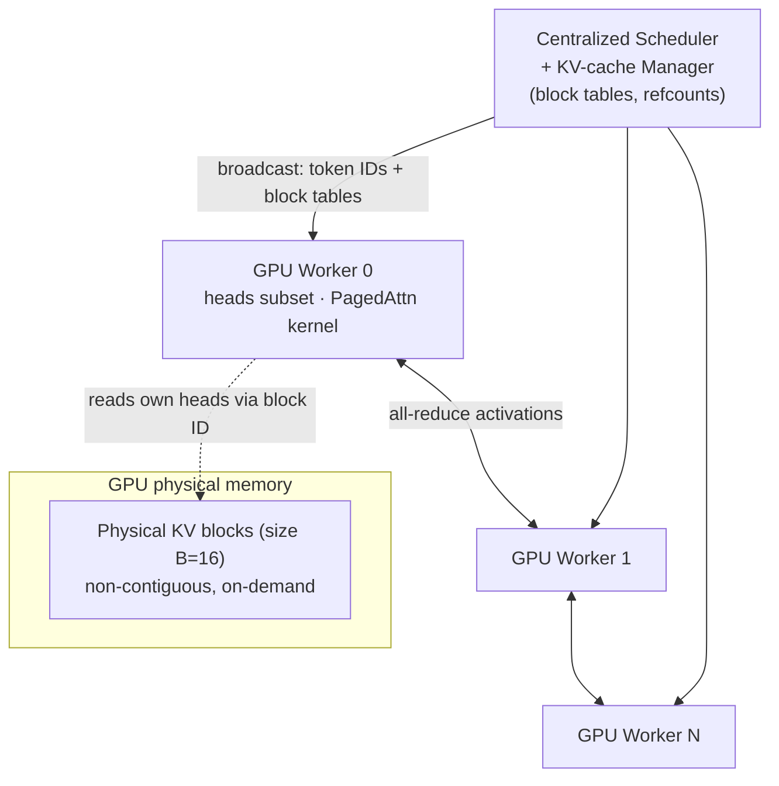

# Efficient Memory Management for LLM Serving with PagedAttention (vLLM) — Kwon et al., 2023

> **arXiv:** 2309.06180v1 · **Venue:** SOSP 2023 · **Affiliation:** UC Berkeley · Stanford · UC San Diego

## TL;DR
LLM serving throughput is capped by **KV-cache memory**, and existing systems waste **60–80%** of it
by storing each request's KV cache in one **contiguous, max-length** chunk. **PagedAttention** borrows
OS **virtual memory / paging**: it splits each sequence's KV cache into **fixed-size blocks** (default
$B=16$ tokens) that live in **non-contiguous** GPU memory, addressed through a per-request **block
table**. Built on it, **vLLM** cuts waste to **<4%**, enables **copy-on-write** and **prefix sharing**
across sequences, and delivers **2–4× higher throughput** than FasterTransformer and Orca at the same
latency — larger gains for longer sequences, bigger models, and complex decoding (beam search).

## Problem & motivation
Autoregressive generation is **memory-bound**: each new token attends to the **key/value vectors of all
previous tokens**, which are cached (the "KV cache"). On a 40 GB A100 serving OPT-13B, ~65% of memory
holds static weights and ~30% holds the dynamic KV cache — so **how the KV cache is managed decides the
max batch size**, hence throughput.

The KV cache is nasty to manage: it **grows one token at a time**, and its final length is **unknown a
priori**. Existing systems (Orca, FasterTransformer) store it **contiguously**, pre-allocating the
request's **maximum** length (e.g. 2048 tokens). This creates three wastes (Fig. 3):
- **Reserved** — slots allocated for future tokens, unusable by others for the request's lifetime.
- **Internal fragmentation** — over-provisioning to max length that the request never reaches.
- **External fragmentation** — buddy-allocator gaps from unequal per-request chunks.

Profiling shows only **20.4–38.2%** of KV-cache memory holds actual token states (§1, Fig. 2). For
context, one OPT-13B token needs **800 KB** ($2 \times 5120 \times 40 \times 2$ bytes), so a
2048-token sequence needs **1.6 GB** — only tens of requests fit even if all memory were KV cache.


## Key idea
Stop requiring the KV cache to be contiguous. Partition each sequence's KV cache into **KV blocks** of
$B$ tokens; store blocks anywhere in physical memory; translate logical→physical via a **block table**
(the analogue of an OS page table). The attention kernel is rewritten to operate **block-by-block**.

For the standard attention (Eq. 3),

$$
a_{ij} = \frac{\exp(q_i^\top k_j/\sqrt{d})}{\sum_{t=1}^{i}\exp(q_i^\top k_t/\sqrt{d})}, \qquad
o_i = \sum_{j=1}^{i} a_{ij}\, v_j,
$$

PagedAttention groups keys/values into blocks $K_j=(k_{(j-1)B+1},\dots,k_{jB})$ and
$V_j=(v_{(j-1)B+1},\dots,v_{jB})$ and computes **block-wise** (Eq. 4):

$$
A_{ij} = \frac{\exp(q_i^\top K_j/\sqrt{d})}{\sum_{t=1}^{\lceil i/B\rceil}\exp(q_i^\top K_t\mathbf{1}/\sqrt{d})}, \qquad
o_i = \sum_{j=1}^{\lceil i/B\rceil} V_j\, A_{ij}^\top,
$$

where $q_i$ is the query at position $i$; $K_j,V_j$ the $j$-th key/value block; $A_{ij}$ the row of
attention scores over block $j$; $d$ the head dimension; $B$ the block size; $\mathbf{1}$ a ones-vector
for the block-wise softmax denominator. The kernel **fetches blocks by ID** from the block table and
attends on the fly.

**OS analogy:** block ↔ page, token ↔ byte, sequence ↔ process, block table ↔ page table.


## How it works

### KV block manager (§4.2)
- A **block engine** allocates one contiguous GPU DRAM slab and divides it into **physical KV blocks**
  (also mirrored on CPU RAM for swapping).
- Each request has **logical KV blocks** filled left-to-right; a **block table** entry maps each logical
  block → physical block ID + **#filled** count.
- Physical blocks are allocated **on demand** (only when the previous block fills), so **waste is
  confined to the last, partially-filled block** of each sequence → **<4%**.


### Memory sharing via reference counts (§4.4)
Each physical block carries a **reference count**. Sharing patterns:
- **Parallel sampling** — $n$ samples share the prompt's physical blocks; on first divergent write,
  **copy-on-write** clones just that one block and decrements the refcount. Savings **6.1–9.8%**
  (Alpaca) / **16.2–30.5%** (ShareGPT).
- **Beam search** — beams share prompt *and* common generation blocks; sharing evolves as beams prune,
  freeing blocks whose refcount hits 0. Savings **37.6–55.2%** (Alpaca) / **44.3–66.3%** (ShareGPT);
  eliminates the frequent large KV copies existing systems need.
- **Shared prefix** — a system prompt / few-shot preamble is cached once in reserved physical blocks;
  new requests map their logical blocks to it and only prefill their own suffix.

### Scheduling & preemption (§4.5)
- **FCFS**; when memory is exhausted, preempt the latest-arrived requests first.
- **All-or-nothing eviction** — all blocks of a sequence are accessed together, so evict all or none;
  sequences that share memory (e.g. beams) are **gang-scheduled** as a sequence group.
- **Recovery**: **swapping** (copy blocks to CPU RAM; swap space bounded by GPU KV memory) or
  **recomputation** (regenerate KV in a single prompt-phase pass — recompute overhead is constant in
  block size and never exceeds ~20% of swapping's; for $B\in[16,64]$ the two are comparable).

### Distributed execution (§4.6)
Megatron-style tensor parallelism: a **single centralized scheduler + one KV manager** broadcasts, per
step, the input token IDs and each request's block table to all GPU workers. Each worker stores only its
**own attention heads'** slice of every block and syncs activations via **all-reduce** — no per-block
scheduler coordination.



### Implementation & defaults
- **Block size $B=16$** (default): large enough for GPU parallelism, small enough to limit internal
  fragmentation; $B\in[16,128]$ best on ShareGPT, $B\in\{16,32\}$ on short Alpaca.
- Fused CUDA kernels: fused reshape+block-write, fused block-read+attention (a warp per block), fused
  block-copy for copy-on-write. Decoding built from three primitives: **fork / append / free**.
- ~8.5K lines Python + ~2K lines C++/CUDA; FastAPI + OpenAI-compatible frontend.
- PagedAttention kernel is **20–26% slower** than FasterTransformer's per-kernel, but only touches
  attention and is dwarfed by the end-to-end throughput win.

## Training / data
Not applicable — vLLM is an **inference-serving system**, not a training method. Evaluation synthesizes
request traces from **ShareGPT** (8.4× longer inputs, 5.8× longer outputs than Alpaca) and **Alpaca**,
with Poisson arrivals, serving **OPT-13B/66B/175B** and **LLaMA-13B** on A100 GPUs.

## Results
Metric = **normalized latency** (mean end-to-end latency ÷ output length) vs. request rate; higher
sustainable rate at low latency = better. Baselines: **FasterTransformer**, **Orca (Oracle/Pow2/Max)**.

| Scenario (model / workload) | vLLM vs. baseline | Source |
|---|---|---|
| Basic sampling, OPT-13B / ShareGPT | **1.7–2.7×** vs. Orca (Oracle); **2.7–8×** vs. Orca (Max); up to **22×** vs. FasterTransformer | §6.2 |
| Batched requests, OPT-13B | **2.2×** more concurrent vs. Orca (Oracle); **4.3×** vs. Orca (Max) | §6.2, Fig. 13 |
| Beam search (width 6), OPT-13B / Alpaca | **2.3×** vs. Orca (Oracle) (up from 1.3× at basic sampling) | §6.3 |
| Shared prefix, LLaMA-13B / WMT16 | **1.67×** (1-shot, 80 tok) → **3.58×** (5-shot, 341 tok) vs. Orca (Oracle) | §6.4 |
| Chatbot, OPT-13B / ShareGPT | **2×** vs. all Orca variants | §6.5 |

**Overall: 2–4× throughput** at matched latency, with **no accuracy change** (§10). Gains grow with
longer sequences, larger models, and more sharing-friendly decoding.

## Limitations & follow-ups
- **Attention-kernel overhead** (20–26%) from block-table indirection and branching.
- **Domain-specific**: paging helps because LLM serving is memory-bound with dynamic, unknown lengths;
  it can *hurt* compute-bound or static-shape workloads (e.g. DNN training, non-LLM serving) (§8).
- **Successors:** PagedAttention became the default KV allocator in production engines; the structured
  runtime built atop it is [SGLang](systems_2023_sglang.md) (RadixAttention generalizes prefix sharing
  to a radix tree). The model executor uses [HF Transformers](systems_2019_hf-transformers.md).

## Links
- **arXiv:** [abs](https://arxiv.org/abs/2309.06180) · [html (ar5iv)](https://ar5iv.labs.arxiv.org/html/2309.06180) · [pdf](https://arxiv.org/pdf/2309.06180)
- **Code:** <https://github.com/vllm-project/vllm>
- **Venue page:** SOSP 2023 — [doi:10.1145/3600006.3613165](https://doi.org/10.1145/3600006.3613165)
- **BibTeX:**
  ```bibtex
  @inproceedings{kwon2023efficient,
    title={Efficient Memory Management for Large Language Model Serving with PagedAttention},
    author={Kwon, Woosuk and Li, Zhuohan and Zhuang, Siyuan and Sheng, Ying and Zheng, Lianmin
            and Yu, Cody Hao and Gonzalez, Joseph E. and Zhang, Hao and Stoica, Ion},
    booktitle={Proceedings of the ACM SIGOPS 29th Symposium on Operating Systems Principles},
    year={2023}
  }
  ```
- **Related / successor papers:** [SGLang](systems_2023_sglang.md) · [HF Transformers](systems_2019_hf-transformers.md)
