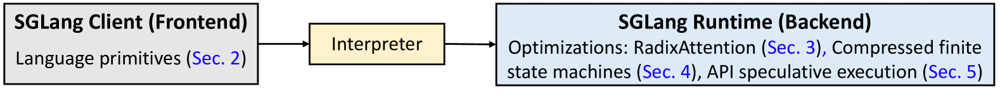
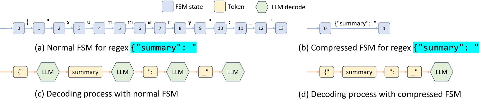
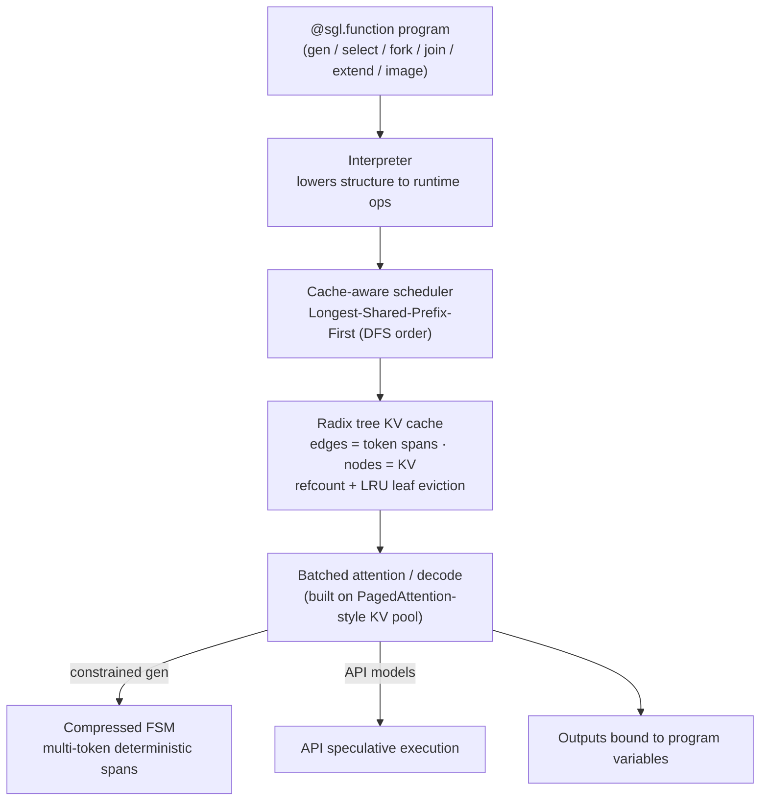
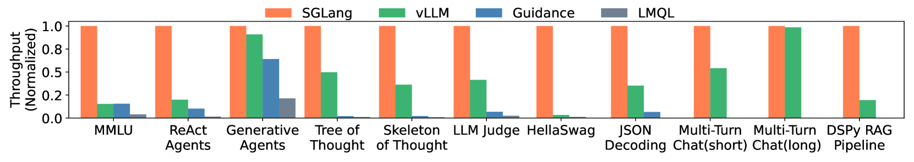

# SGLang: Efficient Execution of Structured Language Model Programs — Zheng et al., 2023

> **arXiv:** 2312.07104v2 · **Venue:** NeurIPS 2024 · **Affiliation:** Stanford · UC Berkeley · SJTU · TAMU

## TL;DR
Real LLM applications are **structured programs**: multi-call chains, control flow, parallelism,
constrained (JSON/regex) decoding, and reused prefixes. SGLang is a **co-designed frontend + runtime**
for them. The **frontend** is an embedded Python DSL (`gen`, `select`, `fork`, `join`, `extend`,
`image`) that exposes structure to the runtime. The **runtime** contributes three optimizations:
**RadixAttention** (automatic, tree-based KV-cache reuse across calls via a radix tree + LRU eviction +
cache-aware scheduling), a **compressed finite-state machine** for fast constrained decoding, and **API
speculative execution**. Together they give up to **6.4× higher throughput** and **3.7× lower latency**
vs. vLLM / Guidance / LMQL, while matching within **96% of optimal** cache reuse.

## Problem & motivation
Prompting has moved beyond single calls to **LM programs** — agents, tool use, chain-of-thought,
multi-modal chat, structured extraction. Executing them efficiently is hard for two reasons:
- **Redundant computation.** Successive calls share large prompt prefixes (system prompt, few-shot
  examples, chat history, tree-of-thought branches), but engines recompute/re-store KV per call. Prior
  reuse (e.g. vLLM's [prefix sharing](systems_2023_pagedattention-vllm.md)) is **manual and limited to a
  single shared prefix**.
- **Constrained decoding is slow.** Forcing outputs to a grammar/regex normally decodes **one token at
  a time** even through fully-determined spans (e.g. the `{"name":` scaffolding of a JSON object).

SGLang's thesis: **expose program structure at the frontend, exploit it in the runtime**.



## Key idea
### Frontend primitives
An LM program is Python decorated with `@sgl.function`, composing:
- `gen(name, ...)` — a generation call (bind result to `name`); `select(name, choices)` — constrained
  choice.
- `s += "text"` / `extend` — append to the prompt state; `image`, `video` — multimodal inputs.
- `fork(k)` — branch the state into `k` parallel continuations; `join` — synchronize branches.

Because structure (branches, shared prefixes, constraints) is **declared**, the runtime can schedule and
cache across calls instead of treating each call as opaque.

### RadixAttention
Store the KV cache of **all live and recent requests** in a **radix tree** whose **edges are token
sequences** (not single characters) and whose **nodes hold the KV cache** of that span. On a new request,
walk the tree matching the longest shared prefix → **reuse** its KV; only the divergent suffix is
computed. A node's cached KV is evictable only when its **reference count** is 0.

- **Eviction:** **LRU, leaf-first** — evict least-recently-used leaves, preserving shared internal
  prefixes.
- **Cache-aware scheduling:** order the waiting queue by **Longest-Shared-Prefix-First**, which is
  equivalent to a **DFS** over the radix tree and is proven **optimal** for cache hit rate
  (Theorem 3.1). Cache hit rate $= \dfrac{\text{cached prompt tokens}}{\text{total prompt tokens}}$.


### Compressed FSM for constrained decoding
Constrained decoding is normally an FSM where each transition emits one token. SGLang **compresses**
chains of **singular-transition** edges (spans with only one legal continuation) into a **single
multi-token edge**, so deterministic scaffolding is emitted in **one step** instead of many (with a
retokenization fix-up at boundaries). ≈**1.6×** speedup on JSON decoding.



### API speculative execution
For API-only models (no logits access), SGLang **speculatively** continues generation past a `gen`
boundary to fill several program variables at once, reducing repeated re-sending of the same input
prompt (~**3×** fewer input tokens billed).

## How it works

Runtime highlights: RadixAttention adds **<0.3%** overhead (0.2 s of 74.3 s over 100 ShareGPT requests);
measured cache hit rates **50–99%**, achieving **96% of the optimal** hit rate.

## Training / data
Not applicable — SGLang is an **execution system**. It runs unmodified models: **Llama-2-7B/70B**,
**Mixtral-8×7B**, and **LLaVA** (image/video). Benchmarks span multi-call agents, few-shot, JSON
extraction, tree-of-thought, and multimodal chat.

## Results
Baselines: **vLLM v0.2.5**, **Guidance v0.1.8**, **LMQL v0.7.3**.

| Setting | Result | Source |
|---|---|---|
| Throughput (structured workloads) | up to **6.4×** vs. baselines | Abstract, §6 |
| Latency | up to **3.7×** lower | Abstract, §6 |
| Cache reuse quality | **96%** of optimal hit rate; hit rates **50–99%** | §6 |
| RadixAttention overhead | **<0.3%** (0.2 s / 74.3 s, 100 ShareGPT req) | §6 |
| JSON constrained decoding | **≈1.6×** via compressed FSM | §4 |
| API speculative execution | **≈3×** fewer input tokens | §5 |
| LLaVA image throughput | **0.18 → 1.15 img/s (≈6.4×)** | §6 |
| LLaVA video throughput | **0.02 → 0.10 frames/s (≈5×)** | §6 |
| Production (Chatbot Arena, LLaVA-NeXT-34B) | **52.4%** cache hit, **1.7×** faster TTFT | §6 |
| Production (Vicuna-33B) | **74.1%** cache hit, **1.7×** faster TTFT | §6 |



## Limitations & follow-ups
- **Retokenization** is required at compressed-FSM boundaries to keep tokenization consistent.
- Benefit scales with **structure**: workloads with little prefix sharing or no constrained decoding see
  smaller gains.
- Builds directly on paged KV management from
  [PagedAttention / vLLM](systems_2023_pagedattention-vllm.md); the radix tree **generalizes** vLLM's
  single-prefix sharing to arbitrary tree-shaped reuse. Uses [HF
  Transformers](systems_2019_hf-transformers.md) model definitions.

## Links
- **arXiv:** [abs](https://arxiv.org/abs/2312.07104) · [html](https://arxiv.org/html/2312.07104v2) · [pdf](https://arxiv.org/pdf/2312.07104)
- **Code:** <https://github.com/sgl-project/sglang>
- **BibTeX:**
  ```bibtex
  @inproceedings{zheng2023sglang,
    title={SGLang: Efficient Execution of Structured Language Model Programs},
    author={Zheng, Lianmin and Yin, Liangsheng and Xie, Zhiqiang and Sun, Chuyue and Huang, Jeff
            and Yu, Cody Hao and Cao, Shiyi and Kozyrakis, Christos and Stoica, Ion
            and Gonzalez, Joseph E. and Barrett, Clark and Sheng, Ying},
    booktitle={Advances in Neural Information Processing Systems (NeurIPS)},
    year={2024}
  }
  ```
- **Related papers:** [PagedAttention / vLLM](systems_2023_pagedattention-vllm.md) · [HF Transformers](systems_2019_hf-transformers.md)
